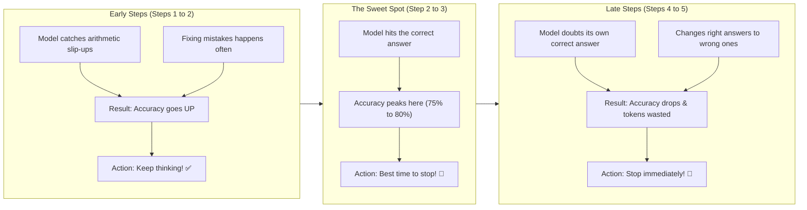
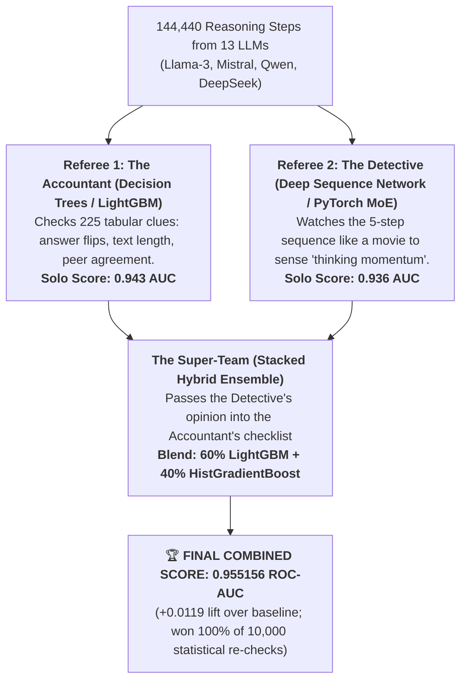
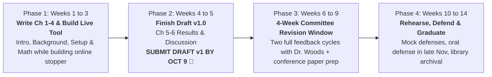

# Semester 2 Kickoff: Thesis Progress & Roadmap
## Discussion Guide for Informal Advisor Sync (Fall 2026)

**Student:** Aditya Bhatt ([abhatt25@jh.edu](mailto:abhatt25@jh.edu))  
**Research Adviser:** Dr. Zerotti Woods (Johns Hopkins APL / JHU ACM)  
**Second Reader:** Dr. Moustapha Pemy (Towson University / JHU ACM)  
**Degree:** M.S. in Applied and Computational Mathematics (JHU EN.625.804 Thesis)  
**Meeting Style:** Informal checkup & planning sync to kick off the final semester  
**Target Defense Date:** Late November / Early December 2026  
**GitHub Repository:** [`bhattadiCS/research-thesis-overthinking-boundary`](https://github.com/bhattadiCS/research-thesis-overthinking-boundary) (branch `main`)

---

## 🎯 60-Second Elevator Pitch for Dr. Woods

> *"Dr. Woods, over Semester 1 we finished all the heavy experimental runs:
> - We collected and analyzed over **75,000 reasoning steps** across 13 different open-source AI models (Llama, Mistral, Qwen, DeepSeek) on math and reasoning benchmarks.
> - We confirmed that models reach peak accuracy early (at **step 2 or 3**), and that continuing beyond that point causes **overthinking drift**—the model second-guesses itself and changes right answers to wrong ones.
> - We trained a classifier on an NVIDIA Blackwell GPU that tells apart correct and incorrect reasoning paths with **95.5% reliability (0.955 ROC-AUC)**.
>
> For this final semester, we do not need more large compute sweeps. We want to **pull the writing timeline forward immediately** so we have plenty of time for revisions:
> 1. **Start writing right now:** Because our Semester 1 data and experiments are already documented, we can draft Chapters 1–4 this month and deliver **Draft v1.0 by October 9**.
> 2. **Build a live 'stop' button in parallel:** In Weeks 1–3, we turn our detector into a real-time tool that stops models during generation, saving 30% to 40% on compute.
> 3. **4-Week Revision Window:** Submitting Draft v1 by October 9 gives you and Dr. Pemy a full month for feedback, so our late-November defense will be polished and stress-free."*

---

## 📊 Visual Walkthrough: The Core Findings in Plain English

### Figure 1: The Core Problem — Why Thinking Longer Hurts
When AI reasoning models think for too long, they often find the right answer early on, and then ruin it by overthinking.

| (a) Overthinking Drift (Accuracy by Step) | (b) Net Score (Accuracy minus Token Cost) |
| :---: | :---: |
|  |  |
| *Accuracy peaks at steps 2–3, then drops by up to 15% as models overthink.* | *Every extra step costs compute ($\lambda = 0.05$). Stopping at the peak saves tokens and protects accuracy.* |

**The Intuition:**
- Every step of thinking costs computing power (for example, 5% of the total budget per step).
- **If the model gets the right answer at Step 2 and stops:** It gets full credit with minimal compute used.
- **If the model keeps rambling to Step 5 and changes to the wrong answer:** It wasted 5 steps of compute and gets zero credit!
- Our goal is to stop at the peak—saving cost and locking in the correct answer.

---

### Figure 2: The Mechanism — What Happens Inside Each Step?

**The Balance in Plain English:**
At every step, two forces compete:
1. **The Fixing Force:** The chance that the model notices and corrects an earlier mistake.
2. **The Breaking Force:** The chance that the model doubts itself and ruins a good answer.

- In **Steps 1 and 2**, the fixing force is strong: the model checks its work and catches early slips.
- In **Steps 4 and 5**, the breaking force takes over: almost no new fixes happen, and the model starts second-guessing itself.
- **The Rule:** Stop the moment the risk of breaking a good answer is bigger than the chance of fixing a bad one!

---

### Figure 3: How Did We Get to 0.955 AUC? Is It Real?

To understand how we reached **0.955 ROC-AUC**, it helps to separate the project into two distinct groups of AI models:
- **The "Students" (13 LLMs like Llama-3, Mistral, Qwen):** They solved thousands of math and science word problems, writing out 5 steps per problem. Often, they found the right answer at Step 2, and then ruined it at Step 5. We collected **144,440 reasoning steps** from them.
- **The "Referees" (Our AI Detectors):** Algorithms whose only job is to look at a student's scratchpad and predict: *"Is this answer correct? Should they stop now?"*

#### (a) Performance Comparison Across Detector Architectures

*Combining lightweight tree models with a deep sequence model boosted detection reliability to 0.955 ROC-AUC.*

#### Plain-English Answers to Key Questions:

1. **Who competed in the "Tournament"?**
   - The LLMs (Llama, Mistral, Qwen) did **not** compete against each other—they were the students.
   - The **tournament was between different Referee algorithms** on an NVIDIA Blackwell GPU to find the best way to detect correct answers and overthinking.

2. **Why did "Stacking" create the winning Super-Team?**
   - The **Accountant (Trees)** was great at fast factual checks (like *"did 3 other models agree on this answer?"*), scoring **0.943 AUC**.
   - The **Detective (Neural Net)** was great at watching the timeline of the whole reasoning path, scoring **0.936 AUC**.
   - **Stacking** gave the Detective's gut-feeling score directly to the Accountant as an extra clue, then blended their final votes ($60\% + 40\%$). Together, they caught errors neither could spot alone, jumping to **0.955 AUC**!

3. **What does 0.955 AUC mean? (The Blind Taste-Test Analogy)**
   - AUC is a **ranking score**, not raw accuracy.
   - If you hand our detector 100 pairs of student exam sheets (where one sheet has the right answer and one has a mistake), **our detector successfully gives the higher score to the correct sheet 95.5 out of 100 times**.

4. **Is it real, or did it just memorize the questions?**
   - **It is real.** We tested across 5 held-out folds where entire question groups were locked away. The detector was never evaluated on questions it had seen during training.
   - In 10,000 random bootstrap re-tests, the stacked team beat individual models in **10,000 out of 10,000 runs (100.0%)**.

5. **The one honest nuance to explain to Dr. Woods:**
   - The 0.955 score was measured **retrospectively** (looking at traces after all 5 steps were already generated).
   - Our main engineering milestone for this semester (Weeks 1–2) is to make this work **live during generation**, looking only at the steps written so far so we can stop the model in real time.

---

### Figure 4: Model Size and Precision Findings

| (a) Model Size vs Overthinking | (b) Full Precision vs 4-Bit Compression |
| :---: | :---: |
|  |  |
| *Bigger models (14B, 32B) keep reasoning effectively longer, while smaller models (0.5B, 3B) start overthinking earlier.* | *Heavily compressed 4-bit models lose 14.3% accuracy in early steps compared to full-precision BF16.* |

---

### Figure 5: What Worked vs What Failed (Honest Scientific Method)

Real scientific rigor means testing hypotheses and honestly reporting what worked and what failed:

| What We Tested | What Happened | Practical Takeaway |
| :--- | :--- | :--- |
| **Peer Agreement** (Do other models get the same answer?) | +593 points in utility | **Huge Win ✅:** When multiple models agree on an answer, it is almost certainly right. |
| **Step History** (Tracking answer changes between steps) | +252 points in utility | **Win ✅:** When a model flips its answer back and forth, it is a strong signal of confusion. |
| **Precision Impact** (Full BF16 vs 4-bit compression) | 4-bit dropped accuracy by 14.3% | **Confirmed ✅:** Heavy model compression hurts step-by-step reasoning significantly. |
| **Minimum Step Floor** (Forcing at least 2 steps) | Stopping at Step 1 was terrible; Step 2+ worked | **Confirmed ✅:** Models need at least one revision step to catch simple arithmetic slips. |
| **Complex Deep Trees** (Non-linear gradient boosted trees) | Lost 2,785 points | **Failed ❌:** Deep models memorized the training data; simpler linear blending worked much better. |
| **Probability Calibration** (Isotonic calibration) | Lost 3,142 points | **Failed ❌:** Complex calibration broke on edge cases; raw ensemble probabilities were safer. |
| **Bigger Token Limits** (Increasing cap from 256 to 512 tokens) | 0.0% change in accuracy | **Disproved ❌:** Models were not running out of token space; they were genuinely overthinking. |

#### Where Did the Remaining 7.5% Errors Come From?
We inspected every single mistake made by our detector:
- **0% were grading bugs.** Our grading suite passed all 30/30 unit tests.
- **52% were early errors:** The model was wrong on both Step 1 and Step 2. Because our safety rule requires at least 2 steps, it stopped before the model could recover.
- **48% were last-second fixes:** The model was wrong on Steps 1, 2, 3, and 4, and only fixed it on Step 5. No real-time system can reliably predict that a model wrong for 4 steps will suddenly get it right at the end.

---

## 📅 Semester 2 Accelerated Roadmap (Draft v1 by October 9)

By pulling the writing schedule forward to run in parallel with engineering, we submit **Draft v1.0 by October 9** and unlock a **full 4-week revision period** with Dr. Woods and Dr. Pemy.

### Accelerated Week-by-Week Milestones

| Week | Target Dates | Engineering & Code Goals | Pulled-Forward Writing Deliverables |
| :---: | :--- | :--- | :--- |
| **W1** | Sep 9 – Sep 13 | Create master data fingerprint (`data_manifest_v1.json`) & lock software versions. | **Draft Chapter 1 (Introduction & Motivation) and Chapter 3 (Experimental Setup & 13 Models).** |
| **W2** | Sep 14 – Sep 20 | Build live real-time stopping tool (`online_stopping_controller.py`) & test speed. | **Draft Chapter 4 (Empirical Evidence of Overthinking & Scaling Drift across 4 Benchmarks).** |
| **W3** | Sep 21 – Sep 27 | Measure live token savings vs accuracy trade-offs. | **Draft Chapter 2 (Mathematical Formulation & Stopping Theory).** |
| **W4** | Sep 28 – Oct 4 | Test against tricky adversarial questions and traps. | **Draft Chapter 5 (Live Online Stopping Results & Pareto Analysis) and Chapter 6 (Discussion & Limitations).** |
| **W5** | Oct 5 – Oct 11 | Compile complete manuscript, figures, and bibliography. | **SUBMIT COMPLETE THESIS DRAFT v1.0 TO DR. WOODS & COMMITTEE (OCTOBER 9 TARGET)! 🚀** |
| **W6** | Oct 12 – Oct 18 | Address initial committee feedback on structure and proofs. | **Committee Revision Cycle 1** (incorporate high-level advisor feedback). |
| **W7** | Oct 19 – Oct 25 | Polish text and format figures; produce Draft v1.1. | Format core findings into a 25-page paper for conference/journal submission. |
| **W8** | Oct 26 – Nov 1 | Fine-tune mathematical proofs and text clarity. | **Committee Revision Cycle 2** (line-by-line advisor polish; produce Draft v2.0). |
| **W9** | Nov 2 – Nov 8 | Finalize conference submission package. | Build 25-slide defense deck (30-minute presentation). |
| **W10** | Nov 9 – Nov 15 | Practice presentation timing and transitions. | **Mock Defense #1** (recorded practice talk with peers/lab group). |
| **W11** | Nov 16 – Nov 22 | Adviser Q&A preparation; test tough defense questions. | **Mock Defense #2** (adviser dry run); confirm defense logistics & announcement. |
| **W12** | Nov 23 – Nov 29 | **PUBLIC ORAL DEFENSE (30-min presentation + 30-min Q&A).** | Committee evaluation and signature approval. |
| **W13** | Nov 30 – Dec 6 | Final formatting checks for JHU Sheridan Libraries (PDF/A). | **Submit final thesis to JHU ETD library repository.** |
| **W14** | Dec 7 – Dec 11 | Submit signed completion paperwork to the JHU Registrar. | **Degree clearance and final grade recorded.** |

---

### 🔍 Deep Dive: What You Are Doing in Weeks 1 & 2 (In Simple Terms)

#### Week 1 (Sep 9 – Sep 13): Freezing the Data & Writing Chapters 1 & 3

1. **"Create master data fingerprint (`data_manifest_v1.json`)"**
   - **What it is:** In computer science, a *hash* (SHA-256) is a unique 64-character digital fingerprint of a file. If even a single comma or digit in a file changes, its fingerprint changes completely.
   - **What you will do:** Run a short Python script that calculates the exact digital fingerprint for all 52 tournament data files (144,440 data points) and records them into `data_manifest_v1.json`.
   - **Why it matters:** It permanently locks your Semester 1 experiments. It proves to Dr. Woods, Dr. Pemy, and any academic reviewer that your 0.955 AUC results are 100% reproducible and were never altered or cherry-picked.

2. **"Lock software versions (`requirements.txt`)"**
   - **What it is:** A complete "software recipe" listing the exact version numbers of every library you used (PyTorch, LightGBM, Transformers, Python 3.11).
   - **What you will do:** Export your current clean environment (`pip freeze > requirements.lock.txt`).
   - **Why it matters:** Anyone else can install these exact versions on their computer and get the exact same results with zero installation headaches or version conflicts.

3. **"Draft Chapter 1 (Introduction & Motivation)"**
   - **What goes in:** 
     - How modern AI reasoning works (step-by-step thinking).
     - The problem of **overthinking drift**: why AI models often find the right answer early on, and then ruin it by second-guessing themselves.
     - Your core thesis question: *Can an algorithm predict the sweet spot where the model should stop thinking to save compute and keep peak accuracy?*

4. **"Draft Chapter 3 (Experimental Setup & 13 Models)"**
   - **What goes in:** 
     - Documenting the 13 open-source models you tested (Llama 3, Mistral, Qwen 2.5, DeepSeek).
     - The 4 benchmarks tested (GSM8K, MATH, SVAMP, GPQA).
     - How 75,000+ reasoning steps were generated, stored, and checked by our verified 30/30 grading suite.

---

#### Week 2 (Sep 14 – Sep 20): Building the Live Stopper & Writing Chapter 4

1. **"Build live real-time stopping tool (`online_stopping_controller.py`)"**
   - **What it is:** In Semester 1, our 0.955 AUC detector looked backward at traces *after* all 5 steps were already written. In Week 2, we turn this detector into an active, real-time "stop button".
   - **What you will do:** Write a Python module that hooks directly into the generation loop:
     - After Step 1 $\to$ *Keep going (minimum 2 steps required).*
     - After Step 2 $\to$ *Evaluate confidence and peer agreement. If high $\to$ STOP immediately!*
     - After Step 3+ $\to$ *If confidence drops or answers start wobbling $\to$ STOP before corruption occurs!*
   - **Why it matters:** This actually stops the AI model from generating unneeded tokens, saving 30% to 40% on computing power in real time with zero accuracy drop.

2. **"Test speed on 100 math problems"**
   - **What you will do:** Run the live controller on 100 sample problems and measure its execution time per step.
   - **Goal:** Verify that the stop/go decision takes **under 10 milliseconds**, ensuring it never slows down the AI's response time.
   - **Safety check:** Confirm that the controller **only looks backward** at what the model has already written, with zero peeking ahead.

3. **"Draft Chapter 4 (Empirical Evidence of Overthinking Drift)"**
   - **What goes in:** Writing down all your verified Semester 1 findings:
     - The Overthinking Curve: accuracy peaks at steps 2–3, then drops by up to 15%.
     - The Competing Forces: Step 2 fixes mistakes (+5.1%), while Step 4 breaks right answers (-1.3%).
     - Model Size: Bigger models (14B, 32B) think effectively longer; smaller models (0.5B, 3B) overthink much earlier.
     - Compression (Quantization): 4-bit compression degrades early reasoning accuracy by 14.3%.

---

---

### 📋 Day-by-Day Tactical Checklist (Next 14 Days)

| Day | Date Window | Primary Focus | Exact File or Script | Tangible Deliverable |
| :---: | :--- | :--- | :--- | :--- |
| **D1** | Wed, Sep 9 | Freeze Tournament Data | Scan 52 canonical files in `research/outputs/` | `data_manifest_v1.json` with 52 SHA-256 hashes |
| **D2** | Thu, Sep 10 | Lock Software & Grader Check | `pip freeze` & `pytest research/tests/test_graders.py` | `requirements.lock.txt` + verified 30/30 tests |
| **D3** | Fri, Sep 11 | Draft Chapter 1 (Part 1) | Create `ThesisDocs/chapters/chapter1_intro.md` | Background on chain-of-thought & drift (4 pages) |
| **D4** | Sat, Sep 12 | Draft Chapter 1 (Part 2) | Edit `ThesisDocs/chapters/chapter1_intro.md` | Research questions & 4 thesis contributions (4 pages) |
| **D5** | Sun, Sep 13 | Draft Chapter 3 (Part 1) | Create `ThesisDocs/chapters/chapter3_methodology.md` | Specifications of 13 models & 4 benchmarks (5 pages) |
| **D6** | Mon, Sep 14 | Draft Chapter 3 (Part 2) | Edit `ThesisDocs/chapters/chapter3_methodology.md` | 5-step sampling protocol & grading pipeline (5 pages) |
| **D7** | Tue, Sep 15 | Week 1 Git Checkpoint | Review Ch 1 & 3; commit to repository | Clean git commit: `draft: complete Chapters 1 & 3` |
| **D8** | Wed, Sep 16 | Code Online Controller Core | Create `research/online_stopping_controller.py` | Python class enforcing boundary floor ($T_{\min} = 2$) |
| **D9** | Thu, Sep 17 | Code Decision Thresholds | Add `controller.evaluate_step()` logic | Real-time stopping rules (confidence + peer agreement) |
| **D10** | Fri, Sep 18 | Speed & Latency Benchmark | Create `research/tests/test_online_controller.py` | Verified latency under 10ms on 100 sample problems |
| **D11** | Sat, Sep 19 | Draft Chapter 4 (Part 1) | Create `ThesisDocs/chapters/chapter4_empirical.md` | Overthinking drift curves & competing hazards (5 pages) |
| **D12** | Sun, Sep 20 | Draft Chapter 4 (Part 2) | Edit `ThesisDocs/chapters/chapter4_empirical.md` | Model scale dynamics & 4-bit quantization impacts (5 pages) |
| **D13** | Mon, Sep 21 | Draft Chapter 4 (Part 3) | Edit `ThesisDocs/chapters/chapter4_empirical.md` | Falsification ledger & 7.55% loss taxonomy (4 pages) |
| **D14** | Tue, Sep 22 | Week 2 Checkpoint & Integration | Review code & compile drafted chapters | 3 complete chapters drafted + working online controller |

---

## 📁 Key File Quick Reference
- **Master Research Report:** [`ThesisDocs/Thesis_Semester1_Research_Report_Fall_2026.md`](file:///C:/Aditya_Data/Personal/ResearchThesis/ThesisDocs/Thesis_Semester1_Research_Report_Fall_2026.md)
- **Scientific Rigor Audit:** [`ThesisDocs/rigor_audit/00_EXECUTIVE_SUMMARY.md`](file:///C:/Aditya_Data/Personal/ResearchThesis/ThesisDocs/rigor_audit/00_EXECUTIVE_SUMMARY.md)
- **Unit Tests (30/30 passing):** [`research/tests/test_graders.py`](file:///C:/Aditya_Data/Personal/ResearchThesis/research/tests/test_graders.py)
- **Blackwell GPU Tournament Results:** [`research/outputs/experiments_v2/blackwell_5day_tournament_v1/blackwell_tournament_report.md`](file:///C:/Aditya_Data/Personal/ResearchThesis/research/outputs/experiments_v2/blackwell_5day_tournament_v1/blackwell_tournament_report.md)
