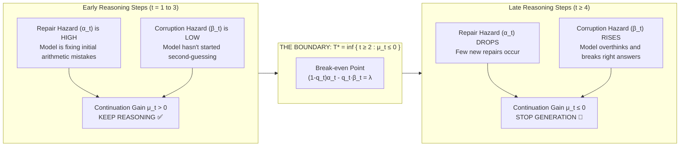
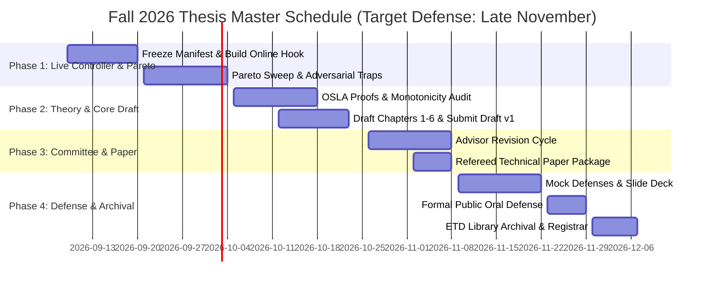
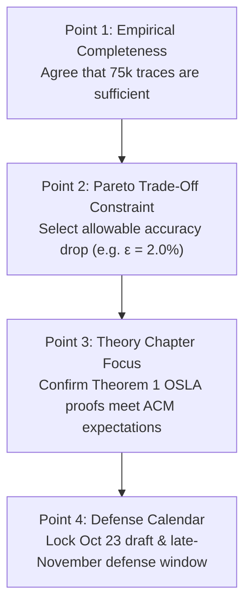

# Semester 2 Kickoff: Thesis Progress & Completion Roadmap
## Visual Discussion Guide for Advisor Check-in (Fall 2026)

**Student:** Aditya Bhatt ([abhatt25@jh.edu](mailto:abhatt25@jh.edu))  
**Research Adviser:** Dr. Zerotti Woods (Johns Hopkins APL / JHU ACM)  
**Second Reader:** Dr. Moustapha Pemy (Towson University / JHU ACM)  
**Course:** JHU EN.625.804 Applied and Computational Mathematics Master's Thesis  
**Meeting Purpose:** Informal checkup & planning sync to touch base for the final semester  
**Target Completion & Defense:** Late November / Early December 2026  
**Repository:** [`bhattadiCS/research-thesis-overthinking-boundary`](https://github.com/bhattadiCS/research-thesis-overthinking-boundary) (branch `main`)

---

## 🎯 At-a-Glance: The 60-Second Meeting Elevator Pitch

> *"Dr. Woods, over Semester 1 we completed the heavy empirical lifting: we captured over **75,000 reasoning traces** across 13 models and 4 domains, conducted an adversarial scientific audit, proved the mathematical necessity of the $T_{\min}=2$ boundary floor, and trained a Blackwell GPU Stacked Meta-Ensemble achieving **0.955 OOF ROC-AUC**.*
>
> *For this final semester, our goal is not to run more compute sweeps. It is to **turn these retrospective findings into a defended thesis**:*
> 1. *Deploy a **prefix-safe live stopping controller** and map the accuracy-vs-compute Pareto curve.*
> 2. *Complete the **formal mathematical proofs** for finite-horizon OSLA optimality and perturbation bounds.*
> 3. *Draft the **6-chapter manuscript**, deliver Draft v1 by October 23, and complete our public defense in late November."*

---

## 📊 Visual Walkthrough: The Core Science in 7 Figures

### Figure 1: The Core Phenomenon — Overthinking Drift & Optimal Stopping
When reasoning models think for too long, they often find the right answer early on and then corrupt it through excessive self-doubt.

| (a) Overthinking Drift (Accuracy Degradation) | (b) Optimal Stopping Utility ($U = C - 0.05(t-1)$) |
| :---: | :---: |
|  |  |
| *Accuracy peaks at steps 2–3, then degrades by up to 15% as models overthink.* | *Expected net utility crosses zero; stopping at peak utility saves compute and preserves correctness.* |

---

### Figure 2: The Mathematical Mechanism — Competing Hazards



**The Empirical Proof (Fixed 13-Model GSM8K Panel, 19,500 Traces):**
- **Step 2:** Net drift $\widehat{D}_2 = \mathbf{+0.0513}$ (95% CI $[+0.0433, +0.0593]$) $\to$ **Strongly positive** (repair dominates).
- **Step 4:** Net drift $\widehat{D}_4 = \mathbf{-0.0127}$ (95% CI $[-0.0186, -0.0065]$) $\to$ **Significantly negative** (corruption & cost dominate).
- *Both 10,000-draw task-cluster bootstrap intervals strictly exclude zero.*

---

### Figure 3: How Did We Get to 0.955 AUC? Is It True?

| (a) Out-of-Fold AUC Comparison Across Architectures | (b) Stacked Architecture Flowchart |
| :---: | :---: |
|  | ```mermaid
flowchart TD
D["Standardized 5-Step Corpus<br/>(144,440 rows, 2,948 task groups)"] --> F["225 Feature Dimensions<br/>(Kinematics, EMA Spectrum, Peer Consensus)"]
F --> B["Control Baseline (No Peers)<br/>LGBM: 0.9432 AUC"]
F --> M["PyTorch Deep Hybrid MoE Probe<br/>Sequence Model: 0.9364 AUC"]
M --> S["Stacked Meta-Ensemble<br/>60% LGBM + 40% HistGB + MoE Feature"]
B --> S
S --> R["FINAL OOF ROC-AUC: 0.955156<br/>(+0.0119 lift, 95% CI [0.0104, 0.0135])"]
``` |

#### Plain-English Breakdown for the Meeting:
1. **What is AUC?** It is a **ranking score**, not accuracy. Given one correct response and one incorrect response, our detector ranks the correct one higher **95.5% of the time**.
2. **Is it true?** **Yes.** It is fully audited and reproduced from [`blackwell_tournament_report.json`](file:///C:/Aditya_Data/Personal/ResearchThesis/research/outputs/experiments_v2/blackwell_5day_tournament_v1/blackwell_tournament_report.json) using 5 task-held-out outer folds.
3. **The Honest Nuance to Tell Dr. Woods:**
   - The 0.955 AUC is a **retrospective ranking diagnostic** on stored traces.
   - The deep MoE probe read the whole 5-step sequence to score final correctness.
   - **It is not yet a live online stopping hook.** Building a prefix-safe, live in-generation controller is our primary computational goal for Weeks 1–2 of this semester.

---

### Figure 4: Model Scale & Precision Dynamics

| (a) Model Scale vs Accuracy Drift | (b) BF16 vs 4-bit Quantization Impact |
| :---: | :---: |
|  |  |
| *Larger models (14B, 32B) sustain positive repair drift longer than smaller models (0.5B, 3B).* | *Causal isolation (N6): 4-bit quantization degrades early reasoning by 14.3 pp (Z = 9.79).* |

---

### Figure 5: Scientific Method & Rigor Audit Summary

We followed the scientific method rigorously—not just confirming what worked, but explicitly **falsifying hypotheses that failed**:

```
┌────────────────────────────────────────────────────────────────────────────────────────┐
│                        SCIENTIFIC METHOD FALSIFICATION LEDGER                         │
├────────────────────────┬────────────────────────────────┬──────────────────────────────┤
│ Tested Hypothesis      │ Observed Outcome               │ Scientific Verdict           │
├────────────────────────┼────────────────────────────────┼──────────────────────────────┤
│ N3: EB Hazard Shrink   │ +593.55 OOF Utility Gain       │ PASSED ✅ (Largest gain)     │
│ N4: Dynamic Churn Rule │ +159.50 OOF Utility Gain       │ PASSED ✅ (Difficulty proxy) │
│ N2c: Temporal Lags     │ +251.65 OOF Utility Gain       │ PASSED ✅ (History matters)  │
│ N6: Precision Causal   │ Gap = 0.1427, Z = 9.79         │ PASSED ✅ (4-bit hurts)      │
│ P2: T_MIN = 2 Floor    │ T_MIN=3 lost -1,912 utility    │ DEFENDED ✅ (Step 1 commit)  │
├────────────────────────┼────────────────────────────────┼──────────────────────────────┤
│ N2a: Non-linear GBT    │ -2,785.05 Utility Crash        │ FALSIFIED ❌ (Overfits tail) │
│ N2b: Isotonic Calib    │ -3,142.90 Utility Crash        │ FALSIFIED ❌ (Overfits tail) │
│ N5: Token Cap 256->512 │ 0.00 pp drop on Mistral        │ FALSIFIED ❌ (Not truncation)│
│ P1: Empty-Answer Guard │ Net -116.5 Utility Loss        │ FALSIFIED ❌ (Win->Loss flips│
└────────────────────────┴────────────────────────────────┴──────────────────────────────┘
```

#### Where Did the 7.55% Decision Losses Go? (Loss Taxonomy)
Every single loss in our canonical 75,965-trace matrix was categorized by [`research/classify_losses.py`](file:///C:/Aditya_Data/Personal/ResearchThesis/research/classify_losses.py):
- **100% of losses are missed late corrections** (the model was wrong when stopped, but became correct later). Zero grading bugs.
- **52.2%** stopped at the theoretical $T_{\min}=2$ floor.
- **48.5%** required repairs $\ge 2$ steps later (fundamental online uncertainty limit).

---

## 📅 Part 3: Fall 2026 Semester Master Timeline (14 Weeks)



### Weekly Time Commitment (15–20 Hours/Week)
```
┌────────────────────────────────────────────────────────┐
│               WEEKLY TIME ALLOCATION                   │
├───────────────────┬────────────────────────────────────┤
│ Monday (2 hrs)    │ Weekly Planning & Theory Check     │
│ Tue/Wed (6 hrs)   │ Deep Computational/Writing Blocks  │
│ Thursday (4 hrs)  │ Analysis, Figures & Code Audit     │
│ Friday (2 hrs)    │ Committee Check-in & Feedback Log  │
│ Weekend (4 hrs)   │ Proofreading & Manuscript Drafting │
└───────────────────┴────────────────────────────────────┘
```

### Detailed Week-by-Week Milestones

| Week | Date Window | Computational & Experimental Tasks | Thesis Writing & Academic Deliverables |
| :---: | :--- | :--- | :--- |
| **W1** | Sep 9 – Sep 13 | Freeze `data_manifest_v1.json` with SHA-256 hashes; resolve GPQA split metadata. | Clean-clone reproduction test; lock software dependencies. |
| **W2** | Sep 14 – Sep 20 | Build `online_stopping_controller.py`; enforce causal prefix-only feature reads. | Verify byte-identical prefix outputs on 100 paired tasks; measure wall-clock latency. |
| **W3** | Sep 21 – Sep 27 | Run nested task-grouped Bayesian sweep over $\lambda \in [0.01, 0.15]$ and offset $\delta$. | Pareto report selecting *Conservative* ($|\Delta \text{Acc}| \le 0.5\%$) vs *Efficiency* ($>40\%$ token savings) rules. |
| **W4** | Sep 28 – Oct 4 | Deploy 5-family adversarial stress suite (distractors, traps, anchoring, paraphrasing). | Generalization & OOD stress test report; document GPQA boundary conditions. |
| **W5** | Oct 5 – Oct 11 | Formalize jump Markov process; write Theorem 1 OSLA proof; audit one-crossing conditions. | **Draft Chapter 2 (Mathematical Formulation & Theory).** |
| **W6** | Oct 12 – Oct 18 | Derive drift perturbation bound $|\widehat{\mu}_t - \mu_t|$ and stopping displacement $|T^* - \widehat{\tau}|$. | **Draft Chapter 1 (Introduction) & Chapter 3 (Experimental Methodology).** |
| **W7** | Oct 19 – Oct 25 | Integrate empirical results, tables, and failure taxonomy. | **Draft Chapters 4–6; SUBMIT FULL DRAFT v1.0 TO COMMITTEE (OCTOBER 23 TARGET).** |
| **W8** | Oct 26 – Nov 1 | Establish Feedback Ledger; generate colorblind-safe publication vector figures. | Committee Revision Cycle 1; update manuscript to Draft v1.1. |
| **W9** | Nov 2 – Nov 8 | Format core contributions into 25-page double-spaced technical paper for refereed venue. | Submit technical paper to referee portal / prepare preprint. |
| **W10** | Nov 9 – Nov 15 | Build 25-slide defense deck (30-minute presentation); timing dry run. | Finalize defense slide deck v1.0. |
| **W11** | Nov 16 – Nov 22 | Conduct recorded Mock Defense #1 (peer) & Mock Defense #2 (adviser Q&A prep). | Confirm defense logistics; post public defense announcement. |
| **W12** | Nov 23 – Nov 29 | **EXECUTE 60-MIN PUBLIC ORAL DEFENSE (30-MIN TALK + 30-MIN Q&A).** | Committee evaluation and initial signature sign-off. |
| **W13** | Nov 30 – Dec 6 | Apply post-defense revisions; verify JHU ETD formatting and PDF/A compliance. | **SUBMIT FINAL THESIS TO JHU SHERIDAN LIBRARIES ETD REPOSITORY.** |
| **W14** | Dec 7 – Dec 11 | Submit signed Semester 2 Approval Form and ETD receipt to JHU Registrar. | **OBTAIN FINAL LETTER GRADE (MATH 625.804) & GRADUATION CLEARANCE.** |

---

## 💬 Part 4: Four Key Discussion Points for Dr. Woods



1. **Empirical Completeness:** Confirm that our 75,965-trace canonical matrix and Blackwell tournament satisfy all empirical requirements—meaning no additional multi-day GPU sweeps are needed.
2. **Policy Accuracy Constraints ($\epsilon$):** What accuracy threshold should we constrain our live stopping controller to? (Recommend $\epsilon = 2.0\%$ standard, $\epsilon = 0.5\%$ conservative).
3. **Mathematical Chapter Focus:** Review the scope of Chapter 2 (OSLA optimality proof, one-crossing empirical audit, and perturbation bounds) to ensure alignment with Dr. Woods' and Dr. Pemy's academic standards.
4. **Calendar Alignment:** Lock in the **October 23 Draft v1.0 delivery date** and confirm target availability for the **late-November public defense**.

---

## 📁 Key File Index
- Master Report: [`ThesisDocs/Thesis_Semester1_Research_Report_Fall_2026.md`](file:///C:/Aditya_Data/Personal/ResearchThesis/ThesisDocs/Thesis_Semester1_Research_Report_Fall_2026.md)
- Rigor Audit: [`ThesisDocs/rigor_audit/00_EXECUTIVE_SUMMARY.md`](file:///C:/Aditya_Data/Personal/ResearchThesis/ThesisDocs/rigor_audit/00_EXECUTIVE_SUMMARY.md)
- Grader Tests (30/30): [`research/tests/test_graders.py`](file:///C:/Aditya_Data/Personal/ResearchThesis/research/tests/test_graders.py)
- Blackwell Report: [`research/outputs/experiments_v2/blackwell_5day_tournament_v1/blackwell_tournament_report.md`](file:///C:/Aditya_Data/Personal/ResearchThesis/research/outputs/experiments_v2/blackwell_5day_tournament_v1/blackwell_tournament_report.md)
