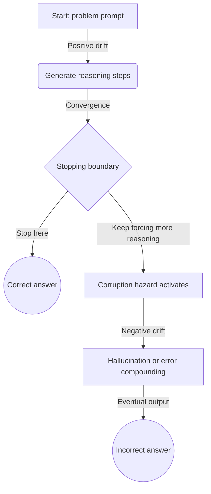
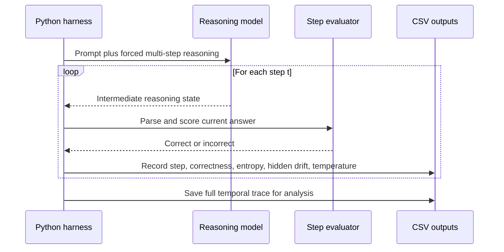
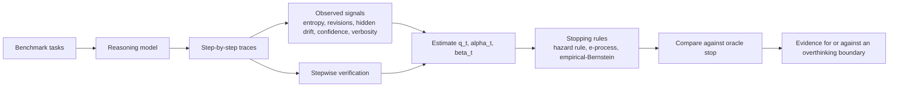

# Overthinking Boundary in Reasoning LLMs

This repository explores a simple yet profound question: **When does extra "thinking" stop helping an AI and start making it worse?**

> [!TIP]
> **New to the project?** Start with the [Simplified Research Summary](#simplified-research-summary) below for a non-technical primer on our methods and findings.

## Simplified Research Summary

### 1. What is "Overthinking"?
Large Language Models often perform better when allowed to "think" before answering (Chain-of-Thought). However, thinking too much can lead to:
- **Corruption**: Correct answers getting broken by unnecessary revisions.
- **Hallucination**: The model drifting into nonsense.
- **Token Waste**: Spending money and time on answers that were already correct.

### 2. The Core Formula
We use a mathematical rule to decide exactly when to stop. We weigh:
- **Repair Potential (α)**: "If I'm wrong, can the next step fix it?"
- **Corruption Risk (β)**: "If I'm right, will the next step break it?"
- **Step Cost (λ)**: The cost of the extra token.

**The Decision:** We calculate the **Drift (μ)**. If the chance of fixing the answer is higher than the risk of breaking it (minus the cost), we keep going. If it drops below zero, we've hit the **Overthinking Boundary** and should stop.

### 3. Key Findings (DeepSeek vs. Qwen)
Our experiments on an NVIDIA L4 GPU on math tasks (GSM8K) proved:
- **DeepSeek-R1 (Capable model)**: Overthinking is real. The model reached peak correctness at **Step 7**, and accuracy dropped if we forced it to keep thinking.
- **Qwen-0.5B (Weak model)**: This served as a control. Because it wasn't smart enough to repair its own mistakes, its "Overthinking Boundary" was reached almost immediately at Step 1.
- **The Verdict**: A smart stopping rule outperforms a "never-stop" policy in both accuracy and efficiency.

---

## Primer: What This Means in LLM Terms

### What is an LLM and what is a token?

At a basic level, a large language model is an autoregressive statistical engine. It predicts the next token from the tokens that came before it. In this view, each generated token is one discrete time step in a sequential process.

### What is reasoning or chain-of-thought?

Older systems often tried to jump directly to a final answer. Modern reasoning models do better when they are allowed to produce intermediate reasoning steps before committing to an answer. In current AI work, those intermediate steps are often described as test-time compute or reasoning tokens.

### What is overthinking?

The naive scaling story says that allowing more reasoning should keep helping. The central claim of this repo is that this breaks down. Beyond some point, additional reasoning can make the model second-guess a correct solution, compound small errors, or drift into a worse answer. That turning point is the overthinking boundary.

## Why This Matters

A lot of test-time scaling work assumes that more thinking is better. In practice, that is only true for part of a trajectory.

This repo treats reasoning as a compute-allocation problem:

- If another step is likely to fix a wrong answer, we should keep going.
- If another step is more likely to damage a correct answer or just burn tokens, we should stop.

That framing connects LLM reasoning to optimal stopping, survival-style hazard modeling, and anytime-valid sequential statistics.

## The Core Idea

The main quantity in this repo is the one-step continuation value:

```text
mu_t = (1 - q_t) * alpha_t - q_t * beta_t - lambda
```

In plain English:

- `q_t` is our current belief that the model's answer is already correct.
- `alpha_t` is the repair hazard: the chance that one more step fixes a wrong answer.
- `beta_t` is the corruption hazard: the chance that one more step breaks a correct answer.
- `lambda` is the cost of taking one more reasoning step.
- `mu_t` is the expected value of continuing for one more step.

If `mu_t > 0`, continuing is still worth it.

If `mu_t <= 0`, the model has crossed the overthinking boundary and should stop.

## The Mathematical Bridge

The main mathematical move in this project is to translate a language-model trace into a stochastic process.

Instead of treating the generated text as a purely linguistic artifact, we treat the reasoning sequence as a discrete-time process with changing continuation value. Early in a good trace, the process can have positive drift because the model is moving toward the correct answer. Later in the same trace, corruption risk can dominate repair and flip the expected drift negative.



This is the working interpretation behind the empirical analysis:

- State space: at each step, the model is in a latent regime that is either moving toward or away from the correct answer.
- Positive drift: early reasoning can improve the answer.
- Hazard: as traces lengthen, the chance of corrupting a correct path can rise.
- Flip: once a harmful token or revision is sampled, future tokens condition on that mistake and the trajectory can deteriorate.

## The Main Concepts, Explained Clearly

### 1. Correctness Belief

We almost never know the answer is correct during inference, so we estimate the probability that it is correct right now. That estimate is `q_t`.

### 2. Repair Hazard

Even if the current answer is wrong, the next step may fix it. The probability of that repair event is `alpha_t`.

### 3. Corruption Hazard

Even if the current answer is correct, another step can push the model into a worse answer. The probability of that corruption event is `beta_t`.

### 4. Step Cost

Reasoning is not free. Every extra step consumes time, tokens, and budget. In this repo, that cost is modeled explicitly as `lambda`.

### 5. Oracle Stop

The oracle stop is a hindsight baseline: if we could replay the full trajectory and pick the best stopping point after seeing everything, where would we stop? It is not deployable, but it is the right benchmark for evaluating practical stopping rules.

### 6. Reward Hacking During Inference

A proxy score can keep looking better even when true utility is getting worse. In this repo, that is the reward-hacking region: the model appears to be improving according to a proxy while actual expected value is already negative.

### 7. Utility Versus Accuracy

This project is mainly about cost-adjusted utility, not raw accuracy alone. In the real-trace experiments, a stop is rewarded for being correct and penalized for taking extra steps. That matters because a later correct answer is not always better than an earlier correct answer.

## What This Repository Is Exploring

The repo is built around a layered research stack.

### Core Theory

The main theoretical frame is a semimartingale drift-sign model. It treats reasoning as a process whose continuation value can become negative. This is the cleanest formalization in the current project.

### Operational Estimator

The theory is operationalized with hazard-style models that estimate:

- correctness belief `q_t`,
- repair hazard `alpha_t`,
- corruption hazard `beta_t`.

These are learned from observable trace features.

### Safety Layer

Because we estimate drift from data, we also test sequentially valid stopping rules:

- empirical-Bernstein upper bounds,
- mixture e-process detectors.

These matter because stop rules are checked repeatedly over time, so pointwise statistics alone are not enough.

### Auxiliary Detector Family

The repo also studies simpler or complementary signals such as:

- entropy changes,
- answer revisions,
- hidden-state drift,
- confidence proxies,
- lexical echo and verbosity.

These are useful as observables, but they are not the primary theory.

## The Applied Math Tools

The repo is explicitly trying to connect LLM behavior to established mathematical tools rather than treating overthinking as a vague empirical curiosity.

### Optimal Stopping Theory

This is the language of deciding exactly when to act in order to maximize expected value. Here, the action is stopping generation at the step where another reasoning token has nonpositive marginal value.

### Convergence Theory and Concentration

These tools help bound uncertainty in estimated quantities. In this project, they motivate the empirical-Bernstein and e-process style detectors that try to decide when the continuation value has become negative while accounting for sampling noise.

### Phase Transitions

One working hypothesis is that productive reasoning and destructive overthinking are not just two points on a smooth slope. The transition may be relatively sharp, more like a tipping point than a gentle decay.

## What Signals We Measure From Traces

The current experiments extract features from each reasoning step, including:

- token entropy and entropy volatility,
- whether the answer changed,
- answer streak length,
- hidden-state L2 shift,
- hidden-state cosine shift,
- lexical echo,
- thought length and verbosity-linked proxies,
- confidence when the model exposes it.

These signals are then used to estimate when continuing reasoning is still useful.

## Proof of Work: The Empirical Harness

This repository is not just a theory note. It includes a working experimental harness for collecting real step-by-step traces from open-weight models.

### Infrastructure

The current workflow is designed around larger cloud runs:

- Google Colab with an NVIDIA L4 GPU.
- Remote orchestration from the local VS Code environment, including SSH-based remote control of the cloud runtime.
- A reusable wrapper in [tools/run_colab_experiment.py](tools/run_colab_experiment.py) for smoke tests, full runs, and artifact regeneration.

### Current DeepSeek Experiment Design

The main large run in the repo forces DeepSeek-R1-Distill 1.5B to reason step by step on GSM8K problems for up to 10 steps and across temperatures `0.1`, `0.6`, and `1.0`. Rather than only checking the final answer, the harness records what happens at each reasoning step so that repair and corruption can be studied directly.

### What gets logged

At each step, the harness can record:

- the current answer,
- whether the answer is correct,
- entropy and related uncertainty signals,
- hidden-state movement,
- revision behavior,
- the final utility of stopping at that step.



This is what makes the hazard model identifiable: the repo does not only ask whether the model was right at the end. It asks when it first became right, whether it later became wrong, and which observables signaled that change.

## High-Level Pipeline



## What the Literature Added

The current literature sweep pushed this repo in four important directions:

- Longer reasoning is not reliably monotone-helpful.
- Hidden states and entropy are among the most useful stopping observables.
- Proxy-based reward signals can remain useful while still being misaligned.
- Time-uniform risk control matters if a detector scans for a stop at every step.

That is why the repo now centers a continuation-value model, hazard decomposition, and anytime-valid detector layer instead of relying on a single entropy threshold or a generic prompting heuristic.

## Why This Matters Beyond PRMs

One common way to supervise reasoning is to train a second model, often called a process reward model, to score the steps of the first model. That approach can help, but it is expensive and brittle.

The alternative explored here is mathematical rather than supervisory: if test-time compute can be modeled as a stochastic process with a stopping boundary, then a model may not need a second full evaluator at inference time. In the strongest version of that idea, the system would monitor its own observable drift and halt when the expected value of continuing turns negative.

That is the long-term motivation of this repo: replacing brute-force extra supervision with a principled stopping rule.

## The Main Research Questions

This repository is trying to answer the following questions in a concrete, testable way:

1. Can we identify when one more reasoning step has negative expected value?
2. Can hidden states, entropy, revisions, and confidence act as usable observables for that decision?
3. Can repair and corruption hazards be estimated well enough to support a practical stop rule?
4. Can we make the stopping rule statistically safe under repeated checking?
5. Can we detect overthinking in real open-weight models, not just in simulators?
6. How much of the boundary is model-specific versus benchmark-specific?

## What the Current Results Say

### DeepSeek-R1 Distill 1.5B

The strongest completed run in the repo is the L4 DeepSeek-R1 distill 1.5B experiment on 300 GSM8K tasks across 3 temperatures.

What it shows:

- The model is competent enough to leave the low-skill regime.
- Step-1 accuracy is 0.237.
- At least one correct answer appears in 621 of 900 runs.
- The pooled trajectory reaches peak correctness around step 7.
- The never-stop policy loses 0.7463 utility on average relative to the oracle.

Interpretation:

- Overthinking is real in this setting.
- Extra reasoning is often useful early and harmful late.
- A practical stopping rule should stop far earlier than the final step.

### Qwen2.5 0.5B

The L4 Qwen2.5 0.5B run is informative for a different reason.

What it shows:

- The model stays in a much weaker regime on GSM8K.
- The best utility is concentrated almost immediately.
- The apparent boundary collapses toward the first step.

Interpretation:

- This run is useful as a low-skill comparison point.
- It does not give the same quality of hazard evidence as the DeepSeek run.

### Detector Comparison

Current detector results show a clear ranking:

- The fitted hazard rule is currently the best practical detector in the DeepSeek L4 run.
- The mixture e-process is a real improvement over empirical-Bernstein.
- Empirical-Bernstein is safer than naive pointwise checking, but too conservative in the present traces.
- Never-stop is consistently poor once a model enters a regime where corruption becomes common.

### What Is Supported Versus What Is Still Open

Supported by the current repo:

- Overthinking can be observed in real traces, not only in simulation.
- Repair and corruption are both measurable and practically important.
- Answer revisions, entropy, and hidden-state drift carry real stopping information.
- Sequentially valid stopping is meaningfully different from pointwise thresholding.

Still open:

- a stronger online estimator for `alpha_t` and `beta_t` under distribution shift,
- cross-family stability of the same observables,
- cleaner per-task evidence for one-crossing behavior,
- better detectors that approach oracle performance without heavy conservatism.

## Snapshot Table

| Model | Runs | Runs ever correct | Step-1 accuracy | Peak correctness | Peak step | Hazard gap | E-process gap | Empirical-Bernstein gap | Never-stop gap |
| --- | ---: | ---: | ---: | ---: | ---: | ---: | ---: | ---: | ---: |
| DeepSeek-R1 distill 1.5B | 900 | 621 | 0.237 | 0.304 | 7 | 0.4121 | 0.4441 | 0.7141 | 0.7463 |
| Qwen2.5 instruct 0.5B | 900 | 81 | 0.071 | 0.082 | 3 | 0.1531 | 0.0595 | 0.4106 | 0.4595 |

## Representative Artifacts

- Theory note: [research/overthinking_boundary.md](research/overthinking_boundary.md)
- DeepSeek summary: [research/FINAL_L4_RESULTS.md](research/FINAL_L4_RESULTS.md)
- Qwen summary: [research/FINAL_QWEN_L4_RESULTS.md](research/FINAL_QWEN_L4_RESULTS.md)
- Open questions and answers: [research/open_questions.md](research/open_questions.md) and [research/ANSWERS_TO_OPEN_QUESTIONS.md](research/ANSWERS_TO_OPEN_QUESTIONS.md)
- Literature synthesis: [research/literature_synthesis.md](research/literature_synthesis.md)
- Framework ranking: [research/hypothesis_table.md](research/hypothesis_table.md)

Representative plots checked into the repo:

- Synthetic trajectories: 
- DeepSeek drift crossing: 
- Qwen drift crossing: 

## Repository Map

- [research/overthinking_boundary.md](research/overthinking_boundary.md): main theory note
- [research/simulate_overthinking_boundary.py](research/simulate_overthinking_boundary.py): synthetic boundary experiments
- [research/real_trace_experiments.py](research/real_trace_experiments.py): real trace collection on benchmark tasks
- [research/trace_analysis.py](research/trace_analysis.py): detector fitting, hazard summaries, and plots
- [research/generate_thesis_artifacts.py](research/generate_thesis_artifacts.py): markdown artifact generation from outputs
- [tools/run_colab_experiment.py](tools/run_colab_experiment.py): guarded Colab runner for larger experiments

## Local Entry Points

- `python research/simulate_overthinking_boundary.py`
- `python research/real_trace_experiments.py --model qwen2p5_0p5b --device cpu --max-tasks 3 --max-steps 3 --max-new-tokens 16 --temperatures 0.2 0.8 --seeds 7 --output-dir research/outputs/real_traces_qwen`
- `python research/trace_analysis.py --input-dir research/outputs/real_traces_qwen`
- `python research/generate_thesis_artifacts.py --input-dir research/outputs/real_traces_l4_deepseek_1p5b`

## Google Colab Workflow

The guarded Colab runner is [tools/run_colab_experiment.py](tools/run_colab_experiment.py). It is designed to avoid wasting GPU credits.

Typical flow:

1. Check the Python environment and GPU.
2. Optionally run the synthetic simulator.
3. Optionally run a smoke test.
4. Launch the full real-trace experiment.
5. Rebuild the analysis artifacts automatically.

Example:

```bash
python tools/run_colab_experiment.py --model deepseek_r1_distill_1p5b
```

Useful variants:

- Smoke test only: `python tools/run_colab_experiment.py --smoke-only`
- Skip dependency installation: `python tools/run_colab_experiment.py --skip-install`
- Run the smaller Qwen family end-to-end: `python tools/run_colab_experiment.py --model qwen2p5_0p5b`
- Resume a partially completed run by reusing an existing `--output-dir`

Dependencies for Colab are listed in [requirements-colab.txt](requirements-colab.txt). The runner intentionally does not reinstall PyTorch so it preserves the GPU-enabled Colab build.