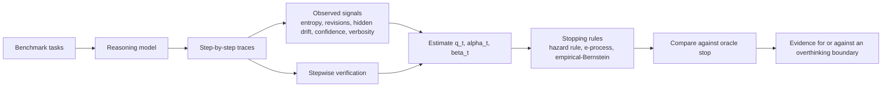

# Overthinking Boundary in Reasoning LLMs

This repository studies a simple question with surprisingly sharp consequences:

> When does extra reasoning stop helping and start hurting?

Reasoning models often improve for the first few steps of chain-of-thought because they can repair an initially wrong answer. But continued reasoning can also corrupt a correct answer, trigger unstable revisions, or waste tokens on steps that no longer add value. This project tries to detect that turning point early enough to stop on time.

The name we use for that turning point is the overthinking boundary.

## Why This Matters

A lot of test-time scaling work assumes that more thinking is better. In practice, that is only true for part of a trajectory.

This repo treats reasoning as a compute-allocation problem:

- If another step is likely to fix a wrong answer, we should keep going.
- If another step is more likely to damage a correct answer or just burn tokens, we should stop.

That framing connects LLM reasoning to optimal stopping, survival-style hazard modeling, and anytime-valid sequential statistics.

## The Core Idea

The main quantity in this repo is the one-step continuation value:

```text
mu_t = (1 - q_t) * alpha_t - q_t * beta_t - lambda
```

In plain English:

- `q_t` is our current belief that the model's answer is already correct.
- `alpha_t` is the repair hazard: the chance that one more step fixes a wrong answer.
- `beta_t` is the corruption hazard: the chance that one more step breaks a correct answer.
- `lambda` is the cost of taking one more reasoning step.
- `mu_t` is the expected value of continuing for one more step.

If `mu_t > 0`, continuing is still worth it.

If `mu_t <= 0`, the model has crossed the overthinking boundary and should stop.

## The Main Concepts, Explained Clearly

### 1. Correctness Belief

We almost never know the answer is correct during inference, so we estimate the probability that it is correct right now. That estimate is `q_t`.

### 2. Repair Hazard

Even if the current answer is wrong, the next step may fix it. The probability of that repair event is `alpha_t`.

### 3. Corruption Hazard

Even if the current answer is correct, another step can push the model into a worse answer. The probability of that corruption event is `beta_t`.

### 4. Step Cost

Reasoning is not free. Every extra step consumes time, tokens, and budget. In this repo, that cost is modeled explicitly as `lambda`.

### 5. Oracle Stop

The oracle stop is a hindsight baseline: if we could replay the full trajectory and pick the best stopping point after seeing everything, where would we stop? It is not deployable, but it is the right benchmark for evaluating practical stopping rules.

### 6. Reward Hacking During Inference

A proxy score can keep looking better even when true utility is getting worse. In this repo, that is the reward-hacking region: the model appears to be improving according to a proxy while actual expected value is already negative.

### 7. Utility Versus Accuracy

This project is mainly about cost-adjusted utility, not raw accuracy alone. In the real-trace experiments, a stop is rewarded for being correct and penalized for taking extra steps. That matters because a later correct answer is not always better than an earlier correct answer.

## What This Repository Is Exploring

The repo is built around a layered research stack.

### Core Theory

The main theoretical frame is a semimartingale drift-sign model. It treats reasoning as a process whose continuation value can become negative. This is the cleanest formalization in the current project.

### Operational Estimator

The theory is operationalized with hazard-style models that estimate:

- correctness belief `q_t`,
- repair hazard `alpha_t`,
- corruption hazard `beta_t`.

These are learned from observable trace features.

### Safety Layer

Because we estimate drift from data, we also test sequentially valid stopping rules:

- empirical-Bernstein upper bounds,
- mixture e-process detectors.

These matter because stop rules are checked repeatedly over time, so pointwise statistics alone are not enough.

### Auxiliary Detector Family

The repo also studies simpler or complementary signals such as:

- entropy changes,
- answer revisions,
- hidden-state drift,
- confidence proxies,
- lexical echo and verbosity.

These are useful as observables, but they are not the primary theory.

## What Signals We Measure From Traces

The current experiments extract features from each reasoning step, including:

- token entropy and entropy volatility,
- whether the answer changed,
- answer streak length,
- hidden-state L2 shift,
- hidden-state cosine shift,
- lexical echo,
- thought length and verbosity-linked proxies,
- confidence when the model exposes it.

These signals are then used to estimate when continuing reasoning is still useful.

## High-Level Pipeline



## What the Literature Added

The current literature sweep pushed this repo in four important directions:

- Longer reasoning is not reliably monotone-helpful.
- Hidden states and entropy are among the most useful stopping observables.
- Proxy-based reward signals can remain useful while still being misaligned.
- Time-uniform risk control matters if a detector scans for a stop at every step.

That is why the repo now centers a continuation-value model, hazard decomposition, and anytime-valid detector layer instead of relying on a single entropy threshold or a generic prompting heuristic.

## The Main Research Questions

This repository is trying to answer the following questions in a concrete, testable way:

1. Can we identify when one more reasoning step has negative expected value?
2. Can hidden states, entropy, revisions, and confidence act as usable observables for that decision?
3. Can repair and corruption hazards be estimated well enough to support a practical stop rule?
4. Can we make the stopping rule statistically safe under repeated checking?
5. Can we detect overthinking in real open-weight models, not just in simulators?
6. How much of the boundary is model-specific versus benchmark-specific?

## What the Current Results Say

### DeepSeek-R1 Distill 1.5B

The strongest completed run in the repo is the L4 DeepSeek-R1 distill 1.5B experiment on 300 GSM8K tasks across 3 temperatures.

What it shows:

- The model is competent enough to leave the low-skill regime.
- Step-1 accuracy is 0.237.
- At least one correct answer appears in 621 of 900 runs.
- The pooled trajectory reaches peak correctness around step 7.
- The never-stop policy loses 0.7463 utility on average relative to the oracle.

Interpretation:

- Overthinking is real in this setting.
- Extra reasoning is often useful early and harmful late.
- A practical stopping rule should stop far earlier than the final step.

### Qwen2.5 0.5B

The L4 Qwen2.5 0.5B run is informative for a different reason.

What it shows:

- The model stays in a much weaker regime on GSM8K.
- The best utility is concentrated almost immediately.
- The apparent boundary collapses toward the first step.

Interpretation:

- This run is useful as a low-skill comparison point.
- It does not give the same quality of hazard evidence as the DeepSeek run.

### Detector Comparison

Current detector results show a clear ranking:

- The fitted hazard rule is currently the best practical detector in the DeepSeek L4 run.
- The mixture e-process is a real improvement over empirical-Bernstein.
- Empirical-Bernstein is safer than naive pointwise checking, but too conservative in the present traces.
- Never-stop is consistently poor once a model enters a regime where corruption becomes common.

### What Is Supported Versus What Is Still Open

Supported by the current repo:

- Overthinking can be observed in real traces, not only in simulation.
- Repair and corruption are both measurable and practically important.
- Answer revisions, entropy, and hidden-state drift carry real stopping information.
- Sequentially valid stopping is meaningfully different from pointwise thresholding.

Still open:

- a stronger online estimator for `alpha_t` and `beta_t` under distribution shift,
- cross-family stability of the same observables,
- cleaner per-task evidence for one-crossing behavior,
- better detectors that approach oracle performance without heavy conservatism.

## Snapshot Table

| Model | Runs | Runs ever correct | Step-1 accuracy | Peak correctness | Peak step | Hazard gap | E-process gap | Empirical-Bernstein gap | Never-stop gap |
| --- | ---: | ---: | ---: | ---: | ---: | ---: | ---: | ---: | ---: |
| DeepSeek-R1 distill 1.5B | 900 | 621 | 0.237 | 0.304 | 7 | 0.4121 | 0.4441 | 0.7141 | 0.7463 |
| Qwen2.5 instruct 0.5B | 900 | 81 | 0.071 | 0.082 | 3 | 0.1531 | 0.0595 | 0.4106 | 0.4595 |

## Representative Artifacts

- Theory note: [research/overthinking_boundary.md](research/overthinking_boundary.md)
- DeepSeek summary: [research/FINAL_L4_RESULTS.md](research/FINAL_L4_RESULTS.md)
- Qwen summary: [research/FINAL_QWEN_L4_RESULTS.md](research/FINAL_QWEN_L4_RESULTS.md)
- Open questions and answers: [research/open_questions.md](research/open_questions.md) and [research/ANSWERS_TO_OPEN_QUESTIONS.md](research/ANSWERS_TO_OPEN_QUESTIONS.md)
- Literature synthesis: [research/literature_synthesis.md](research/literature_synthesis.md)
- Framework ranking: [research/hypothesis_table.md](research/hypothesis_table.md)

Representative plots checked into the repo:

- Synthetic trajectories: 
- DeepSeek drift crossing: 
- Qwen drift crossing: 

## Repository Map

- [research/overthinking_boundary.md](research/overthinking_boundary.md): main theory note
- [research/simulate_overthinking_boundary.py](research/simulate_overthinking_boundary.py): synthetic boundary experiments
- [research/real_trace_experiments.py](research/real_trace_experiments.py): real trace collection on benchmark tasks
- [research/trace_analysis.py](research/trace_analysis.py): detector fitting, hazard summaries, and plots
- [research/generate_thesis_artifacts.py](research/generate_thesis_artifacts.py): markdown artifact generation from outputs
- [tools/run_colab_experiment.py](tools/run_colab_experiment.py): guarded Colab runner for larger experiments

## Local Entry Points

- `python research/simulate_overthinking_boundary.py`
- `python research/real_trace_experiments.py --model qwen2p5_0p5b --device cpu --max-tasks 3 --max-steps 3 --max-new-tokens 16 --temperatures 0.2 0.8 --seeds 7 --output-dir research/outputs/real_traces_qwen`
- `python research/trace_analysis.py --input-dir research/outputs/real_traces_qwen`
- `python research/generate_thesis_artifacts.py --input-dir research/outputs/real_traces_l4_deepseek_1p5b`

## Google Colab Workflow

The guarded Colab runner is [tools/run_colab_experiment.py](tools/run_colab_experiment.py). It is designed to avoid wasting GPU credits.

Typical flow:

1. Check the Python environment and GPU.
2. Optionally run the synthetic simulator.
3. Optionally run a smoke test.
4. Launch the full real-trace experiment.
5. Rebuild the analysis artifacts automatically.

Example:

```bash
python tools/run_colab_experiment.py --model deepseek_r1_distill_1p5b
```

Useful variants:

- Smoke test only: `python tools/run_colab_experiment.py --smoke-only`
- Skip dependency installation: `python tools/run_colab_experiment.py --skip-install`
- Run the smaller Qwen family end-to-end: `python tools/run_colab_experiment.py --model qwen2p5_0p5b`
- Resume a partially completed run by reusing an existing `--output-dir`

Dependencies for Colab are listed in [requirements-colab.txt](requirements-colab.txt). The runner intentionally does not reinstall PyTorch so it preserves the GPU-enabled Colab build.