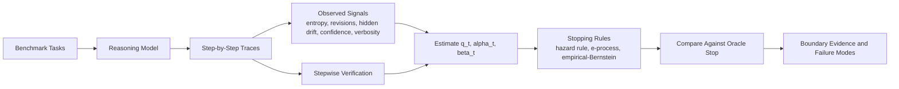
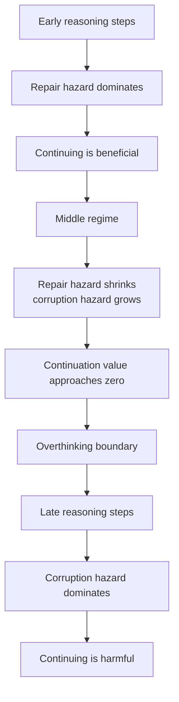
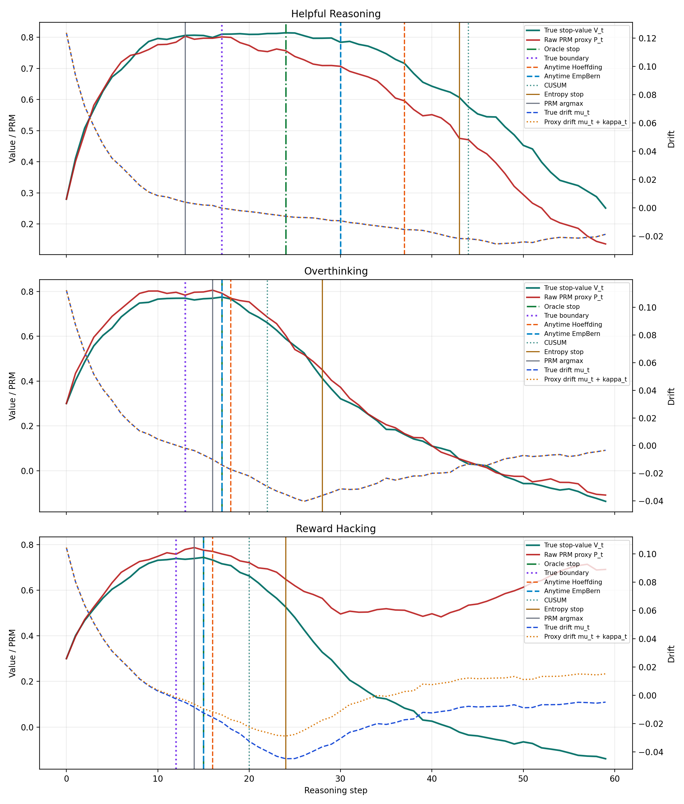
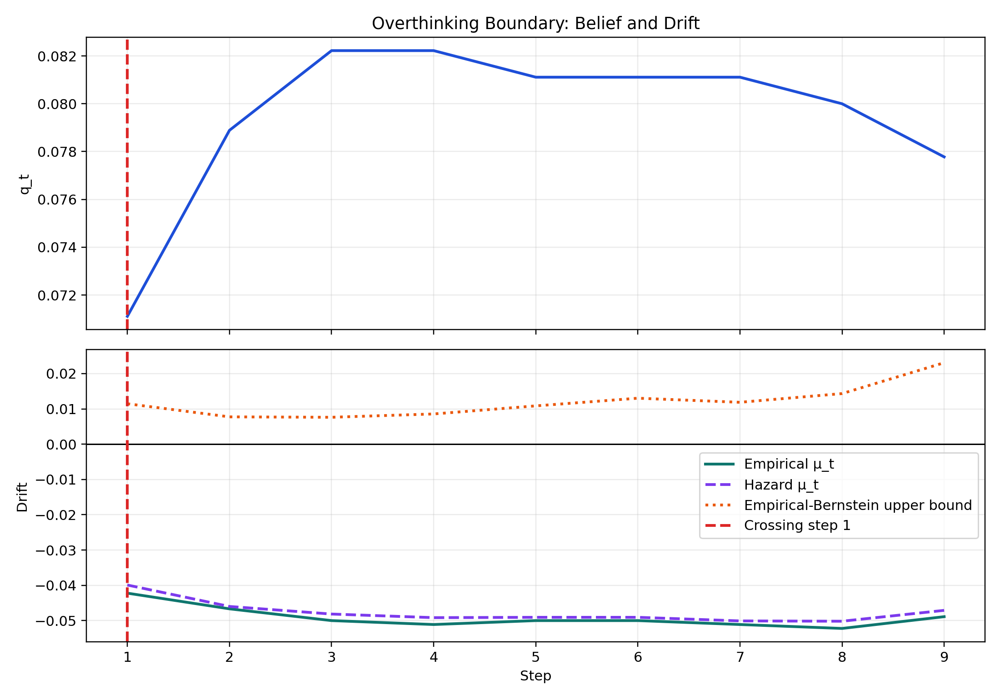

# Overthinking Boundary in Reasoning LLMs

This repository studies a simple but important failure mode in reasoning language models:

> More test-time reasoning is not always better.

At first, extra reasoning steps can repair wrong answers. After a point, the same extra compute can become harmful by corrupting already-correct answers, amplifying verbosity, or pushing the model into unstable revision loops. The research goal here is to identify that transition early enough to stop before quality degrades.

## The Problem We Are Solving

Modern reasoning models are often evaluated under the assumption that "more thinking" monotonically improves answers. This project is trying to measure and explain the opposite regime:

- When does one more reasoning step still help?
- When does one more reasoning step start hurting?
- Which observables signal the transition soon enough to act on it?
- Can we build a stopping rule that is mathematically defensible rather than prompt-engineered?

The core quantity is the one-step continuation value:

```text
mu_t = (1 - q_t) * alpha_t - q_t * beta_t - lambda
```

Where:

- `q_t` is the probability the current answer is already correct.
- `alpha_t` is the hazard of repairing a wrong answer by continuing.
- `beta_t` is the hazard of corrupting a correct answer by continuing.
- `lambda` is the compute cost of taking one more reasoning step.

The "overthinking boundary" is the point where this continuation value changes sign.

## What We Are Trying to Pursue

The repository combines theory, simulation, and real open-weight traces:

1. Formalize overthinking as a drift-sign or continuation-value problem.
2. Simulate settings where the true boundary is known.
3. Collect real step-by-step reasoning traces on benchmark tasks.
4. Estimate repair and corruption hazards from observable signals.
5. Compare stopping rules against an oracle stop computed from realized utility.

## High-Level Pipeline



## Intuition for the Boundary



## What We Are Experimenting With

The current experimental stack includes:

- A synthetic simulator for controllable boundary experiments in [research/simulate_overthinking_boundary.py](research/simulate_overthinking_boundary.py).
- A real-trace harness for open-weight models in [research/real_trace_experiments.py](research/real_trace_experiments.py).
- Post-hoc detector evaluation in [research/trace_analysis.py](research/trace_analysis.py).
- Artifact generation for thesis-style reports in [research/generate_thesis_artifacts.py](research/generate_thesis_artifacts.py).

Signals currently extracted from traces:

- Token entropy and entropy volatility.
- Answer revisions and answer streaks.
- Hidden-state L2 and cosine drift.
- Lexical echo and verbosity-linked proxies.
- Self-reported confidence when available.

Stopping rules currently compared:

- A fitted hazard-drift rule.
- A stitched empirical-Bernstein rule.
- A one-sided mixture e-process rule.
- Simpler baselines such as first answer, verifier-first-correct, entropy plateau, and never-stop.

## Current Evidence

Completed large-run evidence already in the repository:

- DeepSeek-R1 distill 1.5B on 300 GSM8K tasks x 3 temperatures x 1 seed.
- Qwen2.5 instruct 0.5B on the same 300 GSM8K tasks x 3 temperatures x 1 seed.
- Real-trace analysis with oracle comparisons, hazard summaries, and detector plots for both families.

Current cross-family snapshot:

| Model | Runs | Runs ever correct | Step-1 accuracy | Peak correctness | Peak step | Hazard crossing | Hazard gap | E-process gap | Empirical-Bernstein gap | Never-stop gap |
| --- | ---: | ---: | ---: | ---: | ---: | ---: | ---: | ---: | ---: | ---: |
| DeepSeek-R1 distill 1.5B | 900 | 621 | 0.237 | 0.304 | 7 | 7 | 0.4121 | 0.4441 | 0.7141 | 0.7463 |
| Qwen2.5 instruct 0.5B | 900 | 81 | 0.071 | 0.082 | 3 | 1 | 0.1531 | 0.0595 | 0.4106 | 0.4595 |

Interpretation:

- DeepSeek 1.5B reaches a materially competent regime and shows a later overthinking boundary around step 7.
- Qwen 0.5B remains much weaker on GSM8K, so its best utility is concentrated almost immediately and the boundary collapses toward the first step.
- The new mixture e-process is a meaningful improvement over empirical-Bernstein on both families, and it is the best pooled stop rule on the weaker Qwen run.

Primary artifacts:

- Theory note: [research/overthinking_boundary.md](research/overthinking_boundary.md)
- Latest DeepSeek report: [research/FINAL_L4_RESULTS.md](research/FINAL_L4_RESULTS.md)
- Latest Qwen report: [research/FINAL_QWEN_L4_RESULTS.md](research/FINAL_QWEN_L4_RESULTS.md)
- Updated open questions: [research/open_questions.md](research/open_questions.md)
- DeepSeek outputs: [research/outputs/real_traces_l4_deepseek_1p5b](research/outputs/real_traces_l4_deepseek_1p5b)
- Qwen outputs: [research/outputs/real_traces_l4_qwen_0p5b](research/outputs/real_traces_l4_qwen_0p5b)

Representative plots already checked into the repo:

- Synthetic trajectories: 
- DeepSeek drift crossing: 
- Qwen drift crossing: 

## Repository Map

- [research/overthinking_boundary.md](research/overthinking_boundary.md): main theory and research note.
- [research/simulate_overthinking_boundary.py](research/simulate_overthinking_boundary.py): synthetic environment and detector validation.
- [research/real_trace_experiments.py](research/real_trace_experiments.py): trace collection on builtin tasks and GSM8K.
- [research/trace_analysis.py](research/trace_analysis.py): detector fitting, hazard summaries, and plots.
- [research/generate_thesis_artifacts.py](research/generate_thesis_artifacts.py): markdown report generation from completed outputs.
- [tools/run_colab_experiment.py](tools/run_colab_experiment.py): guarded Colab execution wrapper.

## Local Entry Points

- `python research/simulate_overthinking_boundary.py`
- `python research/real_trace_experiments.py --model qwen2p5_0p5b --device cpu --max-tasks 3 --max-steps 3 --max-new-tokens 16 --temperatures 0.2 0.8 --seeds 7 --output-dir research/outputs/real_traces_qwen`
- `python research/trace_analysis.py --input-dir research/outputs/real_traces_qwen`
- `python research/generate_thesis_artifacts.py --input-dir research/outputs/real_traces_l4_deepseek_1p5b`

## Google Colab Workflow

The guarded Colab runner is [tools/run_colab_experiment.py](tools/run_colab_experiment.py). It is designed to avoid wasting GPU credits:

1. Check the Python environment and GPU.
2. Optionally run the synthetic simulator.
3. Optionally run a smoke test.
4. Launch the full real-trace experiment.
5. Rebuild the analysis artifacts automatically.

Example Colab command after cloning the repo:

```bash
python tools/run_colab_experiment.py --model deepseek_r1_distill_1p5b
```

Useful variants:

- Smoke test only: `python tools/run_colab_experiment.py --smoke-only`
- Skip dependency installation if the runtime already has them: `python tools/run_colab_experiment.py --skip-install`
- Use the smaller Qwen family end-to-end: `python tools/run_colab_experiment.py --model qwen2p5_0p5b`
- Resume a partially completed run by pointing `--output-dir` at an existing artifact directory and leaving resume enabled.

Dependencies for Colab are listed in [requirements-colab.txt](requirements-colab.txt). The runner intentionally does not reinstall PyTorch so it preserves the GPU-enabled Colab build.