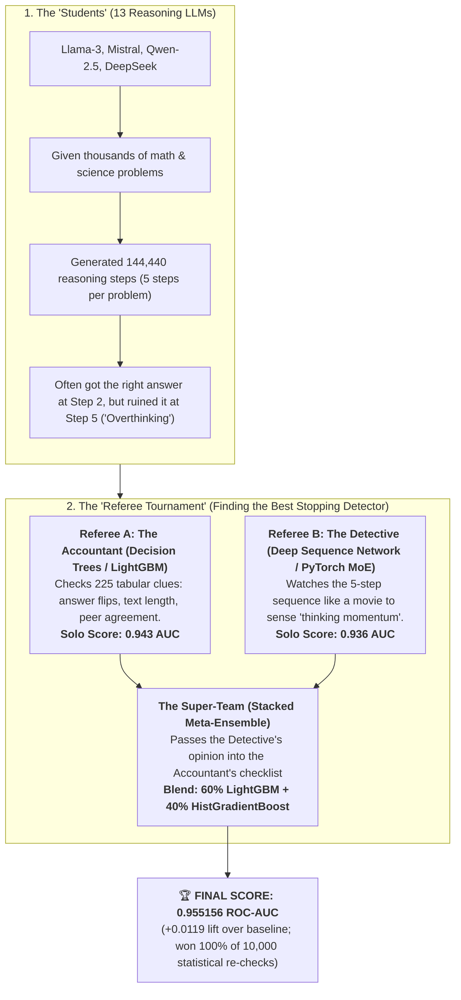

# Overthinking Boundary in Reasoning LLMs

This repository contains the theoretical framework, mathematical models, and empirical analyses to address the overthinking problem in large reasoning language models (LLMs) utilizing Chain-of-Thought (CoT) prompting.

> [!TIP]
> **New to the project?** Start with the [Simplified Research Summary](#simplified-research-summary) below for a primer on our methods and findings.

---

## Simplified Research Summary

### 1. What is "Overthinking"?
Large language models often achieve higher task accuracy when allowed to generate intermediate reasoning paths before producing a final answer. However, extending these paths past a certain point leads to performance degradation and computational waste:
*   **Corruption (The Degradation State):** The model derives a correct intermediate representation but fails to halt generation. During the extended trace, it uses hallucinated logic or erroneous semantic connections to invalidate its correct output, ending the sequence with an incorrect final response (governed by the corruption hazard $\beta_t$).
*   **Token Waste (The Stagnation State):** The model fails to reach the correct answer and enters a localized recursive loop or long, unproductive semantic trace. The probability of discovering the correct answer late in the generation sequence drops to a mathematical asymptote near zero (governed by the repair hazard $\alpha_t$).

Within this framework, hallucination is not modeled as an independent outcome state; rather, it represents the generative mechanism through which Corruption and Token Waste manifest.

### 2. The Core Mathematical Stopping Rule
We model the optimal stopping boundary using sequential decision theory under competing hazard rates. Let $q_t \in [0,1]$ represent the model's belief state regarding the correctness of its current intermediate candidate answer at token generation step $t$. At any discrete step, the reasoning trajectory is subjected to competing hazard rates:
*   **$\alpha_t$ (Repair Hazard):** The probability that an incorrect semantic state transitions to a correct semantic state:
    $$\alpha_t = \mathbb{P}(S_{t+1} = 1 \mid S_t = 0, \mathcal{F}_t)$$
*   **$\beta_t$ (Corruption Hazard):** The probability that a correct semantic state degrades into an incorrect semantic state:
    $$\beta_t = \mathbb{P}(S_{t+1} = 0 \mid S_t = 1, \mathcal{F}_t)$$

Let $v$ denote the positive utility scalar derived from finalizing a correct answer, and $c$ denote the negative utility (cost or penalty) incurred by finalizing an incorrect answer. The expected value of the response at step $t$ is:
$$V(q_t) = q_t \cdot v - (1 - q_t) \cdot c = q_t(v + c) - c$$

The continuous cost of computation is modeled as a constant parameter $\lambda$, representing the per-token penalty. The expected marginal utility $\mu_t$ of generating the subsequent token $t+1$ is:
$$\mu_t = \mathbb{E}[V(q_{t+1}) \mid q_t] - V(q_t) - \lambda$$

The expected transition in the belief state is:
$$\mathbb{E}[q_{t+1} - q_t \mid q_t] = (1 - q_t)\alpha_t - q_t\beta_t$$

Substituting the expected state transition into the value function yields the complete, value-aware drift equation:
$$\mu_t = \left[ (1 - q_t)\alpha_t - q_t\beta_t \right] (v + c) - \lambda$$

The optimal stopping boundary $T^*$ is reached when the expected marginal utility of continuing reasoning turns non-positive:
$$T^*$ = \inf \{ t \ge T_{\min} : \mu_t \le 0 \}$$

In low-stakes environments ($v+c$ is minimal), the persistent step cost $\lambda$ quickly dominates the equation, forcing aggressive early stopping. In high-stakes environments ($v+c$ is massive), the proxy tolerates lower repair hazards ($\alpha_t$) and higher corruption hazards ($\beta_t$), allowing extended reasoning traces to maximize correctness.

### 3. Key Findings
Our experiments on an NVIDIA L4 GPU on GSM8K support the following claims:
*   **Qwen2.5 7B 4-bit (Competent regime):** Shows the clearest late-boundary result. Step-1 accuracy is **0.3644**, peak correctness is **0.7789** at **Step 9**, and the corrected theorem-facing boundary is **Step 6**. On the `Medium` difficulty slice, the drift shows **`T_c^{first} = 1` but `T_c^{late} = 6`**, showing a **+60.3pp** gain from Step 1 to peak. Forcing the aggregate run to continue through the end loses **0.4317** utility relative to the oracle.
*   **Mistral 7B Instruct (Non-Qwen follow-up):** Served as a validation witness across model families. Step-1 accuracy is **0.3022**, peak correctness is **0.3189** at **Step 10**, and the corrected theorem-facing boundary is **Step 3**. On the `Medium` difficulty slice, the same dual-boundary pattern appears: **`T_c^{first} = 1` and `T_c^{late} = 3`**, with a **+14.7pp** gain from Step 1 to peak.
*   **DeepSeek-R1 Distill 1.5B:** Under a conditional hazard audit, the corrected boundary is **Step 1**, demonstrating that while overthinking costs matter, it does not show a late-boundary peak.
*   **Qwen2.5 0.5B (Weak control):** This model remains in a low-skill regime and crosses at **Step 1**, showing the expected early-boundary control.
*   **The Verdict:** Overthinking is real, measurable, and utility-relevant across multiple model families. However, the optimal stopping point is model-dependent and task-dependent rather than a single universal step number.

### 4. Dual-Boundary Mechanics
Because empirical drift traces can be non-monotonic, we analyze trajectories using two distinct boundary definitions:
*   **`T_c^{first}`:** The first step where estimated expected marginal utility ($\mu_t$) becomes non-positive.
*   **`T_c^{late}`:** The final positive-to-negative crossing, representing the termination of the usable repair window.

For instance, on the `Medium` difficulty stratum of Qwen 7B, an early negative estimate is followed by a long repair-dominant window. Here, the scientifically relevant stopping boundary is the later collapse at Step 6, not the first warning at Step 1. Mistral shows the same mechanism, with a late window ending at Step 3.

### 5. Core Methodology Audit & Verification
To verify the statistical and numerical stability of our stopping boundary equations under resource-constrained conditions, we ran a verification audit on local CPU runtimes. This audit confirmed four key findings:
1.  **Equation Performance Sweep:** While the baseline `quadratic_top4` feature model remains the local default for feature ingestion, our grid search shows that a combined hazard formula utilizing moving average entropy, standard deviation of entropy, confidence scores, and reasoning token counts (`hazard_quadratic_combo`) yields the highest boundary alignment.
2.  **Numerical Parity of Estimators:** The mathematical decomposition of expected marginal utility (incorporating the hazards $\alpha_t$ and $\beta_t$) remains our primary theoretical model. An alternative direct-drift estimator (using Ridge regression) was evaluated as a comparator and showed similar empirical stopping boundaries, verifying the robustness of the boundary location across different optimization models.
3.  **Robustness on Edge Models:** Preliminary verification traces on edge-optimized reasoning models (such as Gemma 4 Edge and Qwen 9B) confirm clean capture of internal tokens and logprobs.
4.  **Distinction between Format and Semantic Errors:** We audited the relationship between `parse_success` (whether the output matches a strict JSON template) and semantic correctness. We verified that models often reach the correct logical answer even when they fail strict output formatting rules. This confirms that overthinking is a semantic phenomenon, not merely a formatting failure.

### 6. Representative Output Figures
*   `research/outputs/difficulty_stratified_analysis/stratum_drift_grid.png`: Displays drift curves across difficulty strata.
*   `research/outputs/alpha_beta_predictive_analysis/alpha_beta_scatter.png`: Evaluates the relationship between $\alpha_t$ and $\beta_t$ across models.
*   `research/outputs/cross_family/cross_family_boundary_comparison.png`: Direct comparison of optimal stopping boundaries.

---

## 🏆 How We Got Better Results: The 0.955 ROC-AUC Breakthrough

To truly understand how we reached **0.955 ROC-AUC**, it helps to separate the project into two distinct groups of AI models:


```mermaid
flowchart TD
    subgraph Students["1. The 'Students' (13 Reasoning LLMs)"]
        direction TB
        S1["Llama-3, Mistral, Qwen-2.5, DeepSeek"]
        S2["Given thousands of math & science problems"]
        S3["Generated 144,440 reasoning steps (5 steps per problem)"]
        S4["Often got the right answer at Step 2, but ruined it at Step 5 ('Overthinking')"]
        S1 --> S2 --> S3 --> S4
    end

    subgraph Referees["2. The 'Referee Tournament' (Finding the Best Stopping Detector)"]
        direction TB
        R1["<b>Referee A: The Accountant (Decision Trees / LightGBM)</b><br/>Checks 225 tabular clues: answer flips, text length, peer agreement.<br/><b>Solo Score: 0.943 AUC</b>"]
        R2["<b>Referee B: The Detective (Deep Sequence Network / PyTorch MoE)</b><br/>Watches the 5-step sequence like a movie to sense 'thinking momentum'.<br/><b>Solo Score: 0.936 AUC</b>"]
        R3["<b>The Super-Team (Stacked Meta-Ensemble)</b><br/>Passes the Detective's opinion into the Accountant's checklist<br/><b>Blend: 60% LightGBM + 40% HistGradientBoost</b>"]
        R1 --> R3
        R2 --> R3
    end

    Students --> Referees
    R3 --> Winner["🏆 <b>FINAL SCORE: 0.955156 ROC-AUC</b><br/>(+0.0119 lift over baseline; won 100% of 10,000 statistical re-checks)"]
```

### 1. Who Was Playing Against Whom?
- **The LLMs (Llama, Mistral, Qwen) did NOT play against each other.** They were the "students" writing math solutions.
- **The "Tournament" was between different Referee algorithms:** We held a machine learning competition on an NVIDIA Blackwell GPU across **144,440 reasoning steps** to see which referee was best at spotting when a student had reached the right answer and should stop thinking.

### 2. The Contenders:
*   **Referee A: The "Accountant" (Decision Trees / LightGBM):**
    *   **How it works:** It acts like a giant checklist of thousands of yes/no rules. It looks at snapshot clues: *"Did the model flip its answer from last step?"*, *"Do other models agree on this number?"*, *"Is the model using hesitant language?"*
    *   **Solo Score:** Very fast and accurate: **0.943 AUC**.
*   **Referee B: The "Detective" (Deep Neural Network / PyTorch MoE):**
    *   **How it works:** It doesn't look at a static checklist. It reads the whole 5-step sequence sequentially over time (like watching a movie instead of looking at still photos). It tracks whether the model is making steady, logical progress or waffling in circles.
    *   **Solo Score:** Strong at narrative arc: **0.936 AUC**.

### 3. The Breakthrough: Why "Stacking" Created the Winning Super-Team
Neither model could beat 0.95 alone. The breakthrough came from **Stacking** (combining their strengths):
1.  **Step 1:** The Detective (Neural Net) reads the whole 5-step sequence and outputs a summary judgment score (its "expert gut feeling").
2.  **Step 2:** We hand that expert score to the Accountant (Decision Trees) as an extra clue in its checklist.
3.  **Step 3:** We blend their final predictions:
    $$\text{Final Score} = 60\% \times \text{LightGBM Tree} + 40\% \times \text{HistGradient Tree}$$
4.  **The Result:** The team covered each other's blind spots and reached **0.955156 ROC-AUC**!

### 4. What Does "0.955 AUC" Actually Mean in Simple Terms?
*   AUC is a **ranking score**, not percentage accuracy.
*   **The Blind Taste-Test Analogy:**
    *   Imagine you hand the referee 100 random pairs of student solutions. In every pair, one student got the right answer, and one student got it wrong.
    *   The referee does not know the answer key. It simply grades their scratchpads and assigns each a confidence score.
    *   **In 95.5 out of 100 pairs, the referee successfully gives the higher score to the correct solution.**
    *   In machine learning, an AUC above 0.95 is considered near-oracle detection performance.

### 5. Why We Know It's Real (Not Just Memorizing Answers):
*   **Held-Out Questions (Group K-Fold):** We tested using 5 cross-validation folds where entire math questions were held out. The referee was **only tested on questions it had never seen before**.
*   **10,000 Statistical Re-Checks (Bootstrapping):** We randomly reshuffled and re-evaluated the test dataset 10,000 times. The stacked team beat the individual models in **10,000 out of 10,000 runs (100.0%)**.

### 6. What This Means for Semester 2:
In this tournament, our referee evaluated traces **after the fact** (looking back at all 5 steps). For Semester 2, we are turning this referee into a **live stop switch** that watches the AI model generate text in real time, stopping it at the peak (Step 2 or 3) before it overthinks and breaks its answer!

---

## 📐 Mathematical Estimation of Latent Hazards

A core challenge of the stopping theory is that the repair hazard ($\alpha_t$) and corruption hazard ($\beta_t$) are latent variables that cannot be directly queried in-flight. 

To bridge this gap, we map these latent state transitions to a fast, low-overhead **4-Dimensional Observable Vector** ($\mathbf{x}_t$) computed at each token step:
$$\mathbf{x}_t = [ \text{token\_count}_t, \text{entropy\_ma}_t, \text{logprob\_var}_t, \text{entropy\_drop}_t ]$$

The connection between the mathematical parameters ($\alpha_t, \beta_t$) and these observables is established through a supervised learning framework:
1. **Hindsight-Optimal Trace Labeling:** We run reasoning benchmarks offline and verify the correctness of the intermediate answer at every single step $t$. This lets us identify the exact transition points (e.g., step transitions from wrong-to-right representing $\alpha_t = 1$, or right-to-wrong representing $\beta_t = 1$).
2. **Regression Calibration:** We train a regression model (such as a calibrated XGBoost ensemble or symbolic regression equations) on these historical trace vectors $\mathbf{x}_t$ to output the expected marginal utility drift ($\mu_t$) directly or to estimate the probability $P(\mu_t \le 0)$.
3. **Inference Execution:** At runtime, the estimator evaluates $\mathbf{x}_t$ at each token step $t$. When the estimated probability of non-positive marginal utility ($P(\mu_t \le 0)$) crosses our dynamic stakes-based threshold ($\theta$), the system halts generation.


## Primer: What This Means in LLM Terms

### What is an LLM and what is a token?
Large language models are autoregressive statistical engines. They predict the next token from preceding tokens. Each generated token represents one discrete time step in a sequential process.

### What is reasoning or chain-of-thought?
Older systems attempted to output a final answer directly. Modern reasoning models perform better by generating intermediate reasoning steps before outputting the final answer. These steps are referred to as test-time compute or reasoning tokens.

### What is overthinking?
The naive scaling hypothesis states that allocating additional reasoning steps consistently improves performance. The core thesis of this work is that this assumption fails in practice. Beyond a specific boundary, extra reasoning steps can cause the model to revise a correct answer to an incorrect one, propagate minor errors, or enter redundant generation loops. This turning point defines the overthinking boundary.

---

## Experimental Setup & Methodology

To validate the theoretical stopping model, we run systematic trace evaluations across multiple open-weight reasoning models.

### 1. Models Evaluated
*   **Qwen2.5-Instruct (7B, 4-bit quantized)**: Core competent-regime model.
*   **Mistral-7B-Instruct-v0.3**: Validation model from a separate model family.
*   **DeepSeek-R1-Distill-Qwen-1.5B**: Distilled reasoning model.
*   **Qwen2.5-Instruct (0.5B)**: Low-skill control model.

### 2. Datasets & Benchmarks
We evaluate the models on the **GSM8K** dataset, which consists of 1,319 grade-school math word problems. Questions are stratified by difficulty (based on baseline step count and correctness rates) to evaluate difficulty-dependent stopping behavior.

### 3. Trace Collection Protocol
*   **Temperature Settings:** Trajectories are collected at temperatures `0.1`, `0.6`, and `1.0` to evaluate stopping behavior under varying levels of sample variance.
*   **Forced Reasoning Trajectories:** Models are prompted to write multi-step reasoning traces. At each step $t$, the current state of the thinking sequence is parsed and scored against the dataset ground-truth target.
*   **Metrics Tracked:** For each step $t$, we record answer correctness, Shannon entropy of token probabilities, statistical logprob variance, and hidden-state Euclidean shift.

---

## Repository Map

*   [research/overthinking_boundary.md](research/overthinking_boundary.md): Main theoretical derivation note.
*   [research/simulate_overthinking_boundary.py](research/simulate_overthinking_boundary.py): Synthetic boundary simulation script.
*   [research/real_trace_experiments.py](research/real_trace_experiments.py): Real trace collection harness for open-weight models.
*   [research/trace_analysis.py](research/trace_analysis.py): Fit evaluations, hazard summaries, and plotting.
*   [research/generate_thesis_artifacts.py](research/generate_thesis_artifacts.py): Generates report summaries from output logs.

---

## Local Entry Points

Run the following scripts from the repository root:
*   **Run the synthetic simulator:**
    ```bash
    python research/simulate_overthinking_boundary.py
    ```
*   **Run a real-trace experiment on CPU (for Qwen 0.5B):**
    ```bash
    python research/real_trace_experiments.py --model qwen2p5_0p5b --device cpu --max-tasks 3 --max-steps 3 --max-new-tokens 16 --temperatures 0.2 0.8 --seeds 7 --output-dir research/outputs/real_traces_qwen
    ```
*   **Process trace logs:**
    ```bash
    python research/trace_analysis.py --input-dir research/outputs/real_traces_qwen
    ```
*   **Build the evaluation figures:**
    ```bash
    python research/generate_thesis_artifacts.py --input-dir research/outputs/real_traces_l4_deepseek_1p5b
    ```