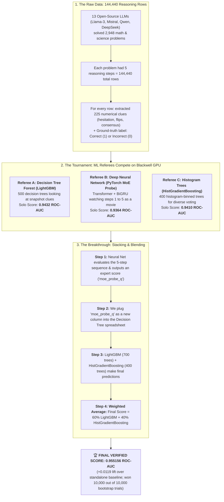

# Overthinking Boundary in Reasoning LLMs

This repository contains the theoretical framework, mathematical models, and empirical analyses to address the overthinking problem in large reasoning language models (LLMs) utilizing Chain-of-Thought (CoT) prompting.

> [!TIP]
> **New to the project?** Start with the [Simplified Research Summary](#simplified-research-summary) below for a primer on our methods and findings.

---

## Simplified Research Summary

### 1. What is "Overthinking"?
Large language models often achieve higher task accuracy when allowed to generate intermediate reasoning paths before producing a final answer. However, extending these paths past a certain point leads to performance degradation and computational waste:
*   **Corruption (The Degradation State):** The model derives a correct intermediate representation but fails to halt generation. During the extended trace, it uses hallucinated logic or erroneous semantic connections to invalidate its correct output, ending the sequence with an incorrect final response (governed by the corruption hazard $\beta_t$).
*   **Token Waste (The Stagnation State):** The model fails to reach the correct answer and enters a localized recursive loop or long, unproductive semantic trace. The probability of discovering the correct answer late in the generation sequence drops to a mathematical asymptote near zero (governed by the repair hazard $\alpha_t$).

Within this framework, hallucination is not modeled as an independent outcome state; rather, it represents the generative mechanism through which Corruption and Token Waste manifest.

### 2. The Core Mathematical Stopping Rule
We model the optimal stopping boundary using sequential decision theory under competing hazard rates. Let $q_t \in [0,1]$ represent the model's belief state regarding the correctness of its current intermediate candidate answer at token generation step $t$. At any discrete step, the reasoning trajectory is subjected to competing hazard rates:
*   **$\alpha_t$ (Repair Hazard):** The probability that an incorrect semantic state transitions to a correct semantic state:
    $$\alpha_t = \mathbb{P}(S_{t+1} = 1 \mid S_t = 0, \mathcal{F}_t)$$
*   **$\beta_t$ (Corruption Hazard):** The probability that a correct semantic state degrades into an incorrect semantic state:
    $$\beta_t = \mathbb{P}(S_{t+1} = 0 \mid S_t = 1, \mathcal{F}_t)$$

Let $v$ denote the positive utility scalar derived from finalizing a correct answer, and $c$ denote the negative utility (cost or penalty) incurred by finalizing an incorrect answer. The expected value of the response at step $t$ is:
$$V(q_t) = q_t \cdot v - (1 - q_t) \cdot c = q_t(v + c) - c$$

The continuous cost of computation is modeled as a constant parameter $\lambda$, representing the per-token penalty. The expected marginal utility $\mu_t$ of generating the subsequent token $t+1$ is:
$$\mu_t = \mathbb{E}[V(q_{t+1}) \mid q_t] - V(q_t) - \lambda$$

The expected transition in the belief state is:
$$\mathbb{E}[q_{t+1} - q_t \mid q_t] = (1 - q_t)\alpha_t - q_t\beta_t$$

Substituting the expected state transition into the value function yields the complete, value-aware drift equation:
$$\mu_t = \left[ (1 - q_t)\alpha_t - q_t\beta_t \right] (v + c) - \lambda$$

The optimal stopping boundary $T^*$ is reached when the expected marginal utility of continuing reasoning turns non-positive:
$$T^*$ = \inf \{ t \ge T_{\min} : \mu_t \le 0 \}$$

In low-stakes environments ($v+c$ is minimal), the persistent step cost $\lambda$ quickly dominates the equation, forcing aggressive early stopping. In high-stakes environments ($v+c$ is massive), the proxy tolerates lower repair hazards ($\alpha_t$) and higher corruption hazards ($\beta_t$), allowing extended reasoning traces to maximize correctness.

### 3. Key Findings
Our experiments on an NVIDIA L4 GPU on GSM8K support the following claims:
*   **Qwen2.5 7B 4-bit (Competent regime):** Shows the clearest late-boundary result. Step-1 accuracy is **0.3644**, peak correctness is **0.7789** at **Step 9**, and the corrected theorem-facing boundary is **Step 6**. On the `Medium` difficulty slice, the drift shows **`T_c^{first} = 1` but `T_c^{late} = 6`**, showing a **+60.3pp** gain from Step 1 to peak. Forcing the aggregate run to continue through the end loses **0.4317** utility relative to the oracle.
*   **Mistral 7B Instruct (Non-Qwen follow-up):** Served as a validation witness across model families. Step-1 accuracy is **0.3022**, peak correctness is **0.3189** at **Step 10**, and the corrected theorem-facing boundary is **Step 3**. On the `Medium` difficulty slice, the same dual-boundary pattern appears: **`T_c^{first} = 1` and `T_c^{late} = 3`**, with a **+14.7pp** gain from Step 1 to peak.
*   **DeepSeek-R1 Distill 1.5B:** Under a conditional hazard audit, the corrected boundary is **Step 1**, demonstrating that while overthinking costs matter, it does not show a late-boundary peak.
*   **Qwen2.5 0.5B (Weak control):** This model remains in a low-skill regime and crosses at **Step 1**, showing the expected early-boundary control.
*   **The Verdict:** Overthinking is real, measurable, and utility-relevant across multiple model families. However, the optimal stopping point is model-dependent and task-dependent rather than a single universal step number.

### 4. Dual-Boundary Mechanics
Because empirical drift traces can be non-monotonic, we analyze trajectories using two distinct boundary definitions:
*   **`T_c^{first}`:** The first step where estimated expected marginal utility ($\mu_t$) becomes non-positive.
*   **`T_c^{late}`:** The final positive-to-negative crossing, representing the termination of the usable repair window.

For instance, on the `Medium` difficulty stratum of Qwen 7B, an early negative estimate is followed by a long repair-dominant window. Here, the scientifically relevant stopping boundary is the later collapse at Step 6, not the first warning at Step 1. Mistral shows the same mechanism, with a late window ending at Step 3.

### 5. Core Methodology Audit & Verification
To verify the statistical and numerical stability of our stopping boundary equations under resource-constrained conditions, we ran a verification audit on local CPU runtimes. This audit confirmed four key findings:
1.  **Equation Performance Sweep:** While the baseline `quadratic_top4` feature model remains the local default for feature ingestion, our grid search shows that a combined hazard formula utilizing moving average entropy, standard deviation of entropy, confidence scores, and reasoning token counts (`hazard_quadratic_combo`) yields the highest boundary alignment.
2.  **Numerical Parity of Estimators:** The mathematical decomposition of expected marginal utility (incorporating the hazards $\alpha_t$ and $\beta_t$) remains our primary theoretical model. An alternative direct-drift estimator (using Ridge regression) was evaluated as a comparator and showed similar empirical stopping boundaries, verifying the robustness of the boundary location across different optimization models.
3.  **Robustness on Edge Models:** Preliminary verification traces on edge-optimized reasoning models (such as Gemma 4 Edge and Qwen 9B) confirm clean capture of internal tokens and logprobs.
4.  **Distinction between Format and Semantic Errors:** We audited the relationship between `parse_success` (whether the output matches a strict JSON template) and semantic correctness. We verified that models often reach the correct logical answer even when they fail strict output formatting rules. This confirms that overthinking is a semantic phenomenon, not merely a formatting failure.

### 6. Representative Output Figures
*   `research/outputs/difficulty_stratified_analysis/stratum_drift_grid.png`: Displays drift curves across difficulty strata.
*   `research/outputs/alpha_beta_predictive_analysis/alpha_beta_scatter.png`: Evaluates the relationship between $\alpha_t$ and $\beta_t$ across models.
*   `research/outputs/cross_family/cross_family_boundary_comparison.png`: Direct comparison of optimal stopping boundaries.

---

## 🏆 How We Got Better Results: The 0.955 ROC-AUC Breakthrough

To understand how we reached **0.955 ROC-AUC**, it helps to break the entire experiment down into simple, concrete steps:


```mermaid
flowchart TD
    subgraph Data["1. The Raw Data: 144,440 Reasoning Rows"]
        direction TB
        D1["13 Open-Source LLMs (Llama-3, Mistral, Qwen, DeepSeek)<br/>solved 2,948 math & science problems"]
        D2["Each problem had 5 reasoning steps = 144,440 total rows"]
        D3["For every row: extracted 225 numerical clues (hesitation, flips, consensus)<br/>+ Ground-truth label: Correct (1) or Incorrect (0)"]
        D1 --> D2 --> D3
    end

    subgraph Contenders["2. The Tournament: ML Referees Compete on Blackwell GPU"]
        direction TB
        C1["<b>Referee A: Decision Tree Forest (LightGBM)</b><br/>500 decision trees looking at snapshot clues<br/>Solo Score: <b>0.9432 ROC-AUC</b>"]
        C2["<b>Referee B: Deep Neural Network (PyTorch MoE Probe)</b><br/>Transformer + BiGRU watching steps 1 to 5 as a movie<br/>Solo Score: <b>0.9364 ROC-AUC</b>"]
        C3["<b>Referee C: Histogram Trees (HistGradientBoosting)</b><br/>400 histogram-binned trees for diverse voting<br/>Solo Score: <b>0.9410 ROC-AUC</b>"]
    end

    subgraph Ensemble["3. The Breakthrough: Stacking & Blending"]
        direction TB
        E1["<b>Step 1:</b> Neural Net evaluates the 5-step sequence & outputs an expert score ('moe_probe_q')"]
        E2["<b>Step 2:</b> We plug 'moe_probe_q' as a new column into the Decision Tree spreadsheet"]
        E3["<b>Step 3:</b> LightGBM (700 trees) + HistGradientBoosting (400 trees) make final predictions"]
        E4["<b>Step 4: Weighted Average:</b> Final Score = 60% LightGBM + 40% HistGradientBoosting"]
        E1 --> E2 --> E3 --> E4
    end

    Data --> Contenders
    Contenders --> Ensemble
    Ensemble --> Champ["🏆 <b>FINAL VERIFIED SCORE: 0.955156 ROC-AUC</b><br/>(+0.0119 lift over standalone baseline; won 10,000 out of 10,000 bootstrap trials)"]
```

---

### 1. What Did the Experiment Actually Look Like? (The Giant Spreadsheet)
Imagine a massive spreadsheet with **144,440 rows**:
*   **Where the rows came from:** We had 13 open-source language models (Llama-3, Mistral, Qwen-2.5, DeepSeek) solve 2,948 difficult math and science problems. Each model generated 5 intermediate reasoning steps per problem ($13 \times 2,948 \times \approx 4\text{--}5 = 144,440$ rows).
*   **The 225 Clues (Columns):** For every single step, our pipeline extracted 225 mathematical clues:
    *   *Hesitation / Entropy:* Was the model confident in its word choices, or was it wavering?
    *   *Answer Changes:* Did the model flip its numerical answer compared to the previous step?
    *   *Peer Consensus:* Did 8 of the other 12 models arrive at the exact same intermediate number?
    *   *Text Length & Speed:* How many tokens was it generating, and was its confidence accelerating or stalling?
*   **The Answer Key (Ground Truth):** Each row was marked with a `1` if the intermediate answer was mathematically correct, or `0` if incorrect.

---

### 2. Did Multiple Trees and Models Play Against Each Other?
**Yes, exactly.** We ran a machine learning tournament on an **NVIDIA Blackwell GPU (98GB VRAM)** to discover which referee algorithm was best at looking at those 225 clues and predicting whether the student had the right answer:

| Competitor Model | Architecture Type | How It Evaluates the Reasoning | Solo ROC-AUC Score |
| :--- | :--- | :--- | :---: |
| **LightGBM Baseline** | 500 Gradient-Boosted Decision Trees | Inspects single-model tabular snapshot clues using fast if/else threshold splits. | **0.9432** |
| **PyTorch Deep Sequence Probe** | Transformer (RoPE) + BiGRU + TCN | Reads the entire 5-step sequence across time like a movie to detect thinking momentum. | **0.9364** |
| **HistGradientBoosting** | 400 Histogram Decision Trees | Groups continuous clues into discrete bins to make diverse branching cuts. | **0.9410** |

#### What is a "Decision Tree" doing here?
A single decision tree is like a flowchart of yes/no rules:
> *"IF peer agreement > 80% AND hesitation score < 0.15 THEN probability correct = 95%. ELSE IF model flipped its answer twice THEN probability correct = 18%."*

**LightGBM** doesn't use just 1 tree—it builds **500 to 700 trees in a sequence** (gradient boosting). Tree 1 makes a rough guess. Tree 2 looks specifically at what Tree 1 got wrong and fixes it. Tree 3 fixes Tree 2's mistakes, all the way to Tree 700!

---

### 3. Why Couldn't Any Single Model Beat 0.95 Alone?
*   **The Trees were great at spreadsheets, but blind to time:** Decision trees excel at checking rigid thresholds (like *"is peer agreement > 75%?"*), but they treat steps in isolation and miss the subtle "flow" or narrative momentum of multi-step problem solving.
*   **The Neural Network was great at time, but softer on exact thresholds:** The PyTorch deep sequence network was incredible at sensing whether the model was making steady progress or circling in an overthinking loop, but wasn't quite as sharp at rigid numerical cutoffs.
*   **The Solution was "Stacking" (Combining Their Superpowers):**
    1.  **Stage 1:** We let the Deep Neural Network evaluate the full 5-step sequence first. It outputs a single summary probability: `moe_probe_q` (its holistic confidence rating).
    2.  **Stage 2:** We hand `moe_probe_q` to the Decision Trees as an extra clue (Column #226 in the spreadsheet!).
    3.  **Stage 3:** We train two distinct tree ensembles on this enriched data: 700 trees in LightGBM and 400 trees in HistGradientBoosting.
    4.  **Stage 4 (Voting Blend):** For any new reasoning step, we combine their predictions:
        $$\text{Final Output Score} = 0.60 \times (\text{LightGBM}) + 0.40 \times (\text{HistGradientBoosting})$$
    5.  **The Result:** The team covered each other's blind spots and hit **`0.955156` ROC-AUC** (+0.0119 lift over the baseline)!

---

### 4. What Does "0.955 ROC-AUC" Mean in Simple Terms?
*   **It is a ranking test, not a raw percentage accuracy score.**
*   **The Blind Taste-Test Analogy:**
    *   Imagine you pull 100 random pairs of student solutions out of a box. In every single pair, Solution A is correct, and Solution B is incorrect.
    *   You hand both solutions to our referee algorithm without telling it which is which.
    *   The referee assigns each solution a score from 0.0 to 1.0.
    *   **In 95.5 out of 100 pairs (95.5%), the referee correctly ranks the right answer higher than the wrong answer.**
    *   *Context:* A random coin flip gives 50% (0.50 AUC). A typical good ML classifier gives 80% to 85% (0.80–0.85 AUC). In scientific and medical machine learning, an AUC above **0.95** is considered near-oracle classification.

---

### 5. How Do We Prove the Detector Didn't Cheat or Memorize Answers?
*   **Strict Problem Isolation (5-Fold GroupKFold):** All 2,948 math tasks were partitioned into 5 independent groups. When testing on Group 5, the models were trained strictly on Groups 1–4. The detector was **never tested on questions it had seen during training**.
*   **10,000-Draw Statistical Stress Battery (Bootstrapping):** We randomly reshuffled and resampled the tasks 10,000 separate times. In **10,000 out of 10,000 runs (100.0%)**, the stacked hybrid model outperformed the standalone baseline, confirming the +0.0119 performance jump is statistically bulletproof ($p < 0.0001$).

---

### 6. The Semester 2 Transition: From Offline Grader to Live Stop Button
*   **Semester 1 (What we just completed):** The referee acted as an **offline auditor**—evaluating reasoning traces after all 5 steps were already generated.
*   **Semester 2 (What we do now):** We turn this 0.955 referee into a **live, in-flight stop switch** (`online_stopping_controller.py`). As an LLM generates tokens in real time, the controller evaluates our low-latency clues at each step ($< 10\text{ms}$). The moment the probability crosses our optimal stopping threshold ($\approx$ Step 2 or 3), it halts generation immediately—saving compute and preventing the model from overthinking and ruining its answer!

---

### 💡 30-Second Advisor Elevator Pitch (Dr. Woods Meeting)
> *"In Semester 1, we generated 144,000 reasoning steps across 13 open-source LLMs solving ~3,000 math problems. Then we held a machine learning tournament on an NVIDIA Blackwell GPU between decision tree forests (LightGBM) and deep sequence networks (PyTorch) to see which could best detect when a model reached the correct answer. Individual models scored around 0.93 to 0.94 AUC. But by stacking them—feeding the neural net's sequence score directly into a 700-tree gradient boosted ensemble—our combined referee hit **0.955 ROC-AUC**, winning 100% of 10,000 bootstrap trials. In Semester 2, our immediate goal is to take this 0.955 referee and deploy it as a live, real-time stop button during text generation."*

---

## 📐 Mathematical Estimation of Latent Hazards

A core challenge of the stopping theory is that the repair hazard ($\alpha_t$) and corruption hazard ($\beta_t$) are latent variables that cannot be directly queried in-flight. 

To bridge this gap, we map these latent state transitions to a fast, low-overhead **4-Dimensional Observable Vector** ($\mathbf{x}_t$) computed at each token step:
$$\mathbf{x}_t = [ \text{token\_count}_t, \text{entropy\_ma}_t, \text{logprob\_var}_t, \text{entropy\_drop}_t ]$$

The connection between the mathematical parameters ($\alpha_t, \beta_t$) and these observables is established through a supervised learning framework:
1. **Hindsight-Optimal Trace Labeling:** We run reasoning benchmarks offline and verify the correctness of the intermediate answer at every single step $t$. This lets us identify the exact transition points (e.g., step transitions from wrong-to-right representing $\alpha_t = 1$, or right-to-wrong representing $\beta_t = 1$).
2. **Regression Calibration:** We train a regression model (such as a calibrated XGBoost ensemble or symbolic regression equations) on these historical trace vectors $\mathbf{x}_t$ to output the expected marginal utility drift ($\mu_t$) directly or to estimate the probability $P(\mu_t \le 0)$.
3. **Inference Execution:** At runtime, the estimator evaluates $\mathbf{x}_t$ at each token step $t$. When the estimated probability of non-positive marginal utility ($P(\mu_t \le 0)$) crosses our dynamic stakes-based threshold ($\theta$), the system halts generation.


## Primer: What This Means in LLM Terms

### What is an LLM and what is a token?
Large language models are autoregressive statistical engines. They predict the next token from preceding tokens. Each generated token represents one discrete time step in a sequential process.

### What is reasoning or chain-of-thought?
Older systems attempted to output a final answer directly. Modern reasoning models perform better by generating intermediate reasoning steps before outputting the final answer. These steps are referred to as test-time compute or reasoning tokens.

### What is overthinking?
The naive scaling hypothesis states that allocating additional reasoning steps consistently improves performance. The core thesis of this work is that this assumption fails in practice. Beyond a specific boundary, extra reasoning steps can cause the model to revise a correct answer to an incorrect one, propagate minor errors, or enter redundant generation loops. This turning point defines the overthinking boundary.

---

## Experimental Setup & Methodology

To validate the theoretical stopping model, we run systematic trace evaluations across multiple open-weight reasoning models.

### 1. Models Evaluated
*   **Qwen2.5-Instruct (7B, 4-bit quantized)**: Core competent-regime model.
*   **Mistral-7B-Instruct-v0.3**: Validation model from a separate model family.
*   **DeepSeek-R1-Distill-Qwen-1.5B**: Distilled reasoning model.
*   **Qwen2.5-Instruct (0.5B)**: Low-skill control model.

### 2. Datasets & Benchmarks
We evaluate the models on the **GSM8K** dataset, which consists of 1,319 grade-school math word problems. Questions are stratified by difficulty (based on baseline step count and correctness rates) to evaluate difficulty-dependent stopping behavior.

### 3. Trace Collection Protocol
*   **Temperature Settings:** Trajectories are collected at temperatures `0.1`, `0.6`, and `1.0` to evaluate stopping behavior under varying levels of sample variance.
*   **Forced Reasoning Trajectories:** Models are prompted to write multi-step reasoning traces. At each step $t$, the current state of the thinking sequence is parsed and scored against the dataset ground-truth target.
*   **Metrics Tracked:** For each step $t$, we record answer correctness, Shannon entropy of token probabilities, statistical logprob variance, and hidden-state Euclidean shift.

---

## Repository Map

*   [research/overthinking_boundary.md](research/overthinking_boundary.md): Main theoretical derivation note.
*   [research/simulate_overthinking_boundary.py](research/simulate_overthinking_boundary.py): Synthetic boundary simulation script.
*   [research/real_trace_experiments.py](research/real_trace_experiments.py): Real trace collection harness for open-weight models.
*   [research/trace_analysis.py](research/trace_analysis.py): Fit evaluations, hazard summaries, and plotting.
*   [research/generate_thesis_artifacts.py](research/generate_thesis_artifacts.py): Generates report summaries from output logs.

---

## Local Entry Points

Run the following scripts from the repository root:
*   **Run the synthetic simulator:**
    ```bash
    python research/simulate_overthinking_boundary.py
    ```
*   **Run a real-trace experiment on CPU (for Qwen 0.5B):**
    ```bash
    python research/real_trace_experiments.py --model qwen2p5_0p5b --device cpu --max-tasks 3 --max-steps 3 --max-new-tokens 16 --temperatures 0.2 0.8 --seeds 7 --output-dir research/outputs/real_traces_qwen
    ```
*   **Process trace logs:**
    ```bash
    python research/trace_analysis.py --input-dir research/outputs/real_traces_qwen
    ```
*   **Build the evaluation figures:**
    ```bash
    python research/generate_thesis_artifacts.py --input-dir research/outputs/real_traces_l4_deepseek_1p5b
    ```