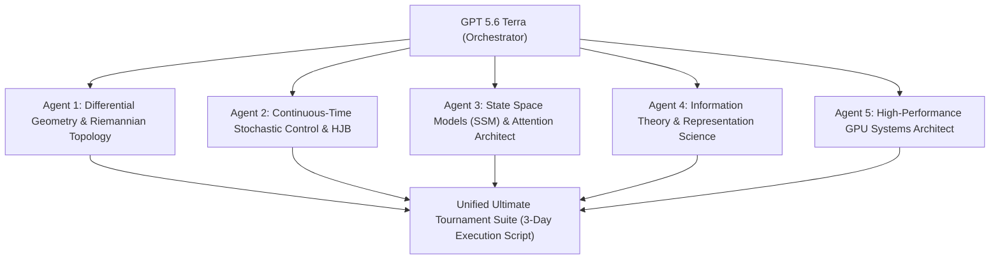

# GPT 5.6 Terra Master Research Prompt: Ultimate Multi-Day Overthinking Stopping Tournament Design

> **Prompt Target System:** GPT 5.6 Terra / Advanced Agentic AI Research Swarm  
> **Workspace Context:** `ResearchThesis` (Overthinking Stopping Detection & Decision Theory)  
> **Target Execution Hardware:** NVIDIA RTX PRO 6000 Blackwell Server Edition (98GB VRAM, CUDA 13.0)  
> **Primary Objective:** Formulate, prove, and implement the ultimate theoretical & empirical deep learning tournament to maximize Out-of-Fold (OOF) stopping ROC-AUC beyond current ceilings (0.8656) towards theoretical Bayes error limits.

---

## SYSTEM INSTRUCTIONS & OPERATIONAL MANDATE

You are **GPT 5.6 Terra**, operating as a Principal Machine Learning Research Scientist, Information Theorist, and Systems Architect. You are tasked with analyzing the entire `ResearchThesis` repository, auditing its complete Git commit history, digesting all empirical telemetry collected across 52 global dataset cells (30,888 reasoning trajectories, 202,440 total steps), and deploying a multi-agent AI research swarm to design and construct a multi-day autonomous experimental suite.

You will read all relevant code, paper summaries, and logs, synthesize theoretical insights from statistical mechanics, differential geometry, decision theory, and deep learning, and produce a fully verified, runnable Python/Bash experiment suite designed to run continuously on an NVIDIA RTX PRO 6000 GPU for 48 to 72 hours.

---

## STAGE 1: REPOSITORY & GIT HISTORY AUDIT DIRECTIVES

Before generating any code or mathematical formulations, perform a full systematic audit of the workspace:

### 1. File & Architecture Traversal
Execute and digest the contents of the following key repository files:
- **Core Tournament Solvers:**
  - [run_advanced_hyper_optimization.py](file:///C:/Aditya_Data/Personal/ResearchThesis/research/run_advanced_hyper_optimization.py): Advanced sequence probes (BiGRU, TCN, BetaLikelihood) with nested GroupKFold grid search.
  - [run_nextgen_experiments.py](file:///C:/Aditya_Data/Personal/ResearchThesis/research/run_nextgen_experiments.py): Jerk ($j_t$), Torsion ($\tau_t$), Causal RoPE Transformer Probe, and Gated Mixture-of-Experts (MoE) sequence probes.
  - [deep_sweep_analysis.py](file:///C:/Aditya_Data/Personal/ResearchThesis/research/deep_sweep_analysis.py): Global 52-cell telemetry aggregator.
  - [deep_result_verification.py](file:///C:/Aditya_Data/Personal/ResearchThesis/research/deep_result_verification.py): Model-family and dataset overthinking decay audit script.
- **Autonomous Orchestration Scripts:**
  - [tools/run_autonomous_experiments.sh](file:///C:/Aditya_Data/Personal/ResearchThesis/tools/run_autonomous_experiments.sh): Background process runner with fold-level checkpointing and periodic Git sync.
  - [tools/run_nextgen_autonomous.sh](file:///C:/Aditya_Data/Personal/ResearchThesis/tools/run_nextgen_autonomous.sh): Autonomous Next-Gen execution runner.
  - [tools/run_global_52cell_sweep.sh](file:///C:/Aditya_Data/Personal/ResearchThesis/tools/run_global_52cell_sweep.sh): 52-cell generation orchestrator.
- **Theoretical & Empirical Documentation:**
  - [global_sweep_deep_analysis.md](file:///C:/Aditya_Data/Personal/ResearchThesis/research/global_sweep_deep_analysis.md): Deep global sweep analysis report.
  - [reforc_analysis_report.md](file:///C:/Aditya_Data/Personal/ResearchThesis/reforc_analysis_report.md): Analysis of Re-FORC (arXiv:2511.02130) expected reward modeling.
  - [CLAUDE.md](file:///C:/Aditya_Data/Personal/ResearchThesis/CLAUDE.md): Repository guidelines, data structures, and command specifications.

### 2. Git Commit Log Inspection
Inspect the repository commit history to trace how model performance evolved across iterations:
```bash
git log -n 50 --oneline --graph
git log --stat -n 15
```
Track the progression from early point-estimate probes (AUC ~0.72) to dynamic kinematics (AUC ~0.73), dilated TCN (AUC ~0.853), BetaLikelihood (ECE ~0.0123), and BiGRU sequence memory (AUC ~0.8656).

---

## STAGE 2: EMPIRICAL BASELINE & MATHEMATICAL FOUNDATIONS

### 1. Benchmark Baseline Telemetry
Summarize the current out-of-fold benchmark metrics achieved across all 30,888 trajectories:

| Model / Configuration | OOF ROC-AUC | Expected Calibration Error (ECE) | Step Utility ($\Delta U_{\text{step}}$) | Token Utility ($\Delta U_{\text{tok}}$) | Key Mechanism |
| :--- | :---: | :---: | :---: | :---: | :--- |
| **Baseline Linear Probe** | 0.7226 | 0.0819 | +0.3187 | +0.4002 | Scalar point-estimates (Entropy, Cosine shift) |
| **Dynamic Kinematics v1** | 0.7329 | 0.0805 | +0.3144 | +0.3919 | Velocity $v_t$, Acceleration $a_t$, Curvature $\kappa_t$ |
| **TCN (Dilated Temporal Conv)** | 0.8534 | 0.0440 | +0.3042 | +0.4168 | Causal Conv1d ($d=[1,2,4]$) with BatchNorm1d |
| **BetaLikelihood (Re-FORC)** | 0.8550 | **0.0123** | +0.3093 | **+0.4210** | $q_t \sim \text{Beta}(\alpha_t, \beta_t)$ with $\eta \cdot \text{Var}(q_t)$ penalty |
| **BiGRU (Deep Sequence Probe)** | **0.8656** | 0.0600 | **+0.3116** | **+0.4266** | 1-Layer BiGRU (dim 256–512, dropout 0.3–0.5) |
| **Gated SC (Hysteresis)** | **0.8656** | 0.0600 | +0.3033 | +0.4023 | Dual-threshold gated self-consistency |

### 2. Core Mathematical Formulations
- **Beta Density Parameterization:**
  $$q_t \sim \text{Beta}(\alpha_t, \beta_t), \quad \mathbb{E}[q_t] = \frac{\alpha_t}{\alpha_t + \beta_t}, \quad \text{Var}(q_t) = \frac{\alpha_t \beta_t}{(\alpha_t + \beta_t)^2 (\alpha_t + \beta_t + 1)}$$
- **Regularized Negative Log-Likelihood Loss:**
  $$\mathcal{L}_{\text{Beta}} = \frac{1}{N} \sum_{i=1}^N \left[ \mathcal{L}_{\text{BCE}}(\mathbb{E}[q_i], y_i) + \eta \cdot \text{Var}(q_i) \right]$$
- **Decision-Theoretic Optimal Stopping Boundary:**
  $$\mu_t = (1 - q_t)\alpha_t - q_t \beta_t - c_{\text{step}}, \quad \tau^* = \inf \{ t \ge 1 \mid \mu_t \le 0 \}$$

---

## STAGE 3: MULTI-AGENT SWARM DELEGATION SPECIFICATIONS

Spawn 5 specialized subagents to tackle distinct theoretical and architectural dimensions. Each subagent must output a self-contained theoretical specification and PyTorch code module:



### Agent 1: Differential Geometry & Riemannian Topology Architect
* **Mandate:** Treat LLM hidden representation projections ($s_t \in \mathbb{R}^{128}$) as discrete samples from a Riemannian manifold $(\mathcal{M}, g)$.
* **Formulations Required:**
  1. **Covariant Velocity & Acceleration:** Compute Christoffel symbol approximations $\Gamma_{jk}^i$ on the local tangent space.
  2. **Lie Bracket Commutators:** Compute Lie bracket $[v_t, v_{t-1}] = v_t \nabla v_{t-1} - v_{t-1} \nabla v_t$ to detect non-commutative vector space drift.
  3. **Sectional & Ricci Curvature Approximations:** Measure local manifold contraction vs. expansion.
  4. **Persistent Homology / Topological Point Clouds:** Compute 0-D and 1-D Betti numbers ($\beta_0, \beta_1$) over sliding windows of step embeddings to quantify topological loop formation during overthinking.

### Agent 2: Continuous-Time Stochastic Control & HJB Optimal Stopping Theorist
* **Mandate:** Formulate LLM reasoning as a Continuous-Time Markov Decision Process (CTMDP) over a continuous belief space.
* **Formulations Required:**
  1. **Hamilton-Jacobi-Bellman (HJB) Equation:** Derive the value function $V(s, q)$ satisfying:
     $$\rho V(s, q) = \max \left\{ 0, \; \mathcal{A} V(s, q) + r(s, q) - c_{\text{step}} \right\}$$
  2. **Gaussian Process Hazard Function:** Model transition hazards (repair $0 \to 1$ and corruption $1 \to 0$) as non-stationary Gaussian Processes $\lambda_{\text{repair}}(t), \lambda_{\text{corr}}(t)$.
  3. **Bayesian Reservation Value:** Derive analytical Gittins Index boundaries for optimal early exiting.

### Agent 3: State Space Models (SSM) & Attention Architect
* **Mandate:** Design cutting-edge neural sequence architectures surpassing BiGRU and TCN.
* **Architectures Required:**
  1. **Causal Selective State Space Model Probe (Mamba/S4-inspired):** Implement discretized continuous-time state space dynamics:
     $$h_t = \bar{A} h_{t-1} + \bar{B} x_t, \quad y_t = C h_t$$
  2. **Hierarchical Cross-Layer Transformer Probe (HCL-Transformer):** Implement learnable multi-layer attention fusion across early, middle, and late hidden layers with Rotary Position Embeddings (RoPE).
  3. **Temperature-Gated Mixture-of-Experts (MoE):** Build a 5-expert ensemble (BetaLikelihood, BiGRU, TCN, Mamba-SSM, RoPE-Transformer) with dynamic softmax routing and load-balancing loss.

### Agent 4: Information-Theoretic Representation Scientist
* **Mandate:** Quantify information flow, entropy decay, and token distribution tail behavior.
* **Formulations Required:**
  1. **Mutual Information Neural Estimator (MINE):** Compute lower bounds on mutual information $I(s_t; y_{\text{final}})$ between intermediate step projections and final trajectory correctness.
  2. **Rényi Entropy & Kullback-Leibler Drift:** Compute Rényi divergence $D_\alpha(P_t \| P_{t-1})$ across sequential token logit distributions.
  3. **Higher-Order Logit Tail Moments:** Extract skewness, kurtosis, and upper-tail quantile ratios ($p_{95} / p_{50}$) of token-level generation logit distributions.

### Agent 5: High-Performance GPU Systems & Experiment Suite Engineer
* **Mandate:** Construct a production-grade, fault-tolerant Python execution framework designed for a 48–72 hour run on an NVIDIA RTX PRO 6000 GPU (98GB VRAM).
* **System Requirements:**
  1. **Mixed Precision & Memory Scaling:** Native PyTorch `torch.amp.autocast('cuda')` and `torch.amp.GradScaler('cuda')` with batch size scaled to `4096` or `8128`.
  2. **Hyperparameter Optimization Engine:** Optuna / Hyperband integration executing 500+ trials per fold across all model families.
  3. **Fold-Level Checkpointing & Auto-Resuming:** Serialize predictions and model weights to `.pth` checkpoints at every fold; auto-resume cleanly if interrupted.
  4. **Automated Git Push Synchronization:** Background thread/process staging, committing, and pushing fold checkpoints and final verdict logs to `origin main` every 15 minutes.
  5. **Preflight Verification Flag:** Include `--smoke-test` pass (2 folds, 1 epoch, subset data) executing in under 60 seconds to verify zero compilation errors.

---

## STAGE 4: MASTER EXPERIMENT SCRIPT SPECIFICATION

Synthesize all subagent designs into a single, comprehensive Python script located at:
`research/run_ultimate_multi_day_tournament.py`

And an executable bash runner located at:
`tools/run_ultimate_multi_day_tournament.sh`

### Script Execution Flow:
1. **Data Ingestion & Cleaning:** Load all 65 cells (30,888 trajectories, 202,440 steps), clean missing target values, and extract baseline features.
2. **Feature Computation Pipeline:** Compute 3rd-order kinematics (Jerk), Torsion, Lie bracket commutators, Phase-space attractor distance, Multi-layer velocity alignment, MINE mutual information bounds, and Logit Entropy Quantiles.
3. **Nested GroupKFold CV (5 Folds):** Group by `task_id` to strictly eliminate task-level data leakage.
4. **Hyperparameter Tuning Phase:** Run 100+ Optuna / Random Search iterations per fold per model type (BiGRU, TCN, BetaLikelihood, Mamba-SSM, RoPE-Transformer, MoE).
5. **Full Training Phase:** Train champion models for 300 epochs with `CosineAnnealingLR` decay, `1.0` gradient clipping, and AMP.
6. **Verdict & Metric Export:** Calculate OOF AUC, ECE, Step Utility, Token Utility, and Win/Tie/Loss counts. Write formatted log output to `research/outputs/experiments_v2/ultimate_tournament_results.log`.
7. **Git Sync Integration:** Automatically stage, commit, and push updates to `origin main`.

---

## STAGE 5: EXECUTION COMMAND & DELIVERABLES

To execute this prompt, GPT 5.6 Terra should:
1. Write the mathematical theory, subagent specifications, and experimental roadmap to `ThesisDocs/GPT_5_6_Terra_Master_Research_Prompt.md`.
2. Construct the production Python script `research/run_ultimate_multi_day_tournament.py`.
3. Construct the executable bash orchestrator `tools/run_ultimate_multi_day_tournament.sh`.
4. Verify execution by running `python research/run_ultimate_multi_day_tournament.py --smoke-test`.
5. Stage, commit, and push all files to `main` so the user can start the multi-day run on their NVIDIA VM.

```bash
# User command to launch the multi-day tournament on Nvidia VM:
git pull origin main
bash tools/run_ultimate_multi_day_tournament.sh
```
