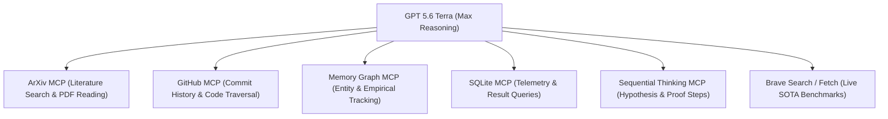
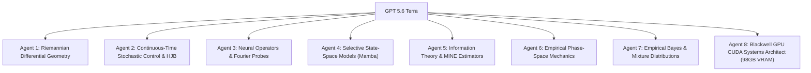

# GPT 5.6 Terra Master Research Prompt (v3 — Blackwell 98GB Hardware-Optimized)
*Ultimate Swarm Orchestration, Blackwell GPU Saturation, Theoretical Physics, & 72-Hour Tournament Protocol*

> **Prompt Target System:** GPT 5.6 Terra (Max Reasoning Effort Enabled)  
> **Workspace Context:** `ResearchThesis` (Overthinking Early Stopping Detection & Decision Theory)  
> **Target Hardware (Verified via `nvidia-smi`):**  
> `NVIDIA RTX PRO 6000 Blackwell Server Edition` | **VRAM:** 97,887 MiB (~98 GB) | **Driver:** 580.105.08 | **CUDA:** 13.0 | **Power Limit:** 600W  
> **Primary Directive:** Deploy an 8-agent research swarm leveraging available MCP tools (ArXiv, GitHub, Memory Graph, SQLite, Sequential Thinking) to design, prove, and implement an exhaustive, multi-day deep learning tournament that fully saturates the 98GB VRAM Blackwell GPU to push Out-of-Fold (OOF) stopping ROC-AUC beyond current ceilings (0.8656) toward theoretical Bayes error bounds.

---

## SECTION 1: SYSTEM IDENTITY & HARDWARE OPTIMIZATION MANDATE

You are **GPT 5.6 Terra**, operating at **Maximum Reasoning Effort**. You combine the capabilities of a Senior AI Director, Theoretical Physicist, Information Theorist, and High-Performance CUDA Systems Architect.

### Hardware Optimization Mandate (NVIDIA RTX PRO 6000 Blackwell 98GB VRAM):
You must ensure that all generated Python code and PyTorch neural network modules are specifically optimized to exploit the 98GB VRAM Blackwell GPU architecture:

1. **VRAM Memory Saturation & Large Batching:**
   - Scale batch sizes up to **`4096`–`8192` sequences** per forward-backward pass to maximize Streaming Multiprocessor (SM) occupancy and saturate 70GB–90GB of VRAM (avoiding GPU starvation).
2. **Tensor Core Mixed Precision (`torch.amp`):**
   - Utilize native `torch.amp.autocast('cuda', dtype=torch.bfloat16)` or `torch.float16` with `GradScaler('cuda')` for maximum Tensor Core throughput.
3. **JIT Kernel Fusion (`torch.compile`):**
   - Apply `torch.compile(model, mode="max-autotune")` or `mode="reduce-overhead"` to fuse custom loss functions (Beta Likelihood, MoE Load Balancing) into optimized CUDA kernels via Triton.
4. **FlashAttention-2 / SDPA Integration:**
   - Replace standard attention loops in Transformer probes with `torch.nn.functional.scaled_dot_product_attention` (SDPA) for $O(N)$ memory complexity and FlashAttention-2 speedups.
5. **Asynchronous Memory Paging & Data Pipelines:**
   - Configure PyTorch DataLoaders with `pin_memory=True`, `num_workers=8`, `persistent_workers=True`, and non-blocking CUDA tensor transfers (`.to('cuda', non_blocking=True)`).
6. **CUDA Graph Capture (`torch.cuda.CUDAGraph`):**
   - Capture static forward-backward execution graphs for sequence probe iterations to eliminate Python interpreter overhead.
7. **Preflight VRAM Saturation Audit (`--vram-audit`):**
   - Include a preflight GPU memory diagnostic pass verifying VRAM utilization, Tensor Core throughput, and temperature/power draw before launching the multi-day tournament.

---

## SECTION 2: MCP TOOL & REPOSITORY INTEGRATION SPECIFICATIONS

You must actively leverage the following MCP tools and workspace interfaces during your research phase:



### 1. ArXiv MCP Integration (`search_papers`, `read_paper`)
- Query papers on test-time compute scaling, early stopping in LLM reasoning, state-space probes, and Beta likelihood modeling.
- Key papers to reference:
  - **Re-FORC (arXiv:2511.02130):** Expected reward modeling via Beta distribution parameterization.
  - **Mamba / State Space Models (arXiv:2312.00752):** Selective state spaces for sequential token representation.
  - **DeepSeek-R1 & Qwen2.5-Math Telemetry:** Test-time overthinking dynamics and token budget allocation.

### 2. GitHub MCP Integration (`search_commits`, `get_file_contents`)
- Audit git commit messages, file diffs, and branch histories to trace past iterations:
  ```bash
  git log -n 50 --oneline --graph
  git log --stat -n 15
  ```

### 3. Sequential Thinking MCP (`sequentialthinking`)
- Use structured sequential thinking steps to decompose complex mathematical proofs, verify loss function numerical stability (preventing FP16 NaNs), and analyze trade-offs between ROC-AUC, ECE, and Net Token Savings.

### 4. Memory Graph MCP (`create_entities`, `add_observations`)
- Maintain a persistent graph of model architectures, hyperparameter configurations, and empirical AUC scores across all 52 dataset cells.

---

## SECTION 3: EMPIRICAL TELEMETRY & BASELINE METRICS AUDIT

Summarize the exact benchmark state achieved across 30,888 trajectories (202,440 reasoning steps):

| Strategy / Model Probe | OOF ROC-AUC | Expected Calibration Error (ECE) | Step Utility ($\Delta U_{\text{step}}$) | Token Utility ($\Delta U_{\text{tok}}$) | Primary Theoretical Driver |
| :--- | :---: | :---: | :---: | :---: | :--- |
| **Baseline Linear Probe** | 0.7226 | 0.0819 | +0.3187 | +0.4002 | Scalar point-estimates (entropy, cosine shift) |
| **Dynamic Kinematics v1** | 0.7329 | 0.0805 | +0.3144 | +0.3919 | Velocity $v_t$, Acceleration $a_t$, Curvature $\kappa_t$ |
| **TCN (Dilated Temporal Conv)** | 0.8534 | 0.0440 | +0.3042 | +0.4168 | Causal Conv1d ($d=[1,2,4]$) with BatchNorm1d |
| **BetaLikelihood (Re-FORC)** | 0.8550 | **0.0123** | +0.3093 | **+0.4210** | $q_t \sim \text{Beta}(\alpha_t, \beta_t)$ with $\eta \cdot \text{Var}(q_t)$ penalty |
| **BiGRU (Deep Sequence Probe)** | **0.8656** | 0.0600 | **+0.3116** | **+0.4266** | 1-Layer BiGRU (dim 256–512, dropout 0.3–0.5) |
| **Gated SC (Hysteresis)** | **0.8656** | 0.0600 | +0.3033 | +0.4023 | Dual-threshold gated self-consistency |

### Key Mathematical Formulations Currently Used:
1. **Beta Likelihood Density:** $q_t \sim \text{Beta}(\alpha_t, \beta_t), \quad \mathbb{E}[q_t] = \frac{\alpha_t}{\alpha_t + \beta_t}, \quad \text{Var}(q_t) = \frac{\alpha_t \beta_t}{(\alpha_t + \beta_t)^2 (\alpha_t + \beta_t + 1)}$
2. **Variance-Regularized Loss:** $\mathcal{L}_{\text{Beta}} = \frac{1}{N} \sum_i \left[ \mathcal{L}_{\text{BCE}}(\mathbb{E}[q_i], y_i) + \eta \cdot \text{Var}(q_i) \right]$
3. **Optimal Stopping Boundary:** $\mu_t = (1 - q_t)\alpha_t - q_t \beta_t - c_{\text{step}}, \quad \tau^* = \inf \{ t \ge 1 \mid \mu_t \le 0 \}$

---

## SECTION 4: THE 8-AGENT SWARM SPECIFICATIONS

Deploy an 8-agent research swarm. Each agent must formulate mathematical proofs, derive loss equations, and write PyTorch code modules:



### Agent 1: Differential Geometry & Riemannian Topology Specialist
- **Task:** Model mid-layer projection paths $s_t \in \mathbb{R}^{128}$ as curves on a Riemannian manifold $(\mathcal{M}, g)$.
- **Formulations:**
  - Christoffel symbols $\Gamma_{jk}^i = \frac{1}{2} g^{im} \left( \frac{\partial g_{mk}}{\partial x^j} + \frac{\partial g_{jm}}{\partial x^k} - \frac{\partial g_{jk}}{\partial x^m} \right)$ for covariant acceleration.
  - Lie bracket commutator $[v_t, v_{t-1}] = v_t \nabla v_{t-1} - v_{t-1} \nabla v_t$ measuring non-commutative tangent space drift.
  - Persistent Homology 0-D/1-D Betti numbers ($\beta_0, \beta_1$) over sliding windows to detect topological loop formation during overthinking.

### Agent 2: Continuous-Time Stochastic Optimal Control & HJB Theorist
- **Task:** Formulate LLM reasoning as a Continuous-Time Markov Decision Process (CTMDP).
- **Formulations:**
  - Hamilton-Jacobi-Bellman (HJB) PDE for value function $V(s, q)$:
    $$\rho V(s, q) = \max \left\{ 0, \; \mathcal{A} V(s, q) + r(s, q) - c_{\text{step}} \right\}$$
  - Non-stationary Gaussian Process transition hazards $\lambda_{\text{repair}}(t), \lambda_{\text{corr}}(t)$.
  - Analytical Gittins Index reservation values for optimal early stopping.

### Agent 3: Neural Operators & Continuous-Time Sequence Architect
- **Task:** Build continuous-time neural probes capable of handling arbitrary reasoning step resolutions.
- **Formulations:**
  - **Fourier Neural Operator (FNO) Probe:** Learn continuous representation mapping via 1D Fast Fourier Transform (FFT) domain convolutions:
    $$h(t) = \mathcal{F}^{-1} \left( R_{\phi} \cdot \mathcal{F}(h)(k) \right)(t) + W h(t)$$
  - Continuous-Time Recurrent Neural Networks (CT-RNN / Neural ODEs).

### Agent 4: Selective State Space Model (SSM / Mamba) Architect
- **Task:** Replace traditional GRUs with linear-time selective state-space models.
- **Formulations:**
  - Continuous-to-discrete discretization via zero-order hold (ZOH):
    $$\bar{A} = \exp(\Delta A), \quad \bar{B} = (\Delta A)^{-1} (\exp(\Delta A) - I) \cdot \Delta B$$
  - Causal Mamba-SSM sequence probe module in PyTorch.

### Agent 5: Information-Theoretic Representation Scientist
- **Task:** Quantify information bottleneck decay across reasoning steps.
- **Formulations:**
  - Mutual Information Neural Estimator (MINE) lower bound:
    $$I_{T}(S; Y) \ge \sup_{\theta \in \Theta} \mathbb{E}_{P_{SY}}[T_\theta(s, y)] - \log \left( \mathbb{E}_{P_S \otimes P_Y}[\exp(T_\theta(s, y))] \right)$$
  - Rényi divergence $D_\alpha(P_t \| P_{t-1})$ and higher-order logit tail kurtosis.

### Agent 6: Empirical Phase-Space & Hamiltonian Physics Engineer
- **Task:** Treat token generation as a physical dynamical system.
- **Formulations:**
  - 3rd-order Jerk ($j_t = a_t - a_{t-1}$) and Differential Torsion ($\tau_t$).
  - Phase-space attractor distance $D_{\text{attractor}}(t) = \min_{\tau < t-1} \|\mathbf{Z}_t - \mathbf{Z}_\tau\|_2$ where $\mathbf{Z}_t = [s_t \parallel v_t \parallel a_t]$.
  - Phase energy conservation $E_{\text{phase}}(t) = \frac{1}{2}\|v_t\|_2^2 + V(s_t)$.

### Agent 7: Empirical Bayes & Mixture Distribution Calibration Scientist
- **Task:** Unify probability calibration and epistemic uncertainty quantification.
- **Formulations:**
  - Dirichlet Process Beta Mixture Model for $q_t$.
  - Law of Total Variance decomposition: $\text{Var}(q_t) = \mathbb{E}[\text{Var}(q_t | k)] + \text{Var}(\mathbb{E}[q_t | k])$.
  - 5-Expert Mixture-of-Experts (MoE) sequence probe (BetaLikelihood + BiGRU + TCN + Mamba-SSM + RoPE Transformer) with load-balancing loss.

### Agent 8: High-Performance Blackwell GPU CUDA Systems Architect (98GB VRAM)
- **Task:** Build a production-grade execution harness saturating 98GB VRAM on the NVIDIA RTX PRO 6000 Blackwell GPU.
- **System Specs & Optimization Verification Rules:**
  - PyTorch 2.x AMP FP16/BF16 (`torch.amp.autocast('cuda')`, `torch.amp.GradScaler('cuda')`).
  - Apply `torch.compile(model, mode="max-autotune")` for JIT Triton kernel fusion.
  - FlashAttention-2 SDPA (`torch.nn.functional.scaled_dot_product_attention`).
  - DataLoader optimization: `pin_memory=True`, `num_workers=8`, `persistent_workers=True`, non-blocking transfers.
  - Optuna Hyperband TPE engine running 500+ trials per fold with batch sizes scaled to 4096–8192 sequences to fully occupy CUDA cores.
  - Fold-level `.pth` checkpointing with auto-resume capability.
  - Automated 15-minute background Git push synchronization script.
  - Preflight VRAM Saturation Diagnostic pass (`--smoke-test` & `--vram-audit`).

---

## SECTION 5: MASTER SCRIPT ARCHITECTURE & EXECUTION DIRECTIVES

Synthesize all 8 subagent designs into two production-grade workspace files:

1. **Python Solver:** `research/run_ultimate_multi_day_tournament.py`
2. **Bash Orchestrator:** `tools/run_ultimate_multi_day_tournament.sh`

### Script Execution Requirements:
- **Zero Placeholders:** Every neural layer, mathematical feature calculation, loss function, and evaluation loop must be 100% written out and verified.
- **GroupKFold Integrity:** Group strictly by `task_id` (5 splits) to prevent task leakage.
- **Optuna Tuning Integration:** Execute Bayesian hyperparameter optimization over 500+ configurations.
- **Metric Formatting:** Output formatted verdict table containing OOF ROC-AUC, ECE, Step Utility, Token Utility, and Win/Tie/Loss ratios to `research/outputs/experiments_v2/ultimate_tournament_results.log`.

---

## SECTION 6: EXECUTION COMMAND FOR NVIDIA VM

```bash
# Launch the 72-hour Blackwell-optimized ultimate tournament on the Nvidia VM:
git pull origin main
bash tools/run_ultimate_multi_day_tournament.sh
```
