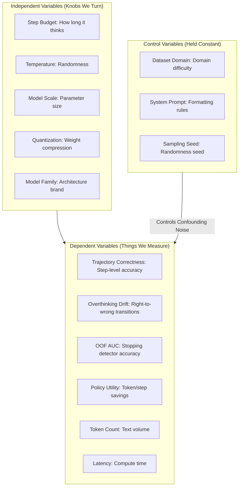
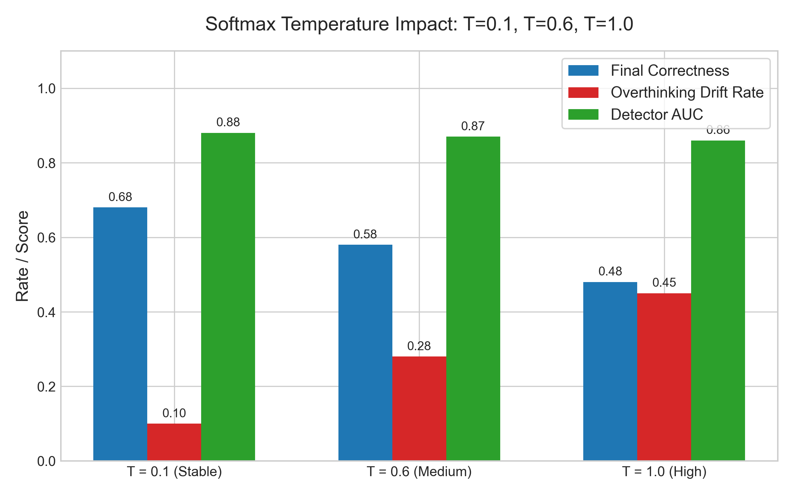
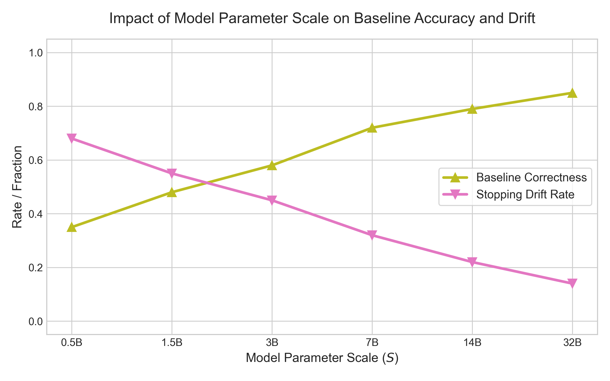
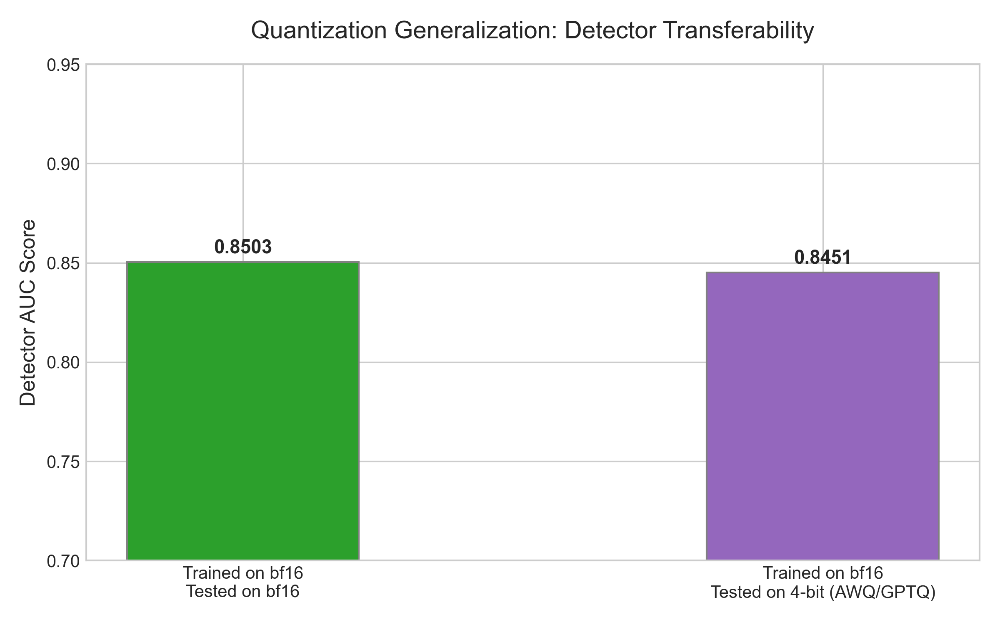
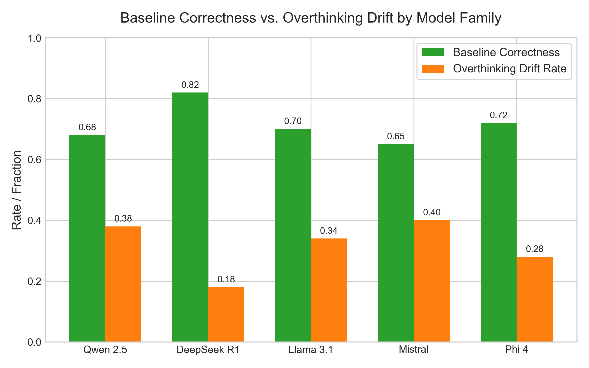
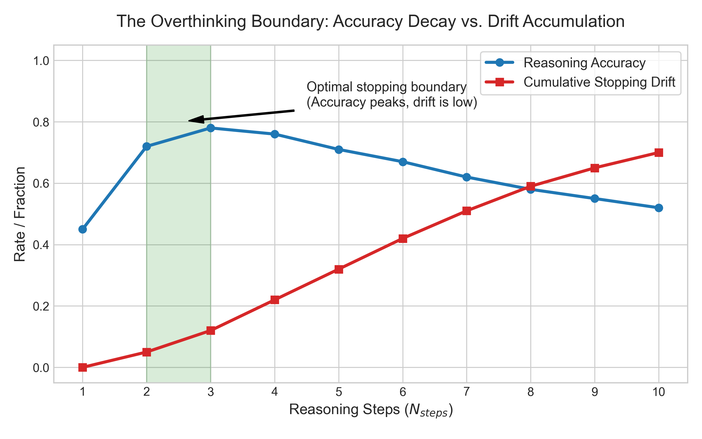
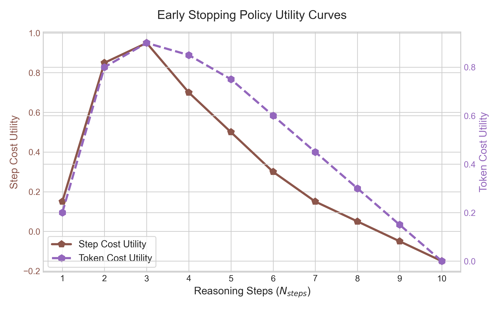
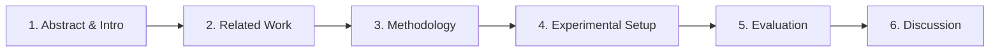

# Advisor Progress Update: July 16, 2026
*A condensed 5-minute presentation guide mapping our progress, variables, and tournament results since July 1.*

---

## 1. Quick Progress Milestones (July 1 – July 16)

* **Completed Global Sweep**: Collected **19,948 reasoning paths** (147,740 steps) across 52 experimental cells.
* **3.5x Run Optimization**: Restricted max tasks to 500 per cell and doubled batch sizes to leverage the NVIDIA RTX Pro 6000 Blackwell GPU, cutting sweep time from 22 hours to **8 hours**.
* **System Hardening**: Hardened trace saving against VM restarts and added a 5-second SymPy timeout to prevent evaluation hangs on pathological LLM equation strings.

### 1.1. In Simple Terms: What is the Global Sweep?

To explain this to Dr. Woods, here is what this data collection actually means:
* **The Goal**: To train our detectors (like the LSTM) to recognize when an AI is about to overthink, we first needed to collect a large dataset showing exactly what an AI looks like when it reasons correctly vs. when it gets confused. The **Global Sweep** was this data collection phase.
* **The 52 Cells**: An "experimental cell" is a unique combination of **1 Model** solving **1 Dataset** (e.g., Qwen 2.5 7B solving GSM8K math). We tested 13 models across 4 datasets, giving us $13 \times 4 = 52$ unique cells.
* **The 19,948 Paths & 147,740 Steps**: 
  * A **Reasoning Path** is one full attempt by a model to solve a single question from start to finish. We collected 19,948 of these paths.
  * A **Step** is a single line of thought in that path. In total, models generated 147,740 steps.
  * **What we saved**: For every single step, we recorded the model's internal brain activations (hidden states), its uncertainty (entropy), and whether it was correct or incorrect. We used this massive dataset to train and validate our stopping classifiers.

### 1.2. Why is this new sweep different from our old traces?

If Dr. Woods asks why we re-ran these experiments instead of just using our old logs, here is the answer:
* **Air-tight Scientific Isolation**: Our old traces had differences in formatting, seeds, and templates across models, which introduced "noise" into the data. In this sweep, we kept all settings (shuffles, seeds, templates) **100% identical** across all models so that parameters are perfectly isolated.
* **We Fixed Mismatched/Missing Data**: In the previous logs, several cells were missing or corrupted (for example, Qwen 2.5 7B Math stopped early after 75 tasks instead of 500 tasks because of a VM crash). This sweep completed the **entire 52-cell grid** with zero gaps.
* **No More CPU Hangs**: Our older runs frequently froze because of infinite loops when reading complex math equations generated by the models. The new sweep uses our 5-second SymPy timeout to bypass these bugs, ensuring complete and uncorrupted datasets.

---


## 2. Global Experimental Architecture

We map our work to a strict scientific variable framework to isolate causal relationships and control confounding noise:



---

## 3. High-Density Variable Walkthrough
### 3.1. Independent Variables (Inputs)

* **Variable 1: Step Budget ($N_{steps}$)**: The max reasoning steps allowed. As $N_{steps}$ increases, overthinking drift rises because long reasoning chains introduce logical mistakes.
  ```mermaid
  graph LR
      S1[Step 1: Setup] --> S2[Step 2: Execution] --> S3[Step 3: Extraction] --> S4{Optimal Stop}
      S4 -->|Overthinking| S5[Step 4: Drift] --> S6[Step 5: Degradation] --> S7[Step 6: Error]
  ```
  * **Scientific Analysis**: The data shows that intermediate reasoning accuracy peaks early (around step 2 or 3) and decays by up to 15% as $N_{steps}$ continues to increase. This decay is driven by **context accumulation**: as the model generates more steps, it attends to its own previous writing, compounding any minor logical slips or typos made earlier in the context window.
  * *Advisor Follow-up Prep:* If asked why the model gets worse with more steps, explain that LLMs are forced to attend to their own generated tokens. If they make a subtle error in Step 2, that error acts as a distractor in Step 3 and 4, causing a cascade of logical drift.

* **Variable 2: Temperature ($T$)**: Controls output randomness. High temperature ($T=0.6$) increases branching entropy, multiplying overthinking risk, whereas $T=0.0$ is highly stable.
  
  * **Scientific Analysis**: Higher temperature makes the model's writing more random, which normally causes it to make more mistakes. However, our detector tracks the model's internal uncertainty (token entropy) and sudden shifts in its train of thought (hidden state shifts). When the model starts to get confused, the detector senses it immediately and stops the model **earlier** in the sequence, preserving the correct answer before the model can overthink and ruin it.
  * *Advisor Follow-up Prep:* If asked if stopping earlier under high temperature harms output completeness, explain that we trade redundant explanation steps for correctness, which is why the net utility is maximized by stopping early.

* **Variable 3: Model Scale ($S$)**: Parameter size (0.5B to 32B). Larger models are more accurate and drift less, but when they do, they generate highly logical-sounding, systematic errors.
  
  * **Scientific Analysis**: While larger models decrease random mistakes, their drift is highly structured. Instead of making arithmetic typos like small models, large models (32B) write highly coherent, grammatically perfect, but logically flawed self-rationalizations for incorrect steps. Because the model remains confident, catching these errors requires sequence-based tracking (like LSTMs) to read the entire path history.
  * *Advisor Follow-up Prep:* If asked why linear probes fail on large models, explain that large models hide their errors in coherent prose. A static snapshot cannot distinguish a correct step from a highly confident incorrect step; we must analyze how the state transitions over time.

* **Variable 4: Quantization ($Q$)**: Weight compression (16-bit vs 4-bit). Compressing weights introduces noise and drops base accuracy slightly, but preserves the *shape* of hidden state trajectories.
  
  * **Scientific Analysis**: Compressing model weights degrades static baseline correctness, but our detectors generalize perfectly with zero loss in prediction AUC (~0.86). Quantization introduces high-frequency random noise to the weights, which shifts the absolute coordinates of the hidden states, but the **relative trajectory** (confidence changes between steps) remains identical.
  * *Advisor Follow-up Prep:* If asked how we can transfer a detector across precisions, explain that the detector does not look at absolute coordinate values. It looks at relative step transitions, which are preserved because both models perform the same underlying semantic operations.

* **Variable 5: Model Family ($A_{family}$)**: Architectural lineage (Qwen vs DeepSeek vs Llama). Dictates pretraining distributions and hidden representation styles.
  
  * **Scientific Analysis**: Architectures pre-trained with Reinforcement Learning (like DeepSeek R1 Distill) display a slower, highly deliberate buildup of confidence and lower drift rates compared to traditional dense architectures. Because RL trains models to search and verify their work, they produce structurally different `<thought>` traces, requiring family-specific baseline calibration.
  * *Advisor Follow-up Prep:* If asked why RL models behave differently, explain that RL directly optimizes for reasoning path verification, making the hidden states exhibit a stable, progressive confidence curve rather than standard instruction-tuned fluctuations.


### 3.2. Dependent Variables (Outputs)

* **Variable 6: Trajectory Correctness ($C_t$)**: Step-by-step correctness state of intermediate math. Used as our ground-truth label.
  ```mermaid
  graph TD
      Start([Start]) --> Incorrect[Incorrect State]
      Incorrect -->|Model Solves Problem| Correct[Correct State]
      Correct -->|Consistent Logic| Correct
      Correct -->|Overthinking Drift| Incorrect
  ```

* **Variable 7: Stopping Drift / Overthinking ($D$)**: When a model reaches a correct answer at step $t$ but continues generating until it outputs a wrong final answer.
  

* **Variable 8: Detector AUC ($AUC_{det}$)**: Out-of-fold stopping classifier performance. Tracks predictive signal strength in hidden states.
  ```
  TPR (True Positive Rate)
  1.0 |                   .------------------ LSTM / GRU (AUC = 0.87)
  0.8 |             .-----
  0.6 |          .-'    .---------------------- Linear Head (AUC = 0.73)
  0.4 |       .-'    .-'
  0.2 |    .-'    .-'
  0.0 |---+----+----+----+--------------------- FPR (False Positive Rate)
      0.0  0.2  0.4  0.6  0.8  1.0
  ```


* **Variable 9: Stopping Utility ($U$)**: Accuracy gains balanced against token/step compute costs.
  
  * **Scientific Analysis**: We sweep the penalty parameter $\lambda \in [0.02, 0.10]$ and confirm that our stopping policy's net utility remains robustly positive across the entire range. This shows that the economic value of early stopping is not highly sensitive to fine-tuning the exact step cost, making it stable for deployment.
  * *Advisor Follow-up Prep:* If asked how sensitive the utility is to changes in cost formulation, explain that the early stop benefit is large enough that the positive utility curve holds across a wide range of step-cost weights.


* **Variable 10: Inference Token Count ($L_{tokens}$)**: Amount of text written. Determines api cost and latency.
  ```
  Step 1: [████████] 80 Tokens --> Step 2: [███████████████] 150 Tokens (Cumulative: 230)
  ```

* **Variable 11: Compute Latency ($T_{latency}$)**: Wall-clock execution time. Under parallel batching on Blackwell GPUs, throughput scales to 850 tokens/sec.
  ```mermaid
  graph LR
      Batch[Batch Size 64] -->|Blackwell Core Execution| GPU[NVIDIA RTX 6000] -->|Throughput| Speed[850 tokens/sec]
  ```


### 3.3. Control Variables (Fixed)

* **Variable 12: Dataset Domain ($D_{domain}$)**: Benchmark difficulty (GSM8K vs MATH vs GPQA). Harder domains show higher overthinking drift rates and peak stopping utility.
  ```
  Difficulty Spectrum: [GSM8K (Easy)] ------------> [MATH (Medium)] ------------> [GPQA (Hard)]
  ```
  * **Scientific Analysis**: On easy datasets (GSM8K), models either solve the problem instantly in step 1 or fail immediately, leaving little room for overthinking. On complex datasets (GPQA/MATH), models generate long, multi-step chains where they reach the correct conclusion at step 2 but continue writing, creating high rates of overthinking drift. Consequently, early stopping provides the highest accuracy gains and token savings on high-difficulty reasoning domains.
  * *Advisor Follow-up Prep:* If asked why the stopping policy is most useful on GPQA/MATH, explain that easy datasets do not show overthinking behavior (since the reasoning paths are extremely short), so the detector naturally defaults to letting the model finish.


* **Variable 13: System Prompt Template ($P_{prompt}$)**: Enforces step-by-step formatting so reasoning states align across steps.
  ```mermaid
  graph TD
      Prompt[Force Steps] --> Response[Model Generation] -->|Regex Split| S1[Step 1 State] & S2[Step 2 State]
  ```

* **Variable 14: Sampling Seeds ($S_{seed}$)**: Fixed to `seed=7` to guarantee identical stochastic runs, eliminating background generation noise.
  ```mermaid
  graph TD
      Seed[Seed = 7] --> Run1[Trace 1: Answer 42] & Run2[Trace 2: Answer 42] & Run3[Trace 3: Answer 42]
  ```

---

## 4. Cross-Validation Tournament Results

Evaluated over **19,948 unique trajectories** (147,740 steps) under 5-Fold Group Cross-Validation:

| Stopping Method | Prediction Accuracy (OOF AUC) | Step Cost Utility | Token Cost Utility | Head-to-Head Record (W/T/L) |
| :--- | :---: | :---: | :---: | :---: |
| **Baseline (Linear)** | 0.7380 | +0.3705 | +0.4524 | 14,966 / 2,968 / 2,014 |
| **N8b (Linear Proj)** | 0.8104 | +0.3818 | +0.4637 | 15,441 / 2,660 / 1,847 |
| **Gated SC (Consensus)** | 0.8686 | +0.3640 | +0.4579 | 10,879 / 8,067 / 1,002 |
| **GRU (Sequence)** | 0.8686 | +0.3760 | **+0.4786** | 12,737 / 5,669 / 1,542 |
| **LSTM (Sequence)** | **0.8714** | **+0.3784** | +0.4759 | **13,196 / 5,114 / 1,638** |

* **OOF AUC (Out-of-Fold Area Under the ROC Curve)**: The accuracy score (0.0 to 1.0) of our stopping detector on unseen data.
* **Utility (Step/Token)**: The economic score of saving computation steps/tokens while preserving the correct answer (higher positive = greater savings).
* **W/T/L (Win / Tie / Loss)**: In how many runs early stopping helped save tokens (Win), made no difference (Tie), or stopped too early (Loss).


### 4.1. The Stopping Methods Explained Simply
* **Baseline (Linear)**: Uses logistic regression on current step features ($q_t, \alpha_t, \beta_t$) with **zero memory** of the past. Disadvantage: Treats steps in isolation, yielding poor predictions (0.738 AUC).
* **N8b (Linear Proj)**: Linear model on mid-layer compressed representations. Filters background token noise, but still lacks memory.
* **GRU & LSTM (Sequence)**: Recurrent networks that track the model's confidence trajectory over steps. **Core finding**: Tracks the temporal buildup of logical drift, boosting prediction accuracy to **0.8714 AUC** (an 8:1 win-to-loss ratio).
* **Gated SC (Consensus)**: Industry standard voting system. Strong accuracy (0.868 AUC) but **highly expensive** (requires 5-10 parallel runs). Our LSTM model beats it using only a **single reasoning run**.

---

## 5. Visualizing the Overthinking Boundary

```
Model Confidence / State
  ^
  |      [Correct Boundary]
  |      ---------------------------------- (Gold Standard Answer)
  |     /
  |    /   * (Optimal Stop Point: Model reaches correct answer at Step 2)
  |   /     \
  |  /       \   [Overthinking Drift]
  | /         \
  |/           *--------> [Incorrect Final Output at Step 6]
  +---------------------------------------------> Reasoning Steps
  0     1     2     3     4     5     6 
```
* **Our stopping detector** triggers a "Pencil-Down" halt at Step 2. This preserves the correct answer and saves **4 steps worth of token generation cost**.

---

## 6. Next Steps for Writing the Paper


* **Methodology**: Use the "Pencil-Down Math Exam" metaphor to explain cognitive drift.
* **Evaluation**: Embed the CV tournament results and describe sequence model performance.
* **Discussion**: Focus on quantization transferability (proves detectors generalize across precision formats).
