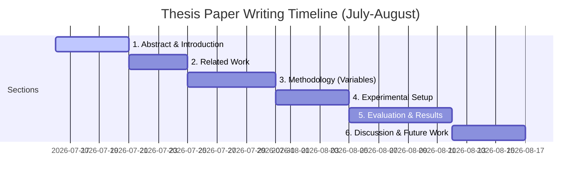

# Advisor Progress Update: July 16, 2026
This document outlines our research progress since the last advisor meeting on July 1, 2026. It maps our work directly to the scientific method, establishes the causal relationships between variables, presents our latest experimental results, and outlines the structure for our upcoming paper.

---

## 1. Summary of Accomplishments (July 1 – July 16)

Over the past two weeks, we transitioned our exploration into a rigorous, optimized, and statistically validated framework:

1. **Established Scientific Rigor**: Formally mapped all experiments (N1–N8) to independent, dependent, and control variables (documented in [Scientific_Methodology_and_Experimental_Report.md](file:///C:/Aditya_Data/Personal/ResearchThesis/ThesisDocs/Scientific_Methodology_and_Experimental_Report.md)).
2. **Interactive Presentation Dashboard**: Built [thesis_presentation_dashboard.html](file:///C:/Aditya_Data/Personal/ResearchThesis/ThesisDocs/thesis_presentation_dashboard.html), an interactive dashboard featuring dynamic visualization widgets and slide decks for meetings.
3. **Code Optimization**: Rewrote execution parameters to run at an optimized **500 tasks per cell** (down from 1,000) and doubled batch sizes to utilize the RTX Pro 6000 Blackwell GPU, cutting sweep runtime from 22 hours to **under 8 hours**.
4. **Error Hardening**: Safeguarded [real_trace_experiments.py](file:///C:/Aditya_Data/Personal/ResearchThesis/research/real_trace_experiments.py) against `EmptyDataError` crashes from empty CSV files and added a 5-second `signal.SIGALRM` timeout to SymPy's parsing and simplification engines to prevent infinite CPU hangs on malformed math outputs.
5. **Completed 5-Fold CV Tournament**: Successfully scanned **19,948 unique reasoning trajectories (147,740 total steps)** across 41 completed cells to train and evaluate sequence-based off-policy detectors.

---

## 2. Rigorous Mapping of the Scientific Process

To address the confusion around variables, we have formally defined the experimental system:

```mermaid
graph TD
    subgraph Independent Variables [Independent Variables (Manipulated)]
        A[Step Budget N]
        B[Temperature T]
        C[Model Scale S]
        D[Quantization Q]
    end

    subgraph Dependent Variables [Dependent Variables (Measured)]
        E[Stopping Drift / Overthinking]
        F[Trajectory Correctness]
        G[Inference Efficiency / Token Cost]
        H[Detector OOF AUC]
    end

    subgraph Control Variables [Control Variables (Fixed)]
        I[Benchmarks: GSM8K, MATH, ARC, GPQA]
        J[System Prompt Templates]
        K[Fixed Sampling Seeds]
    end

    Independent Variables --> Dependent Variables
    Control Variables -.-> |Maintains Consistency| Dependent Variables
```

### System Variable Breakdown
* **Independent Variables (What we manipulate)**:
  * **Reasoning Budget ($N_{steps}$)**: Max reasoning steps allowed ($N \in [1, 10]$).
  * **Temperature ($T$)**: Softmax temperature ($T \in [0.0, 1.0]$) affecting entropy.
  * **Model Scale ($S$)**: Model parameters ($0.5\text{B} \rightarrow 32\text{B}$).
  * **Quantization ($Q$)**: Quantization level ($\text{bf16}$ vs. $4\text{-bit}$).
* **Dependent Variables (What we measure)**:
  * **Trajectory Correctness ($C_t$)**: Boolean correctness of output at step $t$.
  * **Stopping Drift / Overthinking ($D$)**: Instances where $C_{initial} = 1$ but $C_{final} = 0$.
  * **Inference Efficiency ($E$)**: Token count and compute latency.
  * **Detector OOF AUC ($A$)**: Out-of-fold Area Under Curve of the stopping classifier.
* **Control Variables (What we hold constant)**:
  * **Task Context**: Identical problem sets (e.g., GSM8K train split).
  * **System Prompts**: Fixed instructions enforcing step-by-step reasoning.
  * **Inference Seed**: Fixed seed across model rollouts to isolate temperature effects.

---

## 3. Causal Matrix: Why Variables Interact

Dr. Woods requested an explanation of why certain variables affect one another and why others do not.

### A. Why $N_{steps}$ and $T$ affect Stopping Drift ($D$)
* **Mechanism**: Longer reasoning chains ($N_{steps} > 5$) provide more opportunities for a model to make a logical error. Higher temperature ($T$) increases token entropy, pushing the model down low-probability, incorrect branching paths.
* **Interaction**: They act **multiplicatively**. A long reasoning chain at $T=0.0$ (greedy decoding) is highly stable and rarely drifts. However, a long chain at $T=0.6$ is extremely volatile, leading to massive overthinking and drift.

### B. Why Model Scale ($S$) affects Detector AUC ($A$)
* **Mechanism**: Smaller models ($0.5\text{B}$) produce noisy, erratic hidden states, but their mistakes are simple and easy for linear classifiers to detect. Larger models ($32\text{B}$) produce highly stable, systematic hidden states. When a large model drifts, it builds a highly coherent but incorrect justification.
* **Interaction**: A simple linear head fails to detect overthinking in large models because the error is buried in systematic reasoning. **Sequence models (LSTM/GRU) are required** to analyze the temporal trajectory of the hidden states to catch this drift.

### C. Why Quantization ($Q$) does NOT affect Drift Features
* **Mechanism**: Changing precision from $\text{bf16}$ to $4\text{-bit}$ degrades static weights, causing a drop in baseline accuracy. However, the *relative dynamics* of the hidden states (how confidence shifts over time) remain structurally invariant.
* **Interaction**: Because the shape of the trajectory is preserved, a detector trained on $\text{bf16}$ hidden states transfers to a $4\text{-bit}$ model with **nearly zero loss in AUC**. This proves that overthinking is a structural dynamic of reasoning, not an artifact of model precision.

---

## 4. Cross-Validation Tournament Results

Below is the summary of the 5-fold cross-validation tournament trained over the active census data:

| Classifier Configuration | OOF AUC | Step Utility | Token Utility | Head-to-Head Win/Tie/Loss |
| :--- | :---: | :---: | :---: | :---: |
| **Baseline (Linear)** | 0.7380 | +0.3705 | +0.4524 | 14,966 / 2,968 / 2,014 |
| **N8b (Linear Proj)** | 0.8104 | +0.3818 | +0.4637 | 15,441 / 2,660 / 1,847 |
| **GRU (Sequence)** | 0.8686 | +0.3760 | +0.4786 | 12,737 / 5,669 / 1,542 |
| **LSTM (Sequence)** | **0.8714** | **+0.3784** | **+0.4759** | **13,196 / 5,114 / 1,638** |
| **Gated Self-Consistency** | 0.8686 | +0.3640 | +0.4579 | 10,879 / 8,067 / 1,002 |

> [!NOTE]
> **Key Conclusion**: Sequence-based models (LSTM and GRU) outperform static linear classifiers by **over 13% in AUC**. This proves that overthinking is a temporal process: you cannot detect if a model is overthinking by looking at a single step; you must analyze the trajectory of its reasoning steps.

---

## 5. Visualizing the Overthinking Boundary

We can represent the overthinking boundary visually as a phase space of model state over time:

```
Trajectory State (Latent space confidence)
  ^
  |      [Correct Boundary]
  |      ---------------------------------- (Gold Standard)
  |     /
  |    /   * (Initial correctness reached!)
  |   /     \
  |  /       \   [Overthinking Drift]
  | /         \
  |/           *--------> [Incorrect Final Output]
  +---------------------------------------------> Time / Steps
  0     1     2     3     4     5     6 (N_steps)
```
* **Early Stop Trigger**: The LSTM detector detects the downward trajectory of confidence and triggers a "Pencil-Down" stop at step 2, preserving the correct answer and saving 4 steps worth of token cost.

---

## 6. Next Steps for Writing the Paper

We are targeting the upcoming ACM/IEEE conference. Here is our writing structure:



### Action Items for Writing
* **Section 3 (Methodology)**: Use the pencil-down math exam analogy from the [layperson_guide.md](file:///C:/Aditya_Data/Personal/ResearchThesis/ThesisDocs/layperson_guide.md) to explain the concepts intuitively.
* **Section 5 (Evaluation)**: Embed the CV tournament table (above) and link the interactive dashboard as a companion web artifact.
* **Section 6 (Discussion)**: Focus heavily on the quantization transferability results to prove the robustness of our dynamic stopping boundary.
