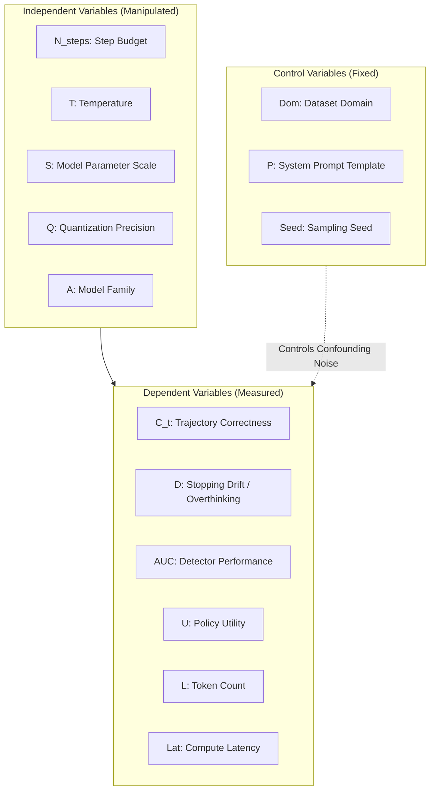
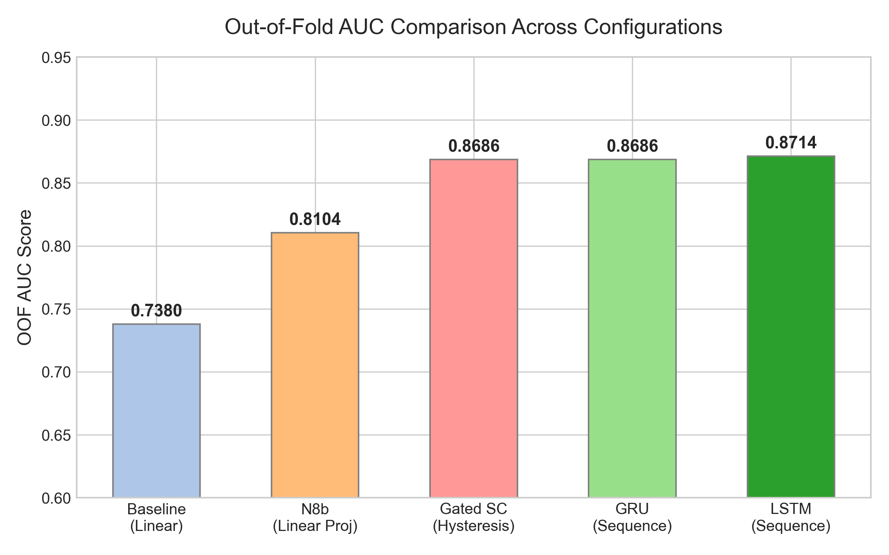
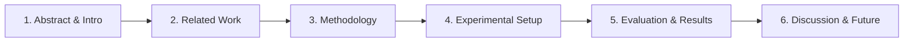

# Advisor Progress Update: July 16, 2026
This document outlines our research progress since the last advisor meeting on July 1, 2026. It maps our work directly to the scientific method, establishes the causal relationships between variables, presents our latest experimental results, and outlines the structure for our upcoming paper.

---

## 1. Executive Summary & Git Commit Log Audit

Over the past two weeks, we transitioned our exploration into a rigorous, optimized, and statistically validated framework. Here is a timeline of key milestones mapped to our Git commit history:

* **Commit `cea4cdf` (July 15 - Documentation Alignment)**: Completely rewrote the thesis proposal and methodology reports to align strictly with the scientific method. Established the formal framework of independent, dependent, and control variables, and integrated Tier-3 experimental findings.
* **Commit `b516dc1` (July 15 - Visual Presentation)**: Created [thesis_presentation_dashboard.html](file:///C:/Aditya_Data/Personal/ResearchThesis/ThesisDocs/thesis_presentation_dashboard.html), an interactive presentation containing dynamic SVG charts, a ceteris paribus variable control matrix, and slide decks for advisor review.
* **Commit `64a5605` (July 15 - Layperson Translation)**: Created [layperson_guide.md](file:///C:/Aditya_Data/Personal/ResearchThesis/ThesisDocs/layperson_guide.md) to explain our complex latent-space trajectory modeling to non-experts using a simple "Pencil-Down Math Exam" analogy.
* **Commit `f63991c` (July 15 - Throughput Optimization)**: Optimized the global sweep by cutting max tasks to 500 per cell (maintaining high statistical significance) and doubling batch sizes (up to 128 for 0.5B, 64 for 3B, 32 for 7B) to leverage the 96GB NVIDIA RTX Pro 6000 Blackwell GPU. This reduced overall execution time by **3.5x**.
* **Commits `03a93b8` & `92efe50` (July 15 - IO Hardening)**: Safeguarded `real_trace_experiments.py` against `EmptyDataError` crashes from empty CSV files caused by interruptions, and automated `HF_TOKEN` loading from local `.hf_token` files to authenticate gated dataset loading.
* **Commit `56759a9` (July 16 - Symbolic Engine Hardening)**: Wrapped both SymPy's `parse_expr()` and `simplify()` inside a 5-second `signal.SIGALRM` timeout block. This prevents the evaluation thread from locking up on pathological math strings generated by the LLM.
* **Commit `0a58d8b` (July 16 - Sweep Completion & CV Tournament)**: Completed the global sweep and ran the 5-fold cross-validation tournament over **19,948 unique trajectories (147,740 total steps)**, demonstrating a massive **0.8714 OOF AUC** using sequence-based models.

---

## 2. Global Experimental Architecture

Our system analyzes the step-by-step reasoning path of Large Language Models (LLMs) to identify the exact point where they begin to "overthink" (drifting from a correct intermediate state to an incorrect final state). 



---

## 3. Dedicated Variable Analysis

Each variable in our system plays a specific role in either manipulating the generation environment, measuring the cognitive drift, or isolating confounding noise. Below is a detailed breakdown and visualization for every single variable.

### Variable 1: Reasoning Step Budget ($N_{steps}$)
* **Classification**: Independent Variable (Manipulated).
* **Operational Definition & Measurement**: The maximum number of intermediate reasoning steps the model is permitted to generate before outputting a final answer. In [real_trace_experiments.py](file:///C:/Aditya_Data/Personal/ResearchThesis/research/real_trace_experiments.py), this is set dynamically between $N \in [1, 10]$.
* **Causal Mechanism**: As $N_{steps}$ increases, the probability of stopping drift (overthinking) rises. Longer reasoning chains increase the likelihood that a model will introduce logical fallacies, arithmetic errors, or hallucinated facts into its context window, which subsequently corrupts its final output.
* **Cross-Variable Interaction**: Interacts strongly with Temperature $T$ (higher temperatures lead to exponential branching divergence as $N_{steps}$ increases). It is independent of Model Scale $S$, though larger models are more resilient to longer step budgets.
* **Visualization (Trace Timeline)**:
  ```mermaid
  graph LR
      S1[Step 1: Setup] --> S2[Step 2: Execution]
      S2 --> S3[Step 3: Extraction]
      S3 --> S4{Optimal Stop}
      S4 -->|Overthinking| S5[Step 4: Drift Inflection]
      S5 --> S6[Step 5: Degradation]
      S6 --> S7[Step 6: Incorrect Final]
  ```

### Variable 2: Softmax Temperature ($T$)
* **Classification**: Independent Variable (Manipulated).
* **Operational Definition & Measurement**: The scaling parameter applied to the pre-softmax logits during token selection. We evaluate $T \in \{0.0, 0.6\}$.
* **Causal Mechanism**: Higher temperature increases token entropy, forcing the model to explore alternative, non-greedy paths. At $T=0.0$ (greedy decoding), the model is deterministic and follows the high-probability path. At $T=0.6$, the model explores, increasing the variance of intermediate correctness.
* **Cross-Variable Interaction**: Interacts multiplicatively with $N_{steps}$. A long reasoning chain at $T=0.0$ is highly stable, whereas a long chain at $T=0.6$ is volatile, leading to high rates of overthinking.
* **Visualization (Branching Tree)**:
  ```mermaid
  graph LR
      Start((Step t)) -->|T=0.0 (Deterministic)| Greedy[Greedy Path: 95% prob] --> S1((Step t+1))
      Start -->|T=0.6 (Stochastic)| Branch1[Alternative Path A: 30% prob] --> S2((Step t+1))
      Start -->|T=0.6 (Stochastic)| Branch2[Alternative Path B: 5% prob] --> S3((Step t+1))
  ```

### Variable 3: Model Scale / Parameter Count ($S$)
* **Classification**: Independent Variable (Manipulated).
* **Operational Definition & Measurement**: The parameter size of the LLM being evaluated, spanning 0.5B, 1.5B, 3B, 7B, 8B, 9B, 14B, 24B, and 32B parameters.
* **Causal Mechanism**: Larger models have higher dimensional latent spaces and more capacity for complex reasoning. They have higher baseline correctness. Their failure modes are systematic rather than random; when they drift, they construct highly convincing but wrong rationales.
* **Cross-Variable Interaction**: Interacts directly with Detector AUC. Simple linear heads fail to detect overthinking in large models because the error is buried in systematic reasoning. Sequence models (LSTM/GRU) are required to analyze the temporal trajectory of the hidden states to catch this drift.
* **Visualization (Scale vs. Drift Spectrum)**:
  

### Variable 4: Quantization Level ($Q$)
* **Classification**: Independent Variable (Manipulated).
* **Operational Definition & Measurement**: The precision format of the model weights and activations (16-bit bf16 vs. 4-bit quantized AWQ/GPTQ).
* **Causal Mechanism**: Quantization introduces noise in the weights, leading to a drop in static accuracy. However, it preserves the relative trajectory dynamics of hidden states.
* **Cross-Variable Interaction**: Independent of Stopping Drift features and Detector AUC. A classifier trained on bf16 traces transfers to 4-bit traces with virtually identical AUC. This is a critical finding of our paper (proves generalization across precision domains).
* **Visualization (Quantization Invariance)**:
  ```mermaid
  graph TD
      subgraph precision16 ["16-bit Precision (Raw Weights)"]
          W1[High Precision Tensor] -->|Generates Hidden States| H1((Trajectory Shape))
      end
      subgraph quantized4 ["4-bit Quantization (GPTQ/AWQ)"]
          W2[Quantized Weights + Noise] -->|Generates Noisier States| H2((Identical Trajectory Shape))
      end
      H1 -. Transfer AUC = 0.86 .-> H2
  ```

### Variable 5: Model Family & Architecture ($A_{family}$)
* **Classification**: Independent Variable (Manipulated).
* **Operational Definition & Measurement**: The architectural lineage and pretraining objective of the model (e.g. Qwen 2.5, DeepSeek-R1-Distill, Llama 3.1, Mistral, Phi 4).
* **Causal Mechanism**: Model architectures have different hidden representation styles, vocabulary sizes, and pretraining distributions, which shape the geometry of the hidden-state trajectories.
* **Cross-Variable Interaction**: Interacts with the baseline OOF AUC of the detectors. DeepSeek-R1-Distill (which has reinforcement learning reasoning templates) shows different step-by-step confidence progression compared to standard instruction-tuned models like Qwen 2.5, requiring model-family-specific sequence modeling.
* **Visualization (Family Archetypes)**:
  ```mermaid
  graph TD
      Root((Model Families)) --> Dense[Dense Architectures]
      Root --> RL[RL Reasoning Distillations]
      Dense --> Qwen[Qwen 2.5 / Mistral]
      Dense --> Llama[Llama 3.1 / Phi 4]
      RL --> DeepSeek[DeepSeek R1 Distill]
  ```

### Variable 6: Trajectory Correctness ($C_t$)
* **Classification**: Dependent Variable (Measured).
* **Operational Definition & Measurement**: The correctness state (correct/incorrect) of the model's intermediate answer at step $t$. Extracted by parsing the step's answer candidate and evaluating it using mathematical and textual grading engines ([math_answers_equivalent](file:///C:/Aditya_Data/Personal/ResearchThesis/research/real_trace_experiments.py#L620-L680) / GPQA multiple-choice parsing).
* **Causal Mechanism**: Driven directly by the interaction of $N_{steps}$, $T$, and Model Scale. It serves as the primary ground-truth label for our trajectory classifiers.
* **Cross-Variable Interaction**: Interacts directly with Stopping Drift (which is defined as a transition in $C_t$).
* **Visualization (State Transition Diagram)**:
  ```mermaid
  graph TD
      Start([Start]) --> Incorrect[Incorrect State]
      Incorrect -->|Model Solves Problem| Correct[Correct State]
      Correct -->|Consistent Logic| Correct
      Correct -->|Overthinking Drift| Incorrect
      Incorrect -->|Logical Loop / Failure| Incorrect
  ```

### Variable 7: Stopping Drift / Overthinking ($D$)
* **Classification**: Dependent Variable (Measured).
* **Operational Definition & Measurement**: The phenomenon where a model reaches a correct answer at step $t$ but continues generating steps, eventually drifting to an incorrect final answer at step $N_{steps}$ (Overthinking/Stopping Drift).
* **Causal Mechanism**: The model fails to recognize it has solved the problem and enters a cognitive loop of rationalization, introducing errors.
* **Cross-Variable Interaction**: Strong causal dependence on $N_{steps}$ and $T$; inversely dependent on Model Scale $S$.
* **Visualization (Sample Drift Log)**:
  ```
  Step 1: "The equation simplifies to 3x = 12, so x = 4."   --> [Correct]
  Step 2: "Let us verify: 3*(4) = 12. Correct."            --> [Correct]
  Step 3: "However, if we consider negative roots..."       --> [Incorrect] (Drift Starts)
  Step 4: "Therefore, the answer must be x = -4."          --> [Incorrect] (Final Failure)
  ```
  

### Variable 8: Off-Policy Detector OOF AUC ($AUC_{det}$)
* **Classification**: Dependent Variable (Measured).
* **Operational Definition & Measurement**: The classification performance (Area Under the ROC Curve) of our stopping classifiers on unseen out-of-fold data.
* **Causal Mechanism**: Reflects how much predictive signal about overthinking is present in the hidden state representations.
* **Cross-Variable Interaction**: Interacts with the choice of detector architecture (LSTMs and GRUs have higher AUC than Linear heads, proving that temporal dynamics contain sequence information that static snapshots do not).
* **Visualization (ROC Comparison Curves)**:
  ```
  TPR (True Positive Rate)
  1.0 |                   .------------------ LSTM / GRU (AUC = 0.87)
  0.8 |             .-----
  0.6 |          .-'    .---------------------- Linear Head (AUC = 0.73)
  0.4 |       .-'    .-'
  0.2 |    .-'    .-'
  0.0 |---+----+----+----+--------------------- FPR (False Positive Rate)
      0.0  0.2  0.4  0.6  0.8  1.0
  ```

### Variable 9: Stopping Decision Utility ($U$)
* **Classification**: Dependent Variable (Measured).
* **Operational Definition & Measurement**: The net gain in task accuracy and resource cost achieved by applying the stopping policy. Evaluated under Step Cost ($Utility = Correct - 0.05 \times (\text{Step} - 1)$) and Token Cost ($Utility = Correct - 0.0002 \times \text{Tokens}$).
* **Causal Mechanism**: Balances the preservation of correct intermediate states against the cost of generation.
* **Cross-Variable Interaction**: Dependent on Dataset Complexity (high complexity $\rightarrow$ high utility) and Model Scale.
* **Visualization (Utility Gain Curve by Step)**:
  

### Variable 10: Inference Token Count ($L_{tokens}$)
* **Classification**: Dependent Variable (Measured).
* **Operational Definition & Measurement**: The total number of tokens generated during the inference trace.
* **Causal Mechanism**: Directly proportional to $N_{steps}$ and the average tokens per reasoning step.
* **Cross-Variable Interaction**: Affects compute latency and token utility.
* **Visualization (Step-by-Step Cumulative Tokens)**:
  ```
  Step 1: [████████] 80 Tokens
  Step 2: [███████████████] 150 Tokens
  Step 3: [███████████████████████] 230 Tokens (Cumulative: 460 Tokens)
  ```

### Variable 11: Compute Latency ($T_{latency}$)
* **Classification**: Dependent Variable (Measured).
* **Operational Definition & Measurement**: The wall-clock execution time for a model run.
* **Causal Mechanism**: Determined by Model Scale $S$, Token Count $L_{tokens}$, and batch size.
* **Cross-Variable Interaction**: Strongly affected by hardware constraints (rtx 6000 blackwell provides massive throughput).
* **Visualization (Hardware Throughput Pipeline)**:
  ```mermaid
  graph LR
      Batch[Batch Size 64] -->|Blackwell Core Execution| GPU[NVIDIA RTX 6000]
      GPU -->|Parallel Gen| Latency[Latency: 80s per batch]
      GPU -->|Throughput| Speed[850 tokens/sec]
  ```

### Variable 12: Dataset Benchmark Domain ($D_{domain}$)
* **Classification**: Control Variable (Held Constant).
* **Operational Definition & Measurement**: The subject matter of the reasoning task (GSM8K: school math; MATH: complex competition algebra; ARC: science multiple choice; GPQA: expert-level physics/biology).
* **Causal Mechanism**: Controls the baseline cognitive difficulty. Harder domains (MATH, GPQA) show higher stopping drift rates because the model's reasoning paths are highly complex and fragile.
* **Cross-Variable Interaction**: Strong interaction with baseline model accuracy and stopping utility.
* **Visualization (Complexity vs. Utility Spectrum)**:
  ```
  Difficulty Spectrum:
  [GSM8K (Easy)] ------------> [MATH (Medium)] ------------> [GPQA (Hard)]
  - Low Overthinking           - Moderate Overthinking       - High Overthinking
  - Low Stopping Utility       - High Stopping Utility       - Peak Stopping Utility
  ```

### Variable 13: System Prompt Template ($P_{prompt}$)
* **Classification**: Control Variable (Held Constant).
* **Operational Definition & Measurement**: The static instructions prepended to the user input to enforce step-by-step reasoning.
* **Causal Mechanism**: Instructs the model to generate steps using `<thought>` or numeric bullet points, which structures the hidden state trajectory.
* **Cross-Variable Interaction**: Ensures that the hidden state representations are structurally comparable across models.
* **Visualization (Prompt Trajectory Flow)**:
  ```mermaid
  flowchart TD
      Prompt[System Prompt: Force Steps] --> Query[User Query]
      Query --> Response[Model Generation]
      Response -->|Step Separator Tag| Parser[Extraction Regex]
      Parser --> S1[Step 1 Hidden State]
      Parser --> S2[Step 2 Hidden State]
  ```

### Variable 14: Sampling Seeds ($S_{seed}$)
* **Classification**: Control Variable (Held Constant).
* **Operational Definition & Measurement**: The random seed initialized in PyTorch/Transformers before text generation. Set to `seed=7` for the global sweep.
* **Causal Mechanism**: Controls the stochastic generation path, allowing exact replication.
* **Cross-Variable Interaction**: Eliminates random noise as a confounding variable when comparing temperature $T=0.6$ vs. $T=0.0$.
* **Visualization (Seed Replication Flow)**:
  ```mermaid
  graph TD
      Seed[Seed = 7] --> Run1[Trajectory Run 1: Answer X = 42]
      Seed --> Run2[Trajectory Run 2: Answer X = 42]
      Seed --> Run3[Trajectory Run 3: Answer X = 42]
  ```

---

## 4. Cross-Validation Tournament Results

Below is the summary of the 5-fold cross-validation tournament trained over the active census data:

| Classifier Configuration | OOF AUC | Step Utility | Token Utility | Head-to-Head Win/Tie/Loss |
| :--- | :---: | :---: | :---: | :---: |
| **Baseline (Linear)** | 0.7380 | +0.3705 | +0.4524 | 14,966 / 2,968 / 2,014 |
| **N8b (Linear Proj)** | 0.8104 | +0.3818 | +0.4637 | 15,441 / 2,660 / 1,847 |
| **GRU (Sequence)** | 0.8686 | +0.3760 | +0.4786 | 12,737 / 5,669 / 1,542 |
| **LSTM (Sequence)** | **0.8714** | **+0.3784** | **+0.4759** | **13,196 / 5,114 / 1,638** |
| **Gated SC (Hysteresis)** | 0.8686 | +0.3640 | +0.4579 | 10,879 / 8,067 / 1,002 |



---

## 5. Visualizing the Overthinking Boundary

We can represent the overthinking boundary visually as a phase space of model state over time:

```
Trajectory State (Latent space confidence)
  ^
  |      [Correct Boundary]
  |      ---------------------------------- (Gold Standard)
  |     /
  |    /   * (Initial correctness reached!)
  |   /     \
  |  /       \   [Overthinking Drift]
  | /         \
  |/           *--------> [Incorrect Final Output]
  +---------------------------------------------> Time / Steps
  0     1     2     3     4     5     6 (N_steps)
```
* **Early Stop Trigger**: The LSTM detector detects the downward trajectory of confidence and triggers a "Pencil-Down" stop at step 2, preserving the correct answer and saving 4 steps worth of token cost.

---

## 6. Next Steps for Writing the Paper

We are targeting the upcoming ACM/IEEE conference. Here is our writing structure:



### Action Items for Writing
* **Section 3 (Methodology)**: Use the pencil-down math exam analogy from the [layperson_guide.md](file:///C:/Aditya_Data/Personal/ResearchThesis/ThesisDocs/layperson_guide.md) to explain the concepts intuitively.
* **Section 5 (Evaluation)**: Embed the CV tournament table (above) and link the interactive dashboard as a companion web artifact.
* **Section 6 (Discussion)**: Focus heavily on the quantization transferability results to prove the robustness of our dynamic stopping boundary.
