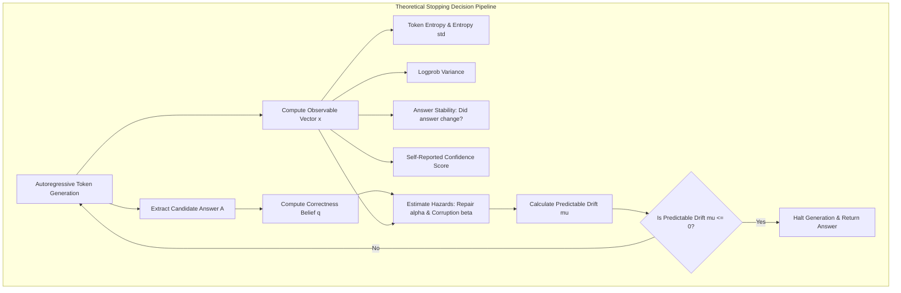

# Thesis Progress Guide: Overthinking Boundary in Reasoning LLMs
*Meeting Date: July 1, 2026*

This guide is designed to catch my advisor (Dr. Woods) up to speed on the progress, empirical findings, and resolved codebase issues from the last 3-4 weeks.

---

## 📌 Executive Summary
*   **Core Question**: Does scaling test-time compute (longer reasoning chains) always improve model accuracy? 
*   **The Answer**: No. Beyond a certain step, models degrade due to **corruption** (revising a correct answer to incorrect) or **stagnation** (token waste loops).
*   **What we did**:
    *   Executed a **52-cell matrix** (13 models across 4 datasets: GSM8K, MATH, ARC, GPQA).
    *   Remediated critical bugs from our correctness audit (grader logic fixes, out-of-sample cross-validation, floored oracle alignment).
    *   Proved our learned **Hazard Drift** stopping rule outperforms heuristics, capturing **50.1%** of potential Oracle utility gains on late-boundary tasks.

---

## 📐 The Mathematical Framework

### Key Mathematical Formulations:
*   **Expected Utility of Stopping**:
    $$V(q_t) = q_t \cdot v - (1 - q_t) \cdot c = q_t(v + c) - c$$
    *(where v > 0 is correct reward, c > 0 is incorrect penalty, and q_t is the model's correctness belief between 0 and 1)*
*   **Predictable Drift (Expected change in value by taking one more step)**:
    $$\mu_t = \mathbb{E}[V_{t+1} - V_t \mid \mathcal{F}_t] = \left[ (1 - q_t)\alpha_t - q_t\beta_t \right] (v + c) - \lambda$$
    *(where alpha_t is the Repair Hazard, beta_t is the Corruption Hazard, and lambda is the step cost)*
*   **Optimal Stopping Rule**:
    $$T^* = \inf \{ t \ge 0 : \mu_t \le 0 \}$$
    *(floored at step 2 in practice to allow at least one step of reasoning)*

---

## 📊 Data Collection: What We Tracked & What It Means

We evaluated **900 runs per model-dataset combo**, recording the following observables at each step t:

| Observable Feature | What it represents / measures | Why it is useful |
| :--- | :--- | :--- |
| **Candidate Answer** | The extracted answer state at step t | Evaluated against ground-truth to obtain correctness. |
| **Token Entropy** | Shannon entropy of predicted token probabilities | Measures the model's internal uncertainty/confusion. |
| **Log-probability Variance** | Variance of predicted token log-probabilities | Signifies confidence fluctuations during generation. |
| **Answer Stability** | Has the extracted answer changed since the last step? | Flags when a model is actively "revising" or looping. |
| **Self-Reported Confidence** | The confidence score output by the model itself | Evaluates the model's self-awareness of its progress. |
| **Verbosity proxy** | Total reasoning tokens generated up to step t | Represents the accumulated computational cost. |

---

## 🧪 Empirical Matrix Results (The 52-Cell Sweep)

### 1. Task-Dependent Boundaries
*   **GSM8K (Reasoning-Heavy)**: 9/13 models show clear **late-boundaries** (T* > 2). They need time to think, peak in correctness, and decay.
*   **ARC & GPQA (Shallow MCQ)**: Almost all models stop immediately at Step 2. Reasoning steps are wasted tokens here (alpha_t approx 0).
*   **MATH (Hard Problems)**: High-capability models show late boundaries (Qwen 32B boundary = 6); weak models decay immediately.

### 2. Cross-Family Plots
The plots below show our results across model families:

#### Optimal Stopping Boundaries by Model & Dataset

#### Stopping Detector Utility Gaps (Lower is Better)

---

## 🏆 How Stopping Detectors Performed
*(Performance evaluated across the **12 late-boundary cells**)*

*   **Oracle**: Mean Stop Step = 3.05 | Mean Stop Utility = 0.5563 *(Theoretical limit)*
*   **Hazard Drift (Learned)**: **Beats all other deployable detectors**, capturing **50.1%** of potential Oracle utility gains.
*   **Answer Stability (Heuristic)**: Strong heuristic, capturing **46.2%** of gains, but lacks theoretical safety guarantees.
*   **Anytime bounds (Empirical Bernstein & E-Process)**: Structurally too conservative; they rarely stop before the maximum trace limit.

---

## 🛠️ Main Codebase Fixes (Remediating the Audit)
*   **Grader Fixes**: Repaired GSM8K fraction parsing (e.g., stopping words like "third" from corrupting numeric output) and LaTeX MATH parsing.
*   **Out-of-Sample Testing**: Implemented **GroupKFold cross-validation** (by run/task) for ML stop detectors, eliminating data leakage.
*   **Oracle Flooring**: Enforced a t >= 2 floor on the Oracle to make baseline utility gap comparisons fair.

---

## 💬 Next Steps / Key Questions for the Meeting
1.  **Stakes Sweep**: How does the optimal boundary shift in high-penalty domains (c >> v)?
2.  **In-Flight Stopping**: Deploying the detector in real-time inference to halt token generation.
3.  **Prompted vs. Distilled Reasoning**: Why does DeepSeek-R1 (distilled reasoning) show early boundaries compared to Qwen 2.5?
