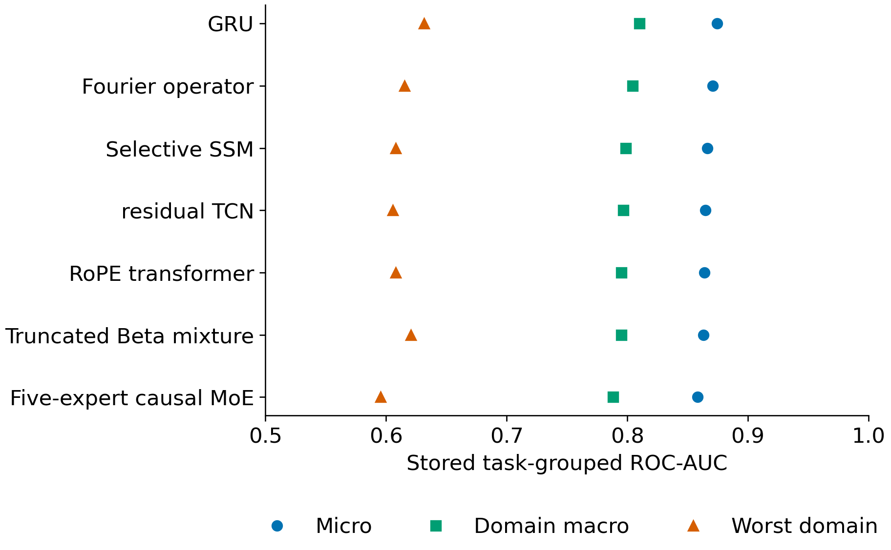
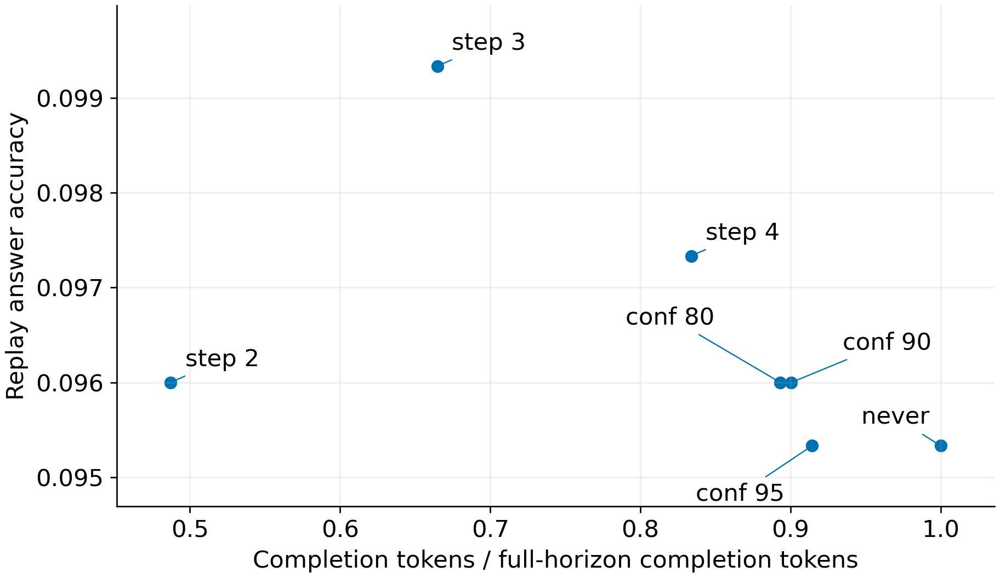
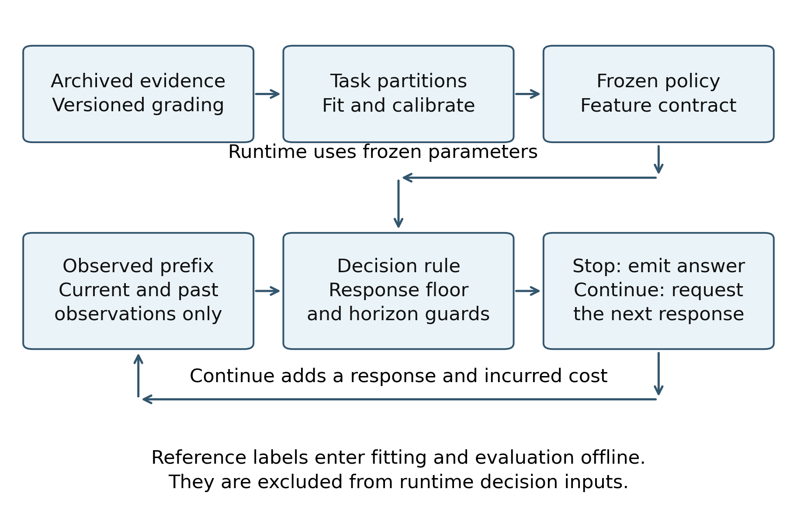

# Cost aware stopping boundaries in reasoning language models

by

Aditya Bhatt

A thesis submitted to Johns Hopkins University in conformity with the requirements for the degree of Master of Science

Baltimore, Maryland

October 2026

# Abstract

Additional reasoning can repair an incorrect answer, replace a correct answer, or consume computation without sufficient improvement. This thesis formulates response-level stopping as a finite-horizon decision based on observable prefixes and hidden correctness. It derives the binary repair-corruption drift identity, applies the standard Bellman/Snell optimal stopping construction, gives a sufficient persistence condition for a drift-sign rule, and constructs exact counterexamples to unconditional myopic optimality. The experimental record separates a variable-horizon matrix from a standardized corpus of 144,440 saved rows, 28,888 trajectories, and 2,948 tasks. Recomputed cluster-based tables show model- and domain-dependent continuation value and matched effects of estimator, token-cap, and precision changes. The historical stacked ROC-AUC of 0.955156 is retained as a retrospective non-nested diagnostic rather than an online performance guarantee. A fitted prefix controller enforces a two-step floor and prevents future generation after stopping. In a newly executed evaluation on 100 GSM8K questions, its actual arm saves 56.51 percent of completion tokens with 7 correct answers versus 6 at the full horizon. On 20 traps it saves 52.11 percent, with one correct answer in each arm. Every learned run stops at step two; adaptive benefit and accuracy noninferiority remain unestablished. The results support protocol-specific, cost-sensitive stopping experiments while identifying limits of myopic rules, probability calibration, and accuracy preservation.

Research adviser: Zerotti Woods

Second reader: Moustapha Pemy

# Chapter 1 Introduction and motivation

## 1.1 Reasoning as a sequential allocation problem

Language models can answer mathematical and scientific questions by producing intermediate text before committing to an answer. Chain-of-thought prompting makes that intermediate work explicit [1]. The resulting sequence can contain useful calculations, checks, and repairs. It can also contain repetition, an incorrect reinterpretation of the problem, or a revision that replaces a correct candidate with an incorrect one. Additional generation therefore has an uncertain benefit and a measurable cost. A stopping policy must decide when the expected benefit of another increment justifies that cost.

The problem is especially clear when a model supplies several successive candidate answers to the same question. A trajectory may begin incorrectly, recover, and then become incorrect again. Its final answer alone conceals both the earlier opportunity to stop and the risk of stopping before a later repair. Comparing only the first and last answers similarly conceals the sequence of changes. The appropriate observational unit is a trajectory with ordered candidate answers, and the relevant decision is made using the prefix available at the moment of stopping.

This thesis studies that decision in a deliberately controlled setting. Each reasoning increment is a complete model response containing a candidate answer. The model can be asked to revise that response at the next increment. The experiments are therefore about repeated response-and-revision trajectories. They should not be interpreted as observations of every latent thought, every token of an uninterrupted internal reasoning process, or the model's unobserved cognition. This distinction determines what a controller can interrupt and how savings must be measured.

The motivating application is economical inference: spend computation when it improves the answer enough to be worthwhile, and terminate when further computation has low expected value. Economical inference is not identical to maximizing accuracy at any cost. A policy can improve a cost-sensitive utility while reducing accuracy; conversely, a policy can increase accuracy while increasing total computation. Both outcomes must be reported. Describing either one solely as a successful stop rate would hide the actual trade-off.

## 1.2 Operational meaning of overthinking

Let a saved candidate be correct when it satisfies the benchmark's frozen reference grader. A repair is an incorrect-to-correct transition between successive saved candidates. A corruption is a correct-to-incorrect transition. These terms describe an observable change in the answer label. They do not assert that the model was internally uncertain or that its narrative accurately reports its reasoning.

Three phenomena must be distinguished. First, **answer corruption** means that a later candidate is wrong after an earlier candidate was correct. Second, **unproductive continuation** means that additional generation fails to produce enough improvement to offset its cost. Third, **policy regret** means that a stopping decision has lower utility than a specified comparator. Corruption can occur without large regret when it is rare or inexpensive to repair. Unproductive continuation can occur even when accuracy is constant. Regret can arise because the policy stops before a repair, not only because it continues beyond a correct answer.

Published work on overthinking motivates the possibility that longer reasoning is inefficient [8]. This thesis asks a narrower, measurable question: on the recorded model-domain panels, when does another response increment have negative net value, and how much of that information can a causal controller use? The literature supplies context; the project's measured effects come from its own frozen artifacts.

At the population level, an accuracy curve can show where the average benefit of continuation changes sign. That curve is not a per-question stopping oracle. An early difficulty assessment, answer stability, or model confidence may differentiate questions that share the same average curve. Conversely, two indistinguishable prefixes may have different unobserved continuations. A scientifically useful controller must acknowledge both possibilities rather than treating the panel's best step as a universally correct stopping time.

## 1.3 Research questions

The first question is descriptive: do repair and corruption transitions explain the empirical change in correctness, after accounting for computation cost? The answer requires explicit denominators. Repair probability is computed among candidates currently wrong, and corruption probability among candidates currently correct. Dividing both counts by all candidates estimates transition frequencies, not their conditional probabilities. Chapter 2 derives the exact relationship between these quantities.

The second question is theoretical: when is a drift-sign rule an optimal stopping rule? A one-step improvement criterion is attractive because it is simple and cheap, but a negative immediate gain need not rule out a valuable later repair. This thesis gives the general finite-horizon solution, identifies a sufficient persistence condition under which a myopic rule becomes optimal, and gives counterexamples when that condition fails. The theory is intended to make an engineering approximation understandable, not to attach an unconditional optimality claim to a convenient heuristic.

The third question is empirical: how do model family, scale, domain, temperature, token cap, and numerical precision relate to the observed trade-off? A cross-model association does not isolate parameter count, and a matched precision comparison does not prove that every model responds to quantization in the same way. Chapter 3 states the actual designs and Chapter 4 reports conclusions at their supported scope.

The fourth question is operational: can a controller make a prefix-only decision quickly enough to be used in a generation loop, and does that loop actually avoid future generation? These are separate checks. A function that returns a stop flag after all responses have already been generated is a replay evaluator. A live loop must cease requesting future increments, preserve the chosen answer, and record what was generated before termination. Chapter 5 distinguishes controller latency, live completion tokens, and retrospective counterfactual tokens.

## 1.4 Contributions

This thesis contributes a protocol-specific study of the accuracy-cost trade-off in repeated response-and-revision trajectories. Learned halting, early exit, and optimal stopping for reasoning already have substantial antecedents, reviewed in Section 1.7. The project's contribution combines an application of established stopping theory with controlled empirical contrasts and an auditable implementation. Its empirical findings concern the declared generation, answer-selection, grading, and cost conventions; changing any of those conventions defines a different decision problem.

The mathematical work translates the standard finite-horizon Bellman and Snell constructions [11], [12] into this response-boundary protocol. It identifies the decision information, selected candidate, correctness endpoint, and cumulative computation cost before deriving the conditional repair-corruption identity. The derivation separates a conditional correctness belief from panel accuracy, conditional transition probabilities from unconditional transition frequencies, and optimal continuation value from immediate drift. It proves the stated persistence condition for a myopic rule and supplies finite counterexamples when that condition is absent. Bounds for uncertain drift and changes in answer stakes have explicit scope conditions. These are specialized derivations and an assumption audit, rather than a claim to originate the general optimal-stopping theory or to establish optimality of the fitted controller.

The empirical work tests explanations that cannot be settled by implementing a known stopping formula alone. It compares matched hazard estimators, examines paired token-cap and numerical-precision contrasts, and evaluates detectors with task-level grouping. The results distinguish improved ranking from improved stopping utility: more expressive fitted models and calibration can reduce utility in the recorded matched comparisons. They also distinguish retrospective diagnostics that use future observations from deployable prefix-only predictors. Together with the failure taxonomy, these contrasts provide evidence about where particular stopping approximations fail, rather than selecting only favorable accuracy or efficiency summaries.

The evidence record separates the variable-horizon boundary corpus from the standardized five-step detector corpus. This prevents double counting and keeps model roster, benchmark split, sample size, and response horizon attached to the relevant claim. The engineering work then implements a prefix-only interface, a minimum response floor, and a loop that actually ceases future generation. Separate fit, calibration, and evaluation task groups produce a serializable probability model without supplying reference labels at runtime. Executable checks examine future-step independence, terminal behavior, token accounting, and adversarial trajectories; manifests identify the executed sources and model artifact.

The resulting live evaluation includes a useful negative finding: the learned rule stops at the minimum two-response budget on every task in both reported panels. Consequently, the observed savings do not establish an advantage of adaptive stopping over that fixed budget. The low absolute accuracy and broad paired uncertainty further limit an accuracy-preservation claim. The thesis contributes those measured limitations alongside the positive implementation result. It does not supply a head-to-head reproduction of the methods reviewed below, a universally best reasoning horizon, or evidence that its controller dominates prior work.

## 1.5 Evidence and reproducibility

A hash verifies that a later artifact has the same selected content as the frozen artifact, subject to the manifest's stated byte-normalization rule. It does not verify that the original observations were generated honestly, that the labels are correct, that the selected sample is representative, or that the original experiment can be repeated on arbitrary hardware. Those issues require provenance, software and hardware records, executable analyses, and independent evaluation.

This repository's Windows checkout can transform line endings. The freeze therefore distinguishes exact local bytes from canonical LF content and checks the canonical content against the historical tournament hashes. This is a reproducibility issue with a precise solution, not permission to ignore arbitrary changes. Both identities are retained, and verification must fail on an unexplained content difference.

Software provenance has a similar limitation. A lock file generated on the current workstation records the current environment. It cannot retrospectively establish the complete environment of the Blackwell tournament. The thesis reports historical versions where stored metadata supports them and identifies unavailable details. It avoids a claim that installing the workstation's lock will reproduce a historical GPU run bit for bit.

The frozen binary label is the endpoint for the primary historical empirical tables in this thesis. The current grader is tested independently, but passing its regression cases is not evidence that every historical label matches its current behavior or a human adjudication. Changes to the grader require a new label census and versioned results. Chapter 6 explains the consequence for scientific interpretation.

## 1.6 Thesis organization

Chapter 2 defines the stochastic model, proves the general stopping result, and establishes the limits of drift-sign and uncertainty arguments. Chapter 3 documents the corpora, generation contracts, instrumentation, grading, grouping, and reproducibility procedures. Chapter 4 presents the measured boundary and detector evidence, including falsification results. Chapter 5 describes the online controller, its runtime checks, and the measured accuracy-cost trade-offs. Chapter 6 discusses generalization, interpretation, and further research. The appendices supply reproducibility commands, a claim-to-artifact map, a note on the accompanying research artifacts, and the derivation of the reported paired accuracy interval.

## 1.7 Related work and the thesis position

Chain-of-thought prompting studies how explicit intermediate reasoning can improve language-model performance [1]. Its benefit does not imply that every additional reasoning increment is valuable. Verifier training uses completed solutions to learn candidate selection [2], while process supervision provides feedback on intermediate mathematical steps [6]. The present endpoint is the selected answer at a saved response boundary. It does not certify every preceding mathematical statement, so the project's answer-level detectors are distinct from process verifiers. These approaches establish why intermediate work and evaluation can help; the stopping question concerns the conditional value of continuing a chosen protocol after a particular prefix.

Adaptive computation predates current language-model reasoning systems. Adaptive Computation Time learns a halting unit for repeated recurrent-state updates and includes a penalty for computation in its training objective [16]. PonderNet instead models the conditional probability of halting, optimizes expected prediction loss over possible halting steps, and regularizes the halting distribution toward a prior [17]. Both learn how much internal computation to perform within a trainable architecture. Their computational increments are state updates, whereas this thesis observes complete generated responses from a fixed generator. The connection is the allocation of effort according to the evolving state; the difference is the information available to the policy and the operation whose execution it can prevent.

Early exit also changes how much of a network executes for each output token. Confident Adaptive Language Modeling, or CALM, chooses intermediate-layer exits during autoregressive decoding and connects local exit decisions to sequence-level performance constraints [18]. This differs from terminating a response-and-revision sequence: CALM can continue emitting tokens while using fewer layers, whereas the present controller decides whether to request another full response. Layer execution, generated tokens, and repeated prompt processing therefore measure different resources. CALM's performance guarantees depend on its calibration procedure and target constraints; they cannot be transferred to a response-boundary confidence heuristic simply because both methods reduce computation.

Self-consistency samples several reasoning paths and aggregates their answers [7]. Adaptive-Consistency makes that sampling budget variable using agreement among the samples already generated [19]. It is a direct precedent for prefix-dependent allocation, with the prefix consisting of completed sampled solutions. The present revision trajectory instead conditions later responses on earlier generated work and uses a declared causal answer selector. Independent-path aggregation and successive revision need not have the same transition law or correctness endpoint. Agreement features can be useful in either setting, but their acquisition cost and timing must be included. In particular, thirteen completed peer trajectories cannot be treated as a free observation in a cost comparison with a single generator.

The overthinking literature motivates inefficiency from excessive test-time reasoning [8]. More recent work addresses termination within a chain of thought. Liu and Wang examine answer convergence and evaluate answer-consistency stopping, changes to end-of-reasoning signals, and a supervised stopping predictor using internal activations [20]. Their work shows that stability is a serious candidate stopping signal, rather than a new idea introduced by this thesis. Stability, however, is a statement about answer agreement; the project separately measures correctness and the possibility of a later repair. Its complete-response boundaries and observable prefix summaries also differ from intervention within a single reasoning trace or access to internal activations.

REFRAIN combines a reflective-redundancy discriminator with a sliding-window upper-confidence-bound controller that adapts stopping thresholds [21]. This provides a recent training-free alternative to a fitted probability model. A redundancy score, a stable answer, and a probability of correctness are different quantities, and each policy must specify how its score determines a continuation decision. The present confidence-and-stability heuristic and trained drift rule are evaluated under their own fixed thresholds and response protocol; REFRAIN's reported results are contextual evidence, not estimates of this implementation's savings or accuracy.

Optimal stopping supplies the established mathematical distinction between immediate reward and conditional continuation value [11], [12]. A particularly close reasoning application is OS-Pruner, a July 2026 preprint that optimizes answer accuracy minus a token-length penalty after observing a reasoning prefix [22]. It intervenes at paragraph boundaries, elicits a final answer on termination, and trains a stopping policy using hidden-state features and precomputed rewards. It also presents a Bellman interpretation and distinguishes continuation value from a fixed correctness threshold. Thus, applying an accuracy-cost optimal-stopping objective to reasoning is already explicit in prior work. This thesis studies selected answers at complete-response boundaries and estimates one-step drift from observable summaries. Its fitted rule approximates a different target from a learned full continuation-value policy, and its finite counterexamples explain the extra conditions needed to connect myopic drift to optimal stopping.

Probability calibration is another established component. Platt's sigmoid mapping fits probabilities from classifier scores [23], and Guo et al. distinguish probability calibration from classification accuracy and evaluate post-processing methods for neural networks [24]. The project uses independently held-out task groups to fit its Platt calibrators and reports ranking and probability errors separately. A calibration fit on archived prefixes does not establish calibration under the live generator, parser, or stopping-induced state distribution. The actual live model is the instruction-tuned Qwen2.5-0.5B release [25]; identifying its model snapshot is essential because the wider archived model panels do not validate transport to every Qwen release or to larger reasoning-specialized models.

Sequential uncertainty theory addresses a further question: how can an interval or decision certificate retain its stated error control under repeated observation? Hoeffding's concentration bound concerns bounded observations under specified sampling assumptions [13]. Confidence sequences provide time-uniform coverage under the conditions of their construction [14]. Such results differ from fitting a calibrated probability score, and neither an arbitrary confidence threshold nor repeated use of an ordinary bootstrap interval inherits their guarantees. Chapter 2 states sufficient assumptions for its uncertainty results; Chapters 4 and 5 report empirical uncertainty at the declared experimental unit. This keeps a mathematical stopping certificate distinct from a descriptive interval for a measured policy contrast.

These lines of work establish learned halting, adaptive sampling, within-chain truncation, and accuracy-cost stopping as known approaches. What this study investigates is their application to a particular answer-revision process: whether measured repair and corruption justify the chosen continuation approximation, whether controlled changes to estimation and generation alter utility, and whether a prefix-safe model produces useful adaptive decisions when actually executed. Its contributions are the resulting derivations, matched empirical findings, and inspectable protocol. Useful adaptive stopping beyond a fixed-two-response budget, transport of the fitted probabilities to new generation regimes, and broadly accuracy-preserving savings remain unestablished by the reported experiments. Since the prior methods were not reproduced under a shared generation and cost contract, the thesis makes no comparative superiority claim.


# Chapter 2 Mathematical formulation and stopping theory

## 2.1 Probability model and admissible information

Fix a finite horizon $N$ and a deterministic earliest permitted stop
$m\in\{0,\ldots,N\}$. Work on a probability space
$(\Omega,\mathcal A,\mathbb P)$. Let $Y^*$ be the reference answer,
$H_t$ the information actually available after decision step $t$, and

$$
\mathcal F_t=\sigma(H_0,\ldots,H_t),\qquad
A_t=a_t(H_0,\ldots,H_t),\qquad
C_t=\mathbf1\{A_t=Y^*\}.
$$

For empirical evaluation, correctness is the versioned domain grader $C_t=g_d(A_t,Y^*)\in\{0,1\}$. Exact answer equality is the special case displayed above. The binary-reward arguments remain unchanged for this grading predicate. This notation identifies the measured endpoint; it does not certify semantic correctness of every stored label. Appendix F illustrates the information restrictions and delayed-repair counterexample.

All observations, executed peer calls, verifier outputs, and controller
randomness used by a decision belong in this filtration. The runtime
interface does not supply offline ground-truth fields, future revisions,
future peer responses, or features computed using an unfinished trace.
These are interface restrictions; mathematical measurability is governed
by the information model and the caveat below. The correctness indicator
need not be observable, even though the answer is.

The filtration is a statistical information model, not a model of
computational hardness. If the reference answer is a known deterministic
measurable function of a fully revealed task, then the selected candidate's
correctness is $\mathcal F_t$-measurable and $q_t=C_t$, even without a gold
input field. All results below still hold in that degenerate case.
Nondegenerate conditional uncertainty requires a specified latent-reference
generative model or an explicitly coarser filtration of decision statistics,
with admissible policies restricted to that information. A fitted probability
based on prefix summaries does not establish a posterior conditioned on all
mathematical semantics of a task.

The candidate $A_t$ means the answer that the specified policy would emit
if it stopped at $t$. If the policy selects among current, earlier, or peer
answers, define $A_t$ by that causal selection procedure. Results for the
current generator answer do not automatically apply to a different selected
answer. If every available candidate in a finite, observable candidate
set can be selected freely, the optimal
immediate correctness reward is
$\max_{a\in\mathcal B_t}\mathbb P(Y^*=a\mid\mathcal F_t)$, where
$\mathcal B_t$ is the candidate set available at $t$. With the empirical grading predicate, the analogous immediate reward is $\max_{a\in\mathcal B_t}\mathbb E[g_d(a,Y^*)\mid\mathcal F_t]$.

A policy's stop time $\tau$ is admissible when

$$
m\le\tau\le N,\qquad \{\tau\le t\}\in\mathcal F_t\quad\text{for every }t.
$$

Let $K_t$ be the nonnegative, nondecreasing, integrable, adapted cumulative cost of **all**
computation executed by $t$, including peers and probes. Put

$$
q_t=\mathbb E[C_t\mid\mathcal F_t],\qquad G_t=q_t-K_t,
\qquad c_t=\mathbb E[K_{t+1}-K_t\mid\mathcal F_t].
$$

The objective is $\sup_{\tau}\mathbb E[C_\tau-K_\tau]$. The step-cost
specialization is $K_t=\lambda(t-m)$ for $t\ge m$; previously incurred
constant costs do not change the optimizer. The empirical choice
$\lambda=0.05$ is a utility convention, not a universal monetary cost or
an assertion about token savings.

**Lemma 1 (observable reward reduction).** For every admissible stop time,

$$
\mathbb E[C_\tau-K_\tau]=\mathbb E[G_\tau].
$$

**Proof.** The event $\{\tau=t\}$ belongs to $\mathcal F_t$, so
$\mathbb E[\mathbf1_{\{\tau=t\}}C_t]
=\mathbb E[\mathbf1_{\{\tau=t\}}q_t]$. Sum this equality over the finite
set $t=m,\ldots,N$, and subtract $\mathbb E[K_\tau]$. □

For stopping-only comparisons, a full potential trace may be defined even
after a policy would stop. Its prefixes must have the same law as the actual
generation process up to stopping. A controller that changes prompts,
sampling, peer allocation, or answer selection changes the process; a
retrospective evaluation must account for that change.

## 2.2 Exact binary correctness drift

For $t<N$, define the conditional joint transition masses

$$
r_t=\mathbb P(C_t=0,C_{t+1}=1\mid\mathcal F_t),\qquad
s_t=\mathbb P(C_t=1,C_{t+1}=0\mid\mathcal F_t),
$$

and the conditional repair and corruption probabilities

$$
\alpha_t=\begin{cases}r_t/(1-q_t),&q_t<1,\\0,&q_t=1,\end{cases}
\qquad
\beta_t=\begin{cases}s_t/q_t,&q_t>0,\\0,&q_t=0.\end{cases}
$$

The value assigned on a zero-probability conditioning state is arbitrary
in $[0,1]$: its multiplier is zero. These quantities are probabilities
per decision transition, not continuous-time intensities. No Markov,
independence, monotonicity, or observability of $C_t$ is needed for the
following identity.

**Theorem 2 (conditional drift identity).** Almost surely,

$$
\mu_t:=\mathbb E[G_{t+1}-G_t\mid\mathcal F_t]
=(1-q_t)\alpha_t-q_t\beta_t-c_t.
$$

**Proof.** Pointwise,
$C_{t+1}-C_t=\mathbf1_{\{C_t=0,C_{t+1}=1\}}
-\mathbf1_{\{C_t=1,C_{t+1}=0\}}$.
The tower property and nested filtrations give

$$
\mathbb E[q_{t+1}\mid\mathcal F_t]
=\mathbb E[\mathbb E[C_{t+1}\mid\mathcal F_{t+1}]\mid\mathcal F_t]
=\mathbb E[C_{t+1}\mid\mathcal F_t].
$$

Subtract $q_t=\mathbb E[C_t\mid\mathcal F_t]$, use the indicator identity,
and subtract $c_t$. □

Consequently, with $D_m=0$ and $D_t=\sum_{s=m}^{t-1}\mu_s$,
$M_t=G_t-G_m-D_t$ is an integrable martingale. This is a discrete Doob
decomposition. The process $q_t$ need not be a martingale: it concerns
the changing answer $C_t$, rather than the conditional probability of
one fixed event.

For a sample of $n$ observed transitions, let $n_0,n_1$ be the numbers
of current incorrect and correct states and let $n_{01},n_{10}$ count
repairs and corruptions. On that same sample,

$$
\left(1-\frac{n_1}{n}\right)\frac{n_{01}}{n_0}
-\frac{n_1}{n}\frac{n_{10}}{n_1}
=\frac{n_{01}-n_{10}}{n}
=\frac1n\sum_i(C_{i,t+1}-C_{i,t}),
$$

with the zero-denominator convention above. Frequencies $n_{01}/n$
and $n_{10}/n$ are already joint event frequencies; multiplying them
again by $1-q$ and $q$ is incorrect. Matching this sample identity
verifies arithmetic, not an online probability model. A product of separately
averaged, instance-specific probabilities generally differs from the
average of their products.

**Corollary 2.1 (affine stakes).** Suppose a correct answer earns $v\ge0$
and an incorrect answer loses $p\ge0$, with $v+p>0$, and computation still
costs $K_t$. The observable stop reward and its conditional drift become

$$
G_t^{v,p}=v q_t-p(1-q_t)-K_t=(v+p)q_t-p-K_t,
$$

$$
\mu_t^{v,p}=(v+p)\bigl((1-q_t)\alpha_t-q_t\beta_t\bigr)-c_t.
$$

**Proof.** The realized terminal reward is
$vC_t-p(1-C_t)-K_t$. Apply Lemma 1 and the linearity of conditional
expectation to Theorem 2. □

For constant computation cost, the correctness-versus-compute trade-off is
therefore determined by cost divided by $v+p$; $-p$ is an additive constant.
Increasing stakes can change the optimal policy. Under a fixed potential
trace law and nondecreasing computation costs, optimal continuation regions
expand as $v+p$ increases; Corollary 3.1 proves the corresponding ordering
of earliest optimal stop times. That ordering need not hold for empirically
thresholded policies, or when stakes change the generation process, answer
selection, or costs. All comparisons must state both scales.

## 2.3 General finite-horizon optimal stopping

**Theorem 3 (Bellman recursion and Snell envelope).** Set

$$
S_N=G_N,\qquad
S_t=\max\{G_t,\mathbb E[S_{t+1}\mid\mathcal F_t]\},
\quad t=N-1,\ldots,m.
$$

Then $S$ is the smallest integrable supermartingale dominating $G$.
For each $t\ge m$,

$$
S_t=\operatorname*{ess\,sup}_{\tau:\,t\le\tau\le N}
\mathbb E[G_\tau\mid\mathcal F_t],\qquad
\tau_t^*=\inf\{s\in\{t,\ldots,N\}:S_s=G_s\}
$$

is an optimal stopping time, and
$S_t=\mathbb E[G_{\tau_t^*}\mid\mathcal F_t]$.

**Proof.** Backward induction gives integrability, adaptation,
$S_t\ge G_t$, and $S_t\ge\mathbb E[S_{t+1}\mid\mathcal F_t]$.
If $W$ is any integrable supermartingale with $W_s\ge G_s$, then
$W_N\ge S_N$. If $W_{s+1}\ge S_{s+1}$, the supermartingale property
and domination give
$W_s\ge\max\{G_s,\mathbb E[S_{s+1}\mid\mathcal F_s]\}=S_s$.
This proves minimality by induction.

For any bounded admissible $\tau$, finite optional sampling, or the
finite telescoping sum of conditional supermartingale increments, gives
$\mathbb E[G_\tau\mid\mathcal F_t]
\le\mathbb E[S_\tau\mid\mathcal F_t]\le S_t$.
The first contact time is measurable and no later than $N$.
On $\{s<\tau_t^*\}$, $S_s>G_s$, so the recursion forces
$S_s=\mathbb E[S_{s+1}\mid\mathcal F_s]$.
Thus $(S_{s\wedge\tau_t^*})_{s=t}^N$ is a martingale. At contact
$S_{\tau_t^*}=G_{\tau_t^*}$, giving equality in the upper bound.
Attainment establishes the essential-supremum representation. □

This is the standard finite-horizon optimal stopping construction; see
[Ferguson, Chapter 3, Section 3.2](https://www.math.ucla.edu/~tom/Stopping/sr3.pdf).
The proof here specializes it to the observable correctness-minus-cost
reward and includes the explicit protocol floor.

The optimal continuation advantage is

$$
\Delta_t^*=\mathbb E[S_{t+1}\mid\mathcal F_t]-G_t
=\mu_t+\mathbb E[S_{t+1}-G_{t+1}\mid\mathcal F_t]\ge\mu_t.
$$

The second term is the value of future choices. Therefore $\mu_t>0$
is sufficient to favor continuation at $t<N$; $\mu_t\le0$
alone is insufficient to justify stopping. At $N-1$ the terms coincide.
The optimal policy stops at the first $\Delta_t^*\le0$, or at $N$.

**Corollary 3.1 (stake monotonicity under a fixed process).** Compare affine
stakes with $0<w_1\le w_2$, where $w_j=v_j+p_j$. Suppose that the
filtration, candidate answers, potential trace law, horizon, floor, and
nondecreasing cumulative cost process are identical in both problems.
Then their earliest optimal contact times satisfy
$\tau^*(w_1)\le\tau^*(w_2)$ almost surely.

**Proof.** For $t<N$, the normalized advantage of being required to
continue at least once is

$$
\frac{\Delta_t^*(w)}{w}
=\operatorname*{ess\,sup}_{\tau:\,t+1\le\tau\le N}
\mathbb E\left[q_\tau-q_t-\frac{K_\tau-K_t}{w}
\,\middle|\,\mathcal F_t\right].
$$

The constant incorrect-answer offset cancels. Since $K_\tau-K_t\ge0$,
each conditional expectation is nondecreasing in $w$, as is its essential
supremum. Consequently $\Delta_t^*(w_1)>0$ implies
$\Delta_t^*(w_2)>0$. Along any fixed path, the larger-stakes policy cannot
stop while the smaller-stakes policy has continued at every decision so
far: each of those strict continuation conditions also holds for larger
stakes. With the same tie convention and forced terminal stop, this proves
the stated ordering. □

This result does not assert that accuracy itself increases strictly, that
all fitted drift boundaries obey the ordering, or that a negative drift
becomes positive merely because stakes increase.

## 2.4 When a drift-sign boundary is optimal

**Theorem 4 (persistent nonpositive drift).** Define

$$
T_c=\min\bigl(\{t\in\{m,\ldots,N-1\}:\mu_t\le0\}\cup\{N\}\bigr).
$$

Assume, almost surely, that $\mu_s\le0$ for every
$s\in\{T_c,\ldots,N-1\}$. Then $T_c$ maximizes
$\mathbb E[G_\tau]$ over all admissible stop times.

**Proof.** For any such $\tau$, telescoping and the measurability of
$\{\tau>s\}$ yield

$$
\mathbb E[G_\tau]=\mathbb E[G_m]+
\mathbb E\sum_{s=m}^{N-1}\mathbf1_{\{\tau>s\}}\mu_s.
$$

For $s<T_c$, $\mu_s>0$ and
$\mathbf1_{\{T_c>s\}}=1$. For $s\ge T_c$, $\mu_s\le0$
and $\mathbf1_{\{T_c>s\}}=0$. Accordingly,

$$
(\mathbf1_{\{T_c>s\}}-\mathbf1_{\{\tau>s\}})\mu_s\ge0
$$

on every path. Sum, take expectations, and apply the telescoping identity
to $T_c$. □

This is a condition on the **conditional drifts along sample paths**.
A single crossing of an empirical population mean curve does not establish
it. Theorem 4 is a special case of monotone stopping problems, whose
one-stage look-ahead conditions are discussed in
[Ferguson, Chapter 5](https://www.math.ucla.edu/~tom/Stopping/sr5.pdf).

**Corollary 4.1 (a sufficient structural condition).** Suppose cost is
constant $c_t=\lambda$, and, almost surely along every path,
$q_{t+1}\ge q_t$, $\alpha_{t+1}\le\alpha_t$, and
$\beta_{t+1}\ge\beta_t$ for $m\le t<N-1$, for specified versions
of the hazards. Then $\mu_t$ is nonincreasing and Theorem 4 applies.

**Proof.** Subtract adjacent drift expressions:

$$
\begin{aligned}
\mu_{t+1}-\mu_t={}&(1-q_{t+1})(\alpha_{t+1}-\alpha_t)
+\alpha_t(q_t-q_{t+1})\\
&-q_{t+1}(\beta_{t+1}-\beta_t)
-\beta_t(q_{t+1}-q_t).
\end{aligned}
$$

Every term is nonpositive because all probabilities lie in $[0,1]$.
With variable predictable cost an extra term $-(c_{t+1}-c_t)$
appears; nondecreasing $c_t$ is an additional sufficient condition. □

These sufficient assumptions are strong. They are not established by a
high correctness AUC, a good average utility curve, or a monotone fitted
hazard curve. A noisily estimated posterior may increase and decrease
after new observations even when the marginal accuracy improves.

### Exact counterexample 1: delayed repair

Use times $0,1,2$, constant cost $1/10$, and correctness probabilities
$q=(0,0,1)$. An exact-answer realization has a latent binary reference
$Y^*$, a surely incorrect placeholder at times 0 and 1, and a generator
that outputs $Y^*$ at time 2. No information at time 0 or 1 reveals which
reference answer will be returned. Then
$G=(0,-1/10,4/5)$ and $\mu_0=-1/10$.
The myopic boundary stops at 0 with reward 0. The optimal stop is 2 with
reward $4/5$. A second system with $q=(0,0,0)$ has the same current
$(q_0,\alpha_0,\beta_0,c_0)=(0,0,0,1/10)$ but optimally stops at 0.
Thus even the exact current hazard triple cannot identify a general
multi-step optimal policy. The example can be shifted to a floor $m=2$
without changing the comparison.

### Exact counterexample 2: a population curve misses adaptive value

Take $q_0=1/2$ and cost $1/10$. At time 1, a fair observed signal gives
branch A with $q_1=2/5$ or branch B with $q_1=3/5$. At time 2, set
$q_2=1$ on A and $q_2=0$ on B. Both unconditional one-step drifts
equal $-1/10$, and the deterministic-time expected rewards are
$1/2,2/5,3/10$. Yet continuing once, then continuing on A and stopping
on B, achieves

$$
\tfrac12(1-2/10)+\tfrac12(3/5-1/10)=13/20>1/2.
$$

For an exact-answer realization, let $Y^*\in\{0,1\}$ have prior probability
$1/2$ of 1, and use candidate answer 1 at times 0 and 1. Set
$\mathbb P(A,Y^*=1)=1/5$, $\mathbb P(A,Y^*=0)=3/10$,
$\mathbb P(B,Y^*=1)=3/10$, and $\mathbb P(B,Y^*=0)=1/5$.
At time 2 the generator returns $Y^*$ on branch A and a surely incorrect
placeholder on branch B. The controller uses only the observed branch
to make its time-1 decision. Thus the examples respect a common reference
answer and use no hindsight information to make decisions.

## 2.5 Partial observation and feature models

For a causal feature vector $Z_t=\phi_t(H_0,\ldots,H_t)$, define

$$
\begin{aligned}
\widetilde q_t&=\mathbb P(C_t=1\mid Z_t),\\
\widetilde\alpha_t&=\mathbb P(C_{t+1}=1\mid C_t=0,Z_t),\\
\widetilde\beta_t&=\mathbb P(C_{t+1}=0\mid C_t=1,Z_t).
\end{aligned}
$$

Their hazard expression equals
$\mathbb E[C_{t+1}-C_t\mid Z_t]$ exactly, subject to the same null-state
convention. This feature-conditional quantity need not equal the
history-conditional drift in Theorem 2. In particular, unrelated
$\sigma(Z_t)$ at different times need not form a filtration.

A Bellman equation on a compressed state requires sufficiency: conditional
on that state, the law of future observations, reward, and cost must not
depend on omitted history. Alternatively a correctly specified partially
observed Markov model can use the full posterior over its latent state as
the belief state. A scalar correctness posterior and two current hazards
do not by themselves provide that transition model. Without such
assumptions, a fitted hazard rule is an empirical myopic approximation.

Retrospective correctness classifiers, continuation predictors, and optimal
stopping policies are different estimands. Training with labels is allowed;
using those labels or future observations to decide on the same live
instance is not. A prefix-stable feature transform must be fitted before
evaluation or updated solely from information available by that prefix.
Full-family or full-trace normalizations may change earlier decisions when
future rows are added, even without directly using correctness labels.

## 2.6 Calibration and perturbation bounds

Discrimination is not probability accuracy. AUC is unchanged by a strictly
increasing transform, while the drift sign generally changes. Even marginal
calibration $\mathbb E[C_t\mid\widehat q_t]=\widehat q_t$ does not imply
$\widehat q_t=\mathbb E[C_t\mid\mathcal F_t]$: a constant $1/2$ score
is marginally calibrated in a balanced population whose available history
perfectly separates correct and incorrect cases.

**Proposition 5 (class weighting changes the population target).** For a
binary target with conditional probability $p\in(0,1)$, positive class
weights $w_1,w_0$, and an unconstrained probability prediction $r$, the
weighted Bernoulli log loss is uniquely minimized at

$$
r=\frac{w_1p}{w_1p+w_0(1-p)},\qquad
p=\frac{w_0r}{w_1(1-r)+w_0r}.
$$

**Proof.** Differentiate
$-w_1p\log r-w_0(1-p)\log(1-r)$; setting the derivative to zero yields
the first formula. Strict positivity of the second derivative gives
uniqueness. Algebra gives the inverse. □

`equation_analysis.py` and `trace_analysis.py` fit class-balanced
classifiers. Thus their uncorrected probability outputs are not guaranteed
to be target-distribution $q,\alpha,\beta$, even if ranking is useful.
For example, balanced weighting in a population with prevalence $1/10$
maps its constant posterior to $1/2$. With
$\alpha=1/50,\beta=1/200,\lambda=1/100$, changing only $q$ from
$1/10$ to $1/2$ changes drift from $3/400>0$ to $-1/400<0$.
The inverse formula describes a population optimum; model misspecification,
regularization, estimated weights, and distribution shift still require
independent probability validation. ECE and Brier scores are useful
diagnostics but do not provide uniform conditional error guarantees.

**Proposition 6 (drift perturbation and interval propagation).** If
$|\widehat q-q|\le\varepsilon_q$,
$|\widehat\alpha-\alpha|\le\varepsilon_\alpha$,
$|\widehat\beta-\beta|\le\varepsilon_\beta$, and
$|\widehat c-c|\le\varepsilon_c$, with all probabilities in $[0,1]$,
then

$$
|\widehat\mu-\mu|\le
2\varepsilon_q+(1-\widehat q)\varepsilon_\alpha
+\widehat q\varepsilon_\beta+\varepsilon_c.
$$

If simultaneous valid intervals are
$q\in[q_L,q_U]$, $\alpha\in[a_L,a_U]$,
$\beta\in[b_L,b_U]$, and $c\in[c_L,c_U]$, their exact rectangular
drift bounds, provided the three probability intervals are contained in
$[0,1]$, are

$$
L=(1-q_U)a_L-q_Ub_U-c_U,\qquad
U=(1-q_L)a_U-q_Lb_L-c_L.
$$

**Proof.** Subtract the true expression from the fitted expression as

$$
\widehat\mu-\mu=(1-\widehat q)(\widehat\alpha-\alpha)
-\widehat q(\widehat\beta-\beta)
-(\widehat q-q)(\alpha+\beta)-(\widehat c-c).
$$

Apply the triangle inequality and $\alpha+\beta\le2$.
The drift is increasing in $\alpha$ and decreasing in
$q,\beta,c$ on their domains, so the stated corners attain its
minimum and maximum on the rectangle. □

This propagation result assumes genuine interval coverage of the relevant
conditional probabilities. It cannot manufacture such intervals from AUC,
a chosen safety margin, cross-validation alone, or calibration plots.

## 2.7 What sequential uncertainty control can certify

**Proposition 7 (a precisely scoped first-crossing guarantee).** Suppose
$U_t$ is observable at decision $t$ and

$$
\mathbb P(\exists t\in\{m,\ldots,N-1\}:\mu_t>U_t)\le\delta.
$$

Let $\tau_U$ be the first $U_t\le0$ after the floor, with fallback
$N$. Then

$$
\mathbb P(\tau_U<N\text{ and }\mu_{\tau_U}>0)\le\delta.
$$

**Proof.** On the simultaneous-coverage event,
$\mu_{\tau_U}\le U_{\tau_U}\le0$ whenever $\tau_U<N$.
Every violation is therefore contained in the coverage-failure event. □

This certifies a nonpositive **one-step** drift, not optimality, retained
accuracy, or proximity to a hindsight oracle. A corresponding simultaneous
upper bound on $\Delta_t^*$ certifies the Bellman stop condition.
To interpret a bound on $\mu_t$ as a statement about the myopic boundary
one must separately impose the relevant structural assumptions.

For a probe construction, distinguish the pre-probe sigma-field
$\mathcal H_t$ from the post-probe decision information $\mathcal F_t$.
Let $\theta_t$ be an $\mathcal H_t$-measurable target, and assume the
$n_t$ probes $X_{t,i}\in[a,b]$ are conditionally independent given
$\mathcal H_t$, each with conditional mean $\theta_t$. Fix their count
before observing them. Conditional Hoeffding gives a bound for
$\theta_t$, not automatically for $\mu_t$:

$$
U_t^{\mathrm{pre}}=\overline X_t+(b-a)\sqrt{\frac{\log(1/\delta_t)}{2n_t}}.
$$

Taking $\delta_t=\delta/[r(r+1)]$ for decision index
$r=t-m+1\ge1$ gives $\sum_t\delta_t\le\delta$, so a union bound
establishes simultaneous coverage of the $\theta_t$ targets. Decisions can depend on earlier data;
independence between different decision times is unnecessary. Within-prefix
conditional independence and the correct conditional mean are essential.
Adaptively choosing the number of probes requires a bound also uniform in
probe count, or a further failure-budget allocation. The bounded-sample
result is due to
[Hoeffding (1963)](https://doi.org/10.1080/01621459.1963.10500830).

Probe observations and their cost must enter the actual decision
filtration. If they reveal information that changes the live conditional
continuation gain, a bound for the pre-probe conditioning target is not
automatically a bound for the post-probe target. Proposition 7 follows
from this construction only if $\theta_t=\mu_t$ after the probes, or if
an additional justified comparison supplies a bound for the post-probe
$\mu_t$. Shared unknown ground truth
can make apparently independent generations dependent after conditioning
only on the visible prefix. Verified probe labels are also not generally
available at deployment. An empirical-Bernstein formula requires its own
theorem, variance convention, and sampling assumptions; merely inserting a
sample variance does not prove those conditions. The modern confidence
sequence framework is developed by
[Howard et al. (2021)](https://doi.org/10.1214/20-AOS1991).

For completeness, a valid elementary e-process can be obtained when
$X_i\in[-1,1]$ is adapted to a sampling filtration $\mathcal G_i$
and the null satisfies $\mathbb E[X_i\mid\mathcal G_{i-1}]\ge0$
for every $i$. For any fixed $\eta\in[0,1)$,

$$
E_n^{(\eta)}=\prod_{i=1}^n(1-\eta X_i)
$$

is a nonnegative supermartingale starting at 1: its next conditional
multiplier has expectation at most 1. A fixed convex mixture of such
processes has the same property. Finite optional sampling at the first
threshold crossing, followed by monotone limits, gives

$$
\mathbb P(\sup_n E_n\ge1/\delta)\le\delta.
$$

This rejects that conditional-mean null for the specified sampling process.
It does not estimate a different instance's present continuation gain.
If $X_i=B$ for all $i$, with one shared fair sign $B$, all marginal
means are zero, yet $(1-X_i/2)$'s ten-factor product exceeds 20 on
the negative branch with probability $1/2$. Hence marginal means and
boundedness alone do not justify a 5% sequential guarantee.

In `trace_analysis.py`, empirical-Bernstein bounds and mixture products
are computed across labeled task rows within a step, then used for a common
step-level diagnostic. That construction is not an observable per-instance
confidence bound. Repeated runs of the same task also need dependence
handling for population inference. This note makes no claim that the
repository's raw fitted probabilities or historical detectors satisfy
Proposition 7's coverage premise.

## 2.8 Scope of the empirical claims

**Table 1. Mathematical objects and assumptions.**

| Mathematical object | Required information or assumptions | Defensible interpretation |
| --- | --- | --- |
| Exact conditional hazard identity | Binary reward, correct conditioning, common transition sample | Algebraic one-step decomposition |
| Snell/Bellman policy | Conditional future law and all computation costs | Optimal finite-horizon causal stop |
| First nonpositive true drift | Persistent nonpositive drift after first crossing | Optimal under Theorem 4 |
| Fitted first nonpositive drift | Causal features and validated probability estimates | Empirical myopic stopping rule |
| First nonpositive upper bound | Simultaneous coverage of the stated target | Probabilistic one-step sign certificate |
| Hindsight best recorded step | Completed labels and trace | Infeasible upper benchmark |
| Correctness AUC | Held-out target labels and scores | Ranking quality on that population |

A hindsight maximum satisfies
$\mathbb E[\max_{m\le t\le N}(C_t-K_t)]
\ge\sup_\tau\mathbb E[C_\tau-K_\tau]$, because it dominates every
realized admissible stop reward. Its maximizing time generally fails the
stopping-time condition. Therefore a hindsight oracle gap includes
unavailable information, and a reported early/late stop relative to that
oracle is not a formal Type I error rate.

A minimum-step floor is a protocol constraint. It restricts the policy
class and can improve a particular fitted policy empirically; it cannot
improve the unconstrained optimum, because that optimum already includes
every policy respecting the floor. For positive constant step cost,
$q_t$ measures accuracy while $q_t-\lambda(t-m)$ measures utility;
their peaks need not coincide. Any savings claim must compare actual
executed tokens/calls with a defined baseline, not convert stopped step
indices into hardware savings without measurement.

The results are relative to the correctness target $C_t$. A passed grading
test suite does not prove every empirical label correct, and an exact-answer
benchmark theorem is not a theorem about open-ended semantic correctness.
The standard optimal stopping machinery here is not claimed as a novel
theorem or a universal law across model architectures.


# Chapter 3 Experimental setup and methods

## 3.1 Corpus separation

The project contains two main collections with different purposes. The canonical model-domain matrix is a variable-horizon response-and-revision collection used for boundary and controlled policy analyses. Its current analysis describes 75,965 sanitized trajectories and 798,770 raw saved step rows over 52 model-domain cells. The word sanitized matters: raw malformed fragments and inconsistent records are handled by the analysis pipeline, so a raw row count and an eligible trajectory count are different denominators. The standardized detector collection contains 144,440 rows from 28,888 five-step trajectories and 2,948 unique task identifiers. Its 52 cells support detector training and task-grouped scoring.

The collections overlap in scientific subject matter and include repeated benchmark questions. They are not independent replications and must not be summed into a single sample size. The earlier replay experiment also reuses a 1,500-trajectory Qwen2.5-7B/GSM8K cell from existing evidence. Its replayed decisions do not create new language-model generations.

**Table 2. Standardized five-step corpus.**

| Domain | Effective split | Tasks | Trajectories | Rows |
| --- | --- | --- | --- | --- |
| GSM8K | train | 1,000 | 8,064 | 40,320 |
| MATH-500 | test | 500 | 6,500 | 32,500 |
| ARC-Challenge | test | 1,000 | 8,500 | 42,500 |
| GPQA main | train (inferred; request test) | 448 | 5,824 | 29,120 |
| Total | four domains | 2,948 | 28,888 | 144,440 |

The standardized task count exceeds the canonical matrix's task count because the collection uses different benchmark sample allocations. Each standardized trajectory has five rows, so 28,888 multiplied by five gives exactly 144,440. Multiplying the unique task count by thirteen and five would be incorrect because model-domain cells have unequal sample sizes. Counts are derived from source-qualified trajectory keys, not from that shortcut.

## 3.2 Model roster

The canonical matrix includes thirteen model configurations: DeepSeek-R1-Distill-Qwen-1.5B and 7B; Qwen2.5-0.5B, 3B, 7B, 14B, and 32B Instruct [25]; InternLM3-8B-Instruct; Llama-3.1-8B-Instruct; Mistral-7B-Instruct-v0.3; Mistral-Small-Instruct-2409; Phi-4-mini-instruct; and Yi-1.5-9B-Chat. The standardized detector collection replaces InternLM3 with Qwen3.5-9B. These are distinct rosters, even though both have thirteen entries.

**Table 3. Model configurations. Source: cell metadata.**

| Model ID | Recorded scale | Membership |
| --- | --- | --- |
| deepseek-ai/DeepSeek-R1-Distill-Qwen-1.5B | 1.5B | Matrix + detector |
| deepseek-ai/DeepSeek-R1-Distill-Qwen-7B | 7B | Matrix + detector |
| internlm/InternLM3-8B-Instruct | 8B | Matrix only |
| meta-llama/Llama-3.1-8B-Instruct | 8B | Matrix + detector |
| mistralai/Mistral-7B-Instruct-v0.3 | 7B | Matrix + detector |
| mistralai/Mistral-Small-Instruct-2409 | 22B | Matrix + detector |
| microsoft/Phi-4-mini-instruct | 4B | Matrix + detector |
| Qwen/Qwen2.5-0.5B-Instruct | 0.5B | Matrix + detector |
| Qwen/Qwen2.5-14B-Instruct | 14B | Matrix + detector |
| Qwen/Qwen2.5-32B-Instruct | 32B | Matrix + detector |
| Qwen/Qwen2.5-3B-Instruct | 3B | Matrix + detector |
| Qwen/Qwen2.5-7B-Instruct | 7B | Matrix + detector |
| 01-ai/Yi-1.5-9B-Chat | 9B | Matrix + detector |
| Qwen/Qwen3.5-9B | 9B | Detector only |

The historical alias `mistral_small_24b_2409` identifies the 2409 model, whose recorded specification is 22B. An alias is not a reliable parameter count. Scientific tables use the documented model specification and retain the alias only where needed to locate source files. Likewise, a speculative entry in a software catalog is not evidence that a model was included in a completed experiment; the actual manifests and trace metadata determine inclusion.

The model panel allows descriptive comparisons of families and scale. It does not randomize architecture, pretraining data, instruction tuning, distillation, or tokenization. A difference between two model families therefore cannot be attributed uniquely to scale. Within the Qwen ladder, common family identity reduces some confounding, but still does not create a controlled intervention on parameter count alone.

## 3.3 Benchmark tasks and splits

GSM8K contains grade-school mathematical word problems and was introduced in the verifier study of Cobbe and colleagues [2]. MATH provides competition-style mathematical problems [3]. ARC-Challenge provides difficult multiple-choice science questions [4]. GPQA provides graduate-level multiple-choice scientific questions [5]. These references identify the benchmark tasks; they do not validate this project's chosen subsets or grading implementation.

The canonical experiment registry specifies GSM8K train, MATH test, ARC-Challenge test, and GPQA main train. The standardized collection also uses GSM8K train, MATH test, and ARC-Challenge test. Its GPQA metadata records `test`, but the current loader unconditionally requests the `train` split; the saved identifiers use `gpqa_main`. The requested and inferred effective split are retained as a provenance discrepancy rather than silently equated. The historical loader revision is not recorded, so this effective-split interpretation uses the current implementation and stored task identities. Thus a dataset's published split name and a detector's held-out fold mean different things. A detector can be evaluated on a task-held-out fold drawn from a benchmark training split. That is an internal task holdout, not an official benchmark test-set evaluation.

SVAMP does not appear in the authoritative standardized tournament manifest. It is excluded from the reported four-domain totals. The complete prompt, task identifier, reference answer, split, and any deterministic choice shuffle must remain associated with a question. An MCQ label such as B only has meaning relative to the exact displayed ordering. The project stores or reconstructs that ordering before evaluating the option label.

## 3.4 Response and revision protocol

A saved step is a complete response generated under the collection's prompt contract. For the canonical registry, seed 7 and dataset shuffle seed 17 are recorded. The temperature panel uses 0.1, 0.6, and 1.0, and the common completion-token cap is 256. Response horizons are domain-specific: ten increments for GSM8K and GPQA, fourteen for MATH, and eight for ARC. Individual metadata remains authoritative when a cell records a deviation or recovery event.

The standardized detector corpus has five saved increments per trajectory. Its generation settings include temperature 0.6 and seed 7. A repeated call with a revision prompt is not equivalent to revealing another fragment of one uninterrupted chain of thought. The revision prompt itself can change the distribution of the next answer. The stopping target is therefore defined relative to this complete sequential protocol, including prompt construction and sampling.

The minimum admissible stopping step is two in the principal experiments. This floor is a design choice informed by development analyses. It is not a theorem that every question requires a revision. Some trajectories are correct only at step one, and the floor can exclude their best candidate. Allowing an answer-selection policy to return a previously saved candidate would define a different action space; such a policy must be compared separately.

At every decision, computation already incurred is sunk. The continuation decision should charge the incremental cost of future generation, not charge the prefix again. At evaluation, however, total policy cost includes every generated response up to the selected step. The distinction keeps the Bellman recursion and empirical cost accounting consistent.

## 3.5 Recorded signals and grading

Recorded signals can include candidate text, normalized answer, correctness, completion-token count, generation runtime, answer changes, log-probability summaries, entropy, hidden-state displacement, and peer agreement. Availability varies across experiments. A missing signal should be recorded as missing or excluded by a documented rule; treating it as a meaningful zero can alter a learned boundary.

Correctness labels use the benchmark's answer type. Numeric tasks use extraction and normalization; symbolic MATH tasks use the project's mathematical equivalence checks; multiple-choice tasks compare the parsed option with the exact displayed reference. Normalization must preserve information that matters to equivalence. For example, reducing an arbitrary plane equation to its right-hand side would identify distinct mathematical objects, and treating the phrase 'the third option' as the fraction one third would corrupt an MCQ answer.

The historical grader receipt covers thirty specific cases. Following the software review, the revised grader exposes ninety-eight tests covering normalization, mathematical equivalence, ambiguous option labels and bounded symbolic parsing. The receipts identify the tested source versions, and finite-system stopping tests separately check the minimum boundary and termination behavior. Regression coverage concerns these specified behaviors; validity across the full answer corpus requires independent adjudication.

The primary boundary tables use the archived `correct` values. The predictor training in Section 5.7 uses a separately versioned reconstruction and regrade of its selected candidates. A subsequent comparison of the historical and revised graders found no changes to the final-answer labels in the four live collections. These checks leave the original labels and results intact; a corpus-wide regrade would define a new analysis version with its own label changes and dependent estimates.

## 3.6 Statistical units and grouping

Rows from one trajectory are dependent, and trajectories from the same task share the question and reference. Task-held-out detector folds keep all rows for a question outside the detector's training data. A source-qualified key combines the cell with its run identifier to prevent accidental merging of trajectories from different model-domain cells. Checking raw identifier collisions is useful, but source qualification remains the defined identity rule.

The strongest stored task-grouped detector analyses use five outer folds. For meta-model stacking, every upstream fitted component must also respect the outer split: its parameters and any calibrated thresholds must be fit using outer-training data alone. Producing a base score out of fold somewhere in the development pipeline does not automatically make a later outer-fold stacked result nested. Chapter 4 explains why the historical 0.955156 result falls short of that standard.

Cluster bootstraps resample questions when the same question appears in several trajectories. Model-domain estimator comparisons use the recorded cell bootstrap for their reported interval. These intervals answer different questions. A question bootstrap estimates variability associated with the observed question population conditional on the fixed model panel; a cell bootstrap summarizes variability across the existing panel. Neither one is a multi-seed generation replication.

The archived N2/N3 probe and hazard harness first uses run-group folds for upstream prediction and then separate task-group folds for threshold selection. Other-temperature trajectories of a question can enter upstream fitting. The later task folds therefore do not make that entire pipeline an untouched-question evaluation. These are controlled development contrasts. The separate strict tabular and text analyses and the new prefix predictor use their explicitly recorded task-disjoint contracts; Appendix E distinguishes their completed evidence. Appendix F summarizes the separation between offline labels, model fitting, and runtime prefix information.

## 3.7 Outcomes and computation measures

Accuracy is the mean binary correctness label at the policy's selected answer. Historical per-trajectory step utility is $U_i(\tau_i)=C_{i,\tau_i}-0.05(\tau_i-1)$, so the mandatory first response is a common baseline and each additional increment incurs the penalty. This penalty is a utility convention, not five percent of physical power consumption or a universal economic price. Token utility is $C_{i,\tau_i}-0.0002\sum_{s=1}^{\tau_i}L_{i,s}$, where $L_{i,s}$ is measured completion tokens; 250 completion tokens carry the same penalty as one response increment. Charging every generated token includes the first response, which cancels in paired policy differences on the same trace. The theoretical reward in Chapter 2 can subtract the common prefix cost without changing the optimal continuation decision.

Token savings are one minus the ratio of total stopped-policy completion tokens to total full-horizon completion tokens, calculated on a common task panel. The ratio of totals differs from the average per-question saving and weights long generations more heavily. Both the definition and denominator must accompany a percentage. Prompt tokens, scoring passes, peer generations, controller inference, and runtime may have separate costs and cannot be omitted from a claim about total compute savings.

ROC-AUC measures ranking, with half credit for tied scores. Brier loss measures squared error of probabilistic predictions. Neither alone establishes a stopping guarantee. Class-balanced raw probability outputs generally target a reweighted posterior, as derived in Chapter 2; their held-out ranking or marginal calibration does not validate natural-distribution conditional hazards. A detector with high pooled AUC can be poorly calibrated around the selected stopping threshold or fail on an underrepresented domain. The evaluation therefore includes micro, task-macro, domain-macro, worst-domain, and policy utility summaries.

## 3.8 Reproducibility and evidence freeze

The evidence manifests record exact local byte hashes and canonical LF content hashes for the selected tournament files, cross-check historical fingerprints, and identify supporting boundary and analysis artifacts. File size, row count and source-qualified trajectory membership are checked in addition to content identity. Appendix A gives verification and isolated reanalysis commands.

The original profile, `data_manifest_v1.json`, binds the research snapshot at revision `09225c95`. The post-review profile, `data_manifest_post_review_v1.json`, binds revised graders, controllers and audit implementations at revision `6e4378be`. The fifty-two standardized trace files, fitted predictor and recorded generation outcomes are preserved across these profiles. For actual live execution, each generation manifest binds preserved source copies; the later working implementation is not substituted for the code that produced the measurements. Post-review replay checks the revised controller's decisions on saved prefixes, without producing new generations or timing results.

The workstation lock and recorded historical environment are separate evidence. Stored Blackwell metadata records a CUDA 13.0 runtime and PyTorch 2.13.0+cu130, whereas the current workstation has different versions. Compiler libraries, drivers, hardware, random-state handling, and nondeterministic kernels can affect a repetition even with an exact package list. The freeze supports inspection and re-analysis of the stored corpus; bit-identical regeneration is not established.

Tables and figures are associated with source paths and hash manifests. Their numerical inputs are generated by the recorded analysis implementations from the frozen evidence. This association links each reported estimate to its input population, label version and software profile.


# Chapter 4 Empirical evidence of overthinking

## 4.1 Population transitions and net value

The boundary analysis measures whether another response increment improves average correctness enough to pay its cost. For a fixed panel, the next-step change in accuracy equals repair frequency minus corruption frequency. Subtracting the step penalty produces the empirical net gain. This is an exact decomposition of observed labels on a common transition-eligible panel, not an assumption about the model's internal reasoning.

**Table 4. GSM8K transition panel; 19,500 trajectories and 500 task clusters per row. Event cells give the count and at-risk denominator above the conditional probability; the final column gives net gain above its 95% interval.**

| Step | Accuracy | Repair events / at risk<br>Probability | Corruption events / at risk<br>Probability | Net gain<br>95% interval |
| --- | --- | --- | --- | --- |
| 2 | 0.2401 | 3,145/14,818<br>0.2122 | 1,170/4,682<br>0.2499 | +0.0513<br>[+0.0433, +0.0593] |
| 4 | 0.4020 | 1,830/11,661<br>0.1569 | 1,102/7,839<br>0.1406 | -0.0127<br>[-0.0186, -0.0065] |

For the pooled GSM8K panel, step two has accuracy 0.2401. There are 3,145 repairs among 14,818 currently incorrect candidates and 1,170 corruptions among 4,682 currently correct candidates. The estimated repair and corruption probabilities are 0.2122 and 0.2499, respectively. Despite the larger conditional corruption probability, repairs outnumber corruptions because many more candidates are currently wrong. The net next-step gain after the 0.05 penalty is positive, approximately 0.0513.

At step four, the panel contains 1,830 repairs and 1,102 corruptions among 19,500 transition-eligible trajectories. Their difference increases accuracy by about 0.0373, which is less than the 0.05 penalty. Net gain is therefore approximately -0.0127. This example demonstrates why a negative net gain does not mean accuracy must fall: accuracy can still improve while the value of improvement is below its assigned cost.

Each of these two panels comprises 500 task clusters and 19,500 trajectories. The reported task-bootstrap intervals condition on the observed model and temperature panel. They characterize uncertainty in a population transition contrast, rather than a probability statement that a particular current answer is correct.


**Figure 1.** Population accuracy and net gain. Bands are task-cluster bootstrap intervals. The horizontal line marks zero gain, not zero accuracy.

## 4.2 Model and domain differences

Selected cells show different empirical crossings. In Qwen2.5-7B/GSM8K, net gain at step four is positive, approximately 0.0193, and step five is negative, approximately -0.0253. In Qwen2.5-32B/MATH, step five is positive, approximately 0.0187, and step six is negative, approximately -0.0133. Each cell contains 1,500 trajectories over 500 questions. The intervals in the evidence tables quantify variation over those questions.

These results support a model- and domain-dependent continuation window. They do not support a universal claim that accuracy peaks at step two or three across the project. Nor do they prove that the first negative empirical gain is the globally best stopping point. The recorded curves can return to positive gain later. Selecting a final positive-to-negative crossing after seeing the complete curve is a retrospective descriptive choice, not a live stopping time.

The scale comparison also needs careful language. A larger model can have a longer useful revision window in a particular domain, but the design does not isolate parameter count from all architecture and training differences. The observed ladder is evidence about these specific models, settings, and questions. A universal scaling law would require additional models, independent generations, and a prespecified functional relationship tested on new data.

## 4.3 Controlled estimator comparisons

**Table 5. Matched effects. Estimator intervals resample 52 cells; systems intervals resample 500 tasks.**

| Arm | Units | Matched effect | 95% interval | Endpoint |
| --- | --- | --- | --- | --- |
| N1 LOCO | 75,965 | +0.01210 | [+0.00522, +0.01907] | step utility per trajectory |
| N1 LOMO | 75,965 | +0.01286 | [+0.00683, +0.01911] | step utility per trajectory |
| N2a | 75,965 | -0.05694 | [-0.08716, -0.03145] | step utility per trajectory |
| N2b | 75,965 | -0.06165 | [-0.09168, -0.03547] | step utility per trajectory |
| N2c | 75,965 | +0.00331 | [+0.00062, +0.00633] | step utility per trajectory |
| N3 | 75,965 | +0.00781 | [+0.00276, +0.01355] | step utility per trajectory |
| N4 | 75,965 | +0.00210 | [+0.00049, +0.00403] | step utility per trajectory |
| N5 | 1,500 | +0.00000 | [+0.00000, +0.00000] | loss-risk difference |
| N6 | 1,500 | +0.14267 | [+0.11133, +0.17533] | accuracy difference |

Empirical-Bayes step hazards improve mean step utility by 0.00781 per trajectory relative to the matched cell-local logistic baseline, with a recorded 52-cell interval approximately [0.00276, 0.01355]. Lagged logistic features improve utility by approximately 0.00331, and the step-two churn threshold contrast improves it by approximately 0.00210. These are mean controlled contrasts, not hundreds of percentage points of accuracy.

The distinction between a controlled effect and an aggregate score matters. The historical '+593.55' for the pooled-hazard arm is a sum of utility differences over 75,965 trajectories. Dividing by that denominator yields the per-trajectory effect. It is a hazard-estimation result; it is not, by itself, a causal estimate of the value of peer agreement. Assigning the summed number to a differently named mechanism would change the experiment being described.

The gradient-boosted probe and isotonic calibration arms reduce utility relative to their matched logistic controls, by approximately 0.05694 and 0.06165 per trajectory. These negative effects constrain the claim that a more expressive probability model necessarily yields a better stopping policy. They do not prove that all nonlinear models overfit or that probability calibration is inherently harmful. Their effect depends on the fitted estimator, target, sample size, and policy threshold.

## 4.4 Token cap and numerical precision

The matched token-cap experiment compares 256 and 512 completion tokens for Mistral-Small-22B/GSM8K. Both arms have 454 losses among 1,500 trajectories under the recorded binary endpoint: the hazard policy has lower utility than never stopping. There are no discordant paired loss indicators. The empirical difference is zero, and the paired bootstrap is degenerate for that particular indicator.

This equality concerns the paired binary loss indicator. Answers, token counts and timings can differ while that indicator remains unchanged. The contrast therefore measures sensitivity of the recorded policy verdict to this token cap, rather than identifying the contribution of truncation across other model-domain cells.

In the matched Qwen2.5-7B/GSM8K precision comparison, 418 of 1,500 step-two answers are correct under BF16 and 204 under 4-bit weights. The observed difference is 214/1,500, or 14.27 percentage points, with the recorded task interval approximately [11.13, 17.53] points. This is an absolute accuracy difference for that model, step, task panel, and implementation. It is not a 14.3 percent relative reduction shared by every quantized model.

## 4.5 Ranking and stopping performance

**Table 6. Stored causal detectors; common task-held-out development evaluation.**

| Configuration | Micro AUC | Task macro | Domain macro | Worst AUC | Step utility |
| --- | --- | --- | --- | --- | --- |
| Causal GRU | 0.8743 | 0.8214 | 0.8102 | 0.6313 | 0.3264 |
| Causal Fourier neural operator | 0.8708 | 0.8172 | 0.8045 | 0.6152 | 0.3289 |
| Selective SSM | 0.8663 | 0.8116 | 0.7989 | 0.6078 | 0.3326 |
| Causal residual TCN | 0.8647 | 0.8088 | 0.7965 | 0.6057 | 0.3315 |
| Causal RoPE transformer | 0.8638 | 0.8085 | 0.7953 | 0.6079 | 0.3331 |
| Truncated Beta mixture | 0.8630 | 0.8140 | 0.7951 | 0.6204 | 0.3311 |
| Five-expert causal MoE | 0.8583 | 0.8005 | 0.7882 | 0.5955 | 0.3310 |
| MoE plus hysteresis | 0.8583 | 0.8005 | 0.7882 | 0.5955 | 0.3217 |
| Task-grouped linear baseline | 0.8294 | 0.7773 | 0.7612 | 0.6000 | 0.3244 |

The stored prefix-safe sequence comparison uses gated recurrent units [9]. Its causal GRU has micro AUC 0.8743, task-macro AUC 0.8214, and domain-macro AUC 0.8102. Its worst domain is GPQA at approximately 0.6313. The contrast between pooled and worst-domain performance shows why a pooled score alone is inadequate for a deployment claim.

A causal transformer with rotary position embeddings [10] has lower pooled AUC than the causal GRU but slightly higher recorded micro step utility, approximately 0.3331 compared with 0.3264. Its token utility is approximately 0.3634 compared with 0.3631. The descriptive fold intervals overlap, so these stored summaries do not establish a statistically unique architecture winner. They do show that ranking and stopping utility need not rank configurations identically.

Task-macro AUC is defined only for questions whose evaluated rows contain both correct and incorrect answers. There are 2,679 such tasks out of 2,948. Omitting the remaining tasks is appropriate for an undefined within-task ranking statistic, but the omission must be stated. Accuracy and utility can still include constant-label tasks.

Additional analyses were completed before the live controller study. On the standardized corpus, strict task-grouped tabular and text baselines have independently recomputed saved out-of-fold AUCs of 0.849510 and 0.808976. Their persisted probabilities include the original task-disjoint calibration stage. A legacy analysis recorded under an anonymous closed-barrier peer-feature contract has raw AUC 0.954664 versus 0.945336 for its matched baseline without the additional peer-dynamics features. The recorded baseline retains vote, count and agreement inputs; this contrast concerns the extra dynamics block. Fixing the roster to thirteen members reduces the corresponding scores to 0.940009 and 0.931266. The saved scores and paired folds reproduce these contrasts, but the exact executed runner and peer-feature module were not recovered from reachable source history. The peer contrast therefore has partial executable-source provenance and remains qualified historical evidence.

Selected-answer analyses use one causally chosen candidate per barrier rather than every model-row target. The no-batch-timing profile and the medium-capacity causal-dynamics profile have raw task-grouped AUCs of 0.934350 and 0.937037 over 14,740 decisions and 2,948 tasks. These endpoints and populations differ from the row-level comparisons, so their AUCs must not be ranked as a common benchmark. Configuration selection remains development work. The selected-answer and committee reporting calibrators are fit across previously computed out-of-fold scores and are not fully nested outer-fold calibration; their calibrated Brier and ECE summaries are diagnostic. The raw AUCs above use the original held-out scores. Appendix E records the completed analyses and distinguishes them from fresh prospective stopping evidence.



**Figure 2.** Micro, domain-macro, and worst-domain ranking differ substantially. Stored grouped outputs, not live-run results.

## 4.6 The stacked retrospective diagnostic

The historical stacked hybrid has stored AUC 0.955156, compared with 0.943223 for its reduced-feature LightGBM control. The observed lift is 0.011933. The stored task-bootstrap lift interval is [0.010384, 0.013480]. That interval describes the difference between two scores on this development evaluation; it is not an interval for the absolute stacked AUC.

Two design details limit its interpretation. First, a bidirectional sequence component reads all five saved steps and copies a trajectory score to earlier rows. A centered smoothing feature also uses later observations. The feature set therefore includes information unavailable to a live decision at an early step. Second, meta-training is not confined to the outer training partition of each reported scoring fold. Task-grouped scoring alone does not remove that upstream dependence.

The control also retains committee and independent-vote aggregates, so its label 'No Peers' does not denote a pure peer-free ablation. The numerical difference is a valid stored diagnostic of the implemented comparison, but it cannot isolate the causal value of peers or certify online correctness prediction. Bootstrap repetition cannot repair either information leakage or non-nested model selection.

The empirical proportion of positive lifts among 10,000 bootstrap draws is 100 percent. It is not a conventional p-value, a proof of superiority on all future questions, or evidence of independent generation seeds. Bootstrap randomness repeatedly resamples the same empirical development distribution. Reporting what it resamples is more informative than describing the resamples as 10,000 independent stress experiments.

## 4.7 Replay and failure interpretation

The historical Qwen2.5-7B/GSM8K replay counts 827,804 full-horizon completion tokens and 377,960 tokens up to the selected stopping steps. The implied saving is 54.34 percent. Accuracy declines from 70.53 percent to 64.20 percent, an observed loss of 6.33 points. The policy is fit and evaluated on the same 1,500 traces, so this result is a development diagnostic. Chapter 5 compares it with the newly implemented runtime experiments.

The paired failure audit covers all 75,965 sanitized variable-horizon trajectories. The archived hazard policy wins in 68,095 trajectories (89.64 percent), ties in 2,135 (2.81 percent), and loses in 5,735 (7.55 percent), relative to the full recorded horizon under the stored step utility. These are utility verdicts, not accuracy percentages. The audit reconstructs both binary endpoint labels from their utility and step cost, checks unique paired trajectories, and verifies that the taxonomy partitions every loss exactly once.

**Table 7. Mutually exclusive archived-policy loss patterns; 5,735 utility losses among 75,965 trajectories.**

| Observed loss pattern | Count | Share of losses |
| --- | --- | --- |
| No extracted candidate at the stop | 196 | 3.42% |
| An earlier decision-eligible candidate was correct | 460 | 8.02% |
| Step one was correct; no eligible pre-stop answer was correct | 600 | 10.46% |
| First eligible correct answer arrived one step after the stop | 1,706 | 29.75% |
| First eligible correct answer arrived at least two steps after the stop | 2,773 | 48.35% |

Every observed utility loss stopped on an incorrect candidate and ended with a correct full-horizon candidate. This pattern describes the current records; a correctness gain after an early stop can outweigh the accumulated cost. Among those losses, 196 stop states have an empty extracted candidate. Another 460 traces contain an earlier correct decision-eligible answer, and 600 contain a correct step-one answer but no correct eligible answer before stopping. The remaining losses first reach an eligible correct answer one step after stopping (1,706) or at least two steps later (2,773). The categories follow a fixed priority order, so an empty stop takes precedence over other properties of the same trace.

The larger late-repair group is 48.35 percent of losses. It does not mean that these traces invariably repaired at step five, or that all online predictors must fail. Horizons vary in this matrix. The recomputation uses frozen labels and does not execute a new regrade or train a new probe. Old probe AUCs embedded in the classification script's descriptive tags are excluded from this table. A failed linear predictor of a late repair is evidence about that predictor and its recorded features; it is not an information-theoretic impossibility proof for every possible online signal.

The taxonomy is conditional on the archived labels and the stored policy. The versioned grader coverage described in Section 3.5 tests specified normalization and equivalence behaviors; independent corpus adjudication would assess whether labeling errors alter this partition.

## 4.8 Empirical conclusions

The stored evidence supports cost-sensitive continuation decisions that vary by model and domain. Repairs can dominate early aggregate changes, later gains can fall below their cost, and estimator changes can improve or worsen utility. It also supplies direct counterexamples to several overly broad claims: pooled AUC is not live policy accuracy, a zero token-cap contrast does not establish universal absence of truncation, and replay savings need not preserve accuracy.

Chapter 5 evaluates frozen policies that use only the observed prefix and directly control subsequent response generation. Their accuracy and computation measurements assess the operational consequence of these continuation trade-offs.


# Chapter 5 Online stopping and computation trade-offs

## 5.1 Causal controller contract

The online controller accepts one newly completed response observation at a time. An observation contains its step number, candidate answer, parsing status, generated completion tokens, and any explicitly available confidence or instrumentation. The API has no field for the reference answer, the correctness label, a future response, or a score computed from the full trajectory. The controller stores its own prefix and rejects skipped, repeated, or out-of-order observations.

The policy enforces a minimum of two completed increments and a finite maximum horizon. Stopping closes the controller, so feeding a subsequent response is an error rather than an implicit restart. Each decision records a selected answer and step, the reason for termination and measured latency; the frozen manifest records the policy fingerprint. Invalid confidence, incomplete parsing and future timestamps receive explicit validation.

The generation and latency results in this chapter use the executed source versions preserved by the live manifests. Subsequent controller revisions strengthen input validation and ledger accounting. Saved-prefix replay reproduces all 480 recorded decision histories across the four collections, including reused baseline rows, and the revised grader leaves their final-answer labels unchanged. This post-review verification measures behavior on existing observations; the reported generation costs and latency distributions retain their original execution provenance.

Peer agreement is optional. When used, the API requires a complete, same-step roster whose barrier closes before the decision. An incomplete panel, a duplicate peer, or a vote that completes later cannot support a current stopping decision. These checks establish the declared event contract; timestamps alone cannot establish that an external caller supplied authentic observations. A fleet experiment must retain generation events and charge every peer's computation.

## 5.2 Policy choice and limitations

The first runtime policy is a frozen confidence-and-stability heuristic. Model-reported confidence is uncalibrated, and a stable answer can be wrong. Default selection carries forward the latest nonempty answer; confidence-drop and answer-wobble branches can retain a prior candidate. Neither retention branch fired in the reported live panels. The controller also provides fixed-step and never-stop controls under the same floor and horizon. These transparent policies make it possible to compare the engineering effect of termination separately from the value of correctness prediction.

The retrospective 0.955156 stacked score is excluded from the controller. Its bidirectional sequence score and future-step smoothing violate the runtime information contract, and a new causal implementation cannot inherit its AUC by reusing the name of the detector. Stored task-held-out predictions can support replay comparisons, but they are not a deployable fitted model unless the training artifact and its causal feature transformation are available and verified.

The heuristics are engineering choices rather than instances of the general Bellman optimum. A confidence drop may justify caution without proving that all future repair opportunities are exhausted. Oscillation can signal instability without distinguishing a wrong candidate from a correct one. Chapter 2's delayed-repair counterexample applies directly: immediate evidence against continuing does not, without structural assumptions, establish a globally optimal stop.

## 5.3 Generation integration

The generation adapter requests an increment, constructs its permitted observation, evaluates the controller, and requests the next increment only if the decision continues. A stop therefore prevents future model calls. A caller cancellation is propagated through the adapter's generation lifecycle. Baseline and active policies use the same response-boundary and parsing conventions so the stopping comparison does not silently change the response contract.

This integration stops between complete reasoning responses. It does not claim that the risk heuristic identifies an optimal token inside a response. Cancellation and a common response-completion boundary can interrupt a call for engineering reasons, but they are different mechanisms from the policy's step-level decision. Completion-token savings refer to avoided response generation under this declared granularity.

The active and full-horizon arms are executed separately. For deterministic greedy generation, the evaluation checks whether their shared prefixes agree. Changing batch membership or kernels can affect numeric results, so deterministic sampling alone is not proof of identical prefixes. A measured mismatch must be reported, because it limits interpreting the full arm as an exact counterfactual continuation of the active arm.

## 5.4 Decision latency

**Table 8. Controller-only latency on 100 saved math-question prefixes.**

| Scope | Decisions | Median ms | p99 ms | Maximum ms |
| --- | --- | --- | --- | --- |
| All measured decisions | 18880 | 0.00340 | 0.01300 | 0.43830 |
| confidence_stability_v1 | 8880 | 0.00420 | 0.01534 | 0.43830 |
| never | 10000 | 0.00340 | 0.01060 | 0.11090 |

The latency experiment evaluates decisions on one hundred math-question prefixes, retaining per-step timings and the benchmark context. It reports the median, upper quantiles, and maximum, with the number of measured decisions. A single fast average is not sufficient to establish a worst-observed under-ten-millisecond target. These measurements cover the controller call on already prepared observations, not the language-model forward pass or external peers.

Unit and adversarial state-machine checks complement this timing result. They verify the minimum floor, horizon termination, terminal closure, future-step independence, parsing guards, exact token accumulation, peer barriers, and cancellation. Their passing result establishes implementation behavior on the covered cases. It does not establish that the heuristic preserves accuracy on a distribution of language-model questions.

## 5.5 Live paired evaluation

**Table 9. Actual paired local generation on 100 GSM8K questions.**

| Endpoint | Measured value |
| --- | --- |
| Questions | 100 |
| Full-horizon accuracy | 6.00% |
| Stopped accuracy | 6.00% |
| Accuracy difference | +0.00 percentage points |
| Full-horizon completion tokens | 22,244 |
| Stopped completion tokens | 21,591 |
| Full-horizon prompt tokens | 142,498 |
| Stopped prompt tokens | 137,574 |
| Completion-token saving | 2.94% |
| Mean stopped step | 4.85 |
| Identical shared prefixes | 94 |
| Conservative paired 95% accuracy interval | [-4.29, +4.29] percentage points |
| Task-bootstrap saving interval | [0.85%, 5.63%] |

The live experiment freezes the task panel, policy, and generation settings before opening evaluation outcomes. Public task records are supplied to generation separately from the reference-answer ledger. Grading occurs after the generation events are written. This separation makes the information boundary inspectable and prevents a runtime stopping decision from accidentally consuming the benchmark label.

The primary paired quantities are final-answer accuracy, selected-answer accuracy, generated completion tokens, executed response increments, prompt-token counts, and wall time. The report states whether auxiliary scoring or peer generations occur. The ratio-of-total completion-token saving is computed from actual generated counts in the two arms. A completion-token reduction is not automatically an equal reduction in wall time, energy, or total inference cost.

The experiments use Qwen2.5-0.5B-Instruct [25] in a local development setting. Tasks previously present in the corpus remain development tasks even when the policy is frozen before their new generation. Prospective execution, task novelty and transfer to another model are distinct evaluation properties.

The accuracy interval is reported alongside savings. An observed gain or zero difference is not a noninferiority proof unless the interval and a prespecified tolerance establish that claim. This thesis makes no unconditional assertion of zero accuracy loss. Likewise, a result from Qwen2.5-0.5B does not validate the earlier Qwen2.5-7B replay or the thirteen-model detector panel as a live system.

The heuristic run answers six of one hundred questions correctly in each arm. No paired correctness indicators change, but the conservative paired interval still allows an accuracy change between approximately -4.29 and +4.29 percentage points under the declared iid task-pair reference model. Completion tokens decline from 22,244 to 21,591, a saving of 2.94 percent; its descriptive task-bootstrap interval is approximately [0.85, 5.63] percent. Only six tasks stop by the confidence-and-stability rule, and ninety-four reach the maximum horizon. The mean stopping step is 4.85.

The response contract is a substantial limitation. Only 88 of the 500 full-horizon responses are strictly valid complete JSON, and final baseline accuracy is six percent. The controller can retain a previously extracted nonempty answer when a later increment is empty, but that selection rule does not recover arbitrary malformed reasoning. All resulting failures remain included in the reported denominator. A study on a larger, protocol-capable model is needed before this experiment can support useful deployed answer quality.

Shared prefixes are exactly identical on 94 of the 100 paired tasks, rather than all of them. The remaining differences constrain a trajectory-specific counterfactual interpretation even though both arms use greedy sampling and the same frozen generation adapter. Measured completion tokens are supplemented by prompt tokens (142,498 versus 137,574), model time (1,127.05 versus 1,099.21 seconds), padded prefill slots (231,856 versus 222,781), and padded decoding slots (57,856 versus 56,128). Prompt plus completion tokens fall by 3.39 percent. There are no auxiliary verifier or peer generations. These quantities describe different costs and are not interchangeable efficiency percentages.

## 5.6 Adversarial questions and traps

**Table 10. Actual paired local generation on the 20-question trap bank.**

| Endpoint | Measured value |
| --- | --- |
| Questions | 20 |
| Full-horizon accuracy | 5.00% |
| Stopped accuracy | 5.00% |
| Accuracy difference | +0.00 percentage points |
| Full-horizon completion tokens | 4,736 |
| Stopped completion tokens | 4,578 |
| Full-horizon prompt tokens | 27,641 |
| Stopped prompt tokens | 26,143 |
| Completion-token saving | 3.34% |
| Mean stopped step | 4.75 |
| Identical shared prefixes | 20 |
| Conservative paired 95% accuracy interval | [-19.68, +19.68] percentage points |
| Task-bootstrap saving interval | [0.00%, 8.80%] |

The adversarial bank contains twenty independently specified mathematical questions, with separate public prompts and evaluation labels. It includes changing percentage bases, harmonic average speed, conditional probability, dependent sampling, inclusive endpoint counts, reciprocal rates, exponent precedence, answer-contract distinctions, and irrelevant details. Exact short derivations accompany the evaluation labels so they can be checked independently of model output.

This bank is designed to probe common reasoning traps, not to estimate the worst-case failure rate of every possible attack. Some classic puzzle forms may have appeared in model pretraining even though these exact project records are newly written. The measured outcome is therefore robustness on the frozen bank under this model and prompt protocol. The software's malformed-input and forged-peer tests remain a separate engineering evaluation.

The completed heuristic trap run answers one of twenty questions correctly in each arm. Completion tokens decrease from 4,736 to 4,578, a saving of 3.34 percent; all twenty shared prefixes match exactly. Only two tasks stop by stable confidence, and the other eighteen reach the horizon. The mean stopping step is 4.75. Full-horizon strict JSON validity is fourteen of one hundred responses. The conservative iid-reference accuracy difference interval is approximately [-19.68, +19.68] percentage points, and the descriptive token-saving interval is [0.00, 8.80] percent. This small, low-accuracy panel provides no strong accuracy-preservation or broad adversarial-robustness claim.

A wrong but stable high-confidence answer is particularly informative: it demonstrates a limitation of the confidence-and-stability heuristic even when the controller functions exactly as intended. A late repair after termination similarly tests the stopping approximation. The evaluation retains these adverse outcomes rather than choosing a new threshold on the same questions and relabeling the adjusted result confirmatory.

The conservative paired accuracy interval uses simultaneous 97.5-percent Clopper-Pearson intervals on the improvement and worsening probabilities. A union bound gives at least 95-percent simultaneous coverage under iid task-pair sampling, without assuming the two discordance categories are independent. Subtracting the interval endpoints then bounds their difference. The task-bootstrap saving interval resamples paired questions and recomputes the ratio of total tokens. Because this trap bank is handpicked, its interval is a conditional reference calculation and resampling diagnostic; it does not establish randomized adversarial-population coverage.

## 5.7 Deployable prefix probability model

The second runtime policy uses a pair of fitted, portable probability heads. One estimates correctness of the latest nonempty candidate available in the observed prefix, $\widehat q_t$. The other estimates correctness of the candidate selected by the same rule after one additional increment, $\widehat p_{t+1}$. Direct prediction of the latter avoids dividing the small sample into separate repair and corruption strata. The controller recomputes the estimated one-step gain as

$$\widehat\mu_t=(v+p)(\widehat p_{t+1}-\widehat q_t)-\lambda.$$

The frozen policy uses $v=1$, $p=0$, and $\lambda=0.05$. It stops at the first nonpositive estimated gain after the two-step floor, otherwise at step five. It does not query a next-step predictor at the terminal horizon. This is a myopic fitted rule. No persistence assumption or learned Bellman continuation law is established for these generations.

Training uses all 1,500 archived Qwen2.5-0.5B GSM8K-training and MATH trajectories, containing 7,500 rows. A fixed hash of public task identity allocates 902 tasks to fitting, 322 to calibration, and 276 to evaluation. Standardization and unweighted logistic coefficients are fit only on training tasks. Each one-dimensional Platt logistic calibrator [23] uses only calibration tasks. The evaluation tasks enter neither fit. All rows from a task share its partition, and the live hundred-task and twenty-trap public identities are explicitly excluded. Features use only current and prior observations, including step, token count, answer changes, thought-text summaries, and public domain.

The training targets match runtime answer selection. Reconstructing candidates with the declared parser produces 4,269 candidate-string disagreements with the saved candidates, so the reconstructed candidates are regraded against the archived references using the existing verification rule. Only 43 row-level correctness labels change. This new training-label version and a row-level audit are separate artifacts; the frozen source corpus and the primary empirical chapter's stored labels remain unchanged. No trajectory is filtered because of later candidate agreement. Selecting whole trajectories by agreement of all five responses would condition an early-step evaluation on future observations and change the eligible population.

**Table 11. Deployable probability heads on 276 archived held-out tasks; repeated rows are not independent trials.**

| Target | Held-out rows | AUC | Brier | ECE (10 bins) |
| --- | --- | --- | --- | --- |
| p_next | 1104 | 0.6923 | 0.0997 | 0.0209 |
| q_current | 1380 | 0.7101 | 0.0976 | 0.0222 |

The fitted artifact serializes both scalers, coefficient vectors and calibrators, allowing standard-library probability evaluation without scikit-learn at runtime. Its byte hash is checked by the controller against the frozen policy. The calibrated held-out Brier scores are 0.09760 for the current target and 0.09970 for the next target, slightly below the corresponding uncalibrated scores of 0.09854 and 0.10068. Those aggregate scores and ten-bin calibration summaries are marginal development diagnostics, rather than certified conditional probabilities for a live prefix.

Transport from the archive remains a material limitation. None of the 7,500 archived outputs satisfies the live strict JSON contract. Consequently, confidence and strict-parsing features have no observed archive variation, while the live JSON prompt creates a different feature distribution. Archived token counts also omit emitted EOS tokens that the live ledger includes. Archive calibration therefore provides marginal evidence under a different prompt and feature distribution from the live experiment.

On the 276 held-out archived tasks, the learned rule stops 275 times at step two and once at step three. Its accuracy is 11.96 percent, compared with 10.51 percent for the full horizon; the task-bootstrap paired accuracy interval includes zero, approximately [-1.45, +4.35] percentage points. Replayed completion-token saving is 51.29 percent, with an approximate interval [49.31, 53.09] percent. The near agreement with a fixed-two-step policy means this evaluation demonstrates little additional stopping value from the learned heads. It does establish a reproducible, causally computed fitted artifact that can be evaluated prospectively.

## 5.8 Actual trained-policy evaluation

**Table 12. Actual trained-policy generation paired with the existing 100-question live baseline.**

| Endpoint | Measured value |
| --- | --- |
| Questions | 100 |
| Full-horizon accuracy | 6.00% |
| Stopped accuracy | 7.00% |
| Accuracy difference | +1.00 percentage points |
| Full-horizon completion tokens | 22,244 |
| Stopped completion tokens | 9,674 |
| Full-horizon prompt tokens | 142,498 |
| Stopped prompt tokens | 43,874 |
| Completion-token saving | 56.51% |
| Mean stopped step | 2.00 |
| Identical shared prefixes | 100 |
| Conservative paired 95% accuracy interval | [-4.27, +6.21] percentage points |
| Task-bootstrap saving interval | [54.83%, 58.01%] |

**Table 13. Actual trained-policy generation paired with the existing trap-bank live baseline.**

| Endpoint | Measured value |
| --- | --- |
| Questions | 20 |
| Full-horizon accuracy | 5.00% |
| Stopped accuracy | 5.00% |
| Accuracy difference | +0.00 percentage points |
| Full-horizon completion tokens | 4,736 |
| Stopped completion tokens | 2,268 |
| Full-horizon prompt tokens | 27,641 |
| Stopped prompt tokens | 8,115 |
| Completion-token saving | 52.11% |
| Mean stopped step | 2.00 |
| Identical shared prefixes | 20 |
| Conservative paired 95% accuracy interval | [-19.68, +19.68] percentage points |
| Task-bootstrap saving interval | [45.86%, 57.17%] |

The trained policy generates its own stopped trajectories and is paired with the previously executed full-horizon baseline. The baseline manifest, model bytes, public prompts, generation adapter, batch order and results are linked by hash. Shared-prefix agreement is measured alongside physical costs because separate execution times and changing batch membership can produce numerical differences.

The predictor artifact and policy are frozen before learned generation. No live or trap outcomes enter its coefficient, calibrator, feature, cost or threshold fitting. The comparison remains a development experiment on one small model and two declared panels. It does not deploy the retrospective stacked hybrid, establish per-instance safety, or prove that the learned rule improves on a cheap fixed-step policy.

The completed trained-policy run stops at step two on all one hundred GSM8K questions. It answers seven correctly, compared with six at the full horizon, and saves 56.51 percent of completion tokens (22,244 versus 9,674). The descriptive saving interval is approximately [54.83, 58.01] percent. The conservative paired accuracy-change interval is approximately [-4.27, +6.21] percentage points, so the observed one-point improvement does not demonstrate superiority or accuracy noninferiority. Every shared prefix matches exactly. Since every task stops at the same step, this realized policy is equivalent to a fixed-two-step budget on the collected panel; the experiment supplies no evidence of useful adaptive stopping beyond that budget.

The trained trap run also stops at step two on all twenty tasks, with one correct answer in both arms. Completion tokens decline from 4,736 to 2,268, saving 52.11 percent, with a descriptive task-resampling interval approximately [45.86, 57.17] percent. All twenty shared prefixes match. The handpicked-bank accuracy interval retains the broad iid-reference bounds of approximately [-19.68, +19.68] percentage points. The large compute reduction accompanies weak absolute answer accuracy and does not establish general adversarial robustness.

Accounting includes repeated prompt processing: the trained main arm uses 43,874 prompt tokens instead of 142,498, and the trap arm uses 8,115 instead of 27,641. Prompt-plus-completion savings are approximately 67.50 and 67.93 percent. Measured main model time is 343.25 seconds rather than 1,127.05, and trap model time is 74.12 rather than 245.14. Padded prefill and decoding slots are separately recorded, with no verifier or peer generations. These are observations on this execution environment; they do not guarantee the same latency reduction under another model or batching regime.

On one hundred actual baseline prefixes repeated twenty times, the trained controller executes 4,000 decisions with median 0.059 ms, p99 0.3143 ms and maximum 0.9369 ms. This benchmark includes feature extraction, both probability heads, calibration, validation and drift computation. It excludes language-model loading, generation, tokenization and peer waits. The measured decision overhead satisfies the under-ten-millisecond target at the observed maximum.

## 5.9 Replay and Pareto analysis

**Table 14. Frozen variants replayed on 1,500 saved trajectories. These are development comparisons.**

| Policy | Accuracy | Completion tokens | Saving | Nondominated |
| --- | --- | --- | --- | --- |
| never | 9.53% | 418,845 | 0.00% | False |
| fixed_2 | 9.60% | 204,011 | 51.29% | True |
| fixed_3 | 9.93% | 278,444 | 33.52% | True |
| fixed_4 | 9.73% | 349,254 | 16.61% | False |
| confidence_80 | 9.60% | 374,129 | 10.68% | False |
| confidence_90 | 9.60% | 377,172 | 9.95% | False |
| confidence_95 | 9.53% | 382,981 | 8.56% | False |

A development replay compares the frozen heuristic with fixed-step policies and the full horizon on already saved trajectories. It is useful because all policies can be evaluated against the same recorded continuations at low additional cost. Its counterfactual validity still requires that stopping does not change the preceding generation protocol. It cannot measure live controller overhead, asynchronous batching effects, or energy.

The accuracy-cost plane reports each policy's observed accuracy against its measured or replay-counted completion tokens. A policy is dominated when another policy achieves at least as much accuracy with no greater cost and improves at least one quantity. Nondominated policies form the empirical Pareto set. A point on that set is not automatically preferred: choosing among points requires a declared utility weight or an accuracy constraint.



**Figure 3.** Development replay accuracy against completion-token cost. Labels identify fixed-step and confidence variants; observed nondominance is sample-specific.


**Figure 4.** Actual generated arms on two development panels. Each learned arm reuses its panel's actually generated full-horizon baseline and stops at step two on every task. The plotted point therefore supplies no evidence of adaptation beyond a fixed-two-step budget. Point estimates omit uncertainty, which is reported in Tables 9, 10, 12 and 13.

The displayed Pareto set describes this development panel. Its membership can change with new tasks, generation seeds or a larger response budget. An independent evaluation would fix the policy-selection rule and distinguish changes to the maximum response horizon from changes to the stopping rule within that horizon.

## 5.10 Online conclusions

The online work establishes a causal runtime interface, direct control over future response scheduling, and reproducible measurements of decision cost and answer-cost trade-offs. The live and replay results have distinct roles. Live events demonstrate actual avoided generation; replay provides broader development comparisons on a shared stored panel; constructed tests verify the event contract.

The learned policy selects response two on every live task, yielding a measured budget reduction with no demonstrated adaptive advantage over fixed two. Weak absolute accuracy and broad paired intervals limit the answer-quality conclusion. Independent calibration, stronger baselines and larger task panels are needed to assess whether prefix prediction contributes useful adaptation beyond this fixed budget.


# Chapter 6 Discussion and limitations

## 6.1 Scientific interpretation

The central finding is that another reasoning increment has an uncertain and cost-dependent value. A question can benefit from revision, suffer a later answer corruption, or remain unchanged while consuming computation. The exact binary-transition decomposition makes these cases measurable. The optimal-stopping formulation explains why their relevance depends on future opportunities as well as the next step.

This combination supports a stopping problem, but not a universal stopping step. A panel curve mixes question difficulty, model configurations, and sampling outcomes. Even a stable population crossing need not identify the best decision for each prefix. A deployed system needs a conditional predictor, a continuation model, or an explicitly acknowledged heuristic. Its performance must be measured under the information available at runtime.

The distinction is also practical. A simple fixed-step policy can satisfy causal execution and save tokens without claiming to recognize correctness. A more elaborate detector may rank answers well while consuming peer or scoring computation that offsets some savings. Complexity is justified by its measured contribution to the final objective, not by the sophistication of its architecture.

## 6.2 Correctness labels and mathematical validity

The observable correctness state is defined by a reference grader. It is not a direct observation of mathematical understanding. Numeric extraction can fail on wording, symbolic equivalence can fail on domain assumptions, and an MCQ option can be parsed correctly while its rationale is wrong. These issues can affect both training targets and estimates of repair and corruption.

The regression tests improve confidence in particular parser behaviors, but a comprehensive label-validity claim would require stratified human adjudication or an independent trusted verifier. Difficult symbolic cases deserve disproportionate attention because surface normalization may identify expressions that differ on an excluded domain or fail to identify mathematically equivalent expressions. The audit should distinguish parsing failure, benchmark-reference issues, and genuine reasoning errors.

The primary tournament analysis uses the archived labels. The prefix predictor uses the separately documented candidate reconstruction and training-target regrading in Section 5.7. The post-review grader changes are also versioned separately: their audit found unchanged final-answer labels in all four live panels, while preserving the original corpus and numerical summaries. A different label definition would change the estimand and would require a separate row-level audit and recomputation of dependent results.

## 6.3 Theory and deployable beliefs

The correctness posterior, repair probability, and corruption probability are conditional expectations under the true data-generating distribution. A fitted classifier is an estimate of one of those quantities only under additional assumptions about its inputs, training target, sampling distribution, and calibration. A model trained with class-balanced loss can be useful for ranking while targeting a reweighted distribution rather than the natural deployment posterior.

The theorem in Chapter 2 does not certify those estimates. It states what an optimal policy would do if the relevant conditional expectations were known. The finite-system checks verify algebra and dynamic-programming behavior on specified examples. They do not turn an estimated model on a development corpus into the true conditional continuation law of an unseen language-model deployment.

Similarly, a confidence interval over questions differs from a confidence sequence along a single reasoning trajectory. The former describes a population estimator under a resampling design. The latter requires a valid sequential concentration or martingale construction for observations generated by the actual process. The reported intervals therefore support population comparisons under their stated assumptions, without a per-instance error guarantee.

## 6.4 Generalization and adaptation

The project contains a broad but fixed panel of models and domains. A single generation seed per setting leaves seed variability largely unmeasured. Benchmark questions may have appeared during language-model pretraining, and task-held-out detector folds cannot eliminate that possibility. The collection's revision prompts, temperatures, response limits, and grading conventions further define the population to which its results apply.

Repeated algorithm development on the same corpus introduces selection effects. Even an outer task holdout can become a development set when many configurations are repeatedly compared and the best result determines the next experiment. A final confirmatory study needs a frozen policy, a locked feature contract, and an untouched evaluation panel. Its report should record any deviations from the prespecified experiment.

Several development safeguards have already been implemented and exercised: strict task-grouped baselines, matched peer-feature ablations, fixed-budget controls, and versioned grader audits. Their completed results are evidence for the documented retrospective and protocol-specific conclusions. An additional fresh collection is needed only when the claim requires independent prospective validation, such as a calibrated deployed peer-fleet stopping benefit. It is not necessary to recollect the existing corpus to report its qualified findings. Historical seed terminology also requires care: independently seeded training or repeated resampling is distinct from independently generated model-response trajectories.

Domain stress tests already suggest that transfer is weaker than pooled internal evaluation. GPQA is a limiting domain in the stored causal sequence results. A new benchmark, another model family, or an adversarial prompt distribution can shift the meaning of confidence and agreement. Deployment requires monitoring and reevaluation rather than assuming the four-domain panel establishes indefinite generalization.

## 6.5 Costs beyond completion tokens

Completion-token reduction is a useful direct measure when a controller prevents responses from being generated. It is still only part of total inference cost. Repeated prompt processing, verifier forward passes, peer-model generations, batching effects, synchronization, network delay, and controller execution all contribute. Wall time and energy need direct instrumentation if they are the claimed outcomes.

Peer agreement particularly changes the comparison. If the baseline generates one model and the stopping system launches thirteen models, a shorter target trajectory may nevertheless cost more in aggregate. Peer signals are valid runtime information only after the peers have produced them, and their generation cost must be charged. A synchronized panel and an asynchronous deployment are different policies with different latency and cost.

The controller latency benchmarks measure decisions on already available observations. The learned benchmark includes prefix feature extraction, both probability heads, calibration and drift calculation. They exclude model loading, response generation, tokenization, peer waits and network communication. An under-ten-millisecond decision satisfies the measured engineering target, but cannot by itself imply that total response time is unchanged.

## 6.6 Adversarial behavior and answer selection

A stable answer can be stably wrong. Several models can agree because they share a misleading interpretation. A correct first answer can be replaced at the mandatory second step. A trajectory can look unpromising for several increments and then repair. These cases are useful adversarial tests because they challenge different assumptions behind a stopping heuristic.

The software tests use constructed prefixes to check the decision contract and failure behavior. The live evaluation uses twenty prespecified trap questions, independently checked answer keys, and measured generation costs. These provide complementary evidence about software behavior and model responses. The small, hand-selected bank does not estimate performance across the broader distribution of adversarial mathematical prompts.

The deployed baseline and learned policy select the latest nonempty candidate; the heuristic also permits the causal retention branches described in Section 5.2. Those branches were absent in the actual panels. Stopping and answer selection remain distinct interventions: retaining a previous candidate can recover an answer lost during mandatory continuation, but its benefit depends on a selector that uses only permitted prefix information. A richer candidate selector warrants a separate comparison; selecting the correct candidate from reference labels defines an oracle comparator.

## 6.7 Evidence needed for stronger claims

To establish a claim of savings without meaningful accuracy loss, the experiment needs a prespecified noninferiority margin, a justified sample size, and a paired evaluation of a frozen policy against the full-horizon baseline. A confidence interval must exclude losses larger than that margin; an observed zero difference is insufficient. Independent evaluation tasks and generation seeds would strengthen transfer and reproducibility evidence.

To establish an optimal learned boundary, the state representation and estimated transition law need support. A one-dimensional correctness estimate is not automatically sufficient for all future revision dynamics. Demonstrating predictive sufficiency would require showing that omitted prefix information does not materially improve the relevant continuation prediction under the target distribution. The general full-history formulation accommodates this dependence without assuming scalar-state sufficiency.

To establish numerical reproducibility of a historical tournament, the original training environment, feature construction, split membership, fitted artifacts, and stochastic controls need to be recovered or rerun. The data freeze and current environment lock identify the available corpus and software profiles; unavailable historical training details remain a limitation. A re-analysis with a fully captured new environment would constitute a separately versioned experiment.

## 6.8 Conclusion

Cost-aware stopping offers a precise way to study useful and harmful continuation in reasoning models. The project's experiments show model- and domain-dependent trade-offs, demonstrate the importance of matched comparisons and causal feature availability, and expose the limits of retrospective detector scores. The mathematical formulation supplies a valid general optimum and a clear explanation of when simpler drift rules can fail.

The resulting controller executes prefix-only decisions in the measured live experiments. The thesis's strongest conclusion is conditional and operational: computation should be allocated according to the expected value of permitted continuation, and the evidence for that allocation must jointly report answer quality, incurred cost, and the information available at the decision. Stronger universal or safety claims require independent experiments.


# References

[1] Wei, J., Wang, X., Schuurmans, D., Bosma, M., Ichter, B., Xia, F., Chi, E., Le, Q. V., and Zhou, D. (2022). Chain-of-Thought Prompting Elicits Reasoning in Large Language Models. NeurIPS 35. https://arxiv.org/abs/2201.11903

[2] Cobbe, K., Kosaraju, V., Bavarian, M., Chen, M., Jun, H., Kaiser, L., Plappert, M., Tworek, J., Hilton, J., Nakano, R., Hesse, C., and Schulman, J. (2021). Training Verifiers to Solve Math Word Problems. https://arxiv.org/abs/2110.14168

[3] Hendrycks, D., Burns, C., Kadavath, S., Arora, A., Basart, S., Tang, E., Song, D., and Steinhardt, J. (2021). Measuring Mathematical Problem Solving With the MATH Dataset. Proceedings of the Neural Information Processing Systems Track on Datasets and Benchmarks, 1. https://datasets-benchmarks-proceedings.neurips.cc/paper_files/paper/2021/hash/be83ab3ecd0db773eb2dc1b0a17836a1-Abstract-round2.html

[4] Clark, P., Cowhey, I., Etzioni, O., Khot, T., Sabharwal, A., Schoenick, C., and Tafjord, O. (2018). Think You Have Solved Question Answering? Try ARC, the AI2 Reasoning Challenge. https://arxiv.org/abs/1803.05457

[5] Rein, D., Hou, B. L., Stickland, A. C., Petty, J., Pang, R. Y., Dirani, J., Michael, J., and Bowman, S. R. (2023). GPQA: A Graduate-Level Google-Proof Q&A Benchmark. COLM 2024. https://arxiv.org/abs/2311.12022

[6] Lightman, H., Kosaraju, V., Burda, Y., Edwards, H., Baker, B., Lee, T., Leike, J., Schulman, J., Sutskever, I., and Cobbe, K. (2023). Let's Verify Step by Step. ICLR 2024. https://arxiv.org/abs/2305.20050

[7] Wang, X., Wei, J., Schuurmans, D., Le, Q., Chi, E., Narang, S., Chowdhery, A., and Zhou, D. (2022). Self-Consistency Improves Chain of Thought Reasoning in Language Models. ICLR 2023. https://arxiv.org/abs/2203.11171

[8] Chen, X., Xu, J., Liang, T., He, Z., Pang, J., Yu, D., Song, L., Liu, Q., Zhou, M., Zhang, Z., Wang, R., Tu, Z., Mi, H., and Yu, D. (2024). Do NOT Think That Much for 2+3=? On the Overthinking of o1-Like LLMs. https://arxiv.org/abs/2412.21187

[9] Cho, K., van Merrienboer, B., Gulcehre, C., Bahdanau, D., Bougares, F., Schwenk, H., and Bengio, Y. (2014). Learning Phrase Representations Using RNN Encoder-Decoder for Statistical Machine Translation. EMNLP, 1724-1734. https://aclanthology.org/D14-1179/

[10] Su, J., Lu, Y., Pan, S., Murtadha, A., Wen, B., and Liu, Y. (2021). RoFormer: Enhanced Transformer with Rotary Position Embedding. https://arxiv.org/abs/2104.09864

[11] Ferguson, T. S. Optimal Stopping and Applications. UCLA electronic text. Chapters 3 and 5. https://www.math.ucla.edu/~tom/Stopping/sr3.pdf and https://www.math.ucla.edu/~tom/Stopping/sr5.pdf

[12] Peskir, G., and Shiryaev, A. (2006). Optimal Stopping and Free-Boundary Problems. Birkhauser, Lectures in Mathematics ETH Zurich. https://doi.org/10.1007/978-3-7643-7390-0

[13] Hoeffding, W. (1963). Probability Inequalities for Sums of Bounded Random Variables. Journal of the American Statistical Association 58(301), 13-30. https://doi.org/10.1080/01621459.1963.10500830

[14] Howard, S. R., Ramdas, A., McAuliffe, J., and Sekhon, J. (2021). Time-uniform, nonparametric, nonasymptotic confidence sequences. Annals of Statistics 49(2), 1055-1080. https://doi.org/10.1214/20-AOS1991

[15] Clopper, C. J., and Pearson, E. S. (1934). The Use of Confidence or Fiducial Limits Illustrated in the Case of the Binomial. Biometrika 26(4), 404-413. https://doi.org/10.1093/biomet/26.4.404

[16] Graves, A. (2016). Adaptive Computation Time for Recurrent Neural Networks. arXiv:1603.08983. https://arxiv.org/abs/1603.08983

[17] Banino, A., Balaguer, J., and Blundell, C. (2021). PonderNet: Learning to Ponder. 8th ICML Workshop on Automated Machine Learning; arXiv:2107.05407. https://arxiv.org/abs/2107.05407

[18] Schuster, T., Fisch, A., Gupta, J., Dehghani, M., Bahri, D., Tran, V. Q., Tay, Y., and Metzler, D. (2022). Confident Adaptive Language Modeling. Advances in Neural Information Processing Systems 35. https://papers.neurips.cc/paper_files/paper/2022/hash/6fac9e316a4ae75ea244ddcef1982c71-Abstract-Conference.html

[19] Aggarwal, P., Madaan, A., Yang, Y., and Mausam. (2023). Let's Sample Step by Step: Adaptive-Consistency for Efficient Reasoning and Coding with LLMs. Proceedings of the 2023 Conference on Empirical Methods in Natural Language Processing, 12375-12396. https://aclanthology.org/2023.emnlp-main.761/

[20] Liu, X., and Wang, L. (2025). Answer Convergence as a Signal for Early Stopping in Reasoning. Proceedings of the 2025 Conference on Empirical Methods in Natural Language Processing, 17896-17907. https://aclanthology.org/2025.emnlp-main.904/

[21] Sun, R., Cheng, W., Li, D., Chen, H., and Wang, W. (2026). Stop When Enough: Adaptive Early-Stopping for Chain-of-Thought Reasoning. Proceedings of the 64th Annual Meeting of the Association for Computational Linguistics (Volume 1: Long Papers), 27250-27268. https://aclanthology.org/2026.acl-long.1256/

[22] Ehab, M., El Gadarri, A., Farias, V. F., Jozefiak, A., and Moallemi, C. C. (2026). OS-Pruner: Pruning Chains-of-Thought of Reasoning Models via Optimal Stopping. arXiv:2607.11089, preprint. https://arxiv.org/abs/2607.11089

[23] Platt, J. C. (2000). Probabilities for SV Machines. In A. J. Smola, P. Bartlett, B. Schölkopf, and D. Schuurmans (eds.), Advances in Large-Margin Classifiers, 61-74. MIT Press. https://doi.org/10.7551/mitpress/1113.003.0008

[24] Guo, C., Pleiss, G., Sun, Y., and Weinberger, K. Q. (2017). On Calibration of Modern Neural Networks. Proceedings of the 34th International Conference on Machine Learning, Proceedings of Machine Learning Research 70, 1321-1330. https://proceedings.mlr.press/v70/guo17a.html

[25] Qwen Team. (2024). Qwen2.5 Technical Report. arXiv:2412.15115, first submitted December 19, 2024; revised January 3, 2025. https://arxiv.org/abs/2412.15115. Official Qwen2.5-0.5B-Instruct model card (accessed October 4, 2026): https://huggingface.co/Qwen/Qwen2.5-0.5B-Instruct


# Appendix A Reproducibility and evidence sources

The empirical results have two software profiles. The original research snapshot is preserved at revision `09225c95c676ab3cae1c4b9586d74f7f803f519f` with `data_manifest_v1.json`. Revision `6e4378bef9a98037c20d1381eb9c7b61462a6578` contains the subsequent software review and `data_manifest_post_review_v1.json`. The latter changes validation, grading and controller input handling while preserving the original corpus, fitted predictor, generation ledgers and reported results. Each live manifest additionally binds the exact executed source copies in its `locked_code` directory.

The following PowerShell commands create detached checkouts and new analysis directories outside the frozen result folders. Run them from a clone containing the recorded evidence, using a Python analysis environment described by `software_provenance_v1.json`. The historical tournament environment is only partially recorded; these commands verify and reanalyse saved data rather than regenerate the original model corpus.

```powershell
$historicalRevision = `
  "09225c95c676ab3cae1c4b9586d74f7f803f519f"
$reviewedRevision = `
  "6e4378bef9a98037c20d1381eb9c7b61462a6578"
$scratch = Join-Path $env:TEMP `
  ("stopping-thesis-" + [guid]::NewGuid().ToString("N"))
New-Item -ItemType Directory -Path $scratch | Out-Null
$historical = Join-Path $scratch "historical"
git worktree add --detach $historical $historicalRevision
Push-Location $historical
python tools/freeze_research_data.py verify `
  --manifest data_manifest_v1.json `
  --allow-line-ending-changes
python research/tests/test_graders.py
python research/tests/test_boundary_floor.py
python -m pytest `
  research/tests/test_graders.py `
  research/tests/test_mathematical_foundations.py `
  research/tests/test_data_freeze.py `
  research/tests/test_online_controller.py `
  research/tests/test_online_replay_accounting.py `
  research/tests/test_prefix_stopping_model.py `
  research/tests/test_learned_online_controller.py `
  research/tests/test_live_uncertainty.py -q
python tools/recompute_thesis_evidence.py `
  --output-dir (Join-Path $scratch "tables")
$liveCopies = Join-Path $scratch "live-panels"
Copy-Item -LiteralPath `
  "research/outputs/semester2/online_stopping_20261002" `
  -Destination $liveCopies -Recurse
$panels = @($liveCopies, `
  (Join-Path $liveCopies "adversarial_live"), `
  (Join-Path $liveCopies "learned_main"), `
  (Join-Path $liveCopies "learned_adversarial"))
python tools/analyze_live_stopping_uncertainty.py @panels
Pop-Location

$reviewed = Join-Path $scratch "reviewed"
git worktree add --detach $reviewed $reviewedRevision
Push-Location $reviewed
python tools/freeze_research_data.py verify `
  --manifest data_manifest_post_review_v1.json `
  --allow-line-ending-changes
python research/tests/test_graders.py
python tools/verify_post_review_behavior.py `
  --output-dir (Join-Path $scratch "review-behavior")
Pop-Location
```

The historical grader receipt contains thirty cases, whereas the revised grader exposes ninety-eight tests. The recorded verification receipts contain 107 passing tests for the historical research suite and 243 for the broader post-review repository suite. These counts refer to their named source versions. The post-review behavior check reproduces all 480 saved decision histories across the four live collections and audits copied ledgers; it performs no model generation or latency measurement. The repeated baseline rows in the learned collections do not constitute additional generations.

The uncertainty command writes only into the copied panels, and the table entry point receives an explicit scratch output path. New generation experiments require the documented model snapshot, task allocation, policy and generation settings, together with a fresh result directory. The manuscript build manifests record the rendering dependencies, including the pinned KaTeX package and local browser engine.

**Table 15. Claim evidence sources.**

| Claim or output | Authoritative repository source |
| --- | --- |
| Tournament corpus | data_manifest_v1.json and ultimate_tournament_manifest.json |
| Boundary and matched effects | research/outputs/thesis_v1/evidence/*.csv |
| Proofs and exact finite checks | research/mathematical_foundations.md; test_mathematical_foundations.py |
| Controller execution | online_stopping_controller.py; online_generation.py |
| Latency and replay | research/outputs/semester2/online_stopping_20261002/ |
| Adversarial bank | research/adversarial_tasks_v1.jsonl; adversarial_gold_v1.jsonl |
| Archived policy failures | research/reports/thesis_failure_audit_v1/audit_summary.json |
| Deployable prefix predictor | research/outputs/semester2/prefix_model_v1/ |
| PDF authoring | tools/build_master_thesis.py; tools/render_thesis_math.mjs |

The standardized tournament manifest lists the mandatory fifty-two trace files. Supporting evidence adds the matrix, paired arms, cached estimator comparisons, stored OOF predictions, analysis implementations, and newly collected events. This source selection is explicit, so a reader can distinguish a fingerprint of selected evidence from a census of every incidental file in the repository.

# Appendix B Claim scope and mathematical review

**Table 16. Claim scope and required evidence.**

| Claim | Evidence required | Supported interpretation |
| --- | --- | --- |
| Binary repair-corruption identity | Common transition panel or conditional probability proof | Exact decomposition in Chapter 2 |
| General optimal stopping | Full conditional continuation law and all costs | Finite-horizon theorem; not a calibrated learned deployment |
| First drift crossing is optimal | Pathwise persistence after the crossing | Conditional theorem; not established universally by the empirical curves |
| 0.955156 AUC | Stored historical tournament result | Retrospective non-nested diagnostic |
| Causal detector ranking | Task-grouped causal sequence outputs | Internal development evaluation |
| Replay completion-token saving | Frozen traces and selected prefixes | Counterfactual development quantity |
| Live completion-token saving | Actual generation events from both arms | Model-, task-, and protocol-specific measurement |
| No meaningful accuracy loss | Prespecified tolerance and adequate paired confidence interval | Not inferred merely from observed equality |
| Grader regression coverage | Versioned test inputs and execution receipts | Thirty historical cases and ninety-eight revised tests cover specified parser behaviors; corpus-wide validity requires separate adjudication |

The proof audit explicitly checks the filtration, hidden correctness target, measurability of stopping events, finite-horizon integrability, cost accounting, and the difference between conditional beliefs and sample averages. Exact finite-system tests supplement those proofs by checking enumerated policy values and counterexamples. Neither a test suite nor a plot substitutes for a general mathematical argument.

# Appendix C Supporting research artifacts

The research is accompanied by a prepared twenty-five-page paper, an anonymous conference manuscript with a technical appendix, and a native twenty-five-slide presentation with thirty minutes of speaker notes. The presentation contains thirteen editable tables and three native charts. These artifacts communicate the mathematical argument and the frozen empirical results in formats suited to review and presentation.

The preserved eighty-six-page historical v1 archival candidate has a byte-bound veraPDF report confirming PDF/A-2b conformance. Its validation establishes the document-format result for those bytes. An oral defense and institutional deposit are separate events and are not recorded by this research evidence.

# Appendix D Paired accuracy uncertainty

For a task sampled under a common independent and identically distributed task law, let $I$ indicate an incorrect baseline answer repaired by the active policy and let $W$ indicate a correct baseline answer corrupted by it. The population accuracy difference is $\delta=\pi_I-\pi_W$, where $\pi_I=\Pr(I=1)$ and $\pi_W=\Pr(W=1)$. The two indicators are mutually exclusive within a task; the analysis does not assume their independence.

Across $n$ independent task pairs, each marginal discordance count is binomial. Construct an exact two-sided 97.5% Clopper-Pearson interval $[L_I,U_I]$ for $\pi_I$ and a separate interval $[L_W,U_W]$ for $\pi_W$ [15]. Each interval has noncoverage probability at most 0.025. The union bound therefore gives simultaneous coverage at least 0.95, irrespective of the dependence between the two counts. On that event, subtraction yields

$$\delta\in[L_I-U_W,\ U_I-L_W].$$

This is the conservative 95% paired interval reported for the live panels. Exact finite multinomial outcome enumeration supplements the coverage argument; it does not replace the binomial assumptions. With no observed discordances, both marginal lower bounds are zero and both upper bounds equal $1-0.0125^{1/n}$. Thus observed equality gives a nonzero uncertainty interval, rather than evidence of exact equivalence. No accuracy tolerance or noninferiority hypothesis was prespecified.

The twenty hand-selected adversarial tasks are a fixed challenge bank. An interval calculated using an independent-task reference model does not provide randomized coverage for an adversarial population. Completion-token intervals instead use a paired task bootstrap of the ratio of total token differences to total baseline tokens. These are descriptive resampling intervals, rather than exact finite-sample certificates.

# Appendix E Completed research and evidence scope

The repository history at GitHub main revision `6e4378b` contains 484 reachable commits, including 159 that change code and 287 that change research outputs or reports; these categories overlap and merge paths include differences against every parent. The full local history has 600 reachable commits, including 116 retained outside the current main ancestry. Those historical copies are not additional independent experiments. The repository review inventory records every commit and changed path, while the code and artifact audits distinguish an implemented capability, a completed experiment, a rejected variant, and a prospective claim.

**Table 17. Completed research and remaining evidence scope.**

| Study component | Existing evidence | Interpretation |
| --- | --- | --- |
| Mathematical formulation | Finite-horizon proofs, counterexamples and exact-system checks | Completed mathematical analysis |
| Main response corpora | Thirteen-model panels; 798,770 raw matrix rows and 144,440 standardized rows | Completed collections with separately defined populations |
| Controlled policy studies | Floor, stakes, threshold, hazard, lag, token-cap and precision contrasts | Completed development experiments, including negative findings |
| Label and software audits | Historical grader checks, reconstructed predictor targets and live-ledger replay | Completed checks with their stated label and source-version scope |
| Strict prediction baselines | Task-grouped tabular and text models; held-out fixed-budget comparisons | Completed retrospective evaluations |
| Peer and selected-answer models | Anonymous matched ablations, fixed-roster sensitivity and selected-candidate scores | Completed historical studies; peer executable-source provenance is partial |
| Actual stopping execution | Four single-model paired collections; latency and physical cost ledgers | Completed live prototype experiments |
| Prospective peer fleet | Collector and audit code; small schema/accounting smoke ledgers | Capability exists; a substantial confirmation collection is not recorded |

The controlled studies and negative results were not merely proposed. Commits `2660d40`, `d2a42e8`, `1f2e445`, `cca2113`, and later algorithm-v2 work record executed analyses. Commit `a9bf282` includes the anonymous peer-feature result and its evidence brief. Commit `fa1c653` adds the canonical proof and actual single-model stopping package; `6e4378b` strengthens grading and saved-ledger verification. Some strict and selected-answer result bundles are retained locally without being committed; their source hashes, saved predictions, fold coverage, and status were checked separately. Directories marked rejected or incomplete are excluded from the qualified results below.

**Table 18. Additional completed retrospective prediction analyses.**

| Analysis | Units and tasks | Saved OOF AUC | Endpoint |
| --- | --- | --- | --- |
| Strict tabular | 144,440 rows; 2,948 tasks | 0.849510 | Current-candidate correctness |
| Strict text | 144,440 rows; 2,948 tasks | 0.808976 | Current-candidate correctness |
| Anonymous peer features | 144,440 rows; 2,948 tasks | 0.954664 | Current-candidate correctness |
| Matched anonymous baseline | Same rows and tasks | 0.945336 | Current-candidate correctness |
| Fixed thirteen-member peers | 98,280 rows; 1,512 tasks | 0.940009 | Current-candidate correctness |
| Matched fixed-roster baseline | Same rows and tasks | 0.931266 | Current-candidate correctness |
| Selected answer without timing | 14,740 decisions; 2,948 tasks | 0.934350 | Selected-candidate correctness |
| Selected causal dynamics | 14,740 decisions; 2,948 tasks | 0.937037 | Selected-candidate correctness |

The strict baseline AUCs and both paired peer comparisons were recomputed directly from saved predictions, with their task-fold memberships and source-corpus hashes checked. The anonymous peer delta is 0.009328, with a recorded paired task-bootstrap interval [0.008028, 0.010639]. The fixed-roster delta is 0.008743, with interval [0.006653, 0.010882]. These are resampling intervals for the archived panel. The selected-answer source and five-fold checkpoint coverage were checked; their endpoint is one selected answer per closed barrier. The strict baseline probabilities include their original task-disjoint calibration; the peer and selected-answer rows use original uncalibrated outputs. No additional reporting calibration was applied to the persisted scores for this check.

The strict baseline and selected-answer source hashes match retained code. In contrast, the legacy peer runner and feature-module hashes do not match any recovered Git version, including line-ending reconstructions; the common base script does resolve to the recorded July commit. The saved peer prediction arrays are auditable, but exact reproduction of the original executable feature pipeline remains incomplete. This qualification applies to both full-corpus and fixed-roster peer scores in Table 18.

The historical peer candidate has no assigned stopping threshold in its evidence brief. Its full-horizon observational collector and small smoke ledgers do not establish a calibrated live fleet policy or avoided peer generation. Those claims would require a separately frozen and executed study. Likewise, a historical stress-report label of "multi-seed" describes resampling of fixed predictions, and one long-horizon report labels a step-at-least-four analysis as step-at-least-six. These report labels do not establish additional generation. Qualified archived results and the actual single-model ledgers remain usable without recollecting the corpus.

The current record supports a mathematical formulation, controlled empirical findings, honest failure analysis, and an inspectable live prototype. Broader calibration, accuracy-preservation and cross-model prospective claims have separate evidence requirements. Their absence is a limit on those stronger claims, rather than a requirement to repeat every completed experiment.

# Appendix F Information flow and delayed repair diagrams



**Figure 5. Offline fitting and runtime information flow.** Reference labels enter fitting and evaluation offline; runtime decisions receive observed prefixes and frozen parameters. The continuation loop incurs additional generation cost. This schematic describes the information contract and does not assert a Bellman-optimal fitted controller or an executed peer fleet.

The fitted single-model controller estimates current and next selected-answer correctness and uses a one-step drift rule, with a declared response floor and horizon. The general theorem instead uses conditional multi-step continuation value. Their distinct requirements explain why runtime correctness, probability calibration, and policy optimality require different evidence.


**Figure 6. Delayed repair defeats a myopic stopping rule.** The exact counterexample has horizon two, earliest permitted stop zero and incremental cost 0.10. Correctness follows zero, zero, one. Immediate drift at zero is -0.10, whereas continuation to the horizon yields reward 0.80. This abstract floor differs from the live experiments' floor of two; the diagram illustrates the Chapter 2 counterexample rather than new generated data.
