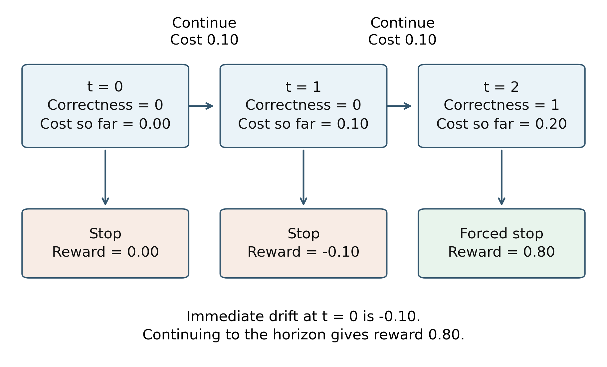
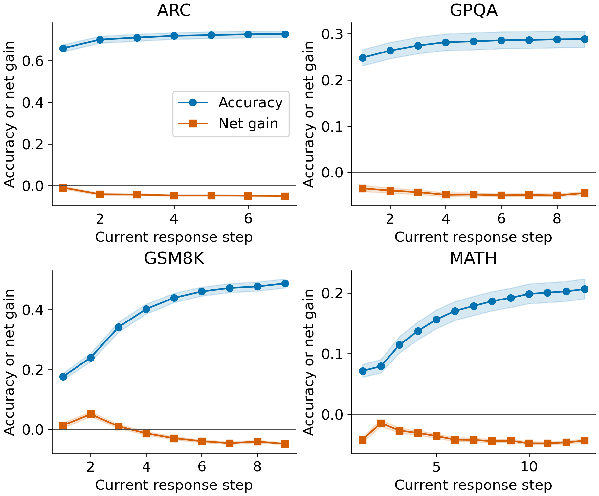
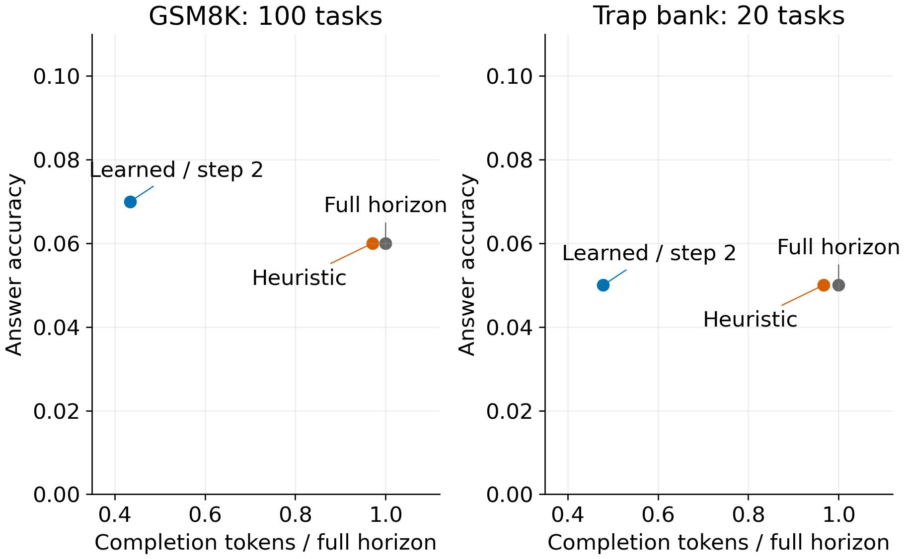

# Cost aware stopping boundaries in reasoning language models

by

Aditya Bhatt

A thesis submitted to Johns Hopkins University in conformity with the requirements for the degree of Master of Science

Baltimore, Maryland

October 2026

# Abstract

Additional response revisions can repair an answer, corrupt it, or consume computation without sufficient gain. This thesis studies stopping at complete-response boundaries using graded correctness and explicit computation cost. It derives repair-corruption drift, specializes finite-horizon optimal stopping, proves a sufficient persistence condition for a myopic rule, and gives a delayed-repair counterexample. Frozen experiments distinguish a variable-horizon matrix from a standardized corpus of 144,440 rows, 28,888 trajectories and 2,948 tasks. Matched estimator, token-cap and precision comparisons show protocol-specific trade-offs, including cases where greater estimator capacity or calibration reduces utility. An executed prefix controller prevents future generation. On 100 GSM8K questions its learned arm saves 56.51 percent of completion tokens with seven correct answers versus six at the full horizon; on twenty traps it saves 52.11 percent with one correct answer in each arm. Every learned live task stops at the two-response floor, so useful adaptation and accuracy noninferiority remain unestablished. The results support cost-sensitive stopping experiments with joint reporting of answer quality, physical cost and decision-time information.

Research adviser: Zerotti Woods

Second reader: Moustapha Pemy

# Chapter 1 Introduction and related work

## 1.1 Problem and research questions

Additional language-model reasoning can repair an answer, replace a correct answer, or consume computation without sufficient improvement. A useful stopping policy must balance answer quality against the cost of continuing. This thesis studies that trade-off at complete-response boundaries: a generator proposes an answer, receives a revision request, and may produce another candidate. These response-and-revision trajectories differ from tokens or latent thoughts within one uninterrupted reasoning process.

A final answer conceals earlier opportunities to stop and later opportunities to repair. Accordingly, the observational unit is an ordered trajectory, and a runtime decision uses only its available prefix. Correctness means agreement with the versioned reference grader. A repair changes an incorrect candidate to a correct one; a corruption makes the reverse transition. Neither label establishes that the preceding reasoning is mathematically valid.

The study asks three connected questions. How do repair and corruption determine the value of another response? When does a one-step drift rule agree with optimal stopping? Do controlled experiments and an actually executed controller support useful accuracy-cost trade-offs? Answer corruption, unproductive computation and policy regret are distinct outcomes: a policy can improve utility while losing accuracy, or stop before a valuable repair.

## 1.2 Prior work and contribution

Chain-of-thought prompting makes intermediate reasoning explicit [1]. Verifier training and process supervision evaluate completed answers or intermediate steps [2], [6]. Self-consistency aggregates sampled solutions, while Adaptive-Consistency adjusts their sampling budget [7], [19]. Successive revision instead conditions later responses on earlier work; its transition law, answer selector and acquisition costs need not match independent-path sampling.

Adaptive Computation Time and PonderNet learn internal halting decisions [16], [17]. CALM exits intermediate network layers while continuing token generation [18]. The overthinking literature and answer-convergence methods address excessive reasoning and termination within a chain of thought [8], [20]. REFRAIN uses a redundancy discriminator and an adaptive controller [21]; OS-Pruner applies accuracy-cost optimal stopping at paragraph boundaries [22]. These are substantial antecedents. This thesis studies complete-response revision under its own generation, selection, grading and cost conventions, rather than claiming to originate learned halting or optimal stopping.

Finite-horizon stopping theory distinguishes immediate gain from conditional continuation value [11], [12]. The mathematical contribution here is its explicit specialization to graded response trajectories: the repair-corruption identity, a sufficient persistence condition for a myopic rule, and counterexamples when that condition fails. The empirical contribution is a set of matched contrasts, including negative findings, and a measured runtime implementation. Prior methods were not reproduced under a shared protocol, so comparative superiority is untested.

The fitted models use sigmoid calibration [23], [24]. Calibration on archived prefixes does not establish conditional probabilities under a changed live prompt or stopping-induced distribution. Likewise, bounded-observation concentration and confidence sequences require their stated assumptions [13], [14]; an arbitrary confidence threshold or repeatedly consulted bootstrap interval does not inherit those guarantees.

The main result is deliberately limited. Continuation value varies across recorded model-domain panels, and improvements in detector ranking need not improve stopping utility. The live prototype avoids future generation, but its learned rule stops at the two-response floor on every evaluated task. Those savings establish a reduced budget on the observed panels; they do not establish useful adaptation or accuracy noninferiority.

## 1.3 Organization and supporting material

Chapter 2 develops the mathematical argument. Chapter 3 defines the data, methods and evaluation contracts; Chapter 4 reports results; Chapter 5 discusses their implications. The preserved extended v5 manuscript supplies full proofs, calibration and uncertainty bounds, complete rosters, additional analyses and reproduction details. This concise thesis retains the argument and evidence needed for its stated conclusions; it performs no new collection or training.

# Chapter 2 Mathematical formulation

## 2.1 Information, answers and computation cost

Fix a finite integer response horizon $N\ge0$ and earliest permitted stop $m\in\{0,\ldots,N\}$ on a probability space $(\Omega,\mathcal A,\mathbb P)$. Let $H_t$ contain the observations available after response $t$, and define $\mathcal F_t=\sigma(H_0,\ldots,H_t)$. The selected candidate $A_t=a_t(H_0,\ldots,H_t)$ is the answer the specified measurable causal selector emits if stopping at $t$. For domain $d$, reference $Y^*$ and measurable binary grader $g_d$, put

$$C_t=g_d(A_t,Y^*)\in\{0,1\},\qquad q_t=\mathbb E[C_t\mid\mathcal F_t].$$

The selector and grader are fixed within a comparison. Changing either changes the endpoint. Offline reference labels, future revisions and future peer outputs are excluded from runtime inputs. Completed peer or verifier observations may enter the filtration only after their costs have been incurred.

Statistical information does not model computational difficulty. If the reference is a deterministic measurable function of a fully observed task, correctness can be $\mathcal F_t$-measurable and $q_t=C_t$. Nondegenerate conditional uncertainty requires a latent-reference model or a coarser filtration to which admissible policies are restricted. A fitted prefix score does not establish the true posterior given all task semantics.

An admissible stop time satisfies $m\le\tau\le N$ and $\{\tau\le t\}\in\mathcal F_t$. Let $K_t$ be nonnegative, nondecreasing, adapted and integrable cumulative cost, including every executed generation, peer and probe call. The objective is

$$\sup_{\tau}\mathbb E[C_\tau-K_\tau].$$

Define the observable reward $G_t=q_t-K_t$ and expected incremental cost $c_t=\mathbb E[K_{t+1}-K_t\mid\mathcal F_t]$. Previously incurred common costs are sunk for the continuation decision, while total reported policy cost still includes them.

**Lemma 1.** For every admissible stop, $\mathbb E[C_\tau-K_\tau]=\mathbb E[G_\tau]$.

**Proof.** Since $\{\tau=t\}\in\mathcal F_t$, conditional expectation gives $\mathbb E[\mathbf1_{\{\tau=t\}}C_t]=\mathbb E[\mathbf1_{\{\tau=t\}}q_t]$. Sum over the finite set $t=m,\ldots,N$ and subtract expected cost. □

A potential full trajectory can support replay only when stopping leaves the law of its preceding prefixes unchanged. Shared-prefix agreement is therefore checked in the live experiments, rather than inferred from deterministic sampling alone.

## 2.2 Repair-corruption drift

For $t<N$, define conditional repair and corruption probabilities

$$\alpha_t=\mathbb P(C_{t+1}=1\mid C_t=0,\mathcal F_t),\qquad \beta_t=\mathbb P(C_{t+1}=0\mid C_t=1,\mathcal F_t).$$

Where an at-risk event has conditional probability zero, its hazard can be assigned an arbitrary version; the corresponding weighted term is zero. Splitting next-step correctness by current correctness gives

$$\mathbb E[C_{t+1}\mid\mathcal F_t]=(1-q_t)\alpha_t+q_t(1-\beta_t).$$

The tower property also gives $\mathbb E[q_{t+1}\mid\mathcal F_t]=\mathbb E[C_{t+1}\mid\mathcal F_t]$. Consequently,

$$\mu_t:=\mathbb E[G_{t+1}-G_t\mid\mathcal F_t]=(1-q_t)\alpha_t-q_t\beta_t-c_t.$$

This is an exact binary-reward identity. Empirical repair probability divides repair events by currently incorrect candidates; corruption probability divides by currently correct candidates. Dividing each event count by all eligible trajectories instead gives its joint frequency. Their frequency difference is the accuracy change on a common panel. A higher conditional corruption hazard can coexist with more repairs when incorrect candidates are more numerous.

The historical step penalty is $0.05$ per additional response. It defines a utility convention, rather than a monetary or energy conversion. Positive accuracy change can therefore accompany negative net utility gain. Population accuracy and estimated drift also differ from a conditional decision for one prefix.

## 2.3 Finite-horizon optimum

The standard Bellman/Snell construction [11], [12] sets

$$V_N=G_N,\qquad V_t=\max\{G_t,\mathbb E[V_{t+1}\mid\mathcal F_t]\},\quad m\le t<N.$$

**Theorem 1.** The earliest permitted time with $V_t=G_t$, denoted $\tau_V$, is optimal and attains $\mathbb E[V_m]$.

**Proof.** Backward induction bounds the conditional reward of any admissible continuation from $t+1$ by $V_{t+1}$. At $t$, stopping yields $G_t$ and continuing yields at most its conditional expectation; their maximum is $V_t$. The bound is attained by stopping at equality and otherwise following the attaining policy from the next step. The hitting event is measurable because $G_t$ and $V_t$ are adapted; finite $N$ ensures termination. Integrability follows from bounded binary rewards and integrable $K_N$. Lemma 1 transfers the result to the original reward. □

The continuation term includes all later opportunities and permitted information. The recursion is not generally a threshold on $q_t$ alone: identical correctness beliefs can accompany different future repair laws or costs. A fitted one-step predictor supplies an approximation, not the conditional multi-step law used by the theorem.

## 2.4 A conditional myopic rule and its failure

Let $\tau_\mu=\inf\{t\ge m:t<N,\ \mu_t\le0\}\wedge N$, using infinity when the crossing set is empty. Suppose nonpositive true drift persists after this first crossing:

$$\mathbf1_{\{\tau_\mu\le t\}}\mu_t\le0\quad\text{almost surely for every }t<N.$$

**Theorem 2.** Under this persistence condition, $\tau_\mu$ is optimal.

**Proof.** Before the crossing, $G_t<\mathbb E[G_{t+1}\mid\mathcal F_t]\le\mathbb E[V_{t+1}\mid\mathcal F_t]$, so stopping cannot be optimal. After the crossing, the condition makes reward a supermartingale on the remaining phase. Finite conditional optional sampling bounds every later admissible reward by the reward at the crossing. Stopping there attains that bound. □

Persistence is substantive and is not established by the observed curves or fitted heads. A deterministic delayed-repair example has $N=2$, $m=0$, correctness $(0,0,1)$ and cumulative costs $(0,0.10,0.20)$. Immediate drift at zero is $-0.10$, yet continuing to the horizon yields reward $0.80$. The first nonpositive drift rule stops too early; drift subsequently becomes positive and violates persistence.

**Figure 1. Delayed repair defeats a myopic rule.** The horizon-two example permits stopping at zero. Its first negative drift precedes a later repair; the true persistence condition fails. This theoretical floor differs from the live floor of two.

The example uses a different floor from the live experiments' $m=2$. It establishes a mathematical failure mode, not an estimate of its frequency in deployed models. The extended manuscript provides a second adaptive-information counterexample, calibration and perturbation bounds, and assumptions for sequential certificates. None supplies an unconditional optimality or per-instance safety guarantee for the implemented controller.

# Chapter 3 Experimental methods

## 3.1 Corpora, models and labels

Two separately defined collections support the analysis. The variable-horizon model-domain matrix contains 798,770 raw saved rows and 75,965 sanitized trajectories over 52 cells. Its boundary and matched policy analyses distinguish malformed raw records from eligible trajectories. The standardized detector corpus has 144,440 rows, 28,888 five-response trajectories and 2,948 task identifiers (Table 1). The collections overlap in benchmark questions and are not independent replications; their counts must not be added.

**Table 1. Standardized five-step corpus.**

| Domain | Effective split | Tasks | Trajectories | Rows |
| --- | --- | --- | --- | --- |
| GSM8K | train | 1,000 | 8,064 | 40,320 |
| MATH-500 | test | 500 | 6,500 | 32,500 |
| ARC-Challenge | test | 1,000 | 8,500 | 42,500 |
| GPQA main | train (inferred; request test) | 448 | 5,824 | 29,120 |
| Total | four domains | 2,948 | 28,888 | 144,440 |

The thirteen-model matrix spans DeepSeek, Qwen, InternLM, Llama, Mistral, Phi and Yi. The detector roster replaces InternLM3-8B with Qwen3.5-9B. The historical `mistral_small_24b_2409` alias denotes the recorded 22B model. Complete identifiers, sampling settings, seeds and response horizons are in the preserved extended methods and cell metadata. Architecture, training and tokenization are not randomized; a family or scale association is not an isolated parameter-count effect.

GSM8K, MATH, ARC-Challenge and GPQA define the four task domains [2], [3], [4], [5]. Standardized GPQA metadata requests `test`, but the current loader uses `train` and saved identities use `gpqa_main`. Its effective split is inferred because the executed historical loader is unrecorded. Table 1 reports both interpretations. Detector task holdouts can come from benchmark training splits and are distinct from official benchmark test evaluation.

Each increment is a complete generated response followed, if permitted, by a revision prompt. Grading uses numeric extraction, symbolic-equivalence checks or the displayed MCQ ordering. The primary historical tables retain archived labels; predictor training separately versions candidate reconstruction and regrading. Parser regression coverage addresses specified cases, while corpus-wide semantic label validity remains unestablished.

## 3.2 Experimental units and comparisons

Rows within a trajectory and trajectories sharing a task are dependent. Source-qualified cell/run keys identify trajectories; task-disjoint folds keep a question's rows together. Strict tabular, text and portable-prefix fits follow their recorded task-disjoint contracts. Some earlier hazard probes instead use upstream run-group folds followed by task-group threshold folds, allowing other-temperature versions of a question into upstream fitting. Their controlled contrasts retain development scope.

Matched estimator comparisons resample the recorded 52 cells; paired systems comparisons and population transitions resample task clusters, conditional on the fixed model panel. One generation seed per setting leaves seed variability largely unmeasured. Repeated configuration selection can also turn a held-out panel into development data. Ten thousand bootstrap draws resample existing observations rather than create independent generations.

Accuracy is the mean grader label of the selected answer. Historical step utility is $C_{i,\tau_i}-0.05(\tau_i-1)$; token utility uses $C_{i,\tau_i}-0.0002\sum_{s=1}^{\tau_i}L_{i,s}$. Thus 250 completion tokens carry the same penalty as one response increment under this convention. Actual savings use one minus the ratio of total stopped completion tokens to total baseline completion tokens. Prompt processing, scoring, peers, timing and energy are distinct costs; a stopped-step index alone cannot establish physical savings.

ROC-AUC assesses ranking, Brier loss probability error. Causal sequence baselines include gated recurrent units [9] and transformers with rotary position embeddings [10]. High pooled AUC or marginal calibration does not establish conditional continuation probabilities, a unique architecture winner or useful stopping utility.

## 3.3 Runtime policies and fitting

The controller consumes completed responses in order, enforces a two-response floor and five-response horizon, records selected answers and costs, and rejects later input after stopping. The adapter requests another response only after a continue decision, so termination prevents future model calls. Reference labels and future-step scores are excluded. Optional peer observations require a completed same-step roster and charged generation costs; no substantial live thirteen-peer experiment is reported.

A frozen confidence/stability heuristic is compared with the full horizon. Confidence is uncalibrated; optional prior-answer retention branches did not fire in the live panels. The learned rule selects the latest nonempty candidate and estimates current correctness $\widehat q_t$ and next-selected correctness $\widehat p_{t+1}$. It stops at the first eligible nonpositive $\widehat p_{t+1}-\widehat q_t-0.05$, or at the horizon. This fitted myopic rule is not the Bellman policy.

Fitting uses 1,500 archived Qwen2.5-0.5B GSM8K/MATH trajectories, comprising 7,500 rows. Task hashes allocate 902 tasks to fitting, 322 to calibration and 276 to evaluation. Scalers and unweighted logistic heads use fitting tasks; Platt mappings use calibration tasks [23]. All rows of a task share a partition, and the live/trap identities are excluded. Prefix features include step, tokens, answer changes, thought-text summaries and domain, without future-trajectory filtering.

Reconstruction changes 4,269 candidate strings but only 43 correctness labels; the versioned training audit preserves the original corpus. None of the 7,500 archive outputs meets the live JSON contract, leaving confidence and strict-parsing features without archive variation. Live prompts and EOS-inclusive token accounting differ. Archive calibration therefore does not establish transport to live generation.

## 3.4 Paired evaluation and uncertainty

Actual paired executions use Qwen2.5-0.5B-Instruct [25] on 100 GSM8K questions and twenty prespecified traps, with separately stored public prompts, reference keys and event ledgers. Tasks already observed during corpus development remain development tasks. Active/full arms are executed separately; shared-prefix agreement is measured because batching and kernels can change greedy outputs.

For $n\ge1$ iid task pairs, let $I$ flag baseline incorrect/active correct and $W$ baseline correct/active incorrect. Write $\pi_I=\Pr(I=1)$ and $\pi_W=\Pr(W=1)$, so $\delta=\pi_I-\pi_W$ is the accuracy difference. Their marginal counts are binomial but the within-pair indicators are not assumed independent. Exact two-sided 97.5% Clopper-Pearson bounds $[L_I,U_I]$ and $[L_W,U_W]$ for the respective marginal probabilities [15] have joint coverage at least 95% by a union bound; subtraction gives

$$\delta\in[L_I-U_W,\ U_I-L_W].$$

No discordances still leave nonzero uncertainty, with each marginal upper bound $1-0.0125^{1/n}$. No noninferiority margin was prespecified. Token intervals bootstrap paired tasks and the ratio of totals. The handpicked traps form a fixed challenge bank; iid-reference intervals do not provide randomized coverage of an adversarial population.

# Chapter 4 Results

## 4.1 Population continuation value

On the pooled GSM8K transition panel, step two has accuracy 0.2401. Repairs occur in 3,145 of 14,818 currently incorrect candidates, and corruptions in 1,170 of 4,682 correct candidates. Repairs are more numerous despite the lower conditional repair hazard. After the 0.05 penalty, next-step net gain is approximately 0.0513. At step four, accuracy still increases by about 0.0373, but net gain is approximately -0.0127: improving accuracy need not justify its cost.

Each transition panel contains 500 task clusters and 19,500 eligible trajectories. Figure 2 reports task-cluster intervals conditional on the observed models and temperatures. These population estimates do not certify correctness of an individual answer or identify its optimal stopping time.

**Figure 2. Population accuracy and continuation gain.** Bands are task-cluster bootstrap intervals. The horizontal line marks zero net gain, not zero accuracy. Panel crossings do not identify an optimal action for every prefix.

Recorded crossings differ by cell. Qwen2.5-7B/GSM8K has positive net gain at step four (0.0193) and negative gain at five (-0.0253); Qwen2.5-32B/MATH remains positive at five (0.0187) and negative at six (-0.0133). Each cell contains 1,500 trajectories over 500 questions. Later positive gains can follow a negative crossing, so a hindsight crossing is descriptive rather than an admissible stopping rule or universal scale law.

## 4.2 Controlled contrasts and retrospective diagnostics

Table 2 normalizes matched effects per trajectory rather than interpreting summed utility as accuracy percentage points. Empirical-Bayes hazards improve recorded utility relative to cell-local logistic hazards, while gradient boosting and isotonic calibration reduce it relative to their controls. Better capacity or calibration can therefore worsen this stopping objective under the tested estimator, target, sample and threshold.

**Table 2. Controlled development contrasts. Estimator intervals resample 52 cells; token-cap/precision intervals resample 500 task clusters. Utility means are per trajectory; accuracy and risk differences are proportions.**

| Matched contrast | Endpoint | Mean effect | 95% interval |
| --- | --- | --- | --- |
| Threshold, held-out cell | Step utility | +0.01210 | [+0.00522, +0.01907] |
| Threshold, held-out model | Step utility | +0.01286 | [+0.00683, +0.01911] |
| Gradient boosting | Step utility | -0.05694 | [-0.08716, -0.03145] |
| Isotonic calibration | Step utility | -0.06165 | [-0.09168, -0.03547] |
| Lagged logistic | Step utility | +0.00331 | [+0.00062, +0.00633] |
| Empirical-Bayes hazards | Step utility | +0.00781 | [+0.00276, +0.01355] |
| Step-two churn | Step utility | +0.00210 | [+0.00049, +0.00403] |
| 512 versus 256 tokens | Loss risk | +0.00000 | [+0.00000, +0.00000] |
| BF16 versus 4-bit | Accuracy | +0.14267 | [+0.11133, +0.17533] |

The matched 256/512-token comparison gives 454 policy losses among 1,500 trajectories in each arm, with no discordant loss indicators. Its zero contrast and degenerate bootstrap concern that binary verdict; answers and token counts may still differ. The Qwen2.5-7B precision comparison gives 418/1,500 correct step-two answers under BF16 versus 204 under 4-bit weights, an absolute 14.27-percentage-point contrast. Neither result generalizes to every token cap or quantized model.

Strict task-grouped tabular/text saved OOF AUCs are 0.849510/0.808976 and include their original task-disjoint calibration. The causal GRU has micro AUC 0.8743 and worst-domain GPQA AUC 0.6313. Within-task AUC is defined for only 2,679 of 2,948 tasks with mixed labels. These grouped summaries describe ranking; they do not establish a statistically unique model winner or calibrated live policy.

The historical stacked AUC 0.955156 is a non-nested retrospective diagnostic. Its bidirectional component and centered smoothing use future steps; upstream meta-training is not confined to each outer training partition. Its reduced-feature control also retains vote aggregates. Consequently, the result neither isolates causal peer value nor qualifies as an online predictor. Positive lifts in all 10,000 bootstrap draws do not repair those dependencies or constitute independent-generation evidence.

Development replay on 1,500 Qwen2.5-7B/GSM8K traces saves 54.34% of completion tokens while accuracy falls from 70.53% to 64.20%, a 6.33-percentage-point loss. Fitting and evaluation reuse the same cell, so this is a development diagnostic.

The broader archived failure audit partitions 5,735 utility losses among 75,965 trajectories. Every loss stops incorrectly and ends correctly, with 48.35% first reaching an eligible correct answer at least two steps later. This supports delayed-repair as a practical failure mode, conditional on the archived labels and policy. It is not an impossibility result for all online predictors. Full taxonomies and qualified peer/selected-answer analyses remain in the extended report.

## 4.3 Actual stopping execution

Table 3 reports physically generated responses, not tokens inferred solely from stopped-step indices. The heuristic provides small savings with weak absolute accuracy. The learned rule stops all 120 live/trap tasks at response two, giving substantially larger savings but no demonstrated adaptive advantage over a fixed-two budget. Accuracy-change intervals permit meaningful losses and establish neither superiority nor noninferiority.

**Table 3. Actual paired generation. Tokens count completions. Accuracy intervals use the conservative iid-reference calculation; saving intervals bootstrap paired tasks. Traps are handpicked. Learned rows reuse the previously generated baseline, rather than adding independent baseline collections.**

| Panel / policy | n | Accuracy (%) full / stopped | Tokens full / stopped | Saving (%) [95% CI] | Change (pp) [95% CI] | Prefix match |
| --- | --- | --- | --- | --- | --- | --- |
| GSM8K, heuristic | 100 | 6% / 6% | 22,244 / 21,591 | 2.94% [0.85, 5.63] | [-4.29, +4.29] | 94/100 |
| Traps, heuristic | 20 | 5% / 5% | 4,736 / 4,578 | 3.34% [0.00, 8.80] | [-19.68, +19.68] | 20/20 |
| GSM8K, learned | 100 | 6% / 7% | 22,244 / 9,674 | 56.51% [54.83, 58.01] | [-4.27, +6.21] | 100/100 |
| Traps, learned | 20 | 5% / 5% | 4,736 / 2,268 | 52.11% [45.86, 57.17] | [-19.68, +19.68] | 20/20 |

Only 88/500 main baseline responses and 14/100 trap baseline responses satisfy the strict JSON contract. Malformed outputs remain in denominators. Heuristic shared prefixes agree on 94/100 main pairs, limiting exact continuation interpretation; all learned main and trap prefixes agree. Trap results concern a small prespecified challenge bank, not broad adversarial robustness.

Completion savings are not total-cost guarantees. Learned main prompt tokens fall from 142,498 to 43,874; prompt-plus-completion savings are 67.50%, and measured model time falls from 1,127.05 to 343.25 seconds. Trap prompt-plus-completion savings are 67.93%. There are no verifier or peer generations. Batching, padded slots and environment-specific timing remain separately recorded; energy was not measured.

On 4,000 decisions from repeated actual baseline prefixes, learned-controller latency has median 0.059 ms, p99 0.3143 ms and maximum 0.9369 ms. It includes extraction, both heads, calibration, validation and drift; it excludes loading, generation, tokenization and peer waits. The observed maximum meets the under-ten-millisecond decision target, without guaranteeing unchanged end-to-end latency.

**Figure 3. Actual paired answer quality and completion cost.** Learned points stop at two on every task and provide no demonstrated adaptation beyond that fixed budget. Point estimates omit intervals, reported in Table 3.

Held-out archive replay is also nearly fixed: 275 of 276 tasks stop at two and one at three. Accuracy is 11.96% versus 10.51% at the full horizon, with paired interval [-1.45, +4.35] percentage points; replayed token saving is 51.29%, interval [49.31, 53.09]%. This produces an inspectable causal fitted artifact, while providing little evidence that its predictions add useful adaptation beyond the floor.

# Chapter 5 Discussion and conclusion

## 5.1 Interpretation and limitations

The theoretical and experimental results answer different parts of the stopping question. Binary transitions make improvement and deterioration measurable. Bellman continuation values account for later repair opportunities; a one-step sign rule is optimal only under additional structure. Controlled comparisons show that improved ranking and increased estimator complexity need not improve policy utility. Actual execution confirms avoided generation, but the learned rule's uniform two-response stopping is a budget reduction rather than evidence of adaptive reasoning allocation.

The frozen grader defines the measured endpoint. Numeric parsing, symbolic domain restrictions and benchmark references can still be wrong; a correct MCQ option can accompany an invalid rationale. Regression tests cover specified cases, while semantic label validity requires independent adjudication. Primary labels and reconstructed predictor targets are separate versions, and changes require a new census and dependent analysis.

A classifier estimates the required conditional probability only under assumptions about its inputs, target, sampling and calibration. Class-balanced losses can target reweighted distributions. Marginal archive calibration, particularly under a different JSON prompt and token contract, does not validate live-prefix probabilities. Likewise, a question-level interval differs from a time-uniform certificate along one trajectory. The mathematics states its assumptions; the prototype supplies empirical evidence under its own contract.

The model panel, prompts, temperatures, grader and single generation seed define the observed population. Task-held-out folds cannot rule out benchmark exposure during pretraining, and repeated development can exhaust a holdout's independence. Stronger confirmation requires a frozen policy, feature contract, prespecified accuracy tolerance and justified sample size on untouched tasks. The handpicked traps and one small live model do not establish transfer across reasoning-specialized models or adversarial populations.

Response termination also differs from early layer exit or within-chain truncation. Every comparison must charge the resources actually executed: prompts, completions, probes, peers and scheduling. Thirteen peer generators can make a shorter target response more expensive than a single-model baseline. A prospective peer-fleet policy needs timestamped generation and a complete cost ledger; the archived peer scores and small smoke ledgers do not establish one.

## 5.2 Reproducibility and conclusion

The original `data_manifest_v1.json` and post-review `data_manifest_post_review_v1.json` preserve the research corpus and executed live source copies. Hashes establish selected artifact identity, not honest original generation, correct labels or representative sampling. Exact historical GPU regeneration is not established by a workstation lock. The [extended v5 report and source/evidence map](https://github.com/bhattadiCS/research-thesis-overthinking-boundary/blob/df03265cfe3b9bf4b1ee66061d81ef5796375be0/ThesisDocs/CURRENT_FORMAL_THESIS.md) retain complete proofs and bounds, all seventeen scientific tables, six figures, additional predictor results and isolated reanalysis commands. Legacy peer executable-source provenance remains partial and is explicitly qualified there.

The study supports protocol-specific stopping experiments that jointly measure quality, cost and decision-time information. It establishes the conditional mathematical argument, matched positive and negative findings, and a causal runtime implementation. Its live savings accompany weak accuracy and a nearly fixed budget, leaving adaptive benefit and accuracy noninferiority unestablished. These limitations are part of the research result and define the independent evidence needed for stronger claims.

The concise manuscript is the primary thesis. The preserved extended report supplies supporting technical detail and previous-version audit receipts; it is not an additional independent experiment. Both are available with the versioned repository publication. No data recollection, regrading, training or model generation was performed for this editorial revision.

# References

[1] Wei, J., Wang, X., Schuurmans, D., Bosma, M., Ichter, B., Xia, F., Chi, E., Le, Q. V., and Zhou, D. (2022). Chain-of-Thought Prompting Elicits Reasoning in Large Language Models. NeurIPS 35. https://arxiv.org/abs/2201.11903

[2] Cobbe, K., Kosaraju, V., Bavarian, M., Chen, M., Jun, H., Kaiser, L., Plappert, M., Tworek, J., Hilton, J., Nakano, R., Hesse, C., and Schulman, J. (2021). Training Verifiers to Solve Math Word Problems. https://arxiv.org/abs/2110.14168

[3] Hendrycks, D., Burns, C., Kadavath, S., Arora, A., Basart, S., Tang, E., Song, D., and Steinhardt, J. (2021). Measuring Mathematical Problem Solving With the MATH Dataset. Proceedings of the Neural Information Processing Systems Track on Datasets and Benchmarks, 1. https://datasets-benchmarks-proceedings.neurips.cc/paper_files/paper/2021/hash/be83ab3ecd0db773eb2dc1b0a17836a1-Abstract-round2.html

[4] Clark, P., Cowhey, I., Etzioni, O., Khot, T., Sabharwal, A., Schoenick, C., and Tafjord, O. (2018). Think You Have Solved Question Answering? Try ARC, the AI2 Reasoning Challenge. https://arxiv.org/abs/1803.05457

[5] Rein, D., Hou, B. L., Stickland, A. C., Petty, J., Pang, R. Y., Dirani, J., Michael, J., and Bowman, S. R. (2023). GPQA: A Graduate-Level Google-Proof Q&A Benchmark. COLM 2024. https://arxiv.org/abs/2311.12022

[6] Lightman, H., Kosaraju, V., Burda, Y., Edwards, H., Baker, B., Lee, T., Leike, J., Schulman, J., Sutskever, I., and Cobbe, K. (2023). Let's Verify Step by Step. ICLR 2024. https://arxiv.org/abs/2305.20050

[7] Wang, X., Wei, J., Schuurmans, D., Le, Q., Chi, E., Narang, S., Chowdhery, A., and Zhou, D. (2022). Self-Consistency Improves Chain of Thought Reasoning in Language Models. ICLR 2023. https://arxiv.org/abs/2203.11171

[8] Chen, X., Xu, J., Liang, T., He, Z., Pang, J., Yu, D., Song, L., Liu, Q., Zhou, M., Zhang, Z., Wang, R., Tu, Z., Mi, H., and Yu, D. (2024). Do NOT Think That Much for 2+3=? On the Overthinking of o1-Like LLMs. https://arxiv.org/abs/2412.21187

[9] Cho, K., van Merrienboer, B., Gulcehre, C., Bahdanau, D., Bougares, F., Schwenk, H., and Bengio, Y. (2014). Learning Phrase Representations Using RNN Encoder-Decoder for Statistical Machine Translation. EMNLP, 1724-1734. https://aclanthology.org/D14-1179/

[10] Su, J., Lu, Y., Pan, S., Murtadha, A., Wen, B., and Liu, Y. (2021). RoFormer: Enhanced Transformer with Rotary Position Embedding. https://arxiv.org/abs/2104.09864

[11] Ferguson, T. S. Optimal Stopping and Applications. UCLA electronic text. Chapters 3 and 5. https://www.math.ucla.edu/~tom/Stopping/sr3.pdf and https://www.math.ucla.edu/~tom/Stopping/sr5.pdf

[12] Peskir, G., and Shiryaev, A. (2006). Optimal Stopping and Free-Boundary Problems. Birkhauser, Lectures in Mathematics ETH Zurich. https://doi.org/10.1007/978-3-7643-7390-0

[13] Hoeffding, W. (1963). Probability Inequalities for Sums of Bounded Random Variables. Journal of the American Statistical Association 58(301), 13-30. https://doi.org/10.1080/01621459.1963.10500830

[14] Howard, S. R., Ramdas, A., McAuliffe, J., and Sekhon, J. (2021). Time-uniform, nonparametric, nonasymptotic confidence sequences. Annals of Statistics 49(2), 1055-1080. https://doi.org/10.1214/20-AOS1991

[15] Clopper, C. J., and Pearson, E. S. (1934). The Use of Confidence or Fiducial Limits Illustrated in the Case of the Binomial. Biometrika 26(4), 404-413. https://doi.org/10.1093/biomet/26.4.404

[16] Graves, A. (2016). Adaptive Computation Time for Recurrent Neural Networks. arXiv:1603.08983. https://arxiv.org/abs/1603.08983

[17] Banino, A., Balaguer, J., and Blundell, C. (2021). PonderNet: Learning to Ponder. 8th ICML Workshop on Automated Machine Learning; arXiv:2107.05407. https://arxiv.org/abs/2107.05407

[18] Schuster, T., Fisch, A., Gupta, J., Dehghani, M., Bahri, D., Tran, V. Q., Tay, Y., and Metzler, D. (2022). Confident Adaptive Language Modeling. Advances in Neural Information Processing Systems 35. https://papers.neurips.cc/paper_files/paper/2022/hash/6fac9e316a4ae75ea244ddcef1982c71-Abstract-Conference.html

[19] Aggarwal, P., Madaan, A., Yang, Y., and Mausam. (2023). Let's Sample Step by Step: Adaptive-Consistency for Efficient Reasoning and Coding with LLMs. Proceedings of the 2023 Conference on Empirical Methods in Natural Language Processing, 12375-12396. https://aclanthology.org/2023.emnlp-main.761/

[20] Liu, X., and Wang, L. (2025). Answer Convergence as a Signal for Early Stopping in Reasoning. Proceedings of the 2025 Conference on Empirical Methods in Natural Language Processing, 17896-17907. https://aclanthology.org/2025.emnlp-main.904/

[21] Sun, R., Cheng, W., Li, D., Chen, H., and Wang, W. (2026). Stop When Enough: Adaptive Early-Stopping for Chain-of-Thought Reasoning. Proceedings of the 64th Annual Meeting of the Association for Computational Linguistics (Volume 1: Long Papers), 27250-27268. https://aclanthology.org/2026.acl-long.1256/

[22] Ehab, M., El Gadarri, A., Farias, V. F., Jozefiak, A., and Moallemi, C. C. (2026). OS-Pruner: Pruning Chains-of-Thought of Reasoning Models via Optimal Stopping. arXiv:2607.11089, preprint. https://arxiv.org/abs/2607.11089

[23] Platt, J. C. (2000). Probabilities for SV Machines. In A. J. Smola, P. Bartlett, B. Schölkopf, and D. Schuurmans (eds.), Advances in Large-Margin Classifiers, 61-74. MIT Press. https://doi.org/10.7551/mitpress/1113.003.0008

[24] Guo, C., Pleiss, G., Sun, Y., and Weinberger, K. Q. (2017). On Calibration of Modern Neural Networks. Proceedings of the 34th International Conference on Machine Learning, Proceedings of Machine Learning Research 70, 1321-1330. https://proceedings.mlr.press/v70/guo17a.html

[25] Qwen Team. (2024). Qwen2.5 Technical Report. arXiv:2412.15115, first submitted December 19, 2024; revised January 3, 2025. https://arxiv.org/abs/2412.15115. Official Qwen2.5-0.5B-Instruct model card (accessed October 4, 2026): https://huggingface.co/Qwen/Qwen2.5-0.5B-Instruct
