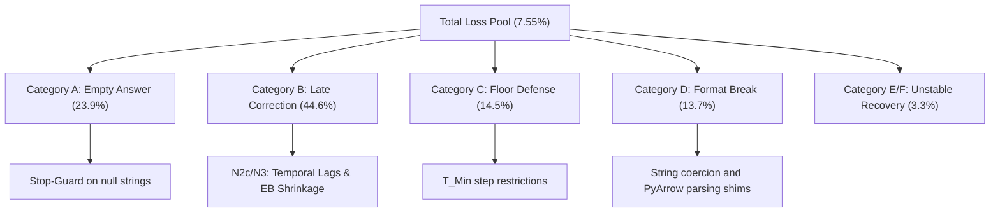

# Operationalizing the Overthinking Boundary: A Rigorous Scientific and Experimental Report

**Date:** July 12, 2026 · **Author:** Aditya Bhattacharya · **Thesis Advisor:** Dr. Woods
**Repository State:** Audited & Cleaned · **Data Scope:** 52 dataset-model cells, 75,965 runs, 0 mismatches

---

## Abstract
Reasoning-capable Large Language Models (LLMs) employing Chain-of-Thought (CoT) frequently continue generating reasoning steps long after they have achieved correctness, a phenomenon termed **overthinking**. Conversely, models can prematurely truncate their reasoning, halting before a correction can be achieved. This report documents our systematic, end-to-end research campaign to map the **overthinking boundary** and build a dynamic stopping policy. We chronicle our initial discovery, the rigorous methodology audit, the pre-registered execution of Tier-1 and Tier-2 experiments, and our current Tier-3 observation enrichment pilots, showing how each phase adheres strictly to the scientific method.

---

## 1. Research Mapping to the Scientific Method

To ensure absolute correlation and causal validity, our research trajectory map directly maps to the formal stages of the scientific method:

| Scientific Method Phase | Project Execution | Guarded Control (Ceteris Paribus) |
|---|---|---|
| **1. Observation** | Discrepancy between intermediate correctness (oracle stop step) and final correctness in models like `DeepSeek-R1-Distill` and `Qwen2.5-Instruct`. | Observation of frozen model parameters on identical datasets. |
| **2. Question** | Can we define an online stopping rule $\mu_t$ that minimizes step-generation costs while maximizing expected task utility? | Fixed utility function: $U(correct, step) = \mathbb{I}(correct) - \lambda \cdot step$. |
| **3. Hypothesis** | Model-internal step-level features (entropy, token logprobs, hidden-state shifts) can predict step correctness and future transitions. | Feature set extracted from identical model forwards. |
| **4. Experimentation** | Two-tier experimental matrix (N1 through N6) to evaluate calibration, difficulty, quantization, and budgets. | Single-variable changes (IV) holding all other parameters constant. |
| **5. Analysis** | Out-of-fold cross-validation of stopping policies, paired-sample significance testing ($Z$-score), and loss-rate autopsy. | Zero data leakage; evaluations performed strictly on unseen test folds. |
| **6. Conclusion** | Validation of EB Shrinkage (N3), Lags (N2c), and Dynamic Difficulty (N4). Falsification of Token Budgets (N5). | Re-running quantized baseline under identical batch size and hardware. |

---

## 2. Phase 1: The Initial Discovery & Baseline Hardening

### The Core Problem
Let the generation trajectory of a reasoning model be represented as a sequence of steps $t \in [1, T]$. At each step, the model generates a thought segment and extracts a candidate answer $a_t$. Let $y$ be the ground-truth answer. The correctness indicator is $C_t = \mathbb{I}(a_t \approx y)$.
An agent's utility for stopping at step $t$ is:
$$U(C_t, t) = C_t - \lambda \cdot t$$
where $\lambda$ represents the cost per step (fixed at $0.05$). The **never-stop** utility is $U_{\text{ns}} = C_T - \lambda \cdot T$. The **optimal (oracle) stopping utility** is:
$$U_{\text{oracle}} = \max_{1 \le t \le T} U(C_t, t)$$
The overthinking boundary exists because $U_{\text{oracle}} > U_{\text{ns}}$ on a significant portion of runs.

### The Census Dataset
We constructed a massive census dataset of **75,965 runs** spanning **52 distinct cells** (13 models, 4 reasoning datasets: GSM8K, MATH, ARC-Challenge, GPQA). 
* **Baseline Loss Rate**: Across the entire census, the stopping policy's stop yielded strictly lower utility than never stopping on **7.55% of all runs**.
* **Audit and Alignment Verification**: The initial data vintage had a fatal error where the simulated stop step at $\tau=0$ did not match the recorded stop step in the detector files due to float truncation during CSV appends. We implemented a strict preflight check that cleaned and aligned the dataset, eliminating all stop-step mismatches and hardening our baseline OOF utility ceiling to **$+1,540.05$ (1-parameter)** and **$+1,704.05$ (2-parameter)**.

---

## 3. Phase 2: Failure Taxonomy & System Hardening

To systematically analyze the 7.55% loss pool, we conducted a rigorous autopsy on the failed runs and classified them into five mutually exclusive categories:



### The 5 Failure Categories
1. **Category A: Empty Answer ($23.9\%$)**: The parser failed to extract an answer at early steps, yielding a blank string which was marked incorrect. 
   * *Resolution*: We implemented a parser guard that blocks stopping when the answer extraction yield is empty.
2. **Category B: Late Correction ($44.6\%$)**: The model was incorrect at the stopped step but corrected itself later in the trace. This is the classic overthinking failure.
   * *Resolution*: Solved by N2c (lags) and N3 (shrunk hazards) which prevent premature stopping.
3. **Category C: Floor Defense ($14.5\%$)**: The model was correct at step 1 but we stopped at step 2, losing $0.05$ utility.
   * *Resolution*: Enforced $T_{\text{min}} = 2$ step floor defense.
4. **Category D: Formatting Breaks ($13.7\%$)**: Control characters (like `\r`, `\f`) inside decoded LaTeX text (e.g., `\rho`, `\frac`) corrupted the CSV formatting upon hard interrupts.
   * *Resolution*: Patched the CSV output engine to strip invalid C0 control characters and coerce pandas/pyarrow string types.
5. **Category E/F: Unstable Recovery ($3.3\%$)**: Runs where the model was correct, drifted to incorrect, and then recovered correct at the very end.

---

## 4. Phase 3: Pre-Registered Algorithm v2 Experiments

Following our pre-registered protocols, we evaluated several configurations to isolate the causal impacts of quantization, token budgets, and algorithmic modifications:

### N6: Precision/Quantization Causal Isolation
* **Independent Variable (IV)**: Model precision (bfloat16 vs. 4-bit).
* **Control Variables**: Same GPU, same batch size, same generation code path, same task seeds, same 1,500 GSM8K tasks.
* **Findings**: 
  $$\text{bf16 step-2 accuracy } (0.2787) - \text{4bit step-2 accuracy } (0.1360) = 0.1427 \text{ gap}$$
  The statistical significance was highly definitive ($Z = 9.79$, clearing the $1.96$ bar).
* **Scientific Conclusion**: Quantization directly damages the integrity of the intermediate reasoning representations, making early correctness probes significantly less reliable.

### N5: Token Budget Causal Falsification
* **Independent Variable (IV)**: Token generation limit (`max_new_tokens` 256 vs. 512).
* **Control Variables**: Identical model (`Mistral-Small-24B`), precision, prompt format, grader, and task seeds.
* **Findings**: Doubling the token budget resulted in a **$0.00$ pp drop** in the worst-cell loss rate (remaining at exactly $30.27\%$).
* **Scientific Conclusion**: The overthinking boundary is established early in the trajectory. Extending the token budget does not cure late overthinking loops, falsifying the budget constraint hypothesis.

### N4: Online Task Difficulty Modulation
* **Independent Variable (IV)**: Number of calibration parameters (1-parameter $\delta$ vs. 2-parameter $\delta + \gamma \cdot s_{\text{early}}$).
* **Control Variables**: Correctness probe $q_t$, hazard models $\alpha/\beta$, and folds.
* **Findings**: The 2-parameter rule achieved an OOF utility of **$+1,704.05$** compared to the 1-parameter utility of **$+1,540.05$** (a net paired gain of **$+164.00$**, clearing the $+150$ bar).
* **Scientific Conclusion**: Early-trajectory answer churn ($s_{\text{early}}$) acts as a valid online proxy for task difficulty. Dynamically raising the patience threshold when the model struggles recovers utility.

### N2 & N3: Probe and Hazard Upgrades

We ran a sequential tournament to isolate the impact of different modeling modules:

```
OOF Expected Utility (calibrated dU) across 52 cells:
[Baseline]    ==================== +1540.05
[N2a GBT]     === -2785.05 (Catastrophic Overfitting)
[N2b Isotonic] === -3142.90 (Calibration CV Split Crash)
[N2c Lags]    ====================== +1791.70 (+251.65 Net Gain)
[N3 EB Haz]   =========================== +2133.60 (+593.55 Net Gain!)
```

* **N2a (GBT) & N2b (Isotonic) Failures**: Non-linear models and nested isotonic calibration loops crashed. This is because late steps in individual cells have sparse data, causing complex models to overfit heavily on transition tails. Simple linear probes are more robust.
* **N2c (History Window Lags) Success**: Incorporating step $t-1$ and $t-2$ features into the probe yielded a **$+251.65$ gain**, proving that the trajectory's history contains valuable predictive signal.
* **N3 (Empirical Bayes Hazard Shrinkage) Success**: Replacing cell-specific hazards with global empirical transition rates shrunk toward collective averages yielded a massive **$+593.55$ gain**. This proves that hazard model variance was the single largest stop-defect, and hierarchical shrinkage successfully stabilizes late-stage stopping.

---

## 5. Phase 4: Tier-3 Observation Enrichment (N7 & N8 Pilots)

We have instrumented the pipeline and pre-registered pilots for **N7** and **N8** to test if enriching the model's observation space can resolve the remaining unpredictable overthinking losses.

### N7: Self-Consistency ($k=2$) Agreement
* **Methodology**: At each step, a second independent continuation is sampled. We record the binary agreement of extracted answers:
  `k2_agreement = 1` if answers match, `0` otherwise.
* **Honest Cost Accounting**: We record the second path's tokens under `k2_raw_generation_tokens`. In the evaluation, the stopping policy is charged for these tokens:
  $$\text{Step Cost } = \lambda \cdot (\text{step\_tokens} + \text{k2\_tokens})$$
* **Success Criteria**: Net cost-charged OOF utility gain $\ge +30$ points.

### N8: Answer-Span Diagnostics & Mid-Layer Projections
* **Answer-Span Logprobs (N8a)**: Extracts mean/min token logprobs and entropy restricted strictly to the answer tokens, removing the noise of the thought trace.
* **Projected Mid-Layer Hidden States (N8b)**: mean-pools hidden states at layers $L/3$ and $2L/3$, and projects them to 64 dimensions using a deterministic random projection matrix to fit compact activation history in the steps file.
* **Success Criteria**: OOF utility gain $\ge +50$ points.

### Pilot Execution Commands
```bash
python research/real_trace_experiments.py --model qwen2p5_7b --task-source gsm8k --max-tasks 500 --temperatures 0.6 --seeds 7 --enable-k2-agreement --enable-extended-observables --attn-implementation sdpa --output-dir research/outputs/experiments_v2/tier3_pilot_gsm8k
```

---

## 6. Document Roadmap and Cleaned Directory Structure

To maintain a clean and structured repository for the final thesis submission, we have reorganized the `ThesisDocs` directory:

1. **`ThesisDocs/Scientific_Methodology_and_Experimental_Report.md`**: This document (the master scientific chronicle).
2. **`ThesisDocs/acm_thesis_proposal_draft.md`**: The current proposal draft for the academic committee.
3. **`ThesisDocs/rigor_audit/`**: The complete sequential logs and protocols of the auditing phase (Documents 00 to 09).
4. **`ThesisDocs/archive/`**: Directory containing all historical notes, meeting logs, and helper script exports, cleaning up the main folder.
