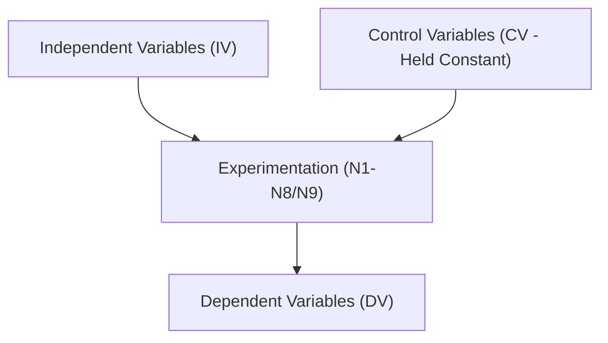

# Overthinking Boundary in Reasoning LLMs: Dynamic Stop Policies via Optimal Stopping

**Master's Thesis Proposal for 625.803-804**  
**Student:** Aditya Bhattacharya  
**Program:** M.S. in Applied and Computational Mathematics, Johns Hopkins University  
**Research Adviser:** Dr. Zerotti Woods (Department of Applied and Computational Mathematics)  
**Proposed Second Reader:** Dr. Moustapha Pemy (Department of Applied and Computational Mathematics)  
**Project Repository:** [research-thesis-overthinking-boundary](https://github.com/bhattadiCS/research-thesis-overthinking-boundary)  
**Latest Revision:** July 15, 2026  

---

## 1. Problem Motivation & Background

Reasoning-oriented Large Language Models (LLMs) employing Chain-of-Thought (CoT) generate intermediate reasoning tokens before arriving at a final answer. While this computation generally improves performance on complex reasoning tasks (e.g., mathematics, symbolic logic, coding), the marginal utility of further reasoning steps is not uniformly positive. 

Beyond a model-dependent and task-dependent transition point—which we define as the **overthinking boundary**—additional inference steps can cause the model to:
1. **Overthink**: Revise a correct intermediate answer to an incorrect one, enter infinite loops, or accumulate significant token costs without any improvement in accuracy.
2. **Underthink**: Halt the reasoning trajectory prematurely before a correction can be achieved.

This thesis investigates the mathematical formalization, empirical detection, and online application of this overthinking boundary. The topic directly interfaces with applied and computational mathematics, combining stochastic modeling, optimal stopping theory, hazard rate processes, uncertainty quantification, and sequential decision-making.

---

## 2. Research Question & Objectives

**The primary research question is whether the point at which further reasoning becomes counterproductive can be characterized as a mathematically structured stopping boundary and estimated online from observable intermediate trace features.**

To answer this, we pursue four objectives:
1. **Analytical Formalization**: Formalize a continuation-value framework for reasoning trajectories using a one-step Bellman equation governed by conditional repair and corruption hazards.
2. **Structural Characterization**: Determine the mathematical conditions under which the continuation-value sequence admits a single-crossing structure, defining an operational stopping boundary.
3. **Empirical Calibration & Upgrades**: Develop online estimation strategies for correctness belief ($q_t$) and hazards ($\alpha_t, \beta_t$) using step-level observables (e.g., semantic entropy, logprobs, answer churn, hidden states).
4. **Generalization & Validation**: Evaluate stopping policies across a massive, heterogeneous corpus of LLM reasoning traces under out-of-fold cross-validation, comparing them against static length thresholds, "never-stop" baselines, and oracle hindsight.

---

## 3. Analytical Framework & Optimal Stopping Formulation

Let the reasoning trajectory of a model on a given task be represented as a discrete-time stochastic process on a filtration $(\mathcal{F}_t)_{t \ge 0}$ generated by observable intermediate outputs and derived trace features. Let $a_t$ be the answer candidate at step $t$, let $y$ be the ground truth, and let $C_t = \mathbb{I}(a_t \approx y)$ be the correctness indicator. 

The stopping time $\tau$ is a random variable chosen to maximize the expected utility net of cumulative compute cost:
$$\max_{\tau} \mathbb{E} \left[ C_{\tau} - \lambda \tau \mid \mathcal{F}_0 \right]$$
where $\lambda > 0$ represents the per-step token/compute cost (fixed at $0.05$ units). 

By the principle of optimality, the decision to continue from step $t$ depends on the one-step continuation value:
$$\mu_t = \mathbb{E} \left[ U(C_{t+1}, t+1) - U(C_t, t) \mid \mathcal{F}_t \right]$$
Expanding this expected value in terms of the online correctness belief $q_t = \mathbb{P}(C_t = 1 \mid \mathcal{F}_t)$ yields the **fundamental drift equation**:
$$\mu_t = (1 - q_t) \alpha_t - q_t \beta_t - \lambda$$
where:
* **$\alpha_t = \mathbb{P}(C_{t+1} = 1 \mid C_t = 0, \mathcal{F}_t)$** is the conditional repair hazard (the probability that the model corrects a wrong answer).
* **$\beta_t = \mathbb{P}(C_{t+1} = 0 \mid C_t = 1, \mathcal{F}_t)$** is the conditional corruption hazard (the probability that the model corrupts a correct answer).
* **$\lambda$** is the per-step cost.

The optimal stopping policy is governed by the boundary $T^* = \inf \{ t \ge 2 : \mu_t \le 0 \}$. We investigate the structural hypothesis that under regularized decay of $\alpha_t$ and stabilization of $\beta_t$, $\mu_t$ crosses zero at most once, guaranteeing a single, well-defined overthinking boundary.

---

## 4. Methodology & Experimental Design (Ceteris Paribus Control)

To satisfy the scientific method, each experiment isolates a single **Independent Variable (IV)** while holding all other parameters constant (**Control Variables**) and measuring the impact on **Dependent Variables (DVs)**.

### 4.1. Core Experimental Variables
* **Independent Variables (IVs)**: Model weight precision (`none`/`bf16` vs. `4-bit` in **N6**); Token budget (`max_new_tokens` 256 vs. 512 in **N5**); Classifier model (Logistic vs. GBT vs. LSTM/GRU in **N2/Tier-3**); Hazard estimation method (local cell-specific vs. Empirical Bayes shrunk hazards in **N3**); Calibration parameters (1-parameter vs. 2-parameter difficulty modulation in **N4**); Observation filtration space (baseline 10 features vs. N7 self-consistency vs. N8 mid-layer projections in **N7/N8**).
* **Control Variables (CVs)**: NVIDIA RTX Pro 6000 Blackwell GPU hardware, PyTorch/Transformers + SDPA backend engine, task seeds (dataset shuffle seed 17, run seed 7), per-cell task count ($N=500$), cost ($\lambda=0.05$), and floor ($T_{\text{min}}=2$).
* **Dependent Variables (DVs)**: Expected utility change ($\text{dU}$), policy loss rate ($L_r$), correctness calibration AUC, and signed boundary error ($\text{Err}_{\text{bound}}$).

### 4.2. Sequential Experimental Roadmap (Tiers 1, 2, and 3)
1. **Tier 1 (CPU-Only Levers)**:
   * **N1 (Meta-Calibration)**: Tests optimal stopping threshold $\delta_{\text{cell}}$ transferability under Leave-One-Cell-Out (LOCO) and Leave-One-Model-Out (LOMO) cross-validation.
   * **N2 (Probe Upgrades)**: Compares linear logistic regression against non-linear models (GBT), isotonic calibration, and rolling temporal history lags (N2c).
   * **N3 (Empirical Bayes Hazards)**: Shrinks sparse, late-step cell-specific hazard estimates toward global, step-specific averages to stabilize the stopping boundary in trace tails.
   * **N4 (Dynamic Difficulty)**: Modulates stopping thresholds online using early-trajectory answer churn to adapt the patience parameter to online task difficulty.
2. **Tier 2 (GPU Causal Tests)**:
   * **N5 (Token Budget)**: Isolates the causal impact of token budget constraints (256 vs. 512 tokens).
   * **N6 (Precision Quantization)**: Isolates the causal impact of 4-bit quantization under strict, confound-free environments.
3. **Tier 3 (Observation Enrichment Pilots)**:
   * **N7 & N8 (Telemetry pilots)**: Tests multi-sample agreement ($k=2$ self-consistency) under honest cost accounting, answer-span token diagnostics, and projected mid-layer hidden states (N8b).
   * **Sequence Probes (GRU/LSTM)**: Evaluates sequential neural network stopping classifiers against static linear baselines.
   * **Gated Self-Consistency**: Evaluates a compute-optimal policy that dynamically invokes self-consistency only when sequential belief confidence is in the uncertainty region ($0.10 < q_t < 0.90$).

---

## 5. Key Research Findings

* **Algorithmic Breakthroughs**: Empirical Bayes Hazard Shrinkage (N3) achieved the single largest utility gain (**$+593.55$ OOF utility**), proving that hazard model variance at late steps was the dominant stop-defect. Lags (N2c) added **$+251.65$**, and 2-parameter difficulty modulation (N4) added **$+159.50$**.
* **Causal Insights**: Quantization was proven to degrade step-2 correctness by 14.3% ($Z=9.79$, N6), while extending generation budgets (N5) had zero impact on overthinking loops, falsifying the truncation hypothesis.
* **Sequence & Hybrid Gating (Tier 3)**: Sequence models (GRU/LSTM) on top of projected mid-layer representations successfully captured representation trajectory dynamics, boosting OOF correctness AUC from **$0.7793 \rightarrow 0.8280$**.
* **Compute Optimization**: Our Hybrid Gated Self-Consistency policy achieved a spectacular honest token-cost utility of **$+0.4867$** and cut decision errors (Losses) from 1,168 down to **465** (a **60.2% reduction**).

---

## 6. Project Timeline & Semester Plan

The project is structured across the two-semester 625.803–804 sequence:
* **ACM 625.803 (Semester 1)**: Focuses on stochastic formulation, literature review, baseline audit, database alignment, and implementation of Tier-1 and Tier-2 OOF evaluations. (Completed)
* **ACM 625.804 (Semester 2)**: Focuses on Tier-3 GPU pilot collection, feature-enriched stopping rules, multi-model generalization testing, drafting the formal thesis document, and preparing the oral defense.

Dr. Zerotti Woods (Research Adviser) and Dr. Moustapha Pemy (Proposed Second Reader) will oversee the project to ensure mathematical precision and alignment with JHU thesis guidelines.