# Novelty and Literature Review of the Overthinking Boundary in Reasoning Language Models

**Master's Thesis Research Note — Literature Synthesis (625.803–804)**  
**Author:** Aditya Bhatt (M.S. in Applied and Computational Mathematics, Johns Hopkins University)  
**Research Adviser:** Dr. Zerotti Woods  
**Proposed Second Reader:** Dr. Moustapha Pemy  

---

## 1. Introduction and Project Context

Reasoning-oriented large language models (LLMs) utilizing Chain-of-Thought (CoT) prompting or reinforcement learning-derived test-time compute scaling (e.g., DeepSeek-R1, QwQ) show substantial performance gains by generating intermediate reasoning chains before emitting a final answer. However, the marginal utility of allocating additional compute is not monotone-helpful. Beyond a task-dependent and model-dependent transition point—the **overthinking boundary**—extended reasoning can corrupt correct intermediate states, trigger recursive loops, or consume compute without improving correctness.

This document presents a systematic, clustered literature sweep mapping 30 recent papers to identify our core theoretical contribution and includes a formal two-sentence **Gap Statement** articulating the project's unique novelty.

---

## 2. Deep Literature Review

To understand the academic landscape of test-time compute allocation and overthinking mitigation, we organize the literature into four distinct thematic clusters.

### 2.1. Thematic Literature Map

```mermaid
graph TD
    A[Test-Time Compute Stopping Rules] --> B(Cluster 1: Overthinking Detection)
    A --> C(Cluster 2: Adaptive Compute)
    A --> D(Cluster 3: Reward Hacking)
    A --> E(Cluster 4: Safe Sequential Inference)

    B --> B1["ROM (2026): Hidden states"]
    B --> B2["TERMINATOR (2026): Exit points"]
    B --> B3["Deviation Monitoring (2026): Entropy"]
    B --> B4["When More Thinking Hurts (2026)"]
    B --> B5["Dynasor/Certaindex (2026)"]

    C --> C1["CODA (2026): Utility optimization"]
    C --> C2["ODAR (2026): Active inference"]
    C --> C3["DiffAdapt (2025)"]

    D --> D1["Inference Hacking (2025): Proxy KL"]
    D --> D2["Reward Under Attack (2026): PRMs"]
    D --> D3["Best-of-N Suboptimality (2026)"]

    E --> E1["Conformal Thinking (2026)"]
    E --> E2["CITE (2026): E-processes"]
    E --> E3["Anytime-Valid Betting (2023)"]
```

#### Cluster 1: Overthinking Detection and Heuristic Exits
Empirical work has recently focused on identifying overthinking and engineering early-exit points.
*   **ROM (2026)** uses late-layer hidden states to train a classifier that detects overthinking in real-time, allowing streaming early answer emission.
*   **TERMINATOR (2026)** casts exit prediction as a supervised learning problem, training the model to locate the first-answer position to bypass redundant verification.
*   **Reasoning Path Deviation Monitoring (2026)** constructs a path deviation index based on transition-token entropy, stopping when the model wanders into unstable semantic territory.
*   **"When More Thinking Hurts" (2026)** systematically evaluates test-time compute scaling on grade-school math and logic, confirming that simpler tasks exhibit a sharp performance drop-off (the "inverted U-shape") at lower token counts than complex tasks.
*   **Dynasor & Certaindex (2026)** implements a serving-level early exit by tracking reasoning stability, demonstrating that stopping when the answer stabilizes improves batch throughput.
*   **REFRAIN (2025)** and **TECA (2025)** introduce training-free rules that monitor reflective redundancy and regulate cumulative token entropy to halt when exploration is exhausted.
*   **Entropy After </Think> (2025)** uses post-think token entropy variance to stop when Pass@1 has plateaued.
*   **Trace Length is a Simple Uncertainty Signal (2025)** shows that trace length itself correlates with uncertainty, but is too coarse to serve as a standalone stopping rule.
*   **The Virtues of Brevity (2025)** finds that shorter answers preferentially sample the concise correctness regime, while verbose trajectories suffer from overthinking.

#### Cluster 2: Adaptive Compute and Token Allocation
These papers frame compute scaling as a resource-allocation optimization problem.
*   **CODA (2026)** formalizes adaptive reasoning using a utility-maximization framework where the marginal benefit of reasoning is balanced against a linear token cost, using policy-internal difficulty estimators.
*   **ODAR (2026)** routes inputs dynamically between fast (small) and slow (large) agents using active inference and variational free energy minimization.
*   **DiffAdapt (2025)** and **Skip a Layer or Loop it? (2025)** adapt generation depth or layer looping at test-time based on calibrated difficulty, showing that uniform compute is highly suboptimal.
*   **Balanced Thinking (2026)** and **Learning to Ponder (2025)** use representation-space steering and reinforcement learning (e.g., GRPO) to dynamically allocate pondering budgets.
*   **No Global Plan in Chain-of-Thought (2026)** probes hidden states to show LLM reasoning is myopic with short planning horizons, supporting local hazard modeling over global trajectory planning.

#### Cluster 3: Reward Models and Hacking Dynamics
Reward models are commonly used to guide search, but they are vulnerable to exploitation.
*   **Inference-Time Reward Hacking (2025)** mathematically proves that optimizing a proxy reward model (e.g., via Best-of-N) leads to a rise-then-fall trajectory in true utility, driven by a proxy optimism bias $\kappa_t$.
*   **Reward Under Attack (2026)** demonstrates that Process Reward Models (PRMs) often act as proxy fluency/length detectors rather than logical verifiers, making PRM-based stopping highly vulnerable to over-generation.
*   **Robust Reward Modeling via Causal Rubrics (2025)** and **Best-of-N Suboptimality (2026)** show that alignment proxies fail to capture true semantic correctness over long horizons, necessitating explicit drift formulations.
*   **Beyond Outcome Verification (2026)** highlights process verification techniques but demonstrates domain specificity limits.

#### Cluster 4: Safe Anytime-Valid Sequential Inference
This cluster focuses on providing distribution-free or time-uniform guarantees for stopping decisions.
*   **Conformal Thinking (2026)** applies split conformal risk control to calibrate stopping thresholds on validation datasets, guaranteeing that the model maintains a user-defined risk bound.
*   **CITE (2026)** constructs e-processes and intersection-union tests for self-consistency sampling, providing anytime-valid certificates for certifying the modal response.
*   **Ramdas et al. (2023)** provides the mathematical foundation for safe anytime-valid inference, showing that nonnegative martingales (e-processes) are the natural mathematical evidence objects under optional stopping.
*   **E-values for Adaptive Clinical Trials (2026)** details anytime-valid clinical trial monitoring, providing the framework for our mixture e-process formulation.

---

## 3. The Gap Statement and Novelty

> [!IMPORTANT]
> **Thesis Gap Statement (Novelty Definition):**  
> *While recent literature addresses overthinking through empirical heuristics, representation steering, or post-hoc threshold tuning, existing frameworks fail to model the continuation decision as a formal stochastic optimal stopping problem under competing repair and corruption hazards.*  
> *This thesis bridges this gap by deriving a value-aware drift equation from first principles and introducing anytime-valid sequential stopping rules that guarantee statistical safety under continuous monitoring.*

### 3.1. Key Conceptual Gaps Addressed

1.  **Utility-to-Hazard Decomposition:**  
    Unlike CODA or ROM which predict a raw score or exit class, we decompose the continuation value into two latent, interpretable competing processes: the **repair hazard** ($\alpha_t$) and the **corruption hazard** ($\beta_t$).
    *   $\alpha_t$ models the rate of transition from an incorrect to a correct semantic state.
    *   $\beta_t$ models the rate of transition from a correct to an incorrect semantic state (corruption/overthinking).
    
    This separation allows us to analyze *why* overthinking occurs (rising $\beta_t$ relative to $\alpha_t$) rather than just *when* it occurs.

2.  **Sequential Validity vs. Pointwise Thresholding:**  
    Standard early stopping (e.g., TECA, REFRAIN) checks a threshold at each step, committing multiple testing errors that inflate the false-stop rate. We resolve this by applying anytime-valid empirical-Bernstein bounds and mixture e-processes, guaranteeing a time-uniform error control level $\delta$.
