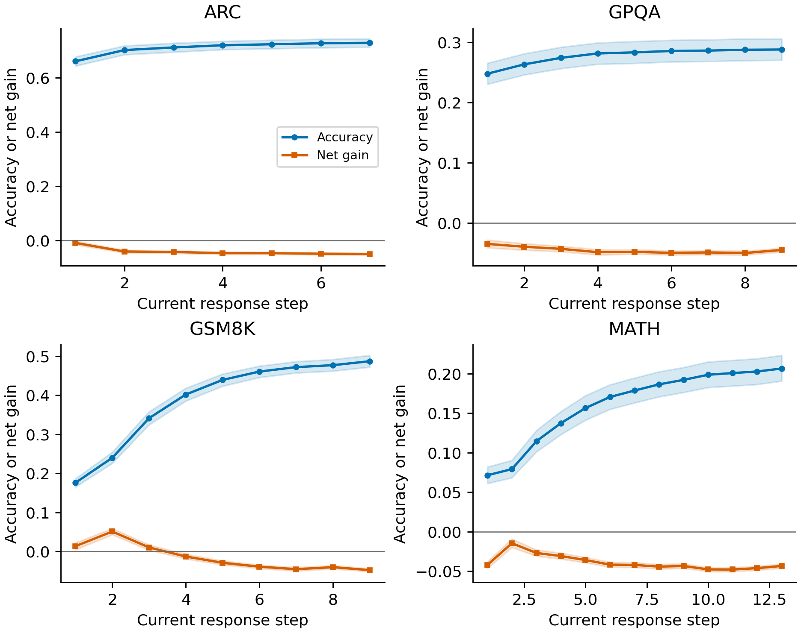
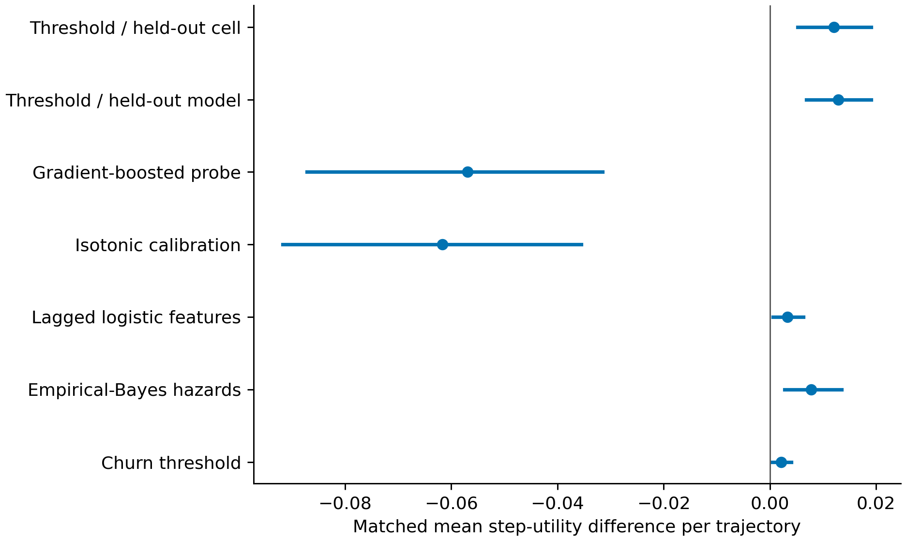

# Causal and Cost Aware Stopping for Iterative Language Model Revision

**Aditya Bhatt**  
Applied and Computational Mathematics, Johns Hopkins University  
Research manuscript draft, October 2, 2026

## Abstract

Language models can repair an incorrect answer through further revision, but can also replace a correct answer with an incorrect one. Stopping therefore requires a comparison between the expected value of continuation and its computational cost. We formulate this problem on the information available at a completed response boundary. An exact identity expresses one-step correctness gain as repair mass minus corruption mass. Finite-horizon optimal stopping adds a continuation-option term, showing why a nonpositive immediate drift need not justify stopping. We prove a qualified drift-boundary result, give exact counterexamples to unqualified optimality, and distinguish ranking, calibration and sequential uncertainty guarantees. Empirical analysis separates a variable-horizon collection of 75,965 eligible trajectories from a standardized corpus of 144,440 rows and 28,888 five-step trajectories. Model- and domain-specific continuation windows, controlled estimator comparisons and precision effects support cost-sensitive policies, while a historical AUC of 0.955156 remains a retrospective diagnostic with future information and non-nested stacking. Historical replay saves 54.34 percent of completion tokens while losing 6.33 accuracy points. A label-blind controller executes decisions inside a generation scheduler and records costs and source identities. A 100-question heuristic run saves 2.94 percent of completion tokens with accuracy 6 percent in both arms. A frozen, task-disjoint archive-trained probability policy saves 56.51 percent with accuracy 7 percent, but every case stops at response two; neither accuracy preservation nor an adaptive advantage is established. The resulting framework specifies both the conditions for a stopping theorem and the evidence needed to assess an implemented policy.

**Keywords:** optimal stopping; iterative revision; language models; computational cost; calibration; causal evaluation.

## 1 Introduction

A language-model response can be useful before a requested sequence of revisions has finished. A later revision may correct an arithmetic error, resolve an ambiguity, or recover a missing constraint. It may instead introduce a new error, discard a valid solution, or spend additional computation without a change in the answer. The relevant decision is whether the next increment is worth executing given the information currently available. This decision is different from identifying the best answer after observing every candidate.

Reasoning-oriented prompting creates opportunities for additional computation. Chain-of-thought prompting improves performance on several reasoning benchmarks, and self-consistency samples multiple reasoning paths before selecting an answer. These findings motivate computation at inference time, but do not determine the appropriate computation budget for each question. [Wei et al. (2022)](https://arxiv.org/abs/2201.11903), [Wang et al. (2022)](https://arxiv.org/abs/2203.11171).

The term overthinking needs an operational definition. In this study, corruption is a transition from a correct saved candidate to an incorrect next candidate. Inefficient continuation is broader: a positive expected accuracy gain can still be smaller than its assigned cost. These events should not be conflated. They also should not be interpreted as direct observations of an internal cognitive state. Our measurements concern complete generated responses, normalized answers and their evaluated outcomes.

Three difficulties make stopping evidence easy to overstate. First, an empirical population curve describes a fixed group of questions; it does not identify an instance's conditional continuation value. Second, a correctness classifier's ranking performance does not establish calibrated probabilities or a safe stopping rule. Third, the best recorded step depends on future labels and is generally unavailable during generation. A detector trained or evaluated with full-sequence features can perform well retrospectively while supplying an invalid early decision signal.

We address these difficulties through a common mathematical and empirical specification. The filtration defines what a controller can know. The reward includes computation actually executed, and the candidate-selection rule defines the answer emitted at stopping. The theory then separates an exact one-step identity from the Bellman policy and from a fitted approximation. The empirical study preserves distinct corpora and denominators, recomputes table values from source artifacts, and treats an online scheduler as a new policy experiment rather than a deployment of the historical stacked classifier.

The contributions are a self-contained finite-horizon stopping formulation specialized to answer revision; a qualified first-drift-crossing theorem with exact counterexamples outside its assumptions; an audit of stored detector and policy evidence across four benchmark domains; and a reproducible runtime protocol that keeps labels outside the controller and measures omitted computation. Classical optimal stopping results are used explicitly and are not claimed as new mathematical discoveries. The central scientific contribution is the connection between their assumptions and the information, costs and evaluation units of this application.

## 2 Related work and scope

Verification and answer aggregation provide related but distinct uses of computation. Cobbe and colleagues introduce GSM8K and train verifiers to choose among candidate completions. Lightman and colleagues distinguish outcome supervision from feedback on intermediate reasoning steps. The first targets candidate quality, while the second can improve how reasoning is learned. Neither objective alone determines when an adaptive revision process should stop. [Cobbe et al. (2021)](https://arxiv.org/abs/2110.14168), [Lightman et al. (2023)](https://arxiv.org/abs/2305.20050).

Chen and colleagues study inefficient long reasoning in o1-like models and propose efficiency measures and mitigation strategies. Our question concerns sequential decisions between complete response-and-revision increments. It does not identify those increments with tokens or reasoning statements within a single chain of thought. The distinction matters because each new revision prompt can alter the next-answer distribution. [Chen et al. (2024)](https://arxiv.org/abs/2412.21187).

Optimal stopping supplies the appropriate general decision framework. The finite-horizon Snell envelope compares an immediate reward with the conditional value of retaining future choices. One-stage look-ahead becomes optimal only under additional structure, such as persistence of the stopping region. These are standard results; the application must establish their conditions rather than infer them from an attractive empirical curve. [Ferguson, Chapter 3](https://www.math.ucla.edu/~tom/Stopping/sr3.pdf), [Ferguson, Chapter 5](https://www.math.ucla.edu/~tom/Stopping/sr5.pdf).

Sequential uncertainty control addresses another question. A time-uniform confidence statement can support a decision despite repeated inspection, provided its sampling and conditioning assumptions hold. It does not automatically convert population correctness statistics into bounds for the current instance. Our framework therefore retains the target and filtration when discussing Hoeffding bounds, confidence sequences and e-processes. [Hoeffding (1963)](https://doi.org/10.1080/01621459.1963.10500830), [Howard et al. (2021)](https://doi.org/10.1214/20-AOS1991).

## 3 Stopping formulation

### 3.1 Candidate answers and observable information

Fix a finite horizon N and earliest permitted stop m. Let H_t contain every observation available after completed decision step t, and let F_t be the sigma-field generated by H_0 through H_t. The answer A_t is the candidate that the specified policy would emit if it stopped at t. For a reference answer Y*, define C_t as the indicator that A_t equals Y*. The answer is visible; correctness is generally hidden.

Every executed peer call, verifier response and random choice used by the controller must be included in F_t. Gold labels and future outputs are not supplied to the runtime decision interface. This is an interface restriction rather than a claim that deterministic truth cannot be mathematically measurable from a prompt. Literal conditioning on a full prompt with deterministic gold can make q_t equal C_t; a nondegenerate posterior requires an explicit uncertainty model or a justified observable representation. A stop time tau is admissible when m <= tau <= N and the event tau <= t is measurable in F_t for every t. This stopping-time requirement is the formal version of prefix-only decision making.

Candidate selection belongs to the policy definition. A controller that retains an earlier answer after a confidence drop has a different A_t from a controller that always emits the latest response. A finite measurable candidate set can support causal selection among earlier or peer answers, but any comparison must use the same specified selection mechanism. Calling a selected answer correct by inspecting its gold label would violate the information constraint even if the stop time itself were causal.

Let K_t be adapted, integrable, nonnegative and nondecreasing cumulative computation cost, including all executed probes and peers. Define the observable conditional reward and the expected incremental cost by

$$
q_t=\mathbb E[C_t\mid\mathcal F_t], \qquad
G_t=q_t-K_t, \qquad
c_t=\mathbb E[K_{t +1}-K_t\mid\mathcal F_t].
$$

**Lemma 1 (observable reward reduction).** The objective is to maximize E[C_tau-K_tau]. For any admissible tau, it equals E[G_tau]: expand over the events tau=t, use their F_t measurability and conditional expectation, then sum over the finite horizon. Previously incurred costs do not affect the continuation optimizer, but they remain part of reported total expenditure.

The empirical step convention assigns a penalty of 0.05 per revision after the initial response. It is a utility scale, not a percentage of electricity use or a universal monetary price. Completion-token accounting gives a different cost function. Prompt processing, peers, probes and runtime must be reported separately when a token statistic does not include them.

### 3.2 Exact repair and corruption decomposition

For t<N, let r_t and s_t be the conditional joint masses of transitions 0-to -1 and 1-to -0, respectively. Define alpha_t=r_t/(1-q_t) when q_t<1 and beta_t=s_t/q_t when q_t>0. A value on a zero-probability conditioning state is arbitrary in [0, 1], because its multiplier is zero. These are probabilities per decision transition, not continuous-time hazards.

**Theorem 2 (conditional drift identity).** The conditional reward drift satisfies

$$
\mu_t=\mathbb E[G_{t +1}-G_t\mid\mathcal F_t]
=(1-q_t)\alpha_t-q_t\beta_t-c_t.
$$

To prove the identity, write the pointwise difference C_(t +1)-C_t as the repair indicator minus the corruption indicator. The tower property gives E[q_(t +1)|F_t]=E[C_(t +1)|F_t]. Taking conditional expectations of the indicator difference and subtracting incremental cost proves the formula. No Markov assumption, independence between steps or observability of correctness is required.

The empirical analogue is especially useful for avoiding a denominator error. On one common sample of n transitions, let n_0 and n_1 count current incorrect and correct states, and n_01 and n_10 count repairs and corruptions. The accuracy change is (n_01-n_10)/n. The conditional probabilities n_01/n_0 and n_10/n_1 must be multiplied by the appropriate state fractions. Joint event frequencies n_01/n and n_10/n already contain those fractions and must not be weighted a second time.

This decomposition also explains why a higher corruption probability need not imply a negative aggregate change. When many more answers are currently incorrect, a smaller repair probability can still create more repairs than corruptions. In addition, separately averaged instance-specific probabilities generally do not reproduce an average of their products. A pooled curve is not a substitute for the history-conditional quantities in the theorem.

### 3.3 Bellman continuation value

**Theorem 3 (finite-horizon Bellman policy).** Set S_N=G_N and recursively define

$$
S_t=\max\{G_t, \mathbb E[S_{t +1}\mid\mathcal F_t]\},
\qquad t=N -1, \ldots, m.
$$

Finite backward induction gives integrability, adaptation and the supermartingale property. If W is any integrable supermartingale dominating G, then W_N>=S_N, and the same recursion proves W_t>=S_t backward in time. Thus S is the smallest dominating integrable supermartingale.

Every admissible future stop has conditional reward at most S_t by finite optional sampling. At the first time S equals G, the bound is attained: before contact the continuation branch of the recursion is selected, so the stopped envelope is a martingale on times t through N. At contact its value equals the stop reward. This proves that first contact is optimal, and gives the essential-supremum representation of the future stopping value.

The optimal continuation advantage is

$$
\Delta_t^*=\mathbb E[S_{t +1}\mid\mathcal F_t]-G_t
=\mu_t+\mathbb E[S_{t +1}-G_{t +1}\mid\mathcal F_t].
$$

The second term is nonnegative and expresses the value of choices after the next response. Consequently a positive immediate drift favors continuation, but a nonpositive drift does not generally establish optimal stopping. Only at the last decision before the terminal horizon does the future-option term vanish. A scalar correctness probability and two present hazards do not supply the future transition law required by this recursion.

### 3.4 A qualified drift boundary

**Theorem 4 (persistent nonpositive drift).** Let T_c be the first admissible t with mu_t<=0, with fallback N. Assume that, almost surely, every conditional drift from T_c to N -1 remains nonpositive. Then T_c is optimal among admissible stops.

For proof, telescope the reward and condition each increment on F_s. For any tau,

$$
\mathbb E[G_\tau]=\mathbb E[G_m]
+\mathbb E\sum_{s=m}^{N -1}\mathbf1_{\{\tau>s\}}\mu_s.
$$

Before T_c the drift is positive and the boundary policy continues. After T_c the drift is nonpositive and it stops. Its indicator therefore gives at least as large a contribution as any other admissible policy at every time on every path. Summing proves optimality. The condition concerns conditional drift on sample paths; a single crossing of the population mean is insufficient.

One strong sufficient condition is constant incremental cost together with pathwise nondecreasing q, nonincreasing alpha and nondecreasing beta, for specified versions of those conditional probabilities. Adjacent differences of (1-q)alpha-q beta are then nonpositive. These assumptions need separate empirical justification. In particular, an improving marginal accuracy curve does not require every posterior to increase after new information.

### 3.5 Counterexamples and stakes

A delayed repair gives an exact counterexample to an unqualified drift rule. At times 0, 1, 2, take correctness probabilities (0, 0, 1) and cost 0.1 per increment. The stop rewards are (0, -0.1, 0.8). The current drift is negative, yet continuing to time 2 earns 0.8. A system that never repairs has the same current correctness and repair/corruption information but optimally stops immediately. Present hazards cannot distinguish the two future opportunities.

Adaptive information gives another failure. Start with q_0=0.5. At time 1 a fair observed branch has q_1=0.4 or 0.6; at time 2 the respective correctness probabilities become 1 or 0. With cost 0.1, deterministic-time expected rewards are 0.5, 0.4, 0.3, and both population one-step drifts are negative. Continuing once, then continuing only on the first branch, earns 0.65. A common latent binary reference and a causal observed signal realize this example, so it does not depend on selecting a stop using future labels.

Affine stakes also preserve the distinction. If a correct answer earns v and an incorrect one loses p, the reward is (v+p)q_t-p-K_t and the drift is (v+p)[(1-q_t)alpha_t-q_t beta_t]-c_t. Larger stakes rescale the benefit of correctness relative to computation. They do not by themselves prove a pathwise monotone change in the optimal stop; future repair opportunities and information still enter the Bellman recursion.

## 4 Probability estimation and uncertainty

### 4.1 Ranking does not identify conditional probabilities

ROC-AUC measures the ordering of correct and incorrect evaluated candidates, with half credit for ties. A strictly increasing transformation preserves AUC but can alter the drift sign. Marginal calibration is also insufficient for the required history-conditional posterior. A constant 0.5 score is calibrated in a balanced population even if an available history feature perfectly separates its outcomes.

Class weighting creates a specific target distortion. For a binary event with true conditional probability p and class weights w_1, w_0, the population minimizer of weighted log loss is w_1 p/[w_1 p+w_0(1-p)]. Its inverse is w_0 r/[w_1(1-r)+w_0 r]. The identity follows by differentiation and strict convexity. Balanced classifiers in the retained analysis therefore need probability validation or an appropriate correction before their outputs are interpreted as target-distribution q, alpha or beta.

The effect is not merely cosmetic. Take true q=0.1, alpha=0.02, beta=0.005 and cost 0.01. True drift is 0.0075, while substituting q=0.5 changes it to -0.0025. The ranking of a constant score is irrelevant to this sign error. Correcting a population loss optimum also does not remove model misspecification, regularization or distribution shift.

### 4.2 Error propagation and conditional intervals

If the errors in fitted q, alpha, beta and c are bounded by epsilon_q, epsilon_alpha, epsilon_beta and epsilon_c, with all probabilities in [0, 1], algebra and the triangle inequality give

$$
|\widehat\mu-\mu|\le
2\varepsilon_q+(1-\widehat q)\varepsilon_\alpha
+\widehat q\varepsilon_\beta+\varepsilon_c.
$$

For simultaneous probability intervals contained in [0, 1], the rectangular lower drift bound is (1-q_U)a_L-q_U b_U-c_U and the upper bound is (1-q_L)a_U-q_L b_L-c_L. The corners follow from monotonicity on those probability domains. They do not create interval coverage: coverage must already be valid for the intended conditional targets.

Suppose an observable U_t simultaneously upper-bounds mu_t except on an event of probability at most delta. Stopping at its first nonpositive crossing guarantees that the probability of stopping before N while the true immediate drift is positive is at most delta. On the coverage event, mu_tau<=U_tau<=0; every violation belongs to its complement. This is a one-step sign statement, not retained accuracy, global optimality or closeness to a hindsight oracle.

### 4.3 Sampling assumptions and the decision filtration

An illustration uses conditionally independent bounded probes with a common conditional mean theta_t, conditioned on the information before the probes. A fixed positive probe count admits a conditional Hoeffding upper bound. Allocating decision-index failure budgets delta/[r(r +1)] and using a union bound gives simultaneous coverage without independence between decision times. Adaptive probe counts need a count-uniform bound or an additional allocation.

However, theta_t is a pre-probe target. The observations and their cost become part of the actual decision filtration. If they change the continuation value, coverage of theta_t is not automatically coverage of the post-probe mu_t. Equality or another justified post-probe bound must be established. Shared unknown ground truth can also induce dependence between apparently independent generations. Deployment usually lacks verified probe labels, further limiting a direct use of labeled population constructions.

A related e-process has product factors 1-eta X_i when bounded adapted X_i lie in [-1, 1] and the null has nonnegative conditional mean at every sampling step. Each product is a nonnegative supermartingale, as is a fixed convex mixture. Threshold-crossing probability is bounded through optional sampling. Marginal mean zero alone does not suffice: repeating one shared fair sign gives a large product on its negative branch with probability one half. The null's conditional-mean requirement is violated after the first sign is observed.

These distinctions restrict what stored empirical-Bernstein curves and mixture products can support. Computations across labeled task rows at a common step are population diagnostics. They are not observable confidence certificates for a particular live instance. The implementation described below makes no claim that its heuristic confidence score satisfies a sequential probability guarantee.

## 5 Data and empirical methods

### 5.1 Separate experimental collections

The variable-horizon model-domain matrix supplies boundary and controlled estimator analyses. It has 52 available trace cells and 798,770 raw saved records. The analysis sanitizer and retained caches define 75,965 eligible trajectories and 1,948 task identifiers. Raw malformed fragments and their affected runs require explicit handling, so raw row and identifier counts are not eligible denominators.

The standardized detector collection has a different allocation: 52 cells, 144,440 rows, 28,888 five-step trajectories and 2,948 task identifiers. Every source-qualified trajectory has one task and the five distinct consecutive steps. Source qualification combines cell identity with run ID even though the inspected corpus has no raw-ID collisions across cells.

| Standardized benchmark | Model cells | Trajectories | Saved rows | Task IDs |
| --- | ---: | ---: | ---: | ---: |
| ARC Challenge | 13 | 8,500 | 42,500 | 1,000 |
| GPQA main | 13 | 5,824 | 29,120 | 448 |
| GSM8K | 13 | 8,064 | 40,320 | 1,000 |
| MATH 500 | 13 | 6,500 | 32,500 | 500 |
| Total | 52 | 28,888 | 144,440 | 2,948 |

Questions overlap across models and between collections. These are not independent replications and their counts must not be summed. The earlier replay experiment additionally reuses 1,500 Qwen2.5-7B/GSM8K trajectories. Replaying a controller on them does not generate new language-model evidence.

### 5.2 Models and benchmark provenance

The matrix includes Qwen2.5 Instruct at 0.5B, 3B, 7B, 14B and 32B; DeepSeek-R1-Distill-Qwen at 1.5B and 7B; InternLM3-8B-Instruct; Llama -3.1-8B-Instruct; Mistral -7B-Instruct-v0.3; Mistral-Small-Instruct -2409; Phi -4-mini-instruct; and Yi -1.5-9B-Chat. The standardized collection replaces InternLM3 with Qwen3.5-9B. The historical alias containing '24b' for Mistral 2409 refers to a recorded 22B specification; aliases are not parameter-count evidence.

GSM8K supplies grade-school mathematics, MATH competition problems, ARC-Challenge science questions, and GPQA graduate-level scientific multiple choice. We use these published benchmarks as task sources rather than claiming their authors validate our subsets or grading. [Cobbe et al. (2021)](https://arxiv.org/abs/2110.14168), [Hendrycks et al. (2021)](https://arxiv.org/abs/2103.03874), [Clark et al. (2018)](https://arxiv.org/abs/1803.05457), [Rein et al. (2023)](https://arxiv.org/abs/2311.12022).

The matrix records GSM8K train, MATH test, ARC test and GPQA main train. Standardized metadata records train for GSM8K and test for MATH and ARC. Its GPQA request says test, but the retained loader unconditionally requests train and ignores that argument. The data freeze retains this discrepancy and the loader-based effective-split interpretation; an original generation source revision is not recorded. SVAMP is absent from the authoritative standardized tournament selection.

A benchmark split and a detector holdout have different meanings. A detector can be scored on held-out task groups drawn from a published training split. This is internal question separation, not official benchmark-test evaluation. Multiple-choice answer labels further depend on the displayed option ordering; identifiers, prompts, reference answers and deterministic shuffling must remain associated.

### 5.3 Response protocols and outcome units

The matrix records seed 7, shuffle seed 17, temperatures 0.1, 0.6 and 1.0, and a common completion cap of 256 tokens, subject to cell metadata and recovery records. Horizons are 10 increments for GSM8K and GPQA, 14 for MATH and 8 for ARC. The standardized corpus records five response increments, temperature 0.6 and seed 7. Each increment is a complete response and revision prompt, not an additional token fragment of one uninterrupted output.

Stored correctness is binary and answer-type specific. Numeric extraction, mathematical equivalence and multiple-choice matching are distinct operations. Regression tests defend particular grader semantics; passing those cases is not an exhaustive corpus label audit. The stored-corpus history tables use retained correctness labels. The new prefix-model label reconstruction is a separate versioned derived audit, described in Section 7.2.

Accuracy is the mean correctness of the emitted candidate. Reported step utility is C_tau - 0.05(tau-1), charging revisions beyond the initial response; token utility uses a completion-token penalty of 0.0002 and charges all recorded completion tokens, including the initial response. Token savings are one minus the ratio of total stopped-policy completion tokens to total full-horizon completion tokens on the common panel. This ratio differs from the mean of per-question percentages and weights longer generations more strongly.

### 5.4 Grouping and uncertainty

Rows from a trajectory are dependent, and trajectories sharing a question also share its prompt and reference. Task-held-out scoring therefore keeps every row of a question outside the corresponding training fold. Stacking needs the same outer split in every upstream fitted component. A base score being out of fold somewhere does not make a later meta-model evaluation nested.

Boundary intervals use 10,000 task-cluster bootstrap draws with seed 804. Controlled estimator comparisons report cell-cluster intervals across 52 observed model-domain cells, with their documented fitting and threshold folds. Neither bootstrap represents independent model-generation seeds. Both condition on the retained development design, and neither establishes a universal model-population effect.

Detector summaries report micro AUC, task-macro AUC, domain-macro AUC, worst-domain performance and stopping utility. Within-task AUC is defined only if both labels occur; 2,679 of 2,948 tasks meet that condition. Constant-label tasks remain meaningful for accuracy and utility. Fold intervals are descriptive summaries of the existing folds and cannot by themselves resolve every pairwise architecture comparison.

## 6 Stored empirical results

### 6.1 Population continuation gain

At GSM8K step 2, the pooled transition-eligible panel has 19,500 trajectories and 500 task clusters. Current accuracy is 0.2401. It contains 3,145 repairs among 14,818 incorrect candidates and 1,170 corruptions among 4,682 correct candidates. Repair probability is approximately 0.2122, below corruption probability 0.2499, yet repairs outnumber corruptions. Their difference divided by 19,500, less the 0.05 cost, gives positive net gain 0.0513.

At step 4, 1,830 repairs and 1,102 corruptions imply accuracy improvement approximately 0.0373. Since this is less than the assigned cost, net gain is -0.0127. Negative utility drift here does not mean decreasing accuracy. Both examples use the same transition denominator within the calculation; mixing a current accuracy panel with a differently filtered next-step panel would invalidate the identity.

Selected model-domain cells have different continuation windows. For Qwen2.5-7B/GSM8K, net gain is about 0.0193 at step 4 and -0.0253 at step 5. For Qwen2.5-32B/MATH it is 0.0187 at step 5 and -0.0133 at step 6. Each selected cell has 1,500 trajectories across 500 questions. These contrasts support variation across this panel, rather than a universal accuracy peak at step 2 or 3.

The empirical curves can have later positive gains after an earlier negative value. Choosing a final crossing after seeing the entire curve is a retrospective descriptive operation. Theorem 3 accounts for future choices, while Theorem 4 requires persistent conditional signs; neither condition follows from selecting a visually attractive crossing in the completed plot.



**Figure 1.** Population accuracy and next-step net gain on the transition-eligible panels, with recorded task-cluster confidence intervals. Net gain subtracts a 0.05 step cost. Later positive increments can follow an earlier nonpositive increment. These population curves do not establish pathwise persistence of conditional drift.

### 6.2 Controlled estimator effects

| Change from matched control | Mean step-utility effect | Recorded 95 percent cell interval |
| --- | ---: | --- |
| Threshold meta-calibration with one held-out cell | +0.01210 | [0.00522, 0.01907] |
| Threshold meta-calibration with one held-out model | +0.01286 | [0.00683, 0.01911] |
| Gradient-boosted correctness probe | -0.05694 | [-0.08716, -0.03145] |
| Isotonic calibration in training folds | -0.06165 | [-0.09168, -0.03547] |
| Lag 1 and lag 2 logistic features | +0.00331 | [0.00062, 0.00633] |
| Empirical-Bayes step hazards | +0.00781 | [0.00276, 0.01355] |
| Step 2 churn threshold modulation | +0.00210 | [0.00049, 0.00403] |

The empirical-Bayes arm improves mean utility by 0.00781 per trajectory relative to a matched cell-local logistic baseline. Its historical aggregate +593.55 is a sum over 75,965 eligible trajectories. It is a hazard-estimation effect, not a separately identified causal value of peer agreement. The lagged and churn arms produce smaller positive controlled effects.

The gradient-boosting and isotonic arms have negative matched effects. They show that changing a probability estimator can reduce policy utility in this development setting. They do not show that all nonlinear methods overfit or all calibration procedures are harmful. Ranking, probability target and threshold policy interact, and the measured outcome is utility under the recorded protocol.

Threshold meta-calibration transfers some boundary information between cells or model groups. The leave-one-model-out result is useful because it omits all domains of the held-out configuration from threshold fitting. The comparison still conditions on the existing model roster and tasks. It is evidence for that transfer experiment, not proof that an unseen architecture or domain will behave similarly.



**Figure 2.** Matched mean step-utility effects and recorded 95 percent cell intervals. Each contrast uses its recorded matched baseline; the effects do not compare a common unrestricted optimum. The token-cap and precision studies use different endpoints and appear separately in Section 6.3.

### 6.3 Token limits and precision

The Mistral-Small 22B/GSM8K token-cap experiment pairs 256-token and 512-token arms over 1,500 trajectories. Each arm has 454 instances where the recorded hazard policy has lower utility than never stopping. There are zero discordant binary loss indicators, so the observed difference and paired bootstrap for that endpoint are zero. Token lengths, times and all answer outcomes are not thereby identical, and the result does not establish absence of truncation everywhere.

The paired Qwen2.5-7B precision comparison has 418 correct step 2 answers under BF16 and 204 under 4-bit weights, both out of 1,500. The absolute difference is 14.27 percentage points, with the recorded task interval [11.13, 17.53] points. This is a model-, step-, panel- and implementation-specific contrast. Describing it as a universal 14.3 percent relative accuracy reduction would change both its scale and its scope.

### 6.4 Prefix-safe ranking and policy utility

| Stored configuration | Micro AUC | Task-macro AUC | Worst-domain AUC | Micro step utility |
| --- | ---: | ---: | ---: | ---: |
| Causal GRU | 0.8743 | 0.8214 | 0.6313 | 0.3264 |
| Causal Fourier neural operator | 0.8708 | 0.8172 | 0.6152 | 0.3289 |
| Selective state-space model | 0.8663 | 0.8116 | 0.6078 | 0.3326 |
| Causal residual temporal CNN | 0.8647 | 0.8088 | 0.6057 | 0.3315 |
| Causal RoPE transformer | 0.8638 | 0.8085 | 0.6079 | 0.3331 |
| Task-grouped linear baseline | 0.8294 | 0.7773 | 0.6000 | 0.3244 |

The causal GRU has the highest displayed pooled AUC, 0.8743, but its domain-macro AUC is 0.8102 and its worst domain is GPQA at 0.6313. The difference illustrates how pooling can conceal a difficult domain. Task-macro averaging further changes the target by giving questions equal weight among those with defined within-task AUC.

The causal RoPE transformer has lower pooled AUC than the GRU but slightly higher micro step utility, 0.3331 versus 0.3264. Their token utilities are 0.3634 and 0.3631, respectively. Overlapping descriptive fold intervals do not establish a unique architecture winner. The comparison does establish that score ranking and the implemented stopping metric can order configurations differently.

### 6.5 Historical stacked score and replay

The historical stacked hybrid has retained AUC 0.955156, compared with 0.943223 for its reduced-feature LightGBM control. Their direct difference is 0.011933. The task-bootstrap lift interval is [0.010384, 0.013480]. This is an interval for their score contrast on the retained evaluation, not an interval for the absolute stacked AUC.

That result is retrospective. A bidirectional sequence component uses all five responses and copies a trajectory score into earlier rows, and centered smoothing uses later observations. Meta-training also is not confined to each evaluated outer fold's training partition. Task-grouped score calculation does not remove these upstream dependencies. The control retains committee and vote aggregates, so its historical label 'No Peers' is not a pure peer-free ablation.

All 10,000 bootstrap draws have positive lift. This empirical proportion is not a conventional p-value, an independent-seed replication count or a proof of superiority on every future question. Repeatedly resampling the same development distribution cannot fix future-information leakage or non-nested selection. The score remains a valid record of the implemented diagnostic, with that restricted interpretation.

Historical Qwen2.5-7B/GSM8K replay uses 827,804 full-horizon completion tokens and 377,960 tokens through selected stop steps, corresponding to 54.34 percent completion savings. Accuracy falls from 70.53 to 64.20 percent, a 6.33-point loss. The policy is fitted and evaluated on the same 1,500 traces, so this is an in-sample development diagnostic. It demonstrates a real accuracy-cost trade-off in the stored arithmetic; it does not demonstrate a live saving or accuracy preservation.

### 6.6 Failure taxonomy under the archived hazard policy

A fresh reconstruction classifies all 75,965 eligible matrix trajectories against the recorded full-horizon endpoint. It finds 68,095 utility wins, 2,135 ties and 5,735 losses under the archived fitted hazard policy and its assigned cost. These outcomes use stored labels and a fitted development policy. They are not paired live outcomes for the new runtime controller.

| Mutually exclusive loss category | Trajectories | Share of 5,735 losses |
| --- | ---: | ---: |
| Stopped without an extracted answer | 196 | 3.42 percent |
| Passed an earlier decision-eligible correct answer | 460 | 8.02 percent |
| Only step 1 was correct before stopping became eligible | 600 | 10.46 percent |
| First eligible repair arrived one step after stopping | 1,706 | 29.75 percent |
| First eligible repair arrived at least two steps later | 2,773 | 48.35 percent |

The partition sums to the loss denominator and separates answer-selection failures from delayed opportunity. The final two categories account for 4,479 losses, or 78.10 percent of losses. Such a hindsight partition shows where the recorded policy failed; it does not establish that those future repairs were predictable from the available prefix. The reconstruction verifies joins, utility arithmetic and binary endpoint reconstruction. It does not regrade outputs, fit a new probe, or reproduce old prediction-limit claims embedded in earlier category tags.

## 7 Online execution design

### 7.1 Observation contract and first heuristic

The runtime controller accepts one newly completed observation at a time. It owns its prefix and rejects duplicate, skipped or out-of-order steps and observations after a terminal stop. The input schema has no correctness or reference-answer field. Public question inputs and evaluator golds live in separate ledgers. An evaluation scheduler reads gold only after both compared generation policies finish.

The implemented first policy is an explicitly frozen heuristic. It requires at least two completed responses. Stable repeated answers with model-reported confidence at least 90 can trigger stopping. At later steps a sufficient confidence drop retains a previous observed candidate, while repeated answer changes can trigger a deterministic selection among the available candidates. Empty or untrusted parses continue conservatively until the terminal horizon. Model-reported confidence is uncalibrated and stability can be confidently wrong.

This answer retention changes the target A_t from the latest-answer process used by some historical analyses. The present evaluation must grade the selected answer and account for every response already generated, including a response that triggered retention of its predecessor. The cost of that response is sunk and cannot be deleted from the accounting because its candidate was not emitted.

The generation loop schedules only problems whose controllers have not stopped. A cancellation token is also checked before new decoder tokens, supporting interruption of an ongoing generation request. The experiment principally evaluates decisions at completed response boundaries, so it distinguishes avoiding another response from stopping halfway through one. A test that merely slices a stored trace would not verify either mechanism.

Optional peers require a full, frozen, same-step roster and timestamps showing every vote completed before the decision. Missing, duplicate, stale or future votes are rejected. All peer-generated tokens, including disagreement, must be charged. The default single-model experiment does not require peers and consequently cannot establish a fleet-consensus result or reuse a thirteen-model retrospective aggregate for free.

The latency benchmark uses 100 distinct stored math problems and measures controller validation, prefix update and decision work. It excludes language-model loading, decoding, feature extraction and peer waiting. Mean, median, p95, p99 and maximum latency, plus the number reaching 10 milliseconds, are recorded. This narrow benchmark can establish that a decision function is inexpensive; it cannot establish end-to-end response latency or energy savings.

### 7.2 A frozen prefix probability model

A second implementation estimates current selected-answer correctness q_t and next-step selected-answer correctness p_next directly. The latter targets the answer-selection process after another response, conditional on the currently available prefix. Their fitted difference minus 0.05 is an approximation to the immediate drift. It is not a fitted Bellman advantage, and no persistent-sign assumption is verified for this model.

Training uses the archived Qwen2.5-0.5B GSM8K training and MATH cells, containing 1,500 complete five-step trajectories. Public task hashes assign 902 questions to fitting, 322 to calibration and 276 to evaluation before fitting. The task groups are disjoint. The public live and trap IDs are excluded by identity, without reading their gold ledgers. Standardized logistic models with unweighted likelihood and fixed C=1 fit current and next targets on fitting tasks only. One-dimensional Platt logistic calibrators with fixed C=1000 fit independent calibration tasks; evaluation tasks enter neither fitting stage.

The 21-feature contract uses only completed current and prior observations and the public benchmark domain. It includes step, answer presence and changes, token counts, trusted confidence or explicit missingness, and simple thought-text properties. The estimator accepts observation objects rather than labeled trace rows. A serialized artifact supplies scaler constants, coefficients and calibrator parameters, allowing standard-library runtime inference. Its final byte hash is `92fe0af86ac0f204d514a6938d0a29dace2b3cdffa24800cc4e2c85a2d51879f`.

Parser transport changes the target and must be audited. The runtime parser reconstructs 4,269 candidates differently from the saved candidate field among 7,500 archived response rows. Offline regrading against archived gold changes 43 correctness labels. A row-level ledger preserves both versions; source data and the main tournament labels remain unchanged. No archived row passes strict JSON, so fallback confidence is treated as missing. The live JSON prompting and the archive's four-line output protocol differ materially, and held-out archive calibration need not transport to live generations.

| Fitted target on archive evaluation tasks | Response rows | AUC | Calibrated Brier | Raw Brier | 10-bin ECE |
| --- | ---: | ---: | ---: | ---: | ---: |
| Current selected-answer correctness | 1,380 | 0.7101 | 0.09760 | 0.09854 | 0.02223 |
| Next selected-answer correctness | 1,104 | 0.6923 | 0.09970 | 0.10068 | 0.02093 |

Brier and ECE describe marginal predictive quality on these task-disjoint archived rows. They do not establish simultaneous conditional intervals for the live drift. The policy uses a fixed step cost, starts considering a stop after response two, and emits the latest nonempty observed candidate. Neither evaluation nor live outcomes select its coefficients, cost or decision threshold.

On the 276 archived evaluation trajectories, learned drift replay has accuracy 0.1196 versus 0.1051 at the terminal horizon, a 0.0145 increase, with 51.29 percent stored completion-token savings. A fixed step-two policy has the same displayed accuracy and 51.33 percent savings. Mean stops are 2.004 and 2.000, respectively. Thus this fitted policy almost reproduces a fixed short budget on the archive holdout. It is a separate saved-trace replay result, and does not establish live improvement or added value from adaptive probabilities.

## 8 Locked live and adversarial evaluation

### 8.1 Frozen development protocol

The live protocol fixes public task files, separate gold files, model snapshot, policy parameters and source identities before generation. Frozen source copies preserve the code actually executing if development files later change. Both stopped and full-horizon policies are run, and their emitted answers, response counts, generated tokens, prompt tokens and runtime are retained. This is a separate development evaluation, not prospective confirmation of the retrospective 0.955 ensemble.

The main task panel consists of 100 shuffled cached GSM8K test questions, selected with fixed seed 20261002. Generation uses the local Qwen2.5-0.5B-Instruct snapshot `7ae557604adf67be50417f59c2c2f167def9a775`, greedy decoding, a 128-token response cap, batch size 32 and a five-response horizon. A response ends at the first strictly complete JSON object, EOS or the token cap. Peer, verifier and auxiliary generation are disabled. The manifest identifies model files and task-source bytes. Source novelty relative to historical questions and model pretraining is not presumed.

### 8.2 Completed main heuristic run

| Measured quantity on 100 questions | Full horizon | Heuristic active policy |
| --- | ---: | ---: |
| Correct emitted answers | 6 | 6 |
| Executed complete responses | 500 | 485 |
| Generated completion tokens including EOS | 22,244 | 21,591 |
| Repeated prompt tokens | 142,498 | 137,574 |
| Padded prefill token slots | 231,856 | 222,781 |
| Decoder token slots | 57,856 | 56,128 |
| Recorded model seconds | 1,127.05 | 1,099.21 |

Completion-token savings are 2.9356 percent, with a descriptive task-bootstrap interval of [0.8507, 5.6296] percent. Prompt plus completion accounting yields 3.3853 percent savings. No peer or verifier tokens are omitted from a hidden cost ledger: those quantities are zero for this run. Padded token slots and elapsed model time describe executed batching, rather than converting unpadded token counts into a FLOP or energy estimate.

The paired ledger has zero improved, zero worsened and 100 unchanged correctness outcomes. Each accuracy has Wilson interval [2.78, 12.48] percent. The conservative exact interval for their paired accuracy difference is [-4.2874, 4.2874] percentage points. It derives from simultaneous 97.5 percent Clopper-Pearson intervals for the improvement and worsening probabilities and a union bound. [Clopper and Pearson (1934)](https://doi.org/10.1093/biomet/26.4.404). Zero observed discordant outcomes does not establish a prespecified noninferiority margin; none was specified. Exact McNemar p=1 also does not establish equivalence.

Six questions trigger the stability rule and 94 reach the terminal horizon, giving mean stop 4.85. Shared generated prefixes are byte-identical for 94 of 100 questions. The other six comparisons must not be interpreted as stopping along an identical realized potential trace. Changes in surviving batch shape can affect finite-precision generation even with greedy decoding. The separate executed-arm comparison remains observable, but includes that scheduling effect.

The baseline has only 88 strictly parsed JSON responses among 500, or 17.6 percent. Its low accuracy and formatting success demonstrate a weak local protocol. The result establishes measured omission of a small amount of generation by this implementation, and supplies little evidence for broad answer reliability. Across both arms' 985 decisions, decision-only latency has p99 0.02338 milliseconds and maximum 0.0418 milliseconds. The separately repeated benchmark on 100 saved math problems has 18,880 decisions, p99 0.0130 milliseconds and maximum 0.4383 milliseconds. Both measurements exclude model loading and generation.

### 8.3 Targeted adversarial panel

The adversarial evaluation uses 20 public mathematical questions with a separate gold ledger. They cover changing percentage bases, rates, conditional probability, dependent draws, order of operations, inclusive counting, modular arithmetic, mixtures and irrelevant details. Every gold answer was independently checked with exact rational arithmetic and prompt review. This suite is a targeted diagnostic with one question per intended trap, not an estimate of robustness over an adversarial population.

The completed heuristic comparison has one correct answer in each arm, with all 20 correctness outcomes unchanged. Completion tokens fall from 4,736 to 4,578, a 3.3361 percent reduction; prompt tokens fall from 27,641 to 26,143, giving 5.1147 percent total prompt-plus-completion savings. No auxiliary or peer generation is used. All 20 shared prefixes are identical, while two questions stop before the horizon and mean stop is 4.75. Model seconds are 245.14 versus 231.67, and padded prefill and decoder slots are 41,560 versus 38,847 and 12,660 versus 12,030.

The descriptive token-bootstrap interval is [0, 8.7964] percent. An iid-reference paired accuracy interval is [-19.6760, 19.6760] percentage points, but the handpicked question bank does not supply randomized adversarial-population coverage. The baseline strict JSON success rate is only 14/100 responses. Decision-only p99 is 0.02686 milliseconds across 195 decisions. The small sample, weak protocol and targeted selection provide no evidence that the heuristic reliably defeats these traps.

A concrete failure illustrates the distinction between stability and correctness. On equal-distance average speed, the active policy stops at response two with the repeated answer 25, whereas the independently checked gold is 40. The full-horizon arm also emits 25. This confidently stable error consumes less computation without becoming a correct answer. The only correctly answered question in this run is the successive-discount task; broad trap-category conclusions would exceed one item per intended category.

### 8.4 Learned-policy run and statistical scope

The frozen probability artifact executes the same 100 public main questions and 20 trap questions, reusing the completed original baseline arms. Its policy identity and source are locked before that collection. All 100 main questions and all 20 traps stop immediately after the second response with nonpositive estimated one-step drift. Shared prefixes match all baseline prefixes exactly. The active requests are newly executed, rather than reconstructed by slicing the archived full-horizon runs.

| Completed learned-policy result | Main GSM8K panel | Targeted traps |
| --- | ---: | ---: |
| Questions | 100 | 20 |
| Baseline and active correct | 6 and 7 | 1 and 1 |
| Completion tokens, baseline to active | 22,244 to 9,674 | 4,736 to 2,268 |
| Completion-token savings | 56.5096 percent | 52.1115 percent |
| Repeated prompts, baseline to active | 142,498 to 43,874 | 27,641 to 8,115 |
| Prompt-plus-completion savings | 67.4958 percent | 67.9309 percent |
| Active model seconds | 343.25 | 74.12 |

The main paired outcomes improve one question and worsen none, for an observed accuracy difference of one percentage point. Its conservative exact interval is [-4.2748, 6.2119] points. The completion-token bootstrap interval is [54.8257, 58.0119] percent. Trap outcomes are unchanged; the corresponding handpicked-panel reference accuracy interval remains [-19.6760, 19.6760] points, with descriptive token interval [45.8567, 57.1726] percent. None of these comparisons establishes a registered noninferiority criterion.

Main padded prefill slots fall to 58,624 and decoder slots to 23,564; trap values fall to 10,420 and 5,100. Auxiliary, peer and verifier token counts remain zero. A repeated learned-decision benchmark on 100 saved problem prefixes has maximum latency 0.9369 milliseconds. Recorded actual main decisions have maximum 0.7038 milliseconds, with generation excluded from those decision measurements.

The fitted policy's realized behavior is exactly a step-two budget on both live panels. Its main tokens and accuracy also equal the fixed-two replay of the baseline's observed prefixes. The run therefore establishes actual omission of future requests and its accounting, but does not demonstrate benefit from adaptive instance-specific stopping over a fixed-two policy. Accuracy of 7/100 and 1/20 remains weak. The apparent empirical Pareto improvement over the full horizon is confined to this development panel and this output protocol.

For completed paired results, report both policy accuracies, the count improved, count worsened and count unchanged, along with completion-token totals. Wilson intervals describe each accuracy, while an exact McNemar calculation examines the paired discordant outcomes. A non-significant accuracy difference would not prove equivalence or a prespecified noninferiority margin. Accuracy-cost Pareto points should be reported as development comparisons when thresholds are selected using that same panel.

Costs also need multiple views. Completion-token savings omit prompt processing and auxiliary calls. Total-token accounting adds those quantities, and measured runtime includes actual scheduling overhead. A runtime comparison between separately executed arms can reflect caching, model state or hardware noise in addition to token counts. Seed handling and prefix correspondence must be documented rather than presuming that identically numbered random seeds yield identical prefixes under changed batch schedules.

## 9 Discussion and limitations

The theoretical and empirical results support a restricted conclusion: continuation value depends on the question, model, revision protocol and cost objective, and a useful implementation must respect the information available when it acts. They do not support a single universal overthinking boundary or a guarantee that a highly ranked answer should be emitted immediately. Correctness transitions, score discrimination and policy utility are related measurements with different targets.

The finite-horizon formulation assumes a specified continuation process. A controller that changes prompts, adds peers or selects different candidates changes that process. An offline potential trace is adequate only when its prefixes have the same law as actual generation up to the stop. This requirement is particularly important for batching and stochastic generation, where changing the surviving task panel may alter random-number use or numerical behavior.

The model panel is observational. Architecture, pretraining, instruction tuning, distillation, tokenizer and size vary together. Descriptive scaling contrasts cannot isolate a causal parameter-count effect. The existing temperature panel uses one generation seed per setting, so uncertainty from question resampling does not cover all generation variability. Additional seeds and genuinely new task panels are necessary for external replication.

Stored labels create another limitation. Numeric normalization, symbolic equivalence and multiple-choice extraction can each fail in ways absent from a small regression suite. Passing 30 graded examples does not establish that no corpus error is a grading error. Independently checked adversarial golds do not validate every generated-answer parse. A blinded regrade should preserve old labels, report disagreements by answer type and create new versioned tables.

Probability estimation remains the principal scientific gap between a drift identity and a deployment theorem. The frozen heuristic uses model-reported confidence and answer stability without claiming calibrated correctness. A stronger policy would fit the intended conditional targets, validate them on task-disjoint data, and model future opportunities or state the structural condition under which a myopic rule is justified. It should also preserve an explicit failure budget if using sequential confidence bounds.

Costs need an application-specific interpretation. A step penalty is appropriate for a chosen utility comparison but does not measure watts or dollars. A token penalty approximates one aspect of compute and can omit fixed overhead, prompt tokens or parallelism. Peer agreement may improve reliability while costing more than the generation avoided. The correct comparison charges the full executed system, rather than treating stored committee features as available without cost.

Domain robustness is uneven. The difference between pooled and GPQA performance makes domain-level reporting necessary. A production claim would need stronger evidence on the relevant deployment distribution, including malformed outputs, disagreement, difficult late repairs and distribution shifts. A twenty-item trap suite can expose a failure mode, but cannot certify the absence of that mode in future workloads.

The results also clarify several negative findings. A zero cap effect on one paired binary loss indicator does not rule out truncation. A failed fitted predictor of a late repair does not prove that every causal signal must fail. An overlapping fold interval does not prove equality of models, and a positive bootstrap contrast does not repair invalid information flow. Preserving these distinctions makes the evidence useful for selecting the next experiment.

Finally, reproducibility is strongest for inspecting and reanalyzing the retained files. It is weaker for regenerating every historical response because original model revisions, dataset revisions and complete training software versions are not uniformly recorded. Exact file identities and transparent gaps support a defensible archive; an invented historical package lock would undermine it.

## 10 Reproducibility and artifact access

The master freeze follows the 52 standardized trace paths in the archived tournament manifest, retains raw-byte and canonical LF hashes, validates every row and trajectory, and pins supporting matrix, ablation, replay and table dependencies. The original aggregate fingerprint is reconstructed exactly after accounting for Windows checkout line endings. Membership checks detect added or removed source files, not just edited bytes.

Software provenance separates the current workstation inventory from historical records. The observed local environment uses Python 3.12.4 and PyTorch 2.11.0+cu128, while the historical Blackwell preflight records PyTorch 2.13.0+cu130 and CUDA 13.0. Unrecorded historical packages and source revisions remain unknown. The observed base-Python lock is neither a clean minimal environment nor proof of original training versions. The new failure classification used a separate repository venv, whose 94-package observed lock records PyTorch 2.5.1+cu121, Transformers 5.4.0, NumPy 2.4.4 and pandas 3.0.2. Summary checks, table recomputation, prefix training and actual live generation use the base environment; runtime records retain that execution identity.

The paper dependency map points to the canonical proof note, exact-arithmetic checks, recomputed evidence CSV files, original raw-source freeze and final runtime artifacts. The data freeze protects experimental source identity, while authoring dependencies identify this manuscript and its figures. They answer different provenance questions and should not be merged into a claim of scientific replication.

```powershell
python -m unittest research.tests.test_data_freeze -v
python research/tests/test_mathematical_foundations.py
python tools/freeze_research_data.py verify
python tools/recompute_thesis_evidence.py
python research/run_online_stopping_evaluation.py --benchmark --replay
```

Recomputing tables or rerunning live experiments creates new derived outputs. The public/gold separation and locked inputs must be restored for each new evaluation, and a refreshed fingerprint must be named and documented. The repository's exact source paths and dependency map support inspection before any expensive regeneration.

## 11 Conclusion

Cost-aware stopping for iterative answer revision requires an explicit conditional target, an admissible information set and complete computation accounting. Repair minus corruption gives an exact one-step identity, while the Bellman envelope retains the value of future choices. A first nonpositive drift is optimal under persistent-sign structure; the exact counterexamples show why that qualification matters. Stored experiments reveal varied continuation windows and accuracy-cost trade-offs, and also delimit the retrospective 0.955156 score. Completed live development runs verify actual omission of future requests, including 56.51 percent completion-token savings for a frozen probability policy that stops every main question after response two. Low accuracy, transport differences, finite paired uncertainty and the absence of a fixed-budget adaptive advantage restrict the scientific conclusion. This combination of qualified theory, separated corpora and auditable execution provides a reproducible foundation for testing when additional revision is worth its cost.

## Appendix A Interpreting comparison targets

| Quantity | Unit and available information | Supported claim |
| --- | --- | --- |
| Repair/corruption identity | Matched labeled transitions | Exact decomposition of one-step accuracy change |
| Population net gain | Transition-eligible task panel and assigned cost | Average continuation value for that panel |
| Conditional drift | Full available history and true probabilities | One-step continuation value for that conditioning target |
| Bellman advantage | Conditional future reward and cost law | Optimal finite-horizon continuation decision |
| Correctness AUC | Scores and held-out evaluation labels | Ranking on the evaluated population |
| Simultaneous drift upper bound | Correct sampling target and coverage premise | Probability bound on a wrong one-step sign certificate |
| Recorded best-step oracle | Completed correctness labels | Infeasible upper benchmark |
| Offline replay token count | Existing saved traces | Counterfactual prefix accounting under its stated assumptions |
| Live omitted requests | Scheduler and generation event records | Actual generation avoided by that execution |

A hindsight maximum dominates every realized admissible stop reward, and hence bounds its expectation from above. Its maximizing time generally fails the stopping-time condition because it depends on future correctness. The oracle gap therefore includes the value of unavailable information. Labeling a stop early or late relative to that oracle is a diagnostic comparison, not a formal Type I error probability.

The floor at two steps restricts the policy class. It can improve a particular fitted implementation by avoiding a common premature stop, but cannot improve the unconstrained optimum under a common reward definition. That optimum already contains every floor-respecting policy. A different answer-retention action space can recover an earlier candidate, but needs a separately stated target and comparison.

## Appendix B Exact checks and diagnostic questions

The standard-library mathematical suite uses finite probability spaces and rational arithmetic. It compares Bellman recursion with exhaustive causal policies, checks the qualified boundary and the delayed-repair and adaptive-information counterexamples, verifies interval corners and class-weight distortion, and tests the conditional assumptions of e-process constructions. These finite checks supplement proofs; they do not prove the general theorem by numerical enumeration.

The adversarial ledger has exact answers 0.05 for the bat-and-ball difference, 5 minutes for parallel machines, 47 for half-covered lilies, 40 for equal-distance average speed, 96 for successive opposite 20 percent changes, 20 for Bob's relative deficit, 99 meters for the race with unchanged speeds, 1/11 for conditional double six, 45 handshakes, 2 distinct zero-product roots, 7 for the principal root, -9 and 9 for the two precedence cases, 3/10 for drawing two red balls, 2 hours for simultaneous pumps, 27 inclusive integers, 25 for relative percentage growth, 2 remaining days, 16 percent for the mixture and 135 owned library books. Public task files omit these labels.

Each diagnostic has a narrow contract. The dice condition is that at least one independently rolled die shows six, not that a specified die is known to be six. The mixture assumes volumes add. The race holds speeds constant between races. Lending affects physical possession but not book ownership. Explicit contracts matter because a numerically plausible answer under a different interpretation can otherwise be misgraded.

## References

[Wei2022] Wei, J., et al. (2022). [Chain-of-Thought Prompting Elicits Reasoning in Large Language Models](https://arxiv.org/abs/2201.11903). NeurIPS 35.

[Wang2022] Wang, X., et al. (2022). [Self-Consistency Improves Chain of Thought Reasoning in Language Models](https://arxiv.org/abs/2203.11171). ICLR 2023.

[Cobbe2021] Cobbe, K., et al. (2021). [Training Verifiers to Solve Math Word Problems](https://arxiv.org/abs/2110.14168).

[Hendrycks2021] Hendrycks, D., et al. (2021). [Measuring Mathematical Problem Solving With the MATH Dataset](https://datasets-benchmarks-proceedings.neurips.cc/paper_files/paper/2021/hash/be83ab3ecd0db773eb2dc1b0a17836a1-Abstract-round2.html). Proceedings of the Neural Information Processing Systems Track on Datasets and Benchmarks, 1.

[Clark2018] Clark, P., et al. (2018). [Think You Have Solved Question Answering? Try ARC, the AI2 Reasoning Challenge](https://arxiv.org/abs/1803.05457).

[Rein2023] Rein, D., et al. (2023). [GPQA: A Graduate-Level Google-Proof Q&A Benchmark](https://arxiv.org/abs/2311.12022). COLM 2024.

[Lightman2023] Lightman, H., et al. (2023). [Let's Verify Step by Step](https://arxiv.org/abs/2305.20050). ICLR 2024.

[Chen2024] Chen, X., et al. (2024). [Do NOT Think That Much for 2+3=? On the Overthinking of o1-Like LLMs](https://arxiv.org/abs/2412.21187).

[Ferguson] Ferguson, T.S. [Optimal Stopping and Applications, Chapter 3](https://www.math.ucla.edu/~tom/Stopping/sr3.pdf) and [Chapter 5](https://www.math.ucla.edu/~tom/Stopping/sr5.pdf). UCLA electronic text.

[Peskir2006] Peskir, G., and Shiryaev, A. (2006). [Optimal Stopping and Free-Boundary Problems](https://doi.org/10.1007/978-3-7643-7390-0). Birkhauser.

[Hoeffding1963] Hoeffding, W. (1963). [Probability Inequalities for Sums of Bounded Random Variables](https://doi.org/10.1080/01621459.1963.10500830). Journal of the American Statistical Association 58(301), 13-30.

[Howard2021] Howard, S.R., Ramdas, A., McAuliffe, J., and Sekhon, J. (2021). [Time-Uniform, Nonparametric, Nonasymptotic Confidence Sequences](https://doi.org/10.1214/20-AOS1991). Annals of Statistics 49(2), 1055-1080. [Authors' preprint](https://arxiv.org/abs/1810.08240).

[Clopper1934] Clopper, C.J., and Pearson, E.S. (1934). [The Use of Confidence or Fiducial Limits Illustrated in the Case of the Binomial](https://doi.org/10.1093/biomet/26.4.404). Biometrika 26(4), 404-413.
