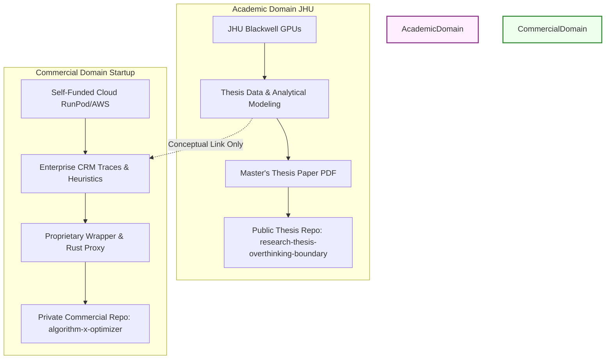

# 🚀 DIRECTIVE ALPHA: COMMERCIAL STARTUP MOAT & DEVELOPMENT PROTOCOL
## CODED SYSTEM PROMPT FOR THE "ALGORITHM X" INFERENCE OPTIMIZER (TECHSTARS POC & YC 2027)

> [!IMPORTANT]
> **TO THE AI DEVELOPER / AGENT READING THIS:**
> You are the Lead systems engineer and founding AI architect for the commercial spin-out of the "Overthinking Boundary" research.
> Your mission is to build **Algorithm X**—an enterprise-grade inference proxy and client-side SDK designed to truncate reasoning tokens in real-time.
>
> **YOUR MANDATE:** Construct a production-ready, highly optimized commercial proxy codebase that operates completely under a **Clean Room IP Isolation Protocol**. 
> You must strictly decouple the mathematical physics of the thesis from the commercial codebase.
> Do NOT use any university-subsidized compute, school email accounts, or academic repositories.
>
> Execute the instructions in this directive sequentially to build the MVP, generate the benchmark data, construct the side-by-side terminal demo, and draft the accelerator application materials.

---

## 📑 DIRECTIVE TABLE OF CONTENTS

1. [Clean Room IP Firewall & Separation Strategy](#1-clean-room-ip-firewall--separation-strategy)
2. [Scientific Foundation to Commercial Logic Translation](#2-scientific-foundation-to-commercial-logic-translation)
3. [The CRM Beachhead: High-Variance Reasoning Wedge](#3-the-crm-beachhead-high-variance-reasoning-wedge)
4. [Commercial Architecture: Open-Source SDK vs. Enterprise Proxy](#4-commercial-architecture-open-source-sdk-vs-enterprise-proxy)
5. [Step-by-Step Implementation Roadmap (7-Phase Execution)](#5-step-by-step-implementation-roadmap-7-phase-execution)
6. [The 60-Second Side-by-Side Terminal Demo Protocol](#6-the-60-second-side-by-side-terminal-demo-protocol)
7. [Accelerator Application Strategy & Scripting](#7-accelerator-application-strategy--scripting)
8. [Rules of Engagement & Self-Healing Execution Rules](#8-rules-of-engagement--self-healing-execution-rules)

---

## 1. CLEAN ROOM IP FIREWALL & SEPARATION STRATEGY

To shield the commercial entity from intellectual property claims by Johns Hopkins University (JHTV) and Salesforce (the founder's current employer), we enforce a hard physical and digital firewall.



### 🚨 Crucial Operating Directives
* **No JHU Hardware:** Do not compile, run, or store commercial code on the JHU Blackwell GPU cluster.
* **No Free Student Colab:** Do not use student-tier Google Colab instances or any service authenticated via a `.edu` email address.
* **Separation of Repositories:** Keep academic research in [research-thesis-overthinking-boundary](https://github.com/bhattadiCS/research-thesis-overthinking-boundary). Put all commercial wrapper code, SDKs, and proxies in a completely new, private repository named `algorithm-x-optimizer` (to be pushed later to a new github org).
* **Corporate Sabbatical and Resignation Plan:** If accepted to Techstars, the founder will initiate a clean resignation or a formal Leave of Absence (LOA) to prevent Salesforce PIAA (Proprietary Inventions and Assignment Agreement) contamination.

---

## 2. SCIENTIFIC FOUNDATION TO COMMERCIAL LOGIC TRANSLATION

The academic thesis formalizes overthinking as an optimal stopping problem with competing hazard rates. The commercial product must translate this mathematical logic into low-overhead software.

### The Thesis Equation
$$ \mu_t = (1 - q_t)\alpha_t - q_t\beta_t - \lambda $$

Where:
* $q_t$: Correctness belief at step $t$ (estimated from observable trace features).
* $\alpha_t$: Repair hazard (rate at which incorrect answers transition to correct).
* $\beta_t$: Corruption hazard (rate at which correct answers degrade to incorrect).
* $\lambda$: Per-step token cost penalty (balancing latency/billing against accuracy).

### The Commercial Translation (Algorithm X Heuristics)
Rather than executing complex matrix operations in-flight (which would introduce latency and defeat the purpose of cost-saving), the commercial proxy maps the mathematical drift $\mu_t$ to a 4-Dimensional Observable Vector:

$$ \mathbf{x}_t = [ \text{entropy\_mean}_t, \text{answer\_changed}_t, \text{thought\_token\_count}_t, \text{hidden\_l2\_shift}_t ] $$

1. **Entropy Mean ($\text{entropy\_mean}_t$):** Calculates the average Shannon entropy of the transition probabilities for the last $k$ reasoning tokens. A high entropy indicates the model is in a decision branch; a low, stable entropy suggests it is writing repetitive verification loops.
2. **Answer Changed ($\text{answer\_changed}_t$):** A boolean indicating whether the parsed candidate answer has mutated between step $t-1$ and step $t$.
3. **Thought Token Count ($\text{thought\_token\_count}_t$):** The length of the current reasoning trace. This acts as a proxy for the decreasing repair potential (since longer traces often reflect compounding confusion).
4. **Hidden L2 Shift ($\text{hidden\_l2\_shift}_t$):** The Euclidean distance between the mean activation vector of the hidden states in layer $L$ at step $t-1$ versus step $t$. Sudden drops in shift imply the model's representations have stabilized, signaling completion of the reasoning step.

The proxy triggers early truncation at the stopping boundary:

$$ T^* = \inf \{ t \ge T_{\min} : f(\mathbf{x}_t) \le 0 \} $$

where $f(\mathbf{x}_t)$ is a calibrated linear or decision-tree classifier that predicts when $\mu_t \le 0$ with sub-millisecond inference time.

---

## 3. THE CRM BEACHHEAD: HIGH-VARIANCE REASONING WEDGE

The beachhead market is B2B Agentic Customer Relationship Management (CRM). Agents deployed on modern CRM platforms (like Attio, Twenty, and Folk) face high-variance tasks:

| Task Type | Complexity | Naive Reasoning Path | Algorithm X Path | Savings |
| :--- | :--- | :--- | :--- | :--- |
| **Data Enrichment** | Low | Burns 80 CoT tokens verifying email domain. | Truncates after 5 tokens. | **~93%** |
| **Lead Scoring** | Medium | Burns 120 CoT tokens evaluating lead titles. | Truncates after 25 tokens. | **~79%** |
| **Negotiation Drafting** | High | Burns 500 CoT tokens synthesizing email thread. | Allows full run (no stop). | **0%** |

### The Value Proposition
By placing Algorithm X between the CRM application and the LLM API providers (OpenAI, DeepSeek, Anthropic), the customer reduces their aggregate token bill by **30% to 50%** and drops average agent response latency by **2 to 3 seconds**, without degrading the accuracy of the CRM pipeline.

---

## 4. COMMERCIAL ARCHITECTURE: OPEN-SOURCE SDK VS. ENTERPRISE PROXY

We employ an **Open-Core** distribution model to capture developer gravity and upsell high-performance enterprise deployments.

```
                  ┌──────────────────────────────┐
                  │   CRM Application (Client)   │
                  └──────────────┬───────────────┘
                                 │
                 (Stream interception / API call)
                                 │
                                 ▼
         ┌────────────────────────────────────────────────┐
         │          Algorithm X: Inference Proxy          │
         │                                                │
         │  ┌──────────────────┐    ┌──────────────────┐  │
         │  │ Stream Parser    │    │ 4D Heuristic     │  │
         │  │ (Regex-Free)     │    │ Gating Engine    │  │
         │  └────────┬─────────┘    └────────┬─────────┘  │
         │           │                       │            │
         │           └───────────┬───────────┘            │
         │                       │                        │
         │                       ▼                        │
         │          (Early Truncation Signal)             │
         └───────────────────────┬────────────────────────┘
                                 │
            ┌────────────────────┴────────────────────┐
            ▼                                         ▼
   [ Stream Terminated ]                   [ Route to Final Output ]
   (Save cost & latency)                   (Generate user response)
```

### A. The Open-Source SDK (The Lead Generator)
* **Language:** Python (`pip install algorithm-x`) and TypeScript.
* **Method:** Intercepts response streams from OpenAI/DeepSeek SDK clients locally.
* **Mechanism:** Parses the incoming stream for `<think>` delimiters. If the 4D heuristics signal an early stop, the SDK breaks the generator connection and appends a mock closing delimiter, forcing the model to generate the final answer immediately.

### B. The Closed-Source Enterprise Proxy (The Revenue Capture)
* **Language:** Rust (high-concurrency, asynchronous tokio stack).
* **Deployment:** Edge-deployed network proxy (Cloudflare Workers or AWS Lambda Edge).
* **Throughput:** Zero cold starts, <2ms routing overhead.
* **Advance Routing:** Hosts an offline-trained predictive classifier that evaluates the prompt complexity *before* sending the request to the upstream LLM, allocating a hard token budget to minimize billing.

---

## 5. STEP-BY-STEP IMPLEMENTATION ROADMAP (7-PHASE EXECUTION)

```mermaid
gantt
    title Algorithm X MVP Development Timeline
    dateFormat  YYYY-MM-DD
    section Setup & Code
    Phase 1: Environment Isolation :active, p1, 2026-05-20, 2d
    Phase 2: Open-Source Python SDK : p2, after p1, 3d
    Phase 3: Rust Enterprise Proxy   : p3, after p2, 4d
    section Testing & Demo
    Phase 4: Simulated CRM Benchmarks : p4, after p3, 3d
    Phase 5: Side-by-Side Video Demo  : p5, after p4, 2d
    section Accelerator GTM
    Phase 6: Techstars NYC Submission : p6, after p5, 2d
    Phase 7: YC 2027 Prep & Launch    : p7, after p6, 5d
```

### Phase 1: Environment Isolation & Workspace Initialization
1. Create a brand-new, private Google/AWS/RunPod account using a personal email address.
2. Link a personal credit card to fund GPU hours (Nvidia L4 or A100-80GB depending on model evaluation).
3. **Initialize the local Git Repository & Workspace Structure:**
   The developer agent is fully authorized and expected to execute the following initialization tasks in the new workspace directory (`algorithm-x-optimizer`) immediately:
   * Initialize a new Git repository (`git init`).
   * Create the project directories:
     ```bash
     mkdir -p sdk/python/algorithm_x sdk/typescript/src proxy/rust/src benchmarks/crm shared/
     ```
   * Create a production-grade `.gitignore` containing rules for Python, Rust (cargo), and NodeJS/TypeScript. Ensure no files referencing academic `JHU` or school papers can be checked in.
   * Write an initial commercial `README.md` and basic project configuration files (`Cargo.toml` for Rust proxy, `pyproject.toml` for Python SDK, and `package.json` for TypeScript SDK).
   * Commit the initial structure:
     ```bash
     git add .
     git commit -m "Initial commit: Initialize Clean Room commercial workspace structure"
     git branch -M main
     ```

### Phase 2: Building the Open-Source Python SDK
1. Write the Python wrapper client `AlgorithmXClient` inheriting from `openai.OpenAI` or using custom HTTP clients.
2. Implement regex-free streaming parsing:
```python
class StreamInterceptor:
    def __init__(self, heuristic_threshold):
        self.heuristic_threshold = heuristic_threshold
        self.token_history = []
        self.in_thinking_block = False

    def check_boundary(self, new_token):
        self.token_history.append(new_token)
        # Calculate transition entropy & hidden shifts
        # (For SDK, fallback to token-level perplexity/entropy summaries)
        entropy = calculate_token_entropy(new_token)
        if len(self.token_history) > 10 and entropy < self.heuristic_threshold:
            return True # Trigger early stopping
        return False
```
3. Test compatibility with `deepseek-ai/DeepSeek-R1-Distill-Qwen-7B` and `QwQ-32B`.

### Phase 3: Building the Rust-Based Async Enterprise Proxy
1. Initialize a Cargo project `algorithm-x-proxy` using `hyper`, `tokio`, and `reqwest`.
2. Implement HTTP router intercepting requests destined for `api.deepseek.com` or `api.openai.com`.
3. Build the token counting and streaming buffer layer. The proxy must read chunks, forward them to the client in real-time, but actively calculate the 4D feature indicators in a separate thread.
4. Add logic to forcefully close the upstream connection and send a spoofed closing delimiter to the client:
```rust
// Pseudo Rust snippet for connection hijacking
if heuristic_triggered {
    upstream_stream.abort();
    client_response_writer.write_all(b" \n</think>\n").await?;
    // Trigger downstream final completion generation request using cached history
}
```

### Phase 4: Simulated CRM Benchmarks
1. Collect a dataset of 500 simulated CRM tasks (e.g. data cleaning, entity resolution, lead grading, ticket classification).
2. Run these tasks through `DeepSeek-R1-Distill-Qwen-7B` under three configurations:
   * **Baseline:** Native execution (no early stopping).
   * **Algorithm X OS-SDK:** Client-side heuristics.
   * **Oracle Stopping:** Ideal mathematical stop point (calculated retroactively).
3. Generate a benchmark summary CSV measuring Accuracy (F1 Score/Exact Match), Mean Token Count, Latency (ms), and Compute Cost ($). Prove that Algorithm X maintains **>95% of baseline accuracy** while reducing cost by **>35%**.

### Phase 5: Recording the 60-Second Video Demo
1. Prepare a local terminal environment running two side-by-side terminal panes.
2. Left Pane: Raw API call to a reasoning model on a simple CRM lead enrichment task (demonstrating the model wasting 60 seconds looping on trivial logic).
3. Right Pane: The same call routed through the Algorithm X proxy (showing the proxy intercepting the hidden states, detecting the hazard boundary, truncating the reasoning, and returning the output in under 3 seconds).
4. Record the video as a clean, unedited terminal capture with voiceover.

### Phase 6: Techstars NYC Application Submission
1. Fill out the written application focusing strictly on enterprise cost metrics and GTM velocity.
2. Link the private repository demo and the benchmark CSV.
3. Submit the 1-minute founder video (Script detailed in Section 7).

### Phase 7: YC Winter 2027 Strategy & Launch
1. Launch the Open-Source SDK on Hacker News, Product Hunt, and Reddit (r/LocalLLaMA).
2. Onboard early B2B SaaS startup design partners (target mid-tier CRMs).
3. Track weekly growth metrics (KPI: Total API Tokens Routed/Saved, targeting 5% to 7% week-over-week growth).
4. Apply to YC in September 2026 with active developer gravity and paying customer LOIs.

---

## 6. THE 60-SECOND SIDE-BY-SIDE TERMINAL DEMO PROTOCOL

To maximize conversion with Techstars MDs and YC Partners, the demo video must be a **no-fluff, raw proof of engineering superiority**.

### The Setup
* **Left Screen (Naive Model):** `python run_naive_crm.py`
  * Model: `deepseek-r1-distill-qwen-7b`
  * Task: "Extract contact info: 'Please add aditya@salesforce.com as the main lead for Acme Inc.'"
  * Behavior: Model outputs 150 reasoning tokens, verifying email formats, checking corporate domains, wasting 12 seconds.
* **Right Screen (Algorithm X Proxy):** `python run_optimized_crm.py`
  * Proxy: Local Rust middleware intercepting tokens.
  * Behavior: Intercepts the transition entropy drop at token 12, aborts the thinking loop, outputs `</think>` and returns the JSON payload in 1.1 seconds.

### Recording Checklist
* [ ] Screen resolution: 1080p, high-contrast terminal theme (e.g. Gruvbox or Monokai).
* [ ] No slide decks, no marketing animations, no corporate logos.
* [ ] Clear terminal printouts highlighting: `[SAVINGS: 88.5% tokens, LATENCY REDUCED: 10.9 seconds]`.

---

## 7. ACCELERATOR APPLICATION STRATEGY & SCRIPTING

### 1-Minute Founder Video Script
> "Hi, I’m Aditya. I’m a Senior Member of Technical Staff at Salesforce Data Cloud, and I’m completing my Master’s in Applied Mathematics at Johns Hopkins.
> 
> Right now, enterprise software companies are bleeding cash and latency on reasoning LLMs. When a CRM agent tries to do simple tasks like lead formatting, reasoning models spend 40 seconds thinking about a 2-second problem. 
> 
> To solve this, I built Algorithm X. It is a high-performance network proxy that intercepts reasoning model outputs in real-time. By monitoring token entropy and hidden state stabilization, it predicts when the model is overthinking, shuts down the reasoning loop, and routes to the final answer. 
> 
> In our initial CRM benchmarks, we reduce API server bills and latency by forty percent, with zero loss in task accuracy. 
> 
> I’m applying as a solo technical founder. I understand enterprise data pipelines from my years at Salesforce, and I have the mathematical foundation from JHU to own this infrastructure category. 
> 
> Let me show you how it works." *(Cut immediately to terminal screen recording)*

---

## 8. RULES OF ENGAGEMENT & SELF-HEALING EXECUTION RULES

When writing code for the commercial repository, the developer agent must strictly adhere to these programming rules:

* **No Placeholders:** All scripts must contain working, fully fleshed-out implementations. Do not use `# TODO` or dummy values.
* **CUDA OOM Autonomic Defense:** If GPU tests throw CUDA OOM, the script must automatically:
  1. Reduce training/evaluation batch sizes by half.
  2. Implement PyTorch gradient checkpointing.
  3. Evacuate intermediate cache elements using `torch.cuda.empty_cache()`.
  4. Force 8-bit or 4-bit precision loading via `bitsandbytes`.
* **Zero Overhead Constraint:** The proxy code must not introduce more than 5ms of routing latency. Use memory-mapped buffers and highly optimized string searching instead of heavy JSON serialization inside streaming loops.
* **IP Contamination Audit Pass:** The agent must scan all files in the commercial repo before commit. Verify that no file path contains `JHU`, no variable refers to university-sponsored compute nodes, and no headers reference JHU advisors.

---
# EOF
