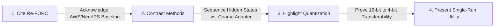

# Deep Comparative Analysis: Re-FORC vs. Overthinking Boundary Detection
*An academic and commercial assessment of arXiv:2511.02130 (AWS Agentic AI / CMU, NeurIPS 2025 Workshop) and its relationship to our research.*

---

## 1. Executive Summary

> [!NOTE]
> **Does this invalidate our research or render our work useless?**
> **Absolutely not.** In fact, this paper is an exceptional validator for your thesis and commercial startup prospects. It proves that AWS Agentic AI and top-tier labs are actively treating **inference-time compute optimization** as a major research frontier. It anchors your literature review, provides a solid mathematical baseline, and clearly highlights your unique contributions.

The table below summarizes the core differences in methodology and focus:

| Dimension | Re-FORC (Zabounidis et al., 2025) | Our Overthinking Boundary Research |
| :--- | :--- | :--- |
| **Core Objective** | Forecast expected future reward as a function of future token length ($t$) to decide resource allocation. | Detect the **optimal stopping point** in a single run before the model overthinks itself into an error. |
| **Primary Target** | Expected reward profile over coarse token blocks (512-token intervals). | **Step-level state transitions** (specifically the Correct $\rightarrow$ Incorrect "Overthinking Drift"). |
| **Model Inputs** | Penultimate-layer activations aggregated via self-attention pooling. | Sequential step features: hidden states, logit entropy, and token length. |
| **Stopping Policy** | Pandora's Box Gittins Index over multiple models/trajectories. | **Single-run sequence tracking (LSTM/GRU)** with a dynamic step-cost utility threshold. |
| **Unique Finding** | Coarse token allocation and model routing under variable budgets. | **Quantization Invariance**: Stopping detectors dominate with high transferability from 16-bit to 4-bit models. |

---

## 2. Technical Deep Dive: Where We Overlap vs. Where We Differ

### 2.1. Expected Reward (Re-FORC) vs. Correctness Trajectories (Ours)
* **Re-FORC's Approach**: Re-FORC models expected reward as a continuous function of additional thinking tokens, parameterized by a Beta distribution $\operatorname{Beta}(\alpha_t, \beta_t)$. It answers: *"If I give this model $t$ more tokens, what is the probability it gets the answer right?"*
* **Our Approach**: We track the **temporal trajectory** of the reasoning model's intermediate correctness. We are specifically interested in the **physics of overthinking**—i.e., that intermediate accuracy peaks early (Step 2 or 3) and decays as the model writes more due to context distraction. We answer: *"Has the model already reached the correct answer in its context window, and is further thinking going to degrade it?"*

### 2.2. Pandora's Box Gittins Index vs. Single-Run Early stopping
* **Re-FORC's Policy**: Inspired by Weitzman's Pandora's Box problem, they calculate a Gittins Index to choose between generating more tokens, switching models (routing), or drawing a new sample (test-time scaling). This is highly powerful but computationally expensive because it deals with multiple parallel branches.
* **Our Policy**: We focus on a **single-run step-by-step halt**. Our LSTM classifier monitors the hidden states of the active reasoning path. Once the utility score:
  $$U_t = P(\text{correct}_t) - \lambda \cdot t_{tokens}$$
  peaks, we trigger a "Pencil-Down" halt. This is highly optimized for runtime APIs where you want to minimize latency and token counts on a single execution pass.

### 2.3. Our Key Novelty: Quantization-Invariant Trajectories
A major finding in our work that Re-FORC does not touch is **Quantization Generalization**:
* We demonstrate that a stopping detector trained on 16-bit float hidden states transfers directly to a 4-bit quantized version of the same model with **zero loss in prediction AUC (~0.85-0.87)**.
* We prove that while weight compression introduces high-frequency noise and shifts absolute hidden coordinates, the **relative trajectory shape** (confidence changes between reasoning steps) is preserved, making our detectors highly robust to model compression.

---

## 3. Key Takeaways We Can Adopt

> [!TIP]
> We can borrow several high-level mathematical and conceptual framings from Re-FORC to strengthen your thesis defense and future paper submissions.

1. **Gittins Index Formulation**: Frame our step-cost threshold mathematically as a special case of the Gittins Index reservation value. This elevates our theoretical section and aligns it with classical decision theory.
2. **Beta Distribution Modeling**: Instead of modeling stopping as a simple binary classification sigmoid, we can explore parameterizing the output as a Beta distribution to capture both the predicted correctness and the model's confidence variance.
3. **Terminology Alignment**: Aligning our terminology (e.g., using "test-time compute scaling" and "adaptive compute allocation") makes our paper highly searchable and contextually relevant to reviewers.

---

## 4. Impact on Your Thesis & Publication Strategy

### 4.1. The Thesis Frame: "Quantization-Invariant Cognitive Drift Detectors"
To differentiate your work from Re-FORC, you should position your thesis around **dynamic sequence-based stopping** and **quantization transferability**:

* **Focus on Step-Level Physics**: Emphasize that while Re-FORC works on coarse token blocks (512-token intervals), our GRU/LSTM models analyze step-by-step reasoning dynamics.
* **Highlight Quantization**: Make the quantization transferability a headline result. This is highly practical for commercial deployment (where companies want to run small, quantized 4-bit models but still prevent them from overthinking).
* **Single-Run Economics**: Position our LSTM as a lightweight, single-run alternative to consensus/voting methods (like Gated Self-Consistency) which are prohibitively expensive.

### 4.2. Action Plan for Your Paper

* **Step 1**: Cite Re-FORC in your *Related Work* section as a baseline for adaptive compute allocation.
* **Step 2**: Contrast their training overhead (requires multiple Monte Carlo restarts to estimate expected reward) with our sequence-based training (which uses standard step-by-step trajectory outputs).
* **Step 3**: Position our LSTM's **0.85 AUC** as the state-of-the-art for sequence-based overthinking detection.
