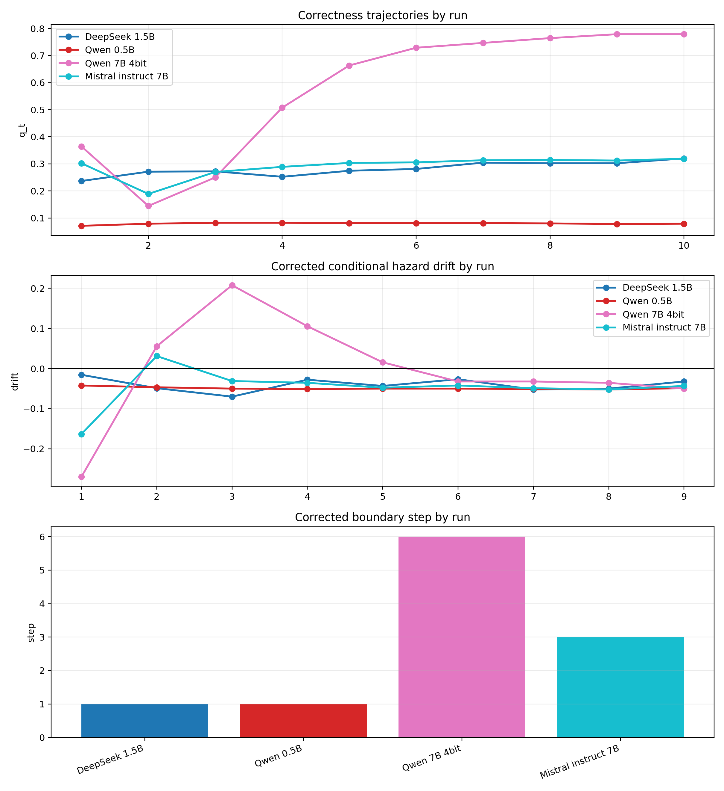
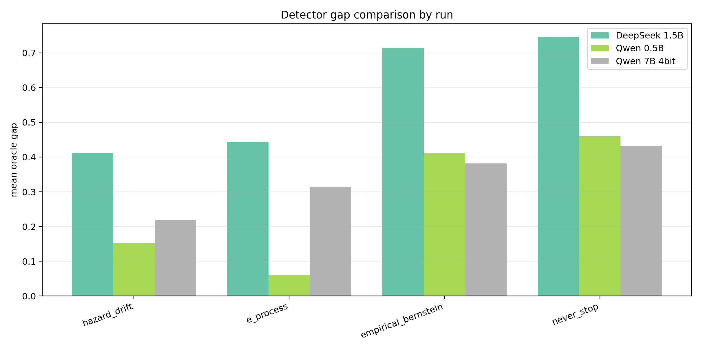

# Cross-Family Report

## Executive Summary
Qwen 7B remains the only clearly late corrected-boundary witness, but Mistral 7B now adds a weaker non-Qwen step-3 boundary with a large never-stop penalty. Cross-family evidence is therefore stronger than a single-family story, but full late-boundary robustness is still unproven.

Task IDs align across all 4 runs under the shared GSM8K train split and shuffle seed 17 protocol.

## Run Summary
| Run | Family | Params | Backend | Quant | Step-1 acc | Peak acc | Peak step | Corrected boundary | Repair | Corruption | Hazard gap | E-process gap | Never-stop gap | Probe Brier | Probe AUC | Assessment |
| --- | --- | --- | --- | --- | --- | --- | --- | --- | --- | --- | --- | --- | --- | --- | --- | --- |
| DeepSeek 1.5B | DeepSeek-R1 distill | 1.5B | transformers+torch(cuda) | none | 0.2367 | 0.3200 | 10 | 1 | 0.1887 | 0.4612 | 0.4121 | 0.4441 | 0.7463 | 0.2217 | 0.6137 | No late-boundary replication |
| Qwen 0.5B | Qwen2.5 instruct | 0.5B | transformers+torch(cuda) | none | 0.0711 | 0.0822 | 3 | 1 | 0.0029 | 0.0236 | 0.1531 | 0.0595 | 0.4595 | 0.2399 | 0.5291 | No late-boundary replication |
| Qwen 7B 4bit | Qwen2.5 instruct | 7B | transformers+torch(cuda-4bit) | 4bit | 0.3644 | 0.7789 | 9 | 6 | 0.1794 | 0.1678 | 0.2193 | 0.3139 | 0.4317 | 0.1625 | 0.9063 | Late-boundary replication |
| Mistral instruct 7B | Mistral instruct | 7B | transformers+torch(cuda) | none | 0.3022 | 0.3189 | 10 | 3 | 0.0545 | 0.1381 | 0.2781 | 0.3351 | 0.5696 | 0.2285 | 0.7184 | Weakened late-boundary support |

## Drift Audit
| Run | Empirical boundary | Corrected boundary | Fitted boundary | Legacy pooled proxy | Mismatch |
| --- | --- | --- | --- | --- | --- |
| DeepSeek 1.5B | 1 | 1 | 1 | 7 | yes |
| Qwen 0.5B | 1 | 1 | 4 | 1 | no |
| Qwen 7B 4bit | 6 | 6 | 7 | 5 | yes |
| Mistral instruct 7B | 3 | 3 | 5 | 3 | no |

## Detector Rankings
| Run | Detector | Rank | Mean oracle gap | False-late rate |
| --- | --- | --- | --- | --- |
| DeepSeek 1.5B | oracle | 1 | 0.0000 | 0.000 |
| DeepSeek 1.5B | verifier_first_correct | 2 | 0.1395 | 0.310 |
| DeepSeek 1.5B | first_answer | 3 | 0.3796 | 0.000 |
| Qwen 0.5B | oracle | 1 | 0.0000 | 0.000 |
| Qwen 0.5B | first_answer | 2 | 0.0173 | 0.000 |
| Qwen 0.5B | e_process | 3 | 0.0595 | 0.981 |
| Qwen 7B 4bit | oracle | 1 | 0.0000 | 0.000 |
| Qwen 7B 4bit | verifier_first_correct | 2 | 0.0745 | 0.166 |
| Qwen 7B 4bit | hazard_drift | 3 | 0.2193 | 0.771 |
| Mistral instruct 7B | oracle | 1 | 0.0000 | 0.000 |
| Mistral instruct 7B | first_answer | 2 | 0.1362 | 0.000 |
| Mistral instruct 7B | verifier_first_correct | 3 | 0.2450 | 0.544 |

## Signal Comparison
| Run | Strongest correctness signal | Strongest corruption signal |
| --- | --- | --- |
| DeepSeek 1.5B | answer revision flag (answer_changed, coeff=-0.618) | answer revision flag (answer_changed, coeff=0.396) |
| Qwen 0.5B | verbosity-confidence proxy (verbose_confidence_proxy, coeff=0.448) | token entropy (entropy_mean, coeff=0.847) |
| Qwen 7B 4bit | self-reported confidence (confidence, coeff=0.714) | verbosity-confidence proxy (verbose_confidence_proxy, coeff=0.622) |
| Mistral instruct 7B | answer revision flag (answer_changed, coeff=-0.528) | token entropy (entropy_mean, coeff=0.563) |

## Figures

