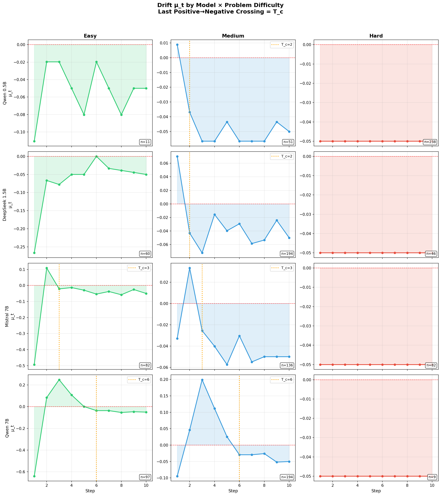
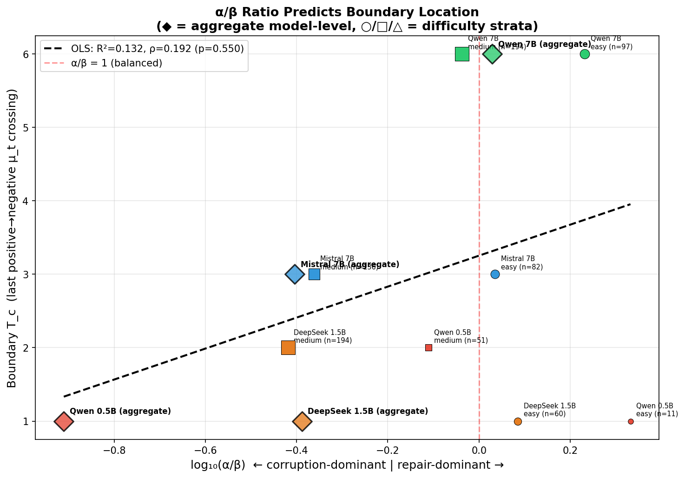

# Cross-Family Report

## Executive Summary
The central result is no longer "the models disagree, so the boundary is inconclusive." The stronger supported claim is that the overthinking boundary is **capability-gated**: the location of the last useful stop expands or contracts with the local repair-to-corruption balance rather than staying fixed across families or task strata.

Two empirical facts now drive the thesis narrative:

1. Aggregate model-level boundaries are real but incomplete. They tell us whether a family is mostly repair-dominant or corruption-dominant on the full benchmark mix.
2. Difficulty-stratified drift traces reveal the mechanism. Several slices show an early negative drift estimate and then a later positive repair window, so the scientifically useful summary must distinguish the **first** nonpositive crossing from the **last** positive-to-negative crossing.

Task IDs align across all four runs under the shared GSM8K train split and shuffle seed 17 protocol.

## Current Claim
The theorem-facing continuation value is

$$
\mu_t = (1-q_t)\alpha_t - q_t\beta_t - \lambda.
$$

The current thesis claim is therefore:

- There is not one universal fixed overthinking step shared by all model families.
- The effective boundary is stratum-dependent and capability-gated by the balance between repair hazard $\alpha_t$ and corruption hazard $\beta_t$.
- Scientific reporting should distinguish $T_c^{first}$ from $T_c^{late}$ whenever the empirical drift path is nonmonotone.
- Qwen 7B remains the strongest aggregate late-boundary witness, while Mistral 7B provides genuine non-Qwen confirmation of the same mechanism but with a weaker earlier late boundary.
- The correct cross-family conclusion is predictive structure, not universal late-boundary robustness.

For the theorem-facing stopping rule, see [../ThesisDocs/thesis_stopping_rule_algorithm.md](../ThesisDocs/thesis_stopping_rule_algorithm.md). For the first-versus-late empirical interpretation used in the defense story, see [../ThesisDocs/dual_boundary_appendix.md](../ThesisDocs/dual_boundary_appendix.md).

## Aggregate Run Summary
| Run | Family | Step-1 acc | Peak acc | Peak step | Corrected boundary ($T_c^{late}$) | Repair | Corruption | Never-stop gap | Assessment |
| --- | --- | --- | --- | --- | --- | --- | --- | --- | --- |
| DeepSeek 1.5B | DeepSeek-R1 distill | 0.2367 | 0.3200 | 10 | 1 | 0.1887 | 0.4612 | 0.7463 | Corruption-dominant control |
| Qwen 0.5B | Qwen2.5 instruct | 0.0711 | 0.0822 | 3 | 1 | 0.0029 | 0.0236 | 0.4595 | Weak-model control |
| Qwen 7B 4bit | Qwen2.5 instruct | 0.3644 | 0.7789 | 9 | 6 | 0.1794 | 0.1678 | 0.4317 | Strong late-boundary witness |
| Mistral instruct 7B | Mistral instruct | 0.3022 | 0.3189 | 10 | 3 | 0.0545 | 0.1381 | 0.5696 | Non-Qwen but weaker witness |

At the aggregate model level, $T_c^{first}$ and $T_c^{late}$ coincide for all four runs. The dual-boundary separation appears when the traces are stratified by problem difficulty.

## Dual-Boundary Evidence
The most informative slice is the `Medium` stratum, where problems are neither already solved at Step 1 nor hopelessly hard. This is where a genuine repair window can exist.

| Model | Medium n | $T_c^{first}$ | $T_c^{late}$ | $\alpha/\beta$ | Step-1 acc | Peak acc | Peak step | Gain to peak | Reading |
| --- | --- | --- | --- | --- | --- | --- | --- | --- | --- |
| Qwen 0.5B | 51 | 2 | 2 | 0.774 | 25.5% | 32.7% | 3 | +7.2pp | Weak recoverable subset, no extended late window |
| DeepSeek 1.5B | 194 | 2 | 2 | 0.381 | 12.5% | 30.9% | 10 | +18.4pp | Single early repair pulse, still early boundary |
| Mistral 7B | 136 | 1 | 3 | 0.435 | 17.9% | 32.6% | 7 | +14.7pp | Genuine but short late repair window |
| Qwen 7B | 194 | 1 | 6 | 0.918 | 15.1% | 75.4% | 9 | +60.3pp | Strong late repair window |

This is the core defense story. An early negative estimate does not automatically mean the model never enters a useful repair regime. Qwen 7B medium and Mistral 7B medium both show that the drift can dip negative early, recover into a positive repair block, and only later collapse decisively. That is why the thesis now treats $T_c^{first}$ as an early warning and $T_c^{late}$ as the better empirical witness for the last usable reasoning window.

Hard strata flatline at Step 1 for all four models. Easy strata sometimes show later usable windows as well, but they are less diagnostic because those tasks are already mostly solved at Step 1. The `Medium` stratum is therefore the cleanest identification set for repair-versus-corruption mechanics.

## Capability-Gated Boundary Prediction
When aggregate runs and difficulty strata are pooled, boundary location tracks the repair-to-corruption ratio rather than a universal time index:

- **OLS fit of boundary vs $\log_{10}(\alpha/\beta)$:** $R^2 = 0.1317$
- **Spearman rank correlation:** $\rho = 0.1918$

The effect is modest because the boundary variable is integer-clipped to a short 10-step horizon and the number of families is still small, but the ordering is coherent. The strongest late windows cluster near the balanced boundary $\alpha/\beta \approx 1$, while corruption-dominant slices collapse toward Steps 1 to 3.

This is the key upgrade to the thesis claim: the boundary is not a universal constant, but it is not arbitrary either. It moves with measurable hazard structure.

## Trajectory Mechanism
The trajectory-type audit explains why the boundaries separate across families:

- **Qwen 7B** converts **47.0%** of runs through repair and only **16.6%** remain persistently wrong.
- **Mistral 7B** repairs only **15.3%** of runs while corrupting **20.9%**, which compresses its late window.
- **DeepSeek 1.5B** repairs many runs in aggregate, but the corrected conditional hazard audit shows that corruption dominates quickly enough to keep its safe boundary early.
- **Qwen 0.5B** rarely repairs at all, so it behaves like the weak-regime control the theory predicts.

The mechanistic reading is therefore consistent across the full pipeline: families with stronger repair density and lower corruption pressure sustain longer positive-drift windows.

## Drift Audit
| Run | Empirical boundary | Corrected boundary | Fitted boundary | Legacy pooled proxy | Mismatch |
| --- | --- | --- | --- | --- | --- |
| DeepSeek 1.5B | 1 | 1 | 1 | 7 | yes |
| Qwen 0.5B | 1 | 1 | 4 | 1 | no |
| Qwen 7B 4bit | 6 | 6 | 7 | 5 | yes |
| Mistral instruct 7B | 3 | 3 | 5 | 3 | no |

The corrected conditional-hazard drift remains the canonical empirical witness. The legacy pooled proxy should not be used for theorem-facing claims.

## Figures For Defense
Recommended viewing order:

1. `outputs/difficulty_stratified_analysis/stratum_drift_grid.png`
2. `outputs/alpha_beta_predictive_analysis/alpha_beta_scatter.png`
3. `outputs/cross_family/cross_family_boundary_comparison.png`
4. `outputs/trajectory_type_analysis/trajectory_feature_profiles.png`

The first two are the primary thesis-defense figures. The cross-family comparison is the compact headline slide. The trajectory-feature grid is strong backup material for mechanistic questions.

## Supporting Diagnostics
### Detector Rankings
| Run | Detector | Rank | Mean oracle gap | False-late rate |
| --- | --- | --- | --- | --- |
| DeepSeek 1.5B | oracle | 1 | 0.0000 | 0.000 |
| DeepSeek 1.5B | verifier_first_correct | 2 | 0.1395 | 0.310 |
| DeepSeek 1.5B | first_answer | 3 | 0.3796 | 0.000 |
| Qwen 0.5B | oracle | 1 | 0.0000 | 0.000 |
| Qwen 0.5B | first_answer | 2 | 0.0173 | 0.000 |
| Qwen 0.5B | e_process | 3 | 0.0595 | 0.981 |
| Qwen 7B 4bit | oracle | 1 | 0.0000 | 0.000 |
| Qwen 7B 4bit | verifier_first_correct | 2 | 0.0745 | 0.166 |
| Qwen 7B 4bit | hazard_drift | 3 | 0.2193 | 0.771 |
| Mistral instruct 7B | oracle | 1 | 0.0000 | 0.000 |
| Mistral instruct 7B | first_answer | 2 | 0.1362 | 0.000 |
| Mistral instruct 7B | verifier_first_correct | 3 | 0.2450 | 0.544 |

### Signal Comparison
| Run | Strongest correctness signal | Strongest corruption signal |
| --- | --- | --- |
| DeepSeek 1.5B | answer revision flag (answer_changed, coeff=-0.618) | answer revision flag (answer_changed, coeff=0.396) |
| Qwen 0.5B | verbosity-confidence proxy (verbose_confidence_proxy, coeff=0.448) | token entropy (entropy_mean, coeff=0.847) |
| Qwen 7B 4bit | self-reported confidence (confidence, coeff=0.714) | verbosity-confidence proxy (verbose_confidence_proxy, coeff=0.622) |
| Mistral instruct 7B | answer revision flag (answer_changed, coeff=-0.528) | token entropy (entropy_mean, coeff=0.563) |

