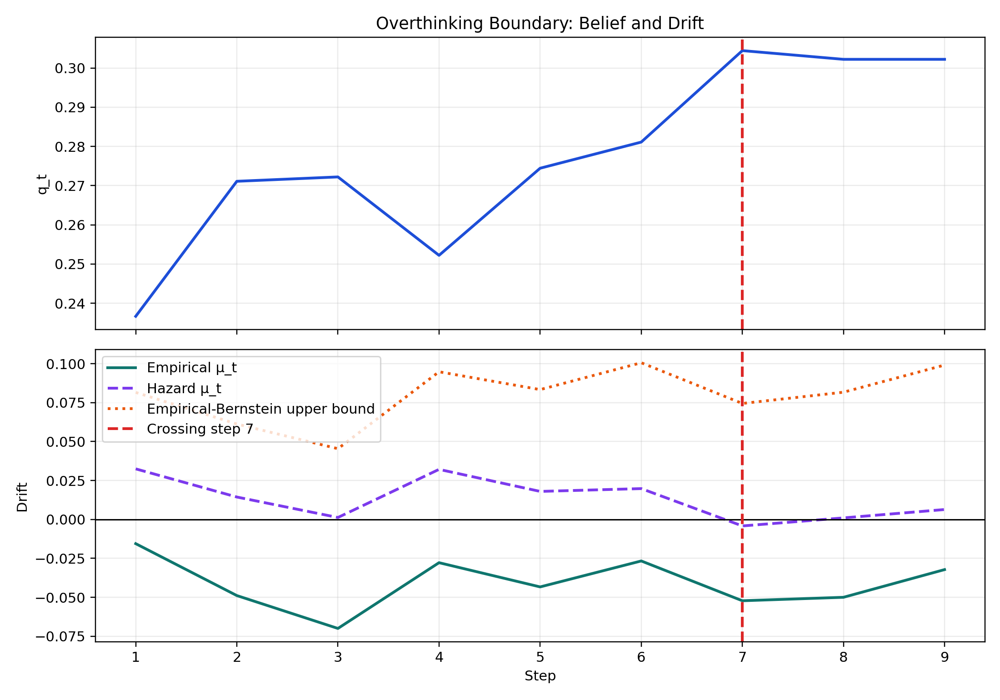
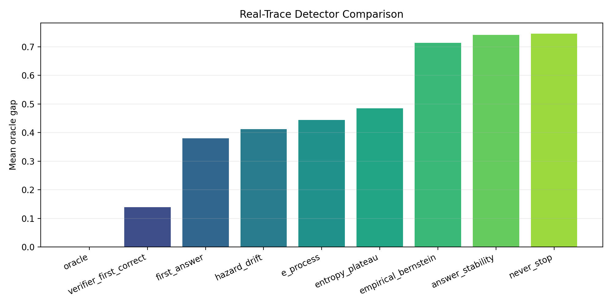
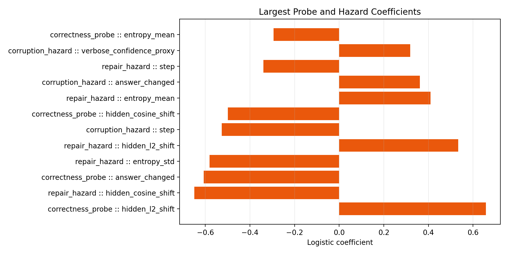

# L4 Overthinking Results

## Executive Summary
The L4 execution loop completed the environment check, parser repair, GSM8K scaling refactor, and real-trace collection for DeepSeek-R1 distill 1.5B on 900 runs. The model entered a competent regime immediately, with step-1 accuracy $q_1=0.237$, and reached peak correctness $q_t=0.304$ at step 7.

## Mathematical Validation
The hazard decomposition exhibits repair rate 0.189 and corruption rate 0.461. The first hazard drift zero crossing occurs at step 7, which is the empirical candidate for the Overthinking Boundary. The never-stop policy loses 0.7463 utility on average relative to the oracle, which is direct evidence that extra reasoning past the boundary is harmful. The new mixture e-process closes part of the gap to the hazard rule with mean oracle gap 0.4441.

## Observables Evaluation
The strongest correctness proxy in the fitted models was answer revision flag (answer_changed, coeff=-0.618). The strongest corruption-side signal was answer revision flag (answer_changed, coeff=0.396). Those coefficients identify the dominant correctness and corruption observables for this run without assuming they transfer unchanged across model families.

## Stopping Comparison
| Policy | Mean stop step | Mean utility | Mean oracle gap |
| --- | ---: | ---: | ---: |
| oracle | 2.47 | 0.6163 | 0.0000 |
| hazard_drift | 3.60 | 0.2042 | 0.4121 |
| e_process | 3.00 | 0.1722 | 0.4441 |
| empirical_bernstein | 9.00 | -0.0978 | 0.7141 |
| never_stop | 10.00 | -0.1300 | 0.7463 |

## Graphs
### Drift Crossing Proof

### Detector Gap Comparison

### Feature Weight Summary

