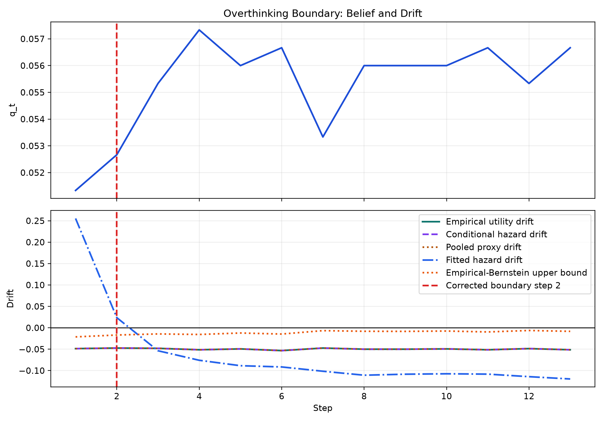
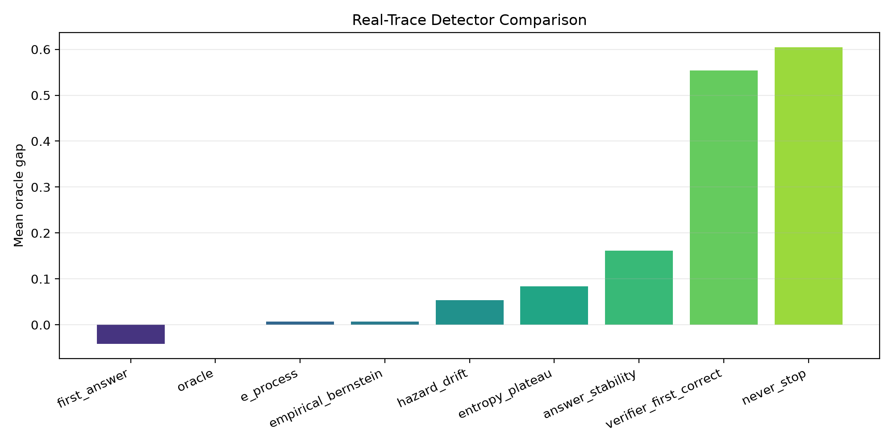
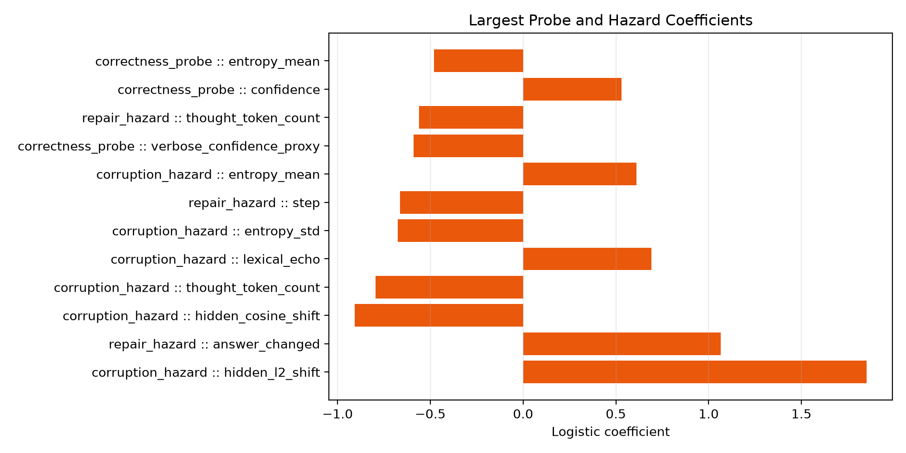

# L4 Overthinking Results

## Executive Summary
The L4 execution loop completed the environment check, parser repair, GSM8K scaling refactor, and real-trace collection for Qwen2.5 instruct 0.5B on 1500 runs. The model entered a competent regime immediately, with step-1 accuracy $q_1=0.051$, and reached peak correctness $q_t=0.057$ at step 4. This run remains below the current capability gate, so it should be treated as a weak-regime control rather than a decisive family-level witness.

## Mathematical Validation
The hazard decomposition exhibits repair rate 0.002 and corruption rate 0.033. The corrected conditional hazard drift crosses zero at step 2, while the raw empirical utility drift crosses at step 2, and the fitted hazard drift estimate crosses at step 3. The never-stop policy loses 0.6045 utility on average relative to the oracle, which is direct evidence that extra reasoning past the boundary is harmful. The new mixture e-process improves on the fitted hazard rule with mean oracle gap 0.0072.

## Drift Audit
| Drift Curve | First zero crossing | Role |
| --- | ---: | --- |
| empirical utility drift | 2 | raw mean $\Delta U_t$ from realized utilities |
| conditional hazard drift | 2 | theorem-facing $((1-q_t)\alpha_t - q_t\beta_t - c)$ witness |
| fitted hazard drift | 3 | model-based estimate from learned probes |
| pooled proxy drift | 2 | legacy unconditional proxy kept for auditability only |

## Observables Evaluation
The strongest correctness proxy in the fitted models was verbosity-confidence proxy (verbose_confidence_proxy, coeff=-0.591). The strongest corruption-side signal was hidden-state L2 drift (hidden_l2_shift, coeff=1.852). Those coefficients identify the dominant correctness and corruption observables for this run without assuming they transfer unchanged across model families.

## Stopping Comparison
| Policy | Mean stop step | Mean utility | Mean oracle gap |
| --- | ---: | ---: | ---: |
| oracle | 2.02 | 0.0099 | 0.0000 |
| hazard_drift | 3.03 | -0.0433 | 0.0532 |
| e_process | 2.00 | 0.0027 | 0.0072 |
| empirical_bernstein | 2.00 | 0.0027 | 0.0072 |
| never_stop | 14.00 | -0.5947 | 0.6045 |

## Graphs
### Drift Crossing Proof

### Detector Gap Comparison

### Feature Weight Summary

